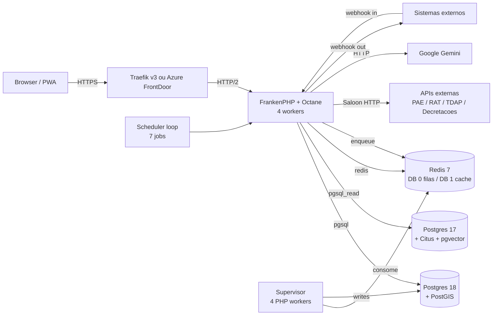
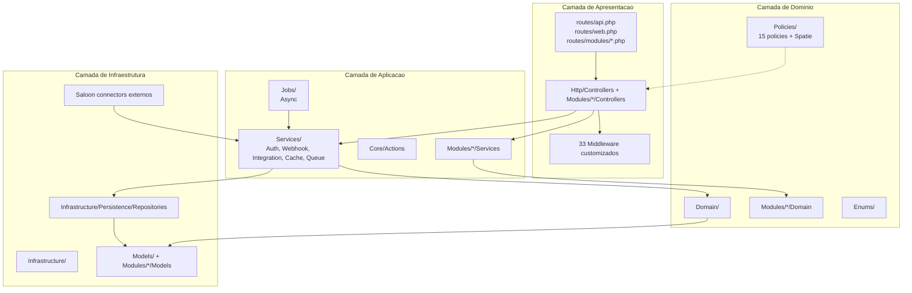
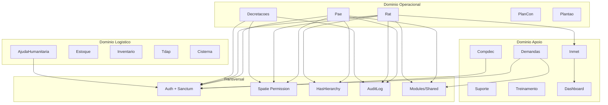
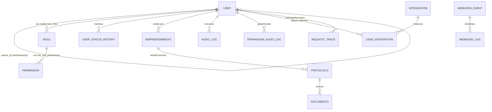
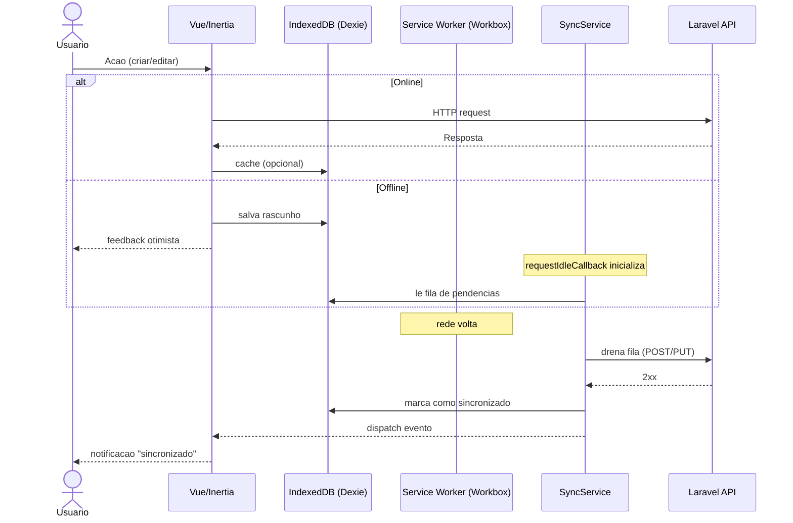
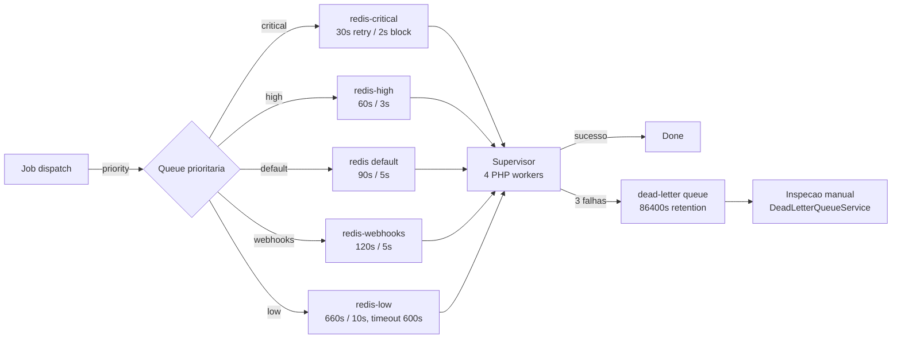
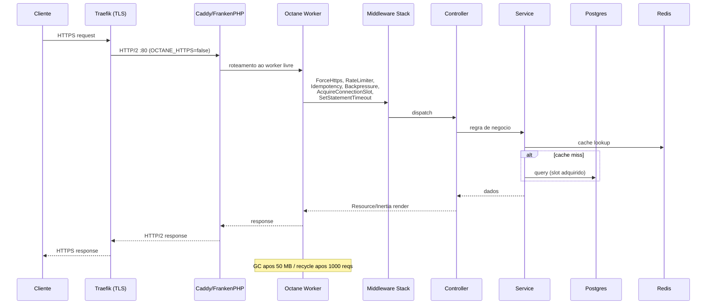
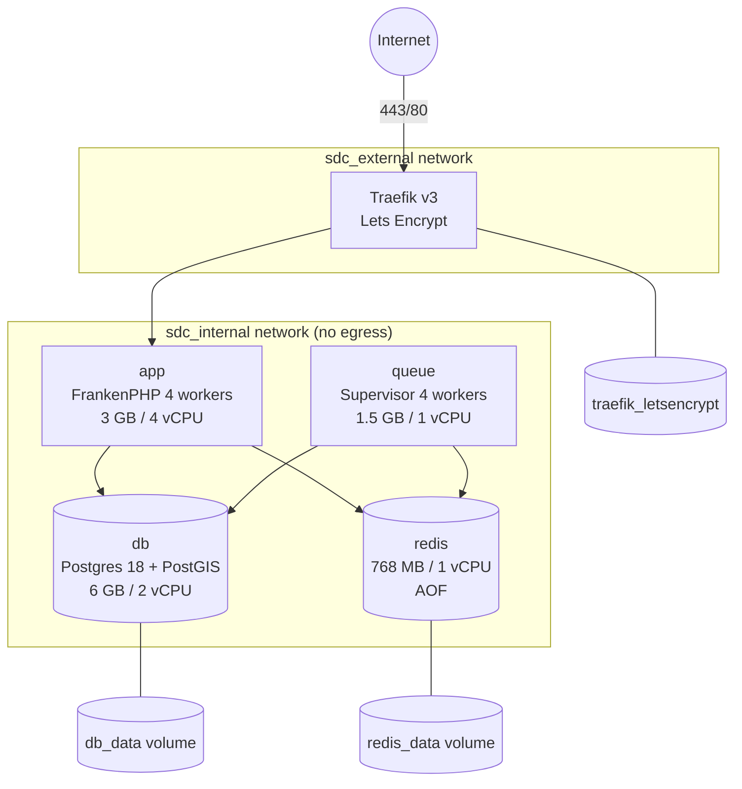

# Arquitetura do NewSDC

> Documento mestre de arquitetura do Sistema da Defesa Civil (SDC).
> Panorama 360 graus: stack, estrutura, modulos, runtime, dados, integracoes, resiliencia, observabilidade, seguranca, testes, deploy.
>
> Documentos relacionados (aprofundamentos verticais):
> - [Sizing de VM e tuning do runtime](ARCHITECTURE_VM_SIZING.md)
> - [Deploy on-premise (Hyper-V + Ubuntu)](ONPREMISE_DEPLOYMENT.md)

---

## Sumario

1. [Visao Geral](#1-visao-geral)
2. [Stack Tecnologica](#2-stack-tecnologica)
3. [Estrutura de Pastas](#3-estrutura-de-pastas)
4. [Arquitetura Backend](#4-arquitetura-backend)
5. [Arquitetura Frontend](#5-arquitetura-frontend)
6. [Banco de Dados](#6-banco-de-dados)
7. [Cache, Filas e Workers](#7-cache-filas-e-workers)
8. [Integracoes Externas](#8-integracoes-externas)
9. [Resiliencia e Performance](#9-resiliencia-e-performance)
10. [Observabilidade](#10-observabilidade)
11. [Seguranca](#11-seguranca)
12. [Testes](#12-testes)
13. [Infraestrutura, Docker e Deploy](#13-infraestrutura-docker-e-deploy)
14. [Convencoes e Padroes de Codigo](#14-convencoes-e-padroes-de-codigo)
15. [Referencias Cruzadas](#15-referencias-cruzadas)

---

## 1. Visao Geral

O NewSDC e o **Sistema da Defesa Civil** — plataforma critica 24/7 projetada para suportar acima de 100k usuarios concorrentes em cenarios de emergencia (decretacoes de calamidade, atendimentos RAT, planos de acao PAE, ajuda humanitaria, gestao de abrigos, etc.).

**Caracteristicas chave:**

- **Monolito modular** Laravel 12 com 16 modulos de dominio isolados sob [SDC/app/Modules/](../SDC/app/Modules/) seguindo praticas de DDD light.
- **Runtime de alta performance:** Laravel Octane sobre FrankenPHP em worker mode (TTFB-alvo < 20 ms para rotas quentes).
- **SPA com PWA:** Vue 3 + Inertia.js, build Vite com code-splitting e Service Worker offline-first (Workbox).
- **Banco transacional Postgres 18** (+ PostGIS) e **banco de IA Postgres 17 + Citus + pgvector** isolado para embeddings.
- **Resiliencia em codigo, nao na infra** ([memoria de feedback](../SDC/storage/.)): semaforo de conexoes, circuit breaker de DB, backpressure por tier, statement timeout, query budget e idempotencia em todas as rotas escritas.
- **Multi-target de deploy:** Azure App Service (via Jenkins + ACR) ou on-premise Hyper-V (runbook completo em [ONPREMISE_DEPLOYMENT.md](ONPREMISE_DEPLOYMENT.md)).

**Topologia logica resumida:**



---

## 2. Stack Tecnologica

Versoes lidas diretamente de [composer.json](../SDC/composer.json) e [package.json](../SDC/package.json) (dados em 2026-05-26).

### 2.1 Backend (PHP)

| Camada | Tecnologia | Versao |
|---|---|---|
| Linguagem | PHP | ^8.3 (platform `8.3.30`) |
| Framework | Laravel | ^12.0 |
| Runtime de alta performance | Laravel Octane | ^2.13 |
| Servidor de aplicacao | FrankenPHP (worker mode) + Caddy | imagem `dunglas/frankenphp` |
| Servidor HTTP alternativo | Spiral RoadRunner | HTTP `^3.3`, CLI `^2.6` |
| Autenticacao API | Laravel Sanctum | ^4.0 |
| Autenticacao web | Laravel Breeze (Inertia stack) | ^2.2 |
| Frontend bridge | Inertia.js Laravel | ^1.3 |
| Permissoes / RBAC | Spatie Laravel Permission | ^6.24 |
| HTTP client externo | Saloon | ^3.14 (+ Guzzle `^7.9`) |
| Media | Spatie Media Library | ^11.10 |
| IA | google-gemini-php/client + theodo-group/llphant | latest |
| Routing para SPA | Tighten Ziggy | ^2.5 |
| ORM utilitario | Doctrine DBAL `^4` + Doctrine ORM `^3` | |
| Documentacao API | darkaonline/l5-swagger | ^8.6 |
| Mobile native | nativephp/mobile | ^3.0 |
| Logs UI | rap2hpoutre/laravel-log-viewer | ^2.5 |
| Redis client | predis/predis | ^3.4 |
| Testes | PHPUnit | ^11.4 |
| Debug | Telescope `^5.18`, Debugbar `^4.1`, Ignition `^2.8` | |
| Code style | Laravel Pint | ^1.18 |

### 2.2 Frontend (JS/TS)

| Camada | Tecnologia | Versao |
|---|---|---|
| Framework | Vue.js | ^3.4 |
| SPA layer | @inertiajs/vue3 + @inertiajs/server (SSR) | ^2.2.19 / ^0.1.0 |
| Build | Vite + laravel-vite-plugin | ^5.0 / ^1.0 |
| PWA | vite-plugin-pwa + workbox-window | ^0.21 / ^7.3 |
| CSS | Tailwind CSS + @tailwindcss/forms | ^3.2 / ^0.5 |
| Server state | @tanstack/vue-query | ^5.62 |
| Composition utils | @vueuse/core | ^14.2 |
| Routing helper | ziggy-js | ^2.6 |
| Charts | apexcharts + vue3-apexcharts | ^5.3 / ^1.10 |
| Mapas | leaflet | ^1.9 |
| Icones | @heroicons/vue | ^2.2 |
| Offline storage | dexie + idb-keyval | ^3.2 / ^6.2 |
| Drag and drop | vuedraggable | ^4.1 |
| User tours | shepherd.js | ^15.2 |
| HTTP | axios | ^1.6 |
| E2E | @playwright/test | ^1.57 |
| Image opt | sharp | ^0.34 |

### 2.3 Infra e Plataforma

| Camada | Tecnologia | Versao / Detalhe |
|---|---|---|
| OS de runtime (prod on-prem) | Ubuntu 22.04 LTS (Hyper-V VM) | 4 vCPU / 16 GB RAM / 128-256 GB SSD |
| Container runtime | Docker + Compose v2 | |
| TLS edge | Traefik | v3.0 (Lets Encrypt ACME) |
| Banco transacional | PostgreSQL + PostGIS | 18 / 3.6-alpine |
| Banco IA | PostgreSQL + Citus + pgvector | 17 / 12.1 / 0.8 |
| Cache, filas, sessoes | Redis | 7-alpine (AOF, allkeys-lru) |
| Worker manager | Supervisor | 4 procs PHP + scheduler loop |
| CI/CD | Jenkins + Azure Container Registry + Azure App Service | (Jenkinsfile no root) |
| SMTP dev | MailHog | (apenas em dev) |
| Monitoring | Prometheus + Grafana + Alertmanager + Loki + Promtail | profile `monitoring` |
| Exporters | node-exporter, pg-exporter, redis-exporter, blackbox-exporter | |

---

## 3. Estrutura de Pastas

### 3.1 Top-level do repositorio

```
NewSDC/
|-- SDC/                    # Aplicacao Laravel (raiz principal de codigo)
|-- Doc/                    # Documentacao tecnica (arquitetura, sizing, deploy)
|-- docs/                   # Docs adicionais e auxiliares
|-- public/                 # Estaticos a nivel de repo (raros, maioria em SDC/public)
|-- storage/                # Storage a nivel de repo (logs, sessoes — uso pontual)
|-- gestaocedec/            # Modulo legacy (PHP puro)
|-- ext/, lib/, extras/     # Bibliotecas e extensoes legadas
|-- .github/                # GitHub Actions workflows
|-- .skills/, .claude/      # Tooling do Claude (subagents, skills)
|-- Jenkinsfile             # Pipeline de CI/CD
|-- README.md               # Visao geral do repo
```

### 3.2 SDC/ (aplicacao Laravel)

```
SDC/
|-- app/
|   |-- Application/        # Camada de aplicacao (DDD)
|   |-- Domain/             # Camada de dominio (DDD)
|   |-- Infrastructure/     # Camada de infra (persistence, repositories)
|   |-- Core/               # Actions, DTOs, classes abstratas
|   |-- Modules/            # 16 modulos de dominio + Shared (ver 4.2)
|   |-- Models/             # Modelos Eloquent globais (16 modelos)
|   |-- Http/
|   |   |-- Controllers/    # Admin/, Api/V1/, Auth/, base
|   |   |-- Middleware/     # 33 middlewares customizados
|   |   |-- Requests/       # FormRequests globais (Auth)
|   |-- Services/           # Servicos transversais
|   |   |-- Auth/           Integration/   Webhook/   Logging/
|   |   |-- Cache/          Queue/         Database/  Export/
|   |-- Jobs/               # Filas async (7 jobs)
|   |-- Policies/           # 15 policies (BasePolicy + Spatie)
|   |-- Notifications/      # Email, Telegram
|   |-- Mail/               # Mailables (UserOnboarding)
|   |-- Listeners/          # Octane events, Permission events
|   |-- Events/             # Eventos de dominio
|   |-- Console/Commands/   # Artisan commands
|   |-- Providers/          # Service providers
|   |-- Contracts/          # Interfaces (HierarchyService)
|   |-- Enums/              # PHP enums
|   |-- Rules/              # Regras de validacao (StrongPassword)
|   |-- Traits/             # HasHierarchy, etc.
|   |-- Support/            # Helpers
|-- bootstrap/              # Bootstrap Laravel
|-- config/                 # 28 arquivos de config customizados
|-- database/
|   |-- migrations/         # 170 arquivos
|   |-- seeders/            # 19 seeders
|   |-- factories/          # 12 factories
|-- resources/
|   |-- js/                 # SPA Vue 3 + Inertia (ver 5.x)
|   |-- css/                # Tailwind + CSS por pagina
|   |-- views/              # Blade (root + emails)
|   |-- lang/               # Traducoes
|-- routes/
|   |-- api.php             # 462 linhas, ~125 rotas (/api/v1)
|   |-- web.php             # Inertia + includes modulares
|   |-- auth.php            # Breeze auth
|   |-- modules/            # 27 arquivos de rotas por modulo
|-- tests/
|   |-- Feature/            # Integration-style
|   |-- Unit/               # Unit tests
|   |-- Integration/        # Integracao (Compdec)
|   |-- e2e/                # Playwright (JS)
|   |-- load/               # Testes de carga (k6/wrk)
|-- docker/                 # Dockerfiles, compose, configs (ver 13.x)
|-- storage/                # Logs, uploads, sessoes, cache
|-- public/                 # build/ (Vite manifest, SW, chunks)
|-- vendor/                 # Composer (gitignored)
|-- node_modules/           # NPM/Bun (gitignored)
|-- composer.json
|-- package.json
|-- vite.config.js
|-- tailwind.config.js
|-- phpunit.xml
|-- playwright.config.js
|-- .env.example
|-- .env.prod               # 280+ linhas
```

---

## 4. Arquitetura Backend

### 4.1 Camadas e padroes (DDD light + Modular Monolith)

O backend combina o esquema padrao do Laravel com uma **camada de dominio modular** em [app/Modules/](../SDC/app/Modules/), inspirado em DDD/Clean Architecture leve. Cada modulo e auto-contido (Controllers, Models, Services, Requests, DTOs, Enums, Routes), o que reduz acoplamento entre dominios e permite extrair modulos para servicos separados no futuro sem refatoracao tracante.



Diretrizes operacionais:

- **Controllers** sao finos: validam (FormRequest), autorizam (Policy via `authorize()`), delegam a Service ou Action e devolvem Resource.
- **Services** carregam logica de negocio reutilizavel e orquestrarao Jobs/Notifications quando preciso.
- **Models** sao Eloquent ricos com escopos, relacionamentos e mutators, mas nao carregam regra de negocio complexa.
- **Modulos** em [app/Modules/](../SDC/app/Modules/) replicam mini-estrutura Laravel internamente, com sub-pastas `Controllers/`, `Models/`, `Services/`, `Requests/`, `Routes/`, `Resources/`.

### 4.2 Modulos de dominio (16 + Shared)

Mapeamento dos dominios em [SDC/app/Modules/](../SDC/app/Modules/):

| Modulo | Dominio funcional |
|---|---|
| **AjudaHumanitaria** | Beneficiarios, abrigos, auxilios, movimentacao de estoque |
| **Cisterna** | Cadastro e gestao hidrica de cisternas |
| **Compdec** | Coordenadorias Municipais de Protecao e Defesa Civil (anexos, equipes, planos de contingencia, orgaos) |
| **Dashboard** | Agregacoes e estatisticas em tempo real |
| **Decretacoes** | Decretos de calamidade publica e emergencia |
| **Demandas** | Tarefas, aprovacoes, comentarios e anexos |
| **Estoque** | Inventario movimentavel (logistico) |
| **Inmet** | Integracao com dados meteorologicos do INMET |
| **Inventario** | Patrimonio e inventario estatico |
| **Pae** | Plano de Acao de Emergencia (empreendimentos, protocolos, formularios, categorias, documentos) |
| **PlanCon** | Planos de contingencia |
| **Plantao** | Escala e gestao de plantao |
| **Rat** | Relatorio de Atendimento (ocorrencias, recursos, beneficios, historico) |
| **Suporte** | Atendimento interno |
| **Tdap** | Equipamentos e ativos especializados |
| **Treinamento** | Cursos e capacitacao |
| **Shared** | Utilitarios e contratos compartilhados (nao e modulo de dominio) |



### 4.3 Roteamento (API v1 + Inertia web)

- **[routes/api.php](../SDC/routes/api.php)** — ~462 linhas, ~125 endpoints, todos sob prefix `/api/v1`. Namespace `App\Http\Controllers\Api\V1`. Throttle global `throttle:30,1` em buscas; `throttle:login` / `throttle:register` em auth.
- **[routes/web.php](../SDC/routes/web.php)** — Rotas Inertia (web SPA). Inclui 13 arquivos de modulo via `require routes/modules/*.php`.
- **[routes/modules/](../SDC/routes/modules/)** — 27 arquivos. Cada modulo registra suas proprias rotas (admin, integration, webhook tambem ficam aqui).
- **[routes/auth.php](../SDC/routes/auth.php)** — Fluxos Breeze (login, register, password reset, first-access).

Subpastas em `Controllers/Api/V1/`: `Auth/`, `Pae/`, `Rat/`, `Decretacoes/`, `Integration/`, `PowerBI/`, `Webhook/`, `BI/`, `Integrations/`, `Tdap/`. Documentacao Swagger viva em `/api/documentation` (annotation-based via L5-Swagger).

### 4.4 Modelos e relacionamentos (ERD core)

Modelos globais em [SDC/app/Models/](../SDC/app/Models/) (~16) + dezenas de modelos por modulo. Esqueleto relacional simplificado:



Modelos centrais notaveis: `User`, `Empreendimento`, `Protocolo`, `Municipio`, `Role`, `Permission`, `AuditLog`, `PermissionAuditLog`, `UserStatusHistory`, `Integration`, `UserIntegration`, `WebhookEvent`, `WebhookLog`, `Tenant`, `RequestTrace`.

### 4.5 Services, Repositories e Actions

Pasta [app/Services/](../SDC/app/Services/) agrupa servicos transversais por capability:

| Subpasta | Responsabilidade |
|---|---|
| `Auth/` | AuthService, HierarchyService, UserRegistrationService, OnboardingService, TokenService |
| `Integration/` | IntegrationHubService, TelegramNotificationService |
| `Webhook/` | WebhookService, CircuitBreakerService, WebhookSignatureValidator |
| `Logging/` | ActivityLogger, LogFileReaderService |
| `Cache/` | TaggedCacheService |
| `Queue/` | DeadLetterQueueService |
| `Database/` | DatabaseCircuitBreaker, ConnectionSemaphore |
| `Export/` | CsvExportService |
| (raiz) | GlobalSearchService |

Modulos colocam seus servicos especificos sob `Modules/<Dominio>/Services/`. Padrao Repository nao formalizado em pasta dedicada, mas existe [Infrastructure/Persistence/Repositories](../SDC/app/Infrastructure/) como blueprint para os modulos que desejam adotar.

### 4.6 Autenticacao e autorizacao

- **Sanctum** para tokens de API (`auth:sanctum`).
- **Breeze + Inertia** para sessoes web (login, password reset, first-access).
- **Spatie Permission** para RBAC: roles e permissions normalizadas em [config/permission.php](../SDC/config/permission.php) e em [config/permissions.php](../SDC/config/permissions.php) (catalogo de permissoes da aplicacao).
- **Hierarquia** via trait `HasHierarchy` + middleware `CheckHierarchy`: usuarios respondem a um pai/coordenador e so podem operar dentro da propria arvore (relevante para Pae, Rat, Decretacoes).
- **Policies** em [app/Policies/](../SDC/app/Policies/) — 15 arquivos extendendo `BasePolicy`. Cobre User, Role, Permission, Empreendimento, Protocolo, Rat, Compdec, Cisterna, Dashboard, Integration, Orgao, Prefeitura.
- **Onboarding seguro:** admin cria usuario `pending`, sistema envia email com **senha provisoria via ASCII puro** (ver `feedback_outlook_corp_blocks_emdash`), usuario faz login em `/login` e e redirecionado para `/first-access` para definir senha definitiva e iniciar tour.

### 4.7 Middleware (33 customizados)

Arquivo de referencia: [app/Http/Middleware/](../SDC/app/Http/Middleware/). Agrupamentos:

| Familia | Middleware |
|---|---|
| Autenticacao | `Authenticate`, `CheckUserActive`, `RedirectIfAuthenticated`, `EnsurePasswordChanged` |
| Autorizacao | `CheckHierarchy`, `ValidateSignature` |
| Octane | `SelectiveDisconnectFromDatabases`, `Backpressure`, `EarlyHints`, `AcquireConnectionSlot` |
| Logging | `LogApiRequests`, `LogHttpRequests`, `LogSystemActivity` |
| API hardening | `ApiRateLimiter`, `IdempotencyMiddleware`, `ValidateOpenApiRequest`, `SetStatementTimeout` |
| Seguranca | `ForceHttps`, `ForceRootUrl`, `TrustProxies`, `TrustHosts`, `EncryptCookies`, `SanitizeInput`, `TrimStrings` |
| Cache | `CacheSwaggerUi` |
| Integracao | `DecretacoesApiAuth` |

### 4.8 Jobs, Eventos e Notificacoes

**Jobs** em [app/Jobs/](../SDC/app/Jobs/) (7):

- `ProcessIntegration` — chama APIs externas via Saloon.
- `ProcessWebhook` / `ProcessInboundWebhook` — entrega/recepcao de webhooks com retries.
- `ExportPowerBIJob` / `ExportRatToCsvJob` — exportacoes pesadas.
- `CleanExpiredPermissions` — limpeza recorrente.
- Trait `Concerns/TracksAsyncProgress` — escreve progresso em `RequestTrace` para o frontend acompanhar.

**Eventos** sao majoritariamente os do Octane (RequestReceived, RequestHandled, WorkerStarting). Listeners customizados:

- `PermissionEventSubscriber` — auditoria de grant/revoke.
- Listeners de Octane — GC, fechamento de handlers, cleanup.

**Mail / Notifications:**

- `Mail\UserOnboardingMail` — boas-vindas com senha provisoria (subject ASCII).
- `Notifications\GeneralNotification` + `Notifications\TelegramChannel` — canal customizado para Telegram.
- `Models\UserNotificationPreference` — opt-in/opt-out por usuario.

---

## 5. Arquitetura Frontend

### 5.1 Stack e dependencias

SPA Vue 3 com Inertia.js servida pelo backend Laravel. Build via Vite com plugin Laravel + plugin PWA (Workbox). Sem Pinia/Vuex — estado de servidor usa Inertia shared props + TanStack Query, estado local usa composables, estado offline usa Dexie/IndexedDB.

Configuracoes-chave:

- [vite.config.js](../SDC/vite.config.js): chunking por vendor (`vendor-vue`, `vendor-icons`), aliases (`@`, `@/Composables`, `ziggy`), Workbox runtime caching.
- [tailwind.config.js](../SDC/tailwind.config.js): dark mode `class`, fonte Figtree, breakpoints `xs` (475 px) e `3xl` (1920 px), plugin `@tailwindcss/forms`.

### 5.2 Atomic Design (Atoms / Molecules / Organisms)

Em [resources/js/Components/](../SDC/resources/js/Components/):

- **Atoms** — Badge, Button, Card, Input, Skeleton, Toast.
- **Molecules** — Table, Form, Filter, FlashNotification, DatePicker, TimePicker; com subpastas por dominio (AjudaHumanitaria, Cisterna, Estoque, Inventario).
- **Organisms** — Sidebar (30 KB), TopBar, Modais grandes.
- **Por dominio** — `Pae/`, `Rat/`, `Dashboard/`, etc., com componentes especificos.
- **Utilitarios** — LoadingWrapper, Dropdown, Modal, NavLink, etc.

### 5.3 Pages, Layouts e Composables

- **Pages** ([resources/js/Pages/](../SDC/resources/js/Pages/)): 11 dominios (`Auth/`, `Pae/`, `Rat/`, `Decretacoes/`, `Demandas/`, `Admin/`, `Cisterna/`, `Compdec/`, `Inmet/`, `Inventario/`, `Tdap/`, `Plantao/`). Pages-raiz: `Dashboard.vue`, `Welcome.vue`, `Pae.vue`, `Rat.vue`.
- **Layouts** ([resources/js/Layouts/](../SDC/resources/js/Layouts/)): `AuthenticatedLayout.vue`, `GuestLayout.vue`, `SidebarOnlyLayout.vue`.
- **Composables** ([resources/js/composables/](../SDC/resources/js/composables/)): 33+ hooks organizados por feature (auth, core, data, ai, dashboard, pae, rat, decretacoes, ui, location, mobile). Exemplos: `usePageLoading`, `useNotifications`, `useModal`, `useTable`, `useRat`, `useDemandas`, `usePermissions`, `useDashboard`, `useAI`, `useHybridAI`, `usePullToRefresh`, `useMobile`.
- **Domain / Infrastructure no frontend**: [resources/js/domain/](../SDC/resources/js/domain/) e [resources/js/infrastructure/](../SDC/resources/js/infrastructure/) replicam o padrao DDD do backend para isolar logica de negocio de UI (especialmente em PAE e Demandas).

### 5.4 Estado: Inertia + TanStack Query + IndexedDB

- **Inertia shared props** entregam dados do servidor a cada navegacao (auth.user, flash, permissions, etc.).
- **TanStack Query** (`@tanstack/vue-query`) cuida do estado de servidor: `staleTime` 5 min, `gcTime` 30 min, `refetchOnReconnect` habilitado, `refetchOnWindowFocus` desabilitado.
- **Composables** mantem estado local reativo (modais, tabs, filtros).
- **IndexedDB** via Dexie + idb-keyval para offline: formularios em rascunho, anexos em fila de upload, dados de leitura cacheados.

### 5.5 PWA, SSR e Offline Sync



- **Service Worker** gerado pelo Vite-PWA com estrategias: NetworkFirst (API), StaleWhileRevalidate (assets), CacheFirst (imagens/fonts).
- **SSR** opcional via `npm run build:ssr` (entrypoint TypeScript em [resources/js/ssr.ts](../SDC/resources/js/ssr.ts)) executado por Bun/Node.
- **SyncService** ([resources/js/infrastructure/services/SyncService.js](../SDC/resources/js/infrastructure/services/SyncService.js)) inicia via `requestIdleCallback` apos mount e orquestra drenagem de fila offline.

### 5.6 Build e Code Splitting

Scripts em [package.json](../SDC/package.json):

```bash
npm run dev          # Vite dev server na porta 8081
npm run build        # Build producao + PWA manifest
npm run build:ssr    # Build com bundle SSR para Bun/Node
npm run build:pwa    # Gera SW via workbox CLI
npm run test:e2e     # Playwright (carrega .env.test)
```

Chunking: Vue/Inertia/Query/Ziggy ficam em `vendor-vue`; Heroicons em `vendor-icons`; ApexCharts/Leaflet/vuedraggable sao lazy-loaded (nao preloaded). Source maps off em prod, CSS code split on, `chunkSizeWarningLimit` 1000 kb.

---

## 6. Banco de Dados

### 6.1 Postgres 18 transacional (+ PostGIS 3.6)

Imagem: `postgis/postgis:18-3.6-alpine` em [docker-compose.prod.yml](../SDC/docker/docker-compose.prod.yml).

Tuning aplicado direto no `command:` do compose (perfil 4 vCPU / 16 GB):

| Parametro | Valor | Racional |
|---|---|---|
| `shared_buffers` | 4 GB | ~25% da RAM da VM |
| `effective_cache_size` | 12 GB | Planner hint, soma RAM + cache do OS |
| `work_mem` | 16 MB | Por operacao de sort/join |
| `maintenance_work_mem` | 512 MB | VACUUM/REINDEX |
| `max_connections` | 150 | Com ConnectionSemaphore limitando para 50 efetivas |
| `max_worker_processes` | 4 | Casado com vCPU |
| `max_parallel_workers_per_gather` | 2 | Queries grandes |
| `statement_timeout` | 30000 ms (default DB) | Middleware sobrescreve para ~10s por request |
| `idle_in_transaction_session_timeout` | 60000 ms | Mata sessoes presas |
| `lock_timeout` | 5000 ms | Evita deadlock-lockup em transacoes |
| `log_min_duration_statement` | 500 ms | Logs de slow queries |
| `shared_preload_libraries` | `pg_stat_statements` | Telemetria de queries |

Conexoes Laravel (em [config/database.php](../SDC/config/database.php)):

- `pgsql` (default, web) — `ATTR_PERSISTENT=true` (Octane reutiliza handle entre requests).
- `pgsql_webhook` — `ATTR_PERSISTENT=false` (handler curto, sem leak).
- `pgsql_read` — aponta para `db_ai` para workloads de IA e read-only pesados.

### 6.2 Postgres 17 + Citus + pgvector (IA)

Container [Dockerfile.db_ai](../SDC/docker/Dockerfile.db_ai) com:
- Postgres 17
- Citus 12.1 (sharding distribuido, ainda nao usado em prod mas pronto)
- pgvector 0.8 (embeddings semanticos para o modulo IA)

Isolado do banco transacional para evitar competicao por recursos durante calculo de embeddings ou queries longas de similaridade vetorial.

### 6.3 Migrations, Seeders, Factories

- **Migrations**: 170 arquivos em [SDC/database/migrations/](../SDC/database/migrations/). Convencao do projeto: **consolidar migrations na principal antes de commitar** (Regra de Ouro #9 do CLAUDE.md).
- **Seeders** (19): `ProductionSeeder` e `OrgaosSeeder` para prod; `MockUsersSeeder`, `MockUsersHierarchySeeder`, `DevUsersSeeder`, `TestUsersSeeder`, `DecretacoesMockSeeder`, `DemandasPermissionsSeeder`, `RolesAndPermissionsSeeder`, etc.
- **Factories** (12): User, Municipio, Orgao, Prefeitura, Cisterna, Compdec*, Pae*.

---

## 7. Cache, Filas e Workers

### 7.1 Redis 7 (DB 0 filas / DB 1 cache)

Imagem `redis:7-alpine` configurada em [docker-compose.prod.yml](../SDC/docker/docker-compose.prod.yml):

- `--appendonly yes --appendfsync everysec` — AOF para durabilidade da fila.
- `--maxmemory 768mb --maxmemory-policy allkeys-lru` — eviction sob pressao.
- `--requirepass ${REDIS_PASSWORD}` — auth obrigatoria.

**Particionamento por database:**

| DB | Uso |
|---|---|
| 0 | Filas, locks distribuidos, ConnectionSemaphore |
| 1 | Cache (SESSION_DRIVER + CACHE_DRIVER) |

**Armadilha conhecida (memoria `project_redis_prefix_app_name_trap`):** sem `REDIS_PREFIX` explicito, cada container com `APP_NAME` diferente gera keyspace isolada — worker e app deixam de enxergar a mesma fila. Em prod usa-se `REDIS_PREFIX=sdc_prod_` e `CACHE_PREFIX=sdc_prod_cache_` setados em [.env.prod](../SDC/.env.prod).

### 7.2 Filas prioritarias + DLQ



Configuracoes em [config/queue.php](../SDC/config/queue.php).

### 7.3 Supervisor (workers + scheduler)

Arquivo [docker/supervisor/laravel-worker.conf](../SDC/docker/supervisor/laravel-worker.conf):

```ini
[program:laravel-worker]
command=php /var/www/artisan queue:work redis \
        --queue=critical,high,default,webhooks,low \
        --sleep=3 --tries=3 --max-time=3600 --timeout=60
numprocs=4
stopwaitsecs=3600
user=www-data

[program:laravel-scheduler]
command=/bin/sh -c "while [ true ]; do (php /var/www/artisan schedule:run &); sleep 60; done"
```

**7 jobs agendados** (consultar [routes/console.php](../SDC/routes/console.php) e Console/Commands): clean expired permissions, deactivate inactive users, alert attachments, exports cleanup (`--days=7`), RAT auto-close, webhook archive, onboarding deactivate. Todos com `withoutOverlapping()` para evitar concorrencia.

---

## 8. Integracoes Externas

### 8.1 Webhooks (in/out, HMAC, circuit breaker)

- **Out:** `Jobs\ProcessWebhook` consome `webhook_events` e entrega com HMAC SHA-256 (`WebhookSignatureValidator`).
- **In:** rota publica + `Jobs\ProcessInboundWebhook` valida assinatura, deduplica por idempotency key e enfileira processamento.
- **Resiliencia:** `Services\Webhook\CircuitBreakerService` abre circuito apos N falhas consecutivas; backoff exponencial; DLQ em ultima instancia.
- Config em [config/webhooks.php](../SDC/config/webhooks.php).

### 8.2 Saloon (APIs externas governamentais e Power BI)

Conectores Saloon em [config/integrations.php](../SDC/config/integrations.php) cobrem PAE, RAT, TDAP, Decretacoes. Job `ProcessIntegration` orquestra chamadas async e persiste resultado em `Integration` / `UserIntegration`.

### 8.3 IA (Gemini + LLPhant + pgvector)

- **google-gemini-php/client** — chamada direta a APIs Gemini para classificacao/sumarizacao.
- **theodo-group/llphant** — orquestrador LLM agnostico para flows complexos.
- **pgvector** no `db_ai` — armazena embeddings para busca semantica e RAG.
- Configuracoes em [config/ai.php](../SDC/config/ai.php). Composables frontend `useAI` / `useHybridAI` consomem endpoints `/api/v1/ai/*`.

### 8.4 Telegram, Power BI, INMET

- **Telegram:** canal customizado de Notifications (`TelegramChannel`) para alertas operacionais.
- **Power BI:** export-to-CSV (`ExportPowerBIJob`) gera datasets consumidos por dashboards externos.
- **INMET:** modulo `Inmet` integra dados meteorologicos para georreferenciar ocorrencias em Rat e gerar pre-alertas em Decretacoes.

---

## 9. Resiliencia e Performance

### 9.1 Octane + FrankenPHP (worker mode)



Parametros em [.env.prod](../SDC/.env.prod): `OCTANE_SERVER=frankenphp`, `FRANKENPHP_WORKERS=4`, `FRANKENPHP_MAX_REQUESTS=1000`, OPcache 256 MB + JIT 100 MB, `validate_timestamps=0` (requer `octane:reload` apos deploy).

### 9.2 ConnectionSemaphore + Circuit Breaker (DB)

- **ConnectionSemaphore** (Redis-backed): 50 slots web (`DB_MAX_CONCURRENT=50`) + 10 slots webhook (`DB_MAX_CONCURRENT_WEBHOOK=10`). Middleware `AcquireConnectionSlot` bloqueia request antes mesmo de tocar no pool de DB. Evita estouro de `max_connections=150` em pico.
- **DatabaseCircuitBreaker:** abre quando p95 cruza `DB_CB_P95_MS=500` ou apos `DB_CB_TIMEOUT_COUNT=5` timeouts seguidos. Fallback retorna 503 estavel em vez de degradar todo o site.

### 9.3 Backpressure por tier

Middleware `Backpressure` examina carga (slots, fila, p95) e descarta agressivamente em tiers menos prioritarios antes de tocar publico autenticado:

| Tier | Drop rate |
|---|---|
| Publico (sem auth) | `BP_PUBLIC_DROP=0.7` |
| Autenticado free | `BP_FREE_DROP=0.9` |
| Autenticado pago/admin | nao dropado |

### 9.4 Statement Timeout + Query Budget

- Middleware `SetStatementTimeout` envia `SET statement_timeout = ...` por request (default 10s, ajustavel por rota), sobrescrevendo o default de DB sem leak entre workers Octane.
- **Query Budget** (`QUERY_BUDGET_WARN=30`, `QUERY_BUDGET_FAIL=100`): warning em log se um request executar mais de 30 queries; falha hard em 100 (geralmente sintoma de N+1).

### 9.5 Idempotencia + Rate Limiting

- **IdempotencyMiddleware** exige header `Idempotency-Key` em POST/PUT/PATCH/DELETE e cacheia resposta em Redis com TTL (deduplica retries).
- **ApiRateLimiter** custom: `RATE_LIMIT_GLOBAL=1500` req/min global; `RATE_LIMIT_FAIL_CLOSED=true` em caso de falha do limiter (preferimos negar a deixar passar).

---

## 10. Observabilidade

### 10.1 Logging

- **Monolog stack** em [config/logging.php](../SDC/config/logging.php) — channels `stack`, `daily`, `single`, `slack` (opcional).
- **Loki + Promtail** ([docker/monitoring/loki.yml](../SDC/docker/monitoring/loki.yml)) ingerem logs estruturados em prod.
- **Log Viewer UI** (`/log-viewer`) via `rap2hpoutre/laravel-log-viewer`.
- **Regra de Ouro #6:** logs de debug devem ser **removidos apos teste**, nao deixados em codigo.

### 10.2 Metricas (Prometheus)

- Configuracao em [docker/monitoring/prometheus.yml](../SDC/docker/monitoring/prometheus.yml).
- **Exporters:** node-exporter, pg-exporter, redis-exporter, blackbox-exporter.
- **Alertas** em [docker/monitoring/alerts/](../SDC/docker/monitoring/): `golden_signals.yml`, `services.yml`, `use_method.yml`.
- Profile `monitoring` em compose dev; em prod recomenda-se VM separada 2 vCPU / 4 GB (detalhes em [ONPREMISE_DEPLOYMENT.md](ONPREMISE_DEPLOYMENT.md)).

### 10.3 Dashboards (Grafana)

Em [docker/monitoring/grafana/dashboards/](../SDC/docker/monitoring/):

- `golden-signals.json` — latencia, trafego, erros, saturacao.
- `laravel-logs.json` — agregacoes de log.

### 10.4 Alertmanager

[docker/monitoring/alertmanager.yml](../SDC/docker/monitoring/) define routing por severidade e receivers (Telegram, email, webhook generico).

### 10.5 Debug (apenas dev)

- **Telescope** (`/telescope`) — historico de requests, jobs, queries, mails.
- **Debugbar** — barra inferior com timeline detalhada.
- **Ignition** — pagina de erro rica.
- `dont-discover` em [composer.json](../SDC/composer.json) evita Telescope em prod por padrao.

---

## 11. Seguranca

### 11.1 RBAC com Hierarquia

- Roles e permissions em tabelas `roles`, `permissions`, `role_has_permissions`, `model_has_roles`.
- Permissoes catalogadas em [config/permissions.php](../SDC/config/permissions.php).
- Hierarquia parent/child via trait `HasHierarchy` restringe escopo: um coordenador municipal nao ve dados de outro municipio.

### 11.2 CORS, CSRF, HTTPS, headers

- **CORS** em [config/cors.php](../SDC/config/cors.php).
- **CSRF** ativo nas rotas web (Inertia).
- **HTTPS** forcado por `ForceHttps` middleware; TLS terminado em Traefik (Lets Encrypt) ou Azure FrontDoor.
- **Headers de seguranca**: HSTS, X-Content-Type-Options, Referrer-Policy aplicados via Traefik labels e Caddyfile.

### 11.3 Auditoria

- `AuditLog` — toda mudanca relevante (create/update/delete em entidades sensiveis).
- `PermissionAuditLog` — grant/revoke de permissoes.
- `UserStatusHistory` — ativacao/desativacao/login.

### 11.4 Onboarding seguro

```
admin cria usuario pending
       v
sistema envia email com senha provisoria (ASCII puro, sem em-dash)
       v
usuario faz login em /login
       v
middleware EnsurePasswordChanged redireciona para /first-access
       v
usuario define senha definitiva (validador StrongPassword)
       v
tour interativo Shepherd.js
```

Detalhes na memoria `project_onboarding_flow`. Subjects de email **devem ser ASCII** (Outlook corporativo da Defesa Civil bloqueia em-dash — memoria `project_outlook_corp_blocks_emdash`).

---

## 12. Testes

### 12.1 PHPUnit

Config em [phpunit.xml](../SDC/phpunit.xml) define 4 suites:

| Suite | Pasta | Foco |
|---|---|---|
| Unit | `tests/Unit/` | Unidades isoladas |
| Feature | `tests/Feature/` | Integration-style (Pae, Octane, Middleware) |
| Integration | `tests/Integration/` | Casos cross-modulo |
| Compdec | `tests/Integration/Compdec/` | Suite especializada |

Convencao do projeto: testes sao **locais para validacao**, **nao sao commitados** salvo nucleo critico — Regra de Ouro de commit ([feedback_commit_granularity](../SDC/storage/.)).

### 12.2 Playwright (E2E)

Config em [playwright.config.js](../SDC/playwright.config.js). Specs em [tests/e2e/](../SDC/tests/e2e/) — exemplo: `decretacoes-crud.spec.js`. Comandos:

```bash
npm run test:e2e        # suite completa
npm run test:e2e:crud   # apenas CRUDs
npm run test:e2e:ui     # modo interativo
```

Carrega `.env` + `tests/e2e/.env.test` via `dotenvx`.

### 12.3 Load tests

[SDC/tests/load/](../SDC/tests/load/) contem scripts de carga (k6/wrk) usados para validar capacidade da VM 4 vCPU / 16 GB. Baselining recomendado contra `/health` antes de cada release maior.

---

## 13. Infraestrutura, Docker e Deploy

### 13.1 Compose files

Em [SDC/docker/](../SDC/docker/):

| Arquivo | Uso |
|---|---|
| `docker-compose.yml` | Dev local (app, queue, db, redis, bun, ssr, nginx, mailhog, db_ai, monitoring) |
| `docker-compose.prod.yml` | Producao (app, queue, db, redis, traefik) |
| `docker-compose.jenkins.yml` / `.jenkins-dev.yml` | Pipeline CI/CD |
| `docker-compose.monitoring.yml.backup` | Stack Prometheus/Grafana isolada |
| `docker-compose.minimal.yml` / `.simple.yml` | Variantes simplificadas para troubleshooting |
| `docker-compose.ssr.yml` | SSR Inertia em Bun (desabilitado por default) |
| `frankenphp/docker-compose.local.yml` | Overrides locais do FrankenPHP |

**Topologia prod:**



### 13.2 Dockerfiles (6 variantes)

| Arquivo | Imagem produzida | Uso |
|---|---|---|
| `frankenphp/Dockerfile` (prod) | `sdc/app` | Producao Laravel + Octane |
| `Dockerfile.dev` | `sdc/app-dev` | Dev local com volumes montados |
| `Dockerfile.frankenphp-dev` | `sdc/frankenphp-dev` | FrankenPHP em dev |
| `Dockerfile.queue` | `sdc/queue` | Supervisor + 4 PHP workers |
| `Dockerfile.node` | `sdc/node` | Bun/Node para Vite/SSR |
| `Dockerfile.db_ai` | `sdc/db-ai` | Postgres 17 + Citus + pgvector |

### 13.3 CI/CD (Jenkins + Azure)

```mermaid
graph LR
    Dev[Desenvolvedor] -->|git push| GH[GitHub]
    GH -->|webhook| Jenkins[Jenkins<br/>Jenkinsfile]
    Jenkins -->|build| Docker[Docker build]
    Docker -->|push| ACR[Azure Container Registry<br/>apidover.azurecr.io]
    ACR -->|deploy| AppSvc[Azure App Service<br/>newsdc2027]
    AppSvc -->|smoke test| Health[/health endpoint]
    Health -->|OK| Done[Deploy OK]
    Health -->|FAIL| Rollback[Rollback automatico]
```

Pipeline detalhada em [Jenkinsfile](../Jenkinsfile). Workflows alternativos em [.github/workflows/](../.github/workflows/).

Scripts auxiliares para Azure em [SDC/docker/azure-app-service/](../SDC/docker/azure-app-service/) (PowerShell + Bash): `create-app-service`, `configure-variaveis-ambiente`, `configure-webhook-github`, `deploy-rapido`, `deploy-completo`, `setup-cicd`.

### 13.4 On-premise (Hyper-V)

Runbook completo em [ONPREMISE_DEPLOYMENT.md](ONPREMISE_DEPLOYMENT.md) — cobre criacao da VM, particionamento LVM, hardening (`ufw`, `fail2ban`, sysctl), instalacao Docker, deploy do compose prod, TLS interno (mkcert/step-ca), backup, monitoring, rollback. Aqui apenas o resumo.

### 13.5 Backup

Scripts em [SDC/docker/backup/](../SDC/docker/backup/):

- `backup.sh` — `pg_dump` formato custom (rapido, paralelizavel).
- `restore.sh` — `pg_restore -j 4`.
- Cron diario 03:00 + rsync semanal para NAS + snapshot VHDX mensal (on-prem).
- Retencao padrao: 7 dias diarios + 4 semanais.

---

## 14. Convencoes e Padroes de Codigo

### 14.1 DRY e SOLID (Regra de Ouro #4)

- **DRY** aplicado via Services compartilhados e composables Vue. Codigo duplicado entre dois modulos deve ser elevado para `Shared` ou `Services/`.
- **SOLID** — controllers thin, services para regra de negocio, policies para autorizacao. Single Responsibility cobrado em code review.

### 14.2 Atomic Design no frontend

Hierarquia rigida: Atoms nunca dependem de Molecules, Molecules nunca dependem de Organisms. Domain components (`Pae/`, `Rat/`) podem compor de qualquer nivel atomico.

### 14.3 Resiliencia em codigo, nao na infra

Princípio do projeto ([feedback_resilience_code_first](../SDC/storage/.)): a aplicacao precisa performar bem em qualquer ambiente. Infra (Octane, OPcache, JIT, Redis) e cherry-on-top — circuit breakers, semaforos e timeouts vivem no codigo.

### 14.4 Migrations consolidadas (Regra #9)

Antes de commitar, **consolidar** migrations novas/ajustadas na migration principal. Evita historico fragmentado e facilita squash em release.

### 14.5 Logs efemeros (Regra #6)

Logs adicionados para debug devem ser **removidos apos o teste passar**. Codigo nao deve carregar `Log::debug()` ou `dump()` em prod.

### 14.6 Git e commits

- **Commits agrupados por fase** (memoria `feedback_commit_granularity`), nao por tarefa atomica.
- **Sem `Co-Authored-By`** (memoria `feedback_no_coauthor_in_commits`) — commits/PRs deste repo nao carregam trailer de coautoria.
- **Merges `--no-ff`** sempre em `dev` e `main` (memoria `feedback_merge_strategy`); cada feat parte de `dev` direto, nao empilhado.

### 14.7 PAPIRO standards

Documentos de mandato em [Doc/](.) (ex: `FINAL_CODE_REVIEW_PAPIRO2.md`) consolidam padroes de revisao de codigo aceitos pelo time. Toda mudanca relevante deve passar pelo checklist do PAPIRO antes do merge em `main`.

### 14.8 Sem emojis no codigo

Regra de Ouro #2 do CLAUDE.md: **codigo, commits, PRs e documentacao tecnica nao usam emojis**. Aplicado consistentemente neste repo.

---

## 15. Referencias Cruzadas

| Topico | Documento |
|---|---|
| Sizing detalhado de VM, tuning Octane/Postgres/Redis | [ARCHITECTURE_VM_SIZING.md](ARCHITECTURE_VM_SIZING.md) |
| Deploy on-premise passo-a-passo (Hyper-V + Ubuntu 22.04) | [ONPREMISE_DEPLOYMENT.md](ONPREMISE_DEPLOYMENT.md) |
| Sistema de permissoes detalhado | [PERMISSION_SYSTEM_ARCHITECTURE.md](PERMISSION_SYSTEM_ARCHITECTURE.md) |
| Refatoracao de rotas (Clean Architecture) | [REFATORACAO_ROTAS_CLEAN_ARCHITECTURE.md](REFATORACAO_ROTAS_CLEAN_ARCHITECTURE.md) |
| Padroes de code review | [FINAL_CODE_REVIEW_PAPIRO2.md](FINAL_CODE_REVIEW_PAPIRO2.md) |
| README do repo | [../README.md](../README.md) |
| Composer (backend deps) | [../SDC/composer.json](../SDC/composer.json) |
| NPM (frontend deps) | [../SDC/package.json](../SDC/package.json) |
| Vite config | [../SDC/vite.config.js](../SDC/vite.config.js) |
| Compose dev | [../SDC/docker/docker-compose.yml](../SDC/docker/docker-compose.yml) |
| Compose prod | [../SDC/docker/docker-compose.prod.yml](../SDC/docker/docker-compose.prod.yml) |
| Supervisor workers | [../SDC/docker/supervisor/laravel-worker.conf](../SDC/docker/supervisor/laravel-worker.conf) |
| .env de producao (template) | [../SDC/.env.prod](../SDC/.env.prod) |
| Jenkinsfile | [../Jenkinsfile](../Jenkinsfile) |

---

_Ultima revisao: 2026-05-26. Manter este documento em sincronia quando:_

- _Versoes de stack mudarem em `composer.json` ou `package.json`._
- _Modulos forem adicionados/removidos em `app/Modules/`._
- _Topologia de compose ou middleware stack mudarem._
- _Novos padroes arquiteturais forem aceitos (atualizar secao 14)._
