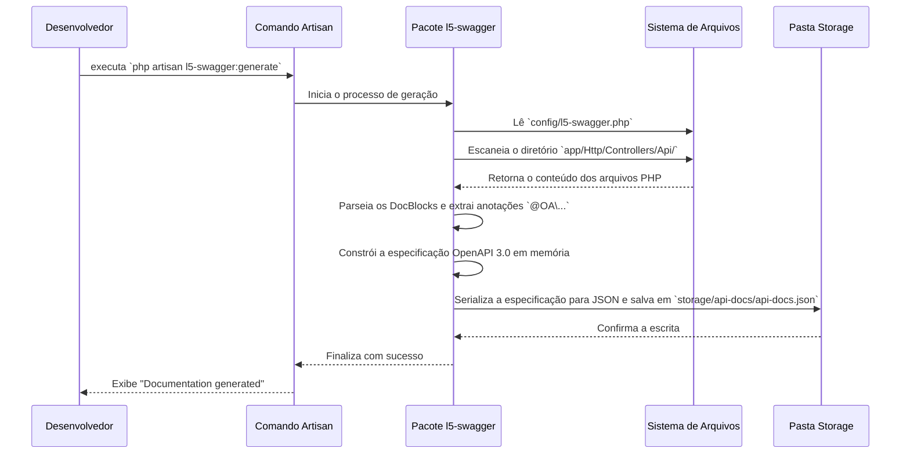
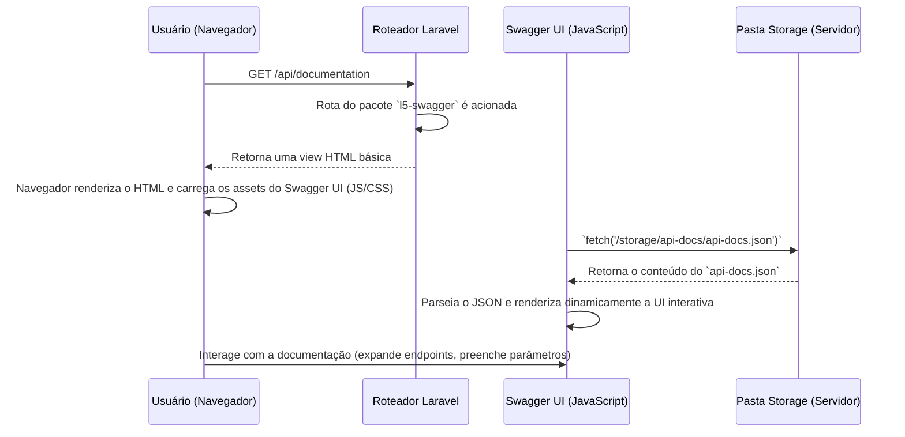

# Mapa de Comportamento: O Fluxo da API e Swagger no NewSDC

Este documento descreve a estrutura comportamental do sistema de documentação da API, detalhando a sequência de eventos e o fluxo de dados desde a geração até a visualização.

---

## Cenário 1: Geração da Documentação (O que acontece com `php artisan l5-swagger:generate`)

Este é o fluxo "offline" que transforma suas anotações de código em um artefato estático.

### Detalhamento do Fluxo de Geração:

1.  **Iniciação:** O desenvolvedor dispara o comando `php artisan l5-swagger:generate` no terminal, dentro do diretório `SDC/`.
2.  **Leitura da Configuração:** O pacote `l5-swagger` é ativado e a primeira coisa que ele faz é ler o arquivo de configuração `config/l5-swagger.php` para saber onde procurar pelas anotações (a diretiva `paths.annotations`).
3.  **Escaneamento e Reflexão:** O pacote percorre o diretório `app/Http/Controllers/Api/`. Para cada arquivo `.php`, ele usa a **Reflection API** do PHP para ler os blocos de comentários (`/** ... */`) de classes e métodos sem executar o código.
4.  **Parsing e Construção:** As anotações (`@OA\Info`, `@OA\Get`, etc.) são extraídas e interpretadas. O pacote constrói uma única e grande estrutura de dados em memória que representa toda a sua API no formato da Especificação OpenAPI. As definições globais do `SwaggerController.php` são fundidas com as definições de cada endpoint.
5.  **Serialização e Escrita:** Essa estrutura de dados é convertida em uma string JSON. O resultado é salvo como um arquivo estático em `storage/api-docs/api-docs.json`. Este arquivo é a "verdade absoluta" da sua documentação de API, completamente desacoplado do seu código Laravel em tempo de execução.

---

## Cenário 2: Visualização da Documentação (O que acontece ao acessar `/api/documentation`)

Este é o fluxo "online" que um usuário (desenvolvedor) experimenta ao consultar a documentação.

### Detalhamento do Fluxo de Visualização:

1.  **Requisição HTTP:** O usuário acessa a URL `[SUA_URL]/api/documentation`.
2.  **Roteamento:** O Laravel identifica que essa rota pertence ao pacote `l5-swagger` e direciona a requisição para o controller interno do pacote.
3.  **Renderização da View "Casca":** O controller do pacote não faz muito. Sua principal função é renderizar uma view Blade simples. Essa view é uma "casca" que contém o mínimo de HTML necessário.
4.  **Carregamento do Swagger UI:** Dentro dessa "casca" HTML, há referências (`<script>` e `<link>`) para os arquivos JavaScript e CSS que compõem a aplicação **Swagger UI**. O navegador do usuário baixa e executa esses arquivos.
5.  **Inicialização do JavaScript:** O Swagger UI (uma aplicação single-page em JavaScript) é inicializado. Sua configuração aponta para a URL onde o `api-docs.json` pode ser encontrado.
6.  **Busca do JSON:** O JavaScript, executando no navegador, faz uma requisição `fetch` ao servidor para obter o arquivo `api-docs.json` que foi gerado estaticamente no Cenário 1.
7.  **Renderização Dinâmica:** Assim que o `api-docs.json` é recebido, o Swagger UI o interpreta e constrói dinamicamente toda a interface que você vê: a lista de endpoints, os campos para parâmetros, os exemplos de resposta, o botão "Authorize", etc.

### Conclusão do Comportamento

É crucial entender que a UI do Swagger (`/api/documentation`) e o seu código Laravel **não conversam diretamente**. A UI do Swagger é uma aplicação estática que simplesmente lê um arquivo `.json` estático. O comando `l5-swagger:generate` é a "ponte" que conecta esses dois mundos, transformando as anotações do seu código PHP nesse `.json` que a UI consegue entender.
