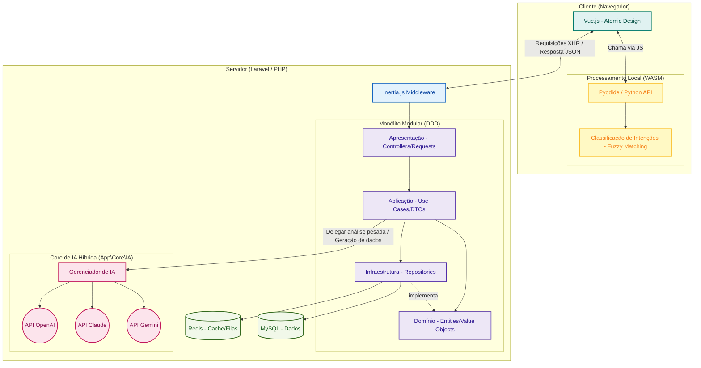

# Arquitetura Atual - NewSDC

Este documento reflete a arquitetura atualizada do sistema **NewSDC**, com destaque para a integração entre o Monólito Modular (DDD), o modelo de Frontend com Vue.js/Inertia.js e, principalmente, a nova **Arquitetura de IA Híbrida** empregada no sistema.

## Visão Geral do Sistema

O sistema é dividido em três grandes blocos de operação e responsabilidade:

1. **Frontend (Cliente):** Responsável por exibir a interface reativa baseada no modelo *Atomic Design* utilizando Vue.js, além de executar processos leves e seguros de classificação local via WebAssembly (Pyodide).
2. **Backend (Servidor):** Monolito modular construído sobre o Laravel seguindo o Padrão de Projeto DDD (Domain-Driven Design). Gerencia rotas locais com Inertia, persiste em MySQL e utiliza Redis para cache/filas.
3. **Core de Inteligência Artificial Híbrida (`SDC/core/IA` ou `App\Core\IA`):** Módulo central de inteligência do NewSDC com conectores para a Nuvem e rotinas de classificação e intenção locais no frontend.

---

## Diagrama da Arquitetura Atual (Mermaid Interativo)

O diagrama abaixo detalha todos os pontos de comunicação e estruturação do projeto. Se o seu leitor de Markdown suportar (como no GitHub ou VS Code), você verá um diagrama interativo abaixo:

### Detalhamento dos Componentes

#### 1. Frontend e Computação na Borda (WASM)
- **Vue.js + Inertia.js:** A base visual segue o **Atomic Design** (`resources/js/Components`). O Inertia atua como a cola invisível para não precisar fazer uma separação de repositórios SPA vs API clássica, provendo hidratação contínua e Single Page Application reativa.
- **Pyodide e Classificação de Intenção Local:** A grande inovação na stack do sistema NewSDC é a utilização de *WebAssembly* para rodar ambiente Python no navegador (Pyodide). O sistema de **Classificação de Intenções** (usando *Fuzzy Matching* em python local) interage com a entrada de usuário de forma barata e reativa, antes de acionar roteamentos pesados no servidor.

#### 2. Backend Monolítico e Orientação a Domínio (DDD)
Cada contexto do sistema (ex: `Demandas`, `Pae`, `Rat`) reside nativamente em pacotes delimitados em `app/Modules/{Modulo}`, contando com camadas restritas:
- **Presentation:** Camada que recebe as requisições, interage com a validação base e os controladores os encaminha.
- **Application:** Camada de orquestração de regras do negócio através dos conhecidos Casos de Uso.
- **Domain:** O núcleo que fica isolado e não conhece bibliotecas externas ou persistência;
- **Infrastructure:** Traduz o domínio em código executável via repositórios (Eloquent) ou conexões.

#### 3. Core IA Híbrida (`SDC/core/IA`)
O backend conta com um core robusto dedicado ao agenciamento de IA gerativa:
- Ele orquestra drivers de conexão direta na nuvem, com capacidades nativas configuráveis para as APIs da **OpenAI**, **Claude (Anthropic)** e **Gemini (Google)**.
- Essa abordagem híbrida (Classificação local *WASM* rodando Pyodide + Processamento Complexo de GenAI via Drivers nativos) confere rapidez ao usuário na ponta e capacidade massiva de processamento no back, em paralelo e mitigando custos de tokens de nuvem onde uma análise via *Fuzzy Matching* do Pyodide resolve localmente a rota ou a intenção.
