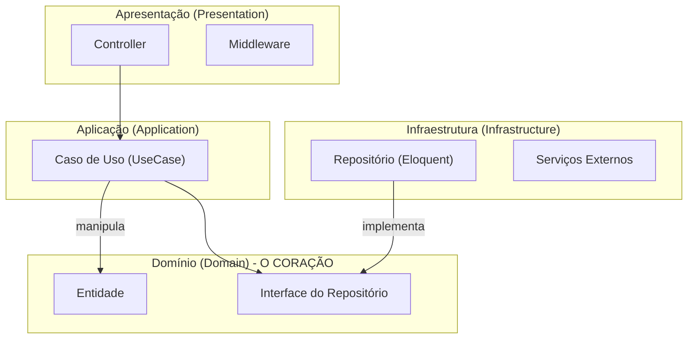
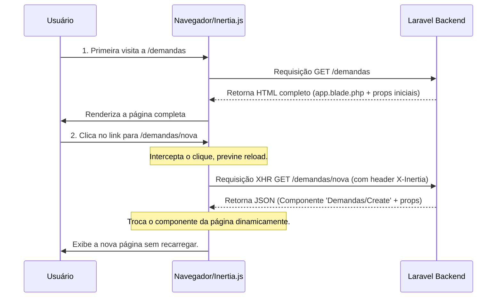

# Manifesto da Arquitetura NewSDC: Um Conceito Detalhado

Este documento serve como uma fonte da verdade para a filosofia e a implementação técnica da arquitetura do projeto NewSDC. Ele conceitua o estado atual do sistema, fornecendo uma visão profunda dos princípios que guiam seu design e desenvolvimento.

---

## Capítulo 1: A Filosofia Arquitetural

A arquitetura do NewSDC não é um acidente, mas um design deliberado com dois pilares filosóficos centrais. A união dessas filosofias cria uma **sinergia única**: a estrutura modular do domínio de negócio no backend é espelhada pela estrutura de componentes no frontend.

### Diagrama: Visão Geral da Arquitetura

```mermaid
graph TD
    subgraph "Cliente"
        A[Usuário] --> B{Navegador};
    end

    subgraph "Servidor"
        C(Frontend - Vue.js via Vite)
        D(Backend - Laravel)
        E[Banco de Dados (MySQL)]
        F[Cache/Filas (Redis)]
    end

    B --> |Requisição HTTP| C;
    C --> |Chamadas Inertia.js| D;
    D --> |Respostas (Props + Componente)| C;
    D --> E;
    D --> F;
```

1.  **Backend Orientado ao Domínio (Domain-Driven Design - DDD)**: A complexidade do negócio não é um obstáculo, mas o coração do software. Em vez de organizar o código em torno de padrões de framework (MVC tradicional), nós o organizamos em torno dos conceitos de negócio (Módulos como `Demandas`, `Pae`, `Rat`). Isso torna o software uma representação fiel do mundo real em que ele opera.

2.  **Frontend Atômico (Atomic Design)**: A interface do usuário é um sistema de design coeso, não uma coleção de páginas. Começando com os menores "átomos" (botões, inputs), nós os compomos em "moléculas", "organismos" e, finalmente, em "templates" e "páginas". O resultado é uma UI consistente, reutilizável e muito mais fácil de manter e escalar.

---

## Capítulo 2: O Coração do Backend - DDD na Prática

O backend é um **Monólito Modular**. Ele tem a simplicidade de implantação de um único sistema, mas a organização e os limites claros de microsserviços, graças à estrutura de Módulos.

### Diagrama: Fluxo de Dependência das Camadas DDD

O fluxo de controle segue de fora para dentro, mas a dependência é sempre de uma camada externa para uma mais interna. A Camada de Domínio não conhece nenhuma outra camada.



### 2.1. O Domínio: A Camada Mais Pura (`app/Modules/{Modulo}/Domain`)

Esta é a camada mais importante e protegida. Ela não conhece o framework, o banco de dados ou a web. Ela só conhece a si mesma e às regras de negócio.

-   **Entidades (`Entities`)**: São os protagonistas do seu domínio (ex: `Task`, `Comment`). Elas não são apenas sacos de dados; são objetos ricos que contêm e protegem sua própria lógica.
-   **Objetos de Valor (`ValueObjects`)**: Representam conceitos imutáveis do domínio (ex: `TaskStatus`, `Prioridade`), trazendo segurança e expressividade ao código.
-   **Interfaces de Repositório (`Repositories`)**: São os contratos que definem como as Entidades são persistidas. O Domínio define *o que* precisa ser salvo, mas não *como*.
-   **Serviços de Domínio (`Services`)**: Orquestram a lógica de negócio que não se encaixa em uma única entidade.

### 2.2. A Aplicação: Orquestrando os Casos de Uso (`app/Modules/{Modulo}/Application`)

-   **Casos de Uso (`UseCases`)**: Representam cada ação que o sistema pode executar (ex: `CreateTaskUseCase`). Eles orquestram o fluxo entre o mundo exterior e o Domínio.
-   **Data Transfer Objects (DTOs)**: Contratos de dados simples que cruzam as fronteiras das camadas.

### 2.3. A Infraestrutura: O Mundo Real (`app/Modules/{Modulo}/Infrastructure`)

-   **Implementações de Repositório (`Repositories`)**: Aqui, as `TaskRepositoryInterface` são implementadas usando o Eloquent ORM. Se o banco de dados mudar, esta é a camada a ser alterada.

### 2.4. A Apresentação: A Janela para o Mundo (`app/Modules/{Modulo}/Presentation`)

-   **Controllers**: Pontos de entrada finos que delegam o trabalho para o Caso de Uso apropriado.
-   **Form Requests**: Especialistas em validação e autorização.
-   **API Resources**: Alfaiates de dados, transformando Entidades em respostas JSON.

---

## Capítulo 3: A Fachada do Frontend - Ordem Atômica e Reatividade

O frontend é construído como um sistema de design vivo, onde cada parte tem um propósito claro e se encaixa para formar um todo coeso.

### Diagrama: Hierarquia de Composição do Atomic Design

```mermaid
graph TD
    subgraph "Fundação (Assets)"
        A[Átomos (Button, Input)]
    end
    subgraph "Componentes Funcionais"
        B[Moléculas (Campo de Busca)]
    end
    subgraph "Seções da Aplicação"
        C[Organismos (Barra Lateral, Tabela de Dados)]
    end
    subgraph "Estrutura da Visão"
        D[Templates (Layout Autenticado)]
    end
    subgraph "Resultado Final"
        E[Páginas (Página de Dashboard)]
    end

    A --> B; B --> C; C --> D; D --> E;
```

### 3.1. A Hierarquia Atômica (`resources/js/Components`)

-   **Átomos**: Os blocos de construção indivisíveis (`Button.vue`, `Input.vue`).
-   **Moléculas**: Grupos funcionais de átomos (`SearchField.vue`).
-   **Organismos**: Seções complexas e reutilizáveis da UI (`Sidebar.vue`, `TaskDataTable.vue`).

### 3.2. A Estrutura da Página (`resources/js/Pages` e `Layouts`)

-   **Templates (`Layouts`)**: O esqueleto da página, definindo áreas persistentes.
-   **Páginas (`Pages`)**: A composição final de organismos e moléculas dentro de um template.

### 3.3. O Mapeamento Domínio-UI: Onde Tudo se Conecta

A genialidade da estrutura reside em como ela espelha o backend.

```
resources/js/
├── Pages/
│   ├── Rat/                 <-- Módulo do DDD
│   │   ├── Create.vue       (Página/Template)
│   │   ├── Index.vue
│   │   └── Partials/        <-- Organismos Específicos do Domínio
│   │       ├── RatForm.vue  (Usa Atoms/Molecules globais)
│   │       └── RatList.vue
│   ├── Pae/                 <-- Outro Módulo DDD
│   │   └── ...
```
Um `RatForm.vue` é um **Organismo de Domínio**. Ele é complexo e específico, então vive dentro de seu próprio contexto de módulo, mas é construído usando os Átomos e Moléculas globais.

### 3.4. Inertia.js: A Cola Invisível

O Inertia.js transforma um aplicativo Laravel clássico em uma SPA reativa, sem a necessidade de uma API REST completa.

### Diagrama: Fluxo de Requisição com Inertia.js



---

## Capítulo 4: O Ecossistema de Suporte

A arquitetura é sustentada por um ecossistema de ferramentas que garantem consistência, automação e uma experiência de desenvolvimento produtiva.

-   **Docker**: Garante um ambiente de desenvolvimento **consistente e descartável**.
-   **Vite**: Um ferramental de frontend ultrarrápido que oferece **Hot Module Replacement (HMR)** para um ciclo de feedback imediato.
-   **Automação (`justfile`, `Jenkins`)**: Codifica o conhecimento operacional, transformando tarefas repetitivas em comandos simples e confiáveis.
