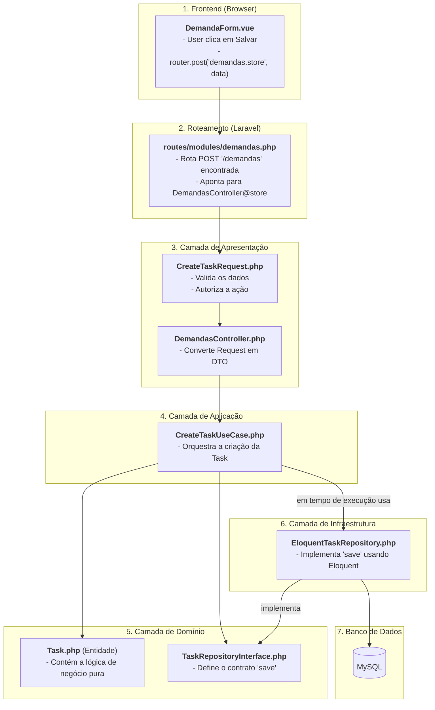

# Guia Definitivo da Arquitetura em Ação
## A Anatomia Completa de uma Requisição

Este documento é a versão ultra-detalhada do fluxo de arquitetura. Ele rastreia uma requisição de ponta a ponta, incluindo **exemplos de código relevantes** em cada etapa para ilustrar exatamente como as camadas interagem.

**Cenário**: O usuário preencheu o formulário para "Criar Nova Demanda" e clica no botão "Salvar".

---

### Diagrama de Fluxo (Visão Geral)



---

## O Rastreamento Ultra-Detalhado

### Etapa 1: O Frontend - O Ponto de Partida

-   **O Quê**: O usuário clica para submeter o formulário. O Inertia.js coleta os dados e envia uma requisição `POST` para o backend.
-   **Localização**: `resources/js/Pages/Demandas/Partials/DemandaForm.vue`

-   **Código Relevante (Exemplo)**:
    ```vue
    <script setup>
    import { useForm } from '@inertiajs/vue3';
    import { route } from 'ziggy-js';

    const form = useForm({
      titulo: '',
      descricao: '',
      prioridade: 'baixa',
    });

    const salvarDemanda = () => {
      // O Inertia fará uma requisição POST para a rota 'demandas.store'
      form.post(route('demandas.store'), {
        onSuccess: () => {
          // Lógica de sucesso (ex: limpar form, mostrar notificação)
        },
      });
    };
    </script>

    <template>
      <form @submit.prevent="salvarDemanda">
        <!-- Campos do formulário (v-model="form.titulo", etc) -->
        <button type="submit" :disabled="form.processing">
          Salvar
        </button>
      </form>
    </template>
    ```

### Etapa 2: A Rota - O Porteiro

-   **O Quê**: Laravel recebe a requisição e a direciona para o controller correto com base na URL e no método HTTP.
-   **Localização**: `routes/modules/demandas.php`

-   **Código Relevante (Exemplo)**:
    ```php
    // routes/modules/demandas.php
    use App\Modules\Demandas\Presentation\Http\Controllers\DemandasController;

    Route::post('/demandas', [DemandasController::class, 'store'])
        ->name('demandas.store')
        ->middleware(['auth']);
    ```

### Etapa 3: A Apresentação - O Mestre de Cerimônias

-   **O Quê**: O Controller é acionado. Antes, o `CreateTaskRequest` intercepta a requisição para validar e autorizar. Em seguida, o controller transforma os dados seguros em um `DTO` e passa para a próxima camada.
-   **Localização**: `app/Modules/Demandas/Presentation/`

-   **Código Relevante (Exemplo)**:
    ```php
    // Presentation/Http/Requests/CreateTaskRequest.php
    class CreateTaskRequest extends FormRequest
    {
        public function authorize(): bool
        {
            // Verifica se o usuário tem permissão para criar uma demanda
            return $this->user()->can('demandas.create');
        }

        public function rules(): array
        {
            return [
                'titulo' => 'required|string|max:255',
                'descricao' => 'nullable|string',
                'prioridade' => 'required|in:baixa,media,alta',
            ];
        }
    }

    // Application/DTOs/CreateTaskDTO.php
    class CreateTaskDTO
    {
        public function __construct(
            public readonly string $titulo,
            public readonly ?string $descricao,
            public readonly string $prioridade,
            public readonly int $solicitanteId,
        ) {}

        public static function fromRequest(CreateTaskRequest $request): self
        {
            return new self(
                titulo: $request->validated('titulo'),
                descricao: $request->validated('descricao'),
                prioridade: $request->validated('prioridade'),
                solicitanteId: $request->user()->id,
            );
        }
    }

    // Presentation/Http/Controllers/DemandasController.php
    class DemandasController
    {
        public function store(CreateTaskRequest $request, CreateTaskUseCase $useCase): RedirectResponse
        {
            // 1. Validação e autorização já ocorreram no CreateTaskRequest.
            // 2. Converte a requisição em um DTO limpo.
            $dto = CreateTaskDTO::fromRequest($request);

            // 3. Delega para a camada de aplicação.
            $task = $useCase->execute($dto);

            // 4. Prepara a resposta.
            return redirect()->route('demandas.show', $task->id)
                ->with('success', 'Demanda criada com sucesso!');
        }
    }
    ```

### Etapa 4: A Aplicação - O Orquestrador

-   **O Quê**: O `UseCase` recebe o `DTO` e orquestra os passos para cumprir a tarefa, interagindo com a camada de Domínio através de interfaces.
-   **Localização**: `app/Modules/Demandas/Application/UseCases/CreateTaskUseCase.php`

-   **Código Relevante (Exemplo)**:
    ```php
    // Application/UseCases/CreateTaskUseCase.php
    class CreateTaskUseCase
    {
        public function __construct(
            private readonly TaskRepositoryInterface $taskRepository
        ) {}

        public function execute(CreateTaskDTO $dto): Task
        {
            // Lógica de orquestração:
            // 1. Criar a entidade de domínio.
            $task = Task::new(
                titulo: $dto->titulo,
                descricao: $dto->descricao,
                prioridade: new Prioridade($dto->prioridade), // Usando um Value Object
                solicitanteId: $dto->solicitanteId,
            );

            // 2. Usar a interface para persistir a entidade.
            $this->taskRepository->save($task);

            // 3. Talvez disparar um evento (ex: NovaDemandaCriada).

            // 4. Retornar a entidade persistida.
            return $task;
        }
    }
    ```

### Etapa 5: O Domínio - O Coração Inteligente

-   **O Quê**: O `UseCase` manipula os objetos de domínio. A `Interface` define o contrato, e a `Entidade` encapsula os dados e o comportamento do negócio.
-   **Localização**: `app/Modules/Demandas/Domain/`

-   **Código Relevante (Exemplo)**:
    ```php
    // Domain/Repositories/TaskRepositoryInterface.php
    interface TaskRepositoryInterface
    {
        public function findById(int $id): ?Task;
        public function save(Task $task): void;
    }

    // Domain/Entities/Task.php (simplificado)
    class Task extends Model
    {
        // Eloquent 'fillable', 'casts', etc.

        public static function new(string $titulo, ?string $descricao, Prioridade $prioridade, int $solicitanteId): self
        {
            $task = new self();
            $task->titulo = $titulo;
            $task->descricao = $descricao;
            $task->prioridade = $prioridade; // Cast para string no Eloquent
            $task->solicitante_id = $solicitanteId;
            $task->status = TaskStatus::OPEN; // Lógica de negócio: sempre começa como 'open'

            return $task;
        }
    }
    ```

### Etapa 6: A Infraestrutura - O Trabalho Pesado

-   **O Quê**: A implementação concreta da interface do repositório, usando ferramentas do mundo real (Eloquent) para executar a ação.
-   **Localização**: `app/Modules/Demandas/Infrastructure/Repositories/EloquentTaskRepository.php`

-   **Código Relevante (Exemplo)**:
    ```php
    // Infrastructure/Repositories/EloquentTaskRepository.php
    class EloquentTaskRepository implements TaskRepositoryInterface
    {
        public function findById(int $id): ?Task
        {
            return Task::find($id);
        }

        public function save(Task $task): void
        {
            // AQUI o Eloquent efetivamente salva no banco de dados.
            $task->save();
        }
    }
    ```

### Etapa 7: O Retorno e a Resposta Final

-   **O Quê**: O fluxo se desenrola de volta para o Controller, que emite um redirecionamento. O Inertia recebe essa resposta e busca a nova página, que por sua vez renderiza os dados da demanda recém-criada, completando o ciclo. O usuário vê a tela de detalhes da demanda que acabou de criar.
-   **Resultado na Tela**: O navegador agora exibe a URL `/demandas/1` (ou o ID da nova task) e o componente `resources/js/Pages/Demandas/Show.vue` é renderizado com os dados da task como `props`.
