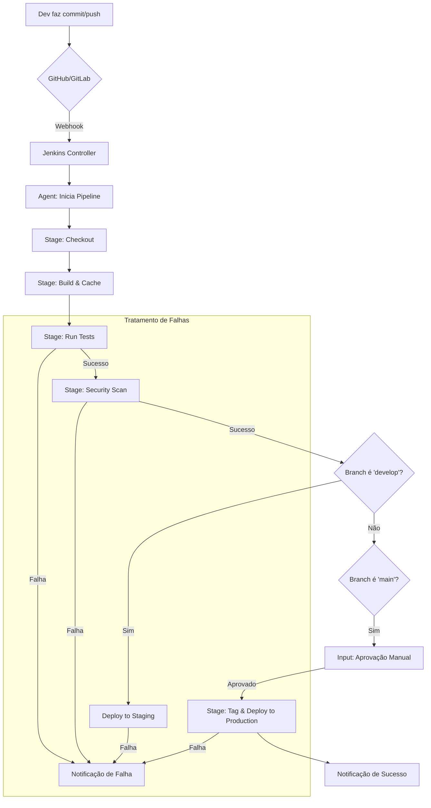

# Documentação de CI/CD: Laravel com Jenkins e Docker

Este documento detalha o processo de Integração Contínua (CI) e Entrega Contínua (CD) para aplicações Laravel containerizadas com Docker e orquestradas pelo Jenkins. O objetivo é fornecer um guia claro, desde o commit do desenvolvedor até o deploy em produção, abordando boas práticas, estratégias de deploy e troubleshooting.

## 1. Visão Geral do Fluxo de CI/CD

O nosso fluxo de CI/CD é projetado para ser automatizado, seguro e resiliente. Ele começa quando um desenvolvedor envia código para o repositório Git e termina com a aplicação atualizada em produção, após passar por uma série de validações.

### Diagrama do Fluxo



### Fluxo Textual Completo

```
1. Desenvolvedor → Commit/Push → GitHub/GitLab
2. GitHub/GitLab → Webhook → Jenkins
3. Jenkins → Inicia Pipeline (Jenkinsfile)
4. Pipeline Stage 1: Checkout do código
5. Pipeline Stage 2: Build das imagens Docker (com cache)
6. Pipeline Stage 3: Instalação de dependências (Composer, NPM)
7. Pipeline Stage 4: Execução dos testes (paralelo)
   - Unit Tests
   - Feature Tests
   - Integration Tests
8. Pipeline Stage 5: Security Scan (Composer, NPM, Docker)
9. Pipeline Stage 6: Deploy
   - Se branch = develop → Staging (automático)
   - Se branch = main → Produção (aprovação manual)
10. Health Check da aplicação
11. Notificação (Slack/Email)
```

---

## 2. O Início: Commit e Trigger do Pipeline

Tudo começa no ambiente local do desenvolvedor.

### 2.1 Fluxo de Desenvolvimento

1. **Desenvolvimento**: O desenvolvedor cria ou modifica código em uma *feature branch* a partir da branch `develop`.

```bash
# Criar feature branch
git checkout develop
git pull origin develop
git checkout -b feature/nova-funcionalidade
```

2. **Commit e Push**: Após concluir a tarefa, o desenvolvedor faz o commit seguindo as [boas práticas de commit](#6-boas-práticas-e-versionamento) e envia a branch para o repositório remoto.

```bash
# Fazer commits atômicos
git add .
git commit -m "feat(auth): adiciona autenticação via OAuth2"
git push origin feature/nova-funcionalidade
```

3. **Pull Request (PR)**: Um PR é aberto da *feature branch* para a `develop`. Revisões de código e verificações automatizadas são executadas.

4. **Merge**: Após a aprovação, o PR é "squashed and merged" na branch `develop`.

5. **Webhook Trigger**: O merge na branch `develop` (ou um push direto) dispara um webhook configurado no repositório Git.

### 2.2 Configuração do Webhook

#### GitHub

```
Settings → Webhooks → Add webhook

Payload URL: http://jenkins.seudominio.com/github-webhook/
Content type: application/json
SSL verification: Enable SSL verification
Events: Just the push event
Active: ✓
```

#### GitLab

```
Settings → Webhooks → Add new webhook

URL: http://jenkins.seudominio.com/project/SDC-Pipeline
Secret Token: [gerado no Jenkins]
Trigger: Push events, Merge request events
SSL verification: Enable SSL verification
```

6. **Início do Pipeline**: O Jenkins recebe a notificação, identifica o projeto e a branch correspondente, e inicia a execução do pipeline definido no `Jenkinsfile`.

---

## 3. As Etapas (Stages) do Pipeline

O nosso pipeline é declarativo e definido em um `Jenkinsfile` na raiz do projeto. Cada etapa é isolada e tem uma responsabilidade clara.

### 3.1 Stage: Checkout

Esta é a primeira etapa ativa. O Jenkins clona o código-fonte do repositório para o workspace do build.

**Como funciona**:
- Usamos credenciais do tipo "SSH Username with private key" configuradas no Jenkins
- A chave pública correspondente é adicionada como "Deploy Key" no repositório Git
- Garante acesso de leitura seguro sem expor credenciais

**Jenkinsfile Snippet:**
```groovy
stage('Checkout') {
    steps {
        echo '📦 Checking out code...'
        checkout scm

        script {
            env.GIT_COMMIT_MSG = sh(
                script: 'git log -1 --pretty=%B',
                returnStdout: true
            ).trim()
            env.GIT_AUTHOR = sh(
                script: 'git log -1 --pretty=%an',
                returnStdout: true
            ).trim()
        }
        echo "Commit: ${env.GIT_COMMIT_MSG}"
        echo "Author: ${env.GIT_AUTHOR}"
    }
}
```

**Troubleshooting**:
```bash
# Se falhar, verificar chaves SSH no container Jenkins
docker-compose -f docker-compose.jenkins.yml exec jenkins cat /var/jenkins_home/.ssh/id_rsa.pub

# Testar conexão SSH manualmente
docker-compose -f docker-compose.jenkins.yml exec jenkins ssh -T git@github.com
```

### 3.2 Stage: Build

Nesta etapa, construímos as imagens Docker para a aplicação (PHP-FPM, Nginx, etc.). O foco aqui é a eficiência, utilizando o cache do Docker para acelerar builds subsequentes.

**Estratégia de Cache**:
- Usamos a flag `--cache-from` no comando `docker build`
- Antes de construir, tentamos puxar a imagem da tag `latest`
- Se ela existir, o Docker a usará como cache, reconstruindo apenas as camadas modificadas

**Jenkinsfile Snippet:**
```groovy
stage('Build Docker Images') {
    steps {
        echo '🏗️  Building Docker images...'

        script {
            // Resolver problema de memória: limpar builds antigos
            sh 'docker system prune -f --filter "until=24h"'

            // Build com cache para acelerar
            sh """
                docker-compose -f docker-compose.prod.yml build --parallel
            """
        }
    }
}
```

**Comando de exemplo com cache:**
```bash
# Puxa a imagem mais recente para usar como cache
docker pull your-registry.com/your-app:latest || true

# Constrói a nova imagem usando o cache
docker build \
  --cache-from your-registry.com/your-app:latest \
  -t your-registry.com/your-app:${BUILD_ID} \
  -t your-registry.com/your-app:latest \
  -f docker/Dockerfile.prod .

# Envia as novas imagens para o registry
docker push your-registry.com/your-app:${BUILD_ID}
docker push your-registry.com/your-app:latest
```

### 3.3 Stage: Install Dependencies

Instalação otimizada de dependências com cache.

**Jenkinsfile Snippet:**
```groovy
stage('Install Dependencies') {
    parallel {
        stage('PHP Dependencies') {
            steps {
                echo '📚 Installing PHP dependencies...'

                sh """
                    mkdir -p ${COMPOSER_CACHE_DIR}
                    docker-compose -f docker-compose.prod.yml run --rm \
                        -e COMPOSER_CACHE_DIR=/cache \
                        -v ${COMPOSER_CACHE_DIR}:/cache \
                        app composer install --no-interaction --prefer-dist --optimize-autoloader --no-dev
                """
            }
        }

        stage('Node Dependencies') {
            steps {
                echo '📚 Installing Node dependencies...'

                sh """
                    mkdir -p ${NPM_CACHE_DIR}
                    docker-compose -f docker-compose.prod.yml run --rm \
                        -e NPM_CONFIG_CACHE=/cache \
                        -v ${NPM_CACHE_DIR}:/cache \
                        node npm ci --prefer-offline
                """
            }
        }
    }
}
```

### 3.4 Stage: Tests

Com as imagens prontas, subimos um ambiente de teste efêmero usando `docker-compose` para executar todos os testes automatizados.

**Tipos de Teste**:
- **Unitários**: Rápidos e isolados. `php artisan test --testsuite=Unit`
- **Feature/Integração**: Testam a interação entre componentes. `php artisan test --testsuite=Feature`
- **Paralelização**: Usamos o recurso `parallel` do Jenkins para rodar testes simultaneamente

**Jenkinsfile Snippet:**
```groovy
stage('Run Tests') {
    parallel {
        stage('Unit Tests') {
            steps {
                echo '🧪 Running unit tests...'
                sh """
                    docker-compose -f docker-compose.prod.yml run --rm app php artisan test \
                        --testsuite=Unit \
                        --coverage-html coverage/unit \
                        --log-junit reports/junit-unit.xml
                """
            }
        }

        stage('Feature Tests') {
            steps {
                echo '🧪 Running feature tests...'
                sh """
                    docker-compose -f docker-compose.prod.yml run --rm app php artisan test \
                        --testsuite=Feature \
                        --coverage-html coverage/feature \
                        --log-junit reports/junit-feature.xml
                """
            }
        }
    }
    post {
        always {
            // Publicar relatórios de teste
            junit 'reports/junit-*.xml'
            publishHTML([
                reportDir: 'coverage',
                reportFiles: 'index.html',
                reportName: 'Code Coverage'
            ])
        }
    }
}
```

### 3.5 Stage: Security Scan

Segurança é crucial. Após os testes, escaneamos vulnerabilidades conhecidas (CVEs).

**Ferramentas utilizadas**:
- **Composer Audit**: Verifica vulnerabilidades em dependências PHP
- **NPM Audit**: Verifica vulnerabilidades em dependências Node.js
- **Trivy** (opcional): Escaneia imagens Docker em busca de CVEs

**Jenkinsfile Snippet:**
```groovy
stage('Security Scan') {
    steps {
        echo '🔒 Running security audit...'

        script {
            // Audit do Composer
            sh "docker-compose -f docker-compose.prod.yml run --rm app composer audit || true"

            // Audit do NPM
            sh "docker-compose -f docker-compose.prod.yml run --rm node npm audit --audit-level=moderate || true"
        }
    }
}
```

**Comando Trivy (se instalado):**
```bash
# Escaneia a imagem recém-construída
trivy image --exit-code 1 --severity HIGH,CRITICAL your-registry.com/your-app:${BUILD_ID}
```

### 3.6 Stage: Deploy

A estratégia de deploy difere com base na branch.

#### Deploy em Staging (Automático)

- **Gatilho**: Automático, em todo merge para a branch `develop`
- **Processo**: Jenkins executa deploy que puxa a nova imagem e reinicia os contêineres

**Jenkinsfile Snippet:**
```groovy
stage('Deploy to Staging') {
    when {
        branch 'develop'
    }
    steps {
        echo '🚀 Deploying to staging environment...'

        script {
            // Deploy com zero downtime
            sh """
                docker-compose -f docker-compose.prod.yml up -d --no-deps --build
                docker-compose -f docker-compose.prod.yml exec -T app php artisan optimize
            """

            // Health check
            timeout(time: 2, unit: 'MINUTES') {
                sh """
                    until curl -f http://localhost:80/health; do
                        echo 'Waiting for application...'
                        sleep 5
                    done
                """
            }
        }
    }
}
```

#### Deploy em Produção (Manual)

- **Gatilho**: Manual, após um merge na branch `main`
- **Processo**: Pipeline aguarda aprovação humana antes de executar deploy

**Jenkinsfile Snippet:**
```groovy
stage('Deploy to Production') {
    when {
        branch 'main'
    }
    steps {
        echo '🚀 Deploying to production environment...'

        // Aprovação manual
        input message: 'Deploy to production?', ok: 'Deploy', submitter: 'admin'

        script {
            // Backup antes do deploy
            sh './jenkins/backup.sh backup'

            // Deploy com zero downtime
            sh """
                docker-compose -f docker-compose.prod.yml up -d --no-deps --build --force-recreate
                docker-compose -f docker-compose.prod.yml exec -T app php artisan optimize
            """

            // Health check
            timeout(time: 5, unit: 'MINUTES') {
                sh """
                    until curl -f http://localhost:80/health; do
                        echo 'Waiting for application...'
                        sleep 10
                    done
                """
            }

            echo '✅ Production deployment successful!'
        }
    }
}
```

### 3.7 Rollback Automático

O rollback é tratado dentro de um bloco `post` no `Jenkinsfile`. Se o deploy falhar, o bloco é acionado, executando um script de rollback.

**Jenkinsfile Snippet:**
```groovy
post {
    failure {
        echo '❌ Pipeline failed!'

        script {
            // Se falhou após deploy, fazer rollback
            if (env.STAGE_NAME == 'Deploy to Production') {
                echo '🔄 Executing rollback...'
                sh './jenkins/rollback.sh'
            }

            // Coletar logs para debugging
            sh "docker-compose -f docker-compose.prod.yml logs --tail=100 > docker-logs.txt || true"
            archiveArtifacts artifacts: 'docker-logs.txt', allowEmptyArchive: true
        }
    }
}
```

---

## 4. Integração com Git e Estratégia de Branches

### 4.1 Configuração de Chaves SSH

#### Passo 1: Gerar Chave no Jenkins

```bash
# Dentro do container Jenkins
docker-compose -f docker-compose.jenkins.yml exec jenkins ssh-keygen -t ed25519 -C "jenkins@sdc"

# Localização padrão: /var/jenkins_home/.ssh/id_ed25519
```

#### Passo 2: Obter Chave Pública

```bash
# Exibir chave pública
docker-compose -f docker-compose.jenkins.yml exec jenkins cat /var/jenkins_home/.ssh/id_ed25519.pub

# Copiar o output
```

#### Passo 3: Adicionar no GitHub/GitLab

**GitHub**:
1. Repositório → Settings → Deploy Keys
2. Add deploy key
3. Title: `Jenkins CI/CD`
4. Key: Cole a chave pública
5. ✓ Allow write access (se precisar criar tags)

**GitLab**:
1. Repositório → Settings → Repository → Deploy Keys
2. Key: Cole a chave pública
3. Title: `Jenkins CI/CD`
4. ✓ Write access allowed (se precisar criar tags)

#### Passo 4: Configurar Credencial no Jenkins

1. Jenkins → Manage Jenkins → Manage Credentials
2. (global) → Add Credentials
3. Kind: **SSH Username with private key**
4. ID: `git-ssh-key`
5. Username: `git`
6. Private Key: **Enter directly**
7. Copiar conteúdo de `/var/jenkins_home/.ssh/id_ed25519`
8. Save

### 4.2 Estratégia de Branches (GitFlow Simplificado)

```
main (produção)
  ↑
  merge via PR de release
  ↑
develop (staging)
  ↑
  merge via PR de feature
  ↑
feature/nome-da-feature (desenvolvimento)
```

**Regras**:

- **`main`**:
  - Reflete o estado de produção
  - Todo commit é uma versão "deployável"
  - Nenhum push direto é permitido
  - Apenas merges de `develop` via PRs de release
  - Cada merge gera uma tag (v1.0.0, v1.1.0, etc)

- **`develop`**:
  - Branch de integração
  - Todas as *feature branches* são mescladas aqui
  - Deploys para o ambiente de *staging* são feitos a partir desta branch
  - CI/CD executa automaticamente em cada push

- **`feature/*`**:
  - Branches de trabalho para novas funcionalidades
  - São criadas a partir de `develop`
  - Mescladas de volta em `develop` via PR
  - Devem ser atualizadas frequentemente com `develop`

**Workflow Prático**:

```bash
# 1. Criar feature branch
git checkout develop
git pull origin develop
git checkout -b feature/adicionar-pagamento

# 2. Desenvolver e commitar
git add .
git commit -m "feat(payment): adiciona integração com Stripe"
git push origin feature/adicionar-pagamento

# 3. Abrir PR para develop
# (via interface do GitHub/GitLab)

# 4. Após aprovação e merge, atualizar local
git checkout develop
git pull origin develop

# 5. Para deploy em produção (apenas admin)
git checkout main
git pull origin main
git merge develop
git push origin main
# Jenkins aguardará aprovação manual
```

---

## 5. Estratégia de Deployment

Nosso objetivo é realizar deploys sem que o usuário final perceba qualquer indisponibilidade.

### 5.1 Zero-Downtime Deployment (Blue-Green)

**Conceito**: Manter duas versões da aplicação (Blue e Green) e alternar o tráfego entre elas.

**Processo Detalhado**:

1. **Estado Atual (Blue)**:
   - Versão `v1.0` rodando em contêineres
   - Recebendo 100% do tráfego através do Nginx/Traefik
   - Containers: `sdc_app_blue`, `sdc_nginx_blue`

2. **Deploy da Nova Versão (Green)**:
   ```bash
   # Subir nova versão em paralelo
   docker-compose -f docker-compose.prod.yml \
       -p sdc_green \
       up -d --no-deps --build
   ```
   - Versão `v1.1` sobe em novos containers
   - Usa portas diferentes (ex: 8001 ao invés de 8000)
   - Blue continua recebendo tráfego

3. **Health Check**:
   ```bash
   # Verificar saúde da nova versão
   curl --fail http://localhost:8001/health || exit 1

   # Verificar métricas críticas
   curl http://localhost:8001/metrics | grep "response_time_avg"
   ```
   - Se retornar `200 OK`, aplicação está saudável
   - Verificar banco de dados, cache, filas

4. **Troca de Tráfego**:
   ```nginx
   # Atualizar upstream no Nginx
   upstream app {
       # server sdc_app_blue:8000;  # Comentar Blue
       server sdc_app_green:8001;    # Ativar Green
   }
   ```
   - Recarregar configuração do Nginx: `nginx -s reload`
   - Green passa a receber 100% do tráfego
   - Blue para de receber requisições mas continua rodando

5. **Monitoramento**:
   - Observar logs, métricas e alertas por 10-15 minutos
   - Verificar taxa de erro, tempo de resposta, uso de recursos

6. **Desativação da Versão Antiga**:
   ```bash
   # Após confirmar estabilidade
   docker-compose -f docker-compose.prod.yml -p sdc_blue down
   ```

**Diagrama do Processo**:

```
[Nginx/Traefik]
      |
      |── 100% tráfego → [Blue v1.0] (rodando)
      |
      └── 0% tráfego →   [Green v1.1] (deploy e health check)

      ↓ (se health check OK)

[Nginx/Traefik]
      |
      |── 0% tráfego →   [Blue v1.0] (standby)
      |
      └── 100% tráfego → [Green v1.1] (rodando)

      ↓ (após confirmação)

[Nginx/Traefik]
      |
      └── 100% tráfego → [Green v1.1] (rodando)

      [Blue v1.0] (removido)
```

### 5.2 Rollback Automático

Se o health check da etapa 3 falhar, o script de deploy é interrompido. O bloco `catch` no `Jenkinsfile` é acionado.

**Script de Rollback** (`jenkins/rollback.sh`):

```bash
#!/bin/bash
set -e

echo "🔄 Iniciando rollback..."

# Parar versão Green que falhou
docker-compose -f docker-compose.prod.yml -p sdc_green down

# Garantir que Blue está rodando
docker-compose -f docker-compose.prod.yml -p sdc_blue up -d

# Restaurar configuração do Nginx para Blue
sed -i 's/sdc_app_green/sdc_app_blue/g' /etc/nginx/sites-available/default
nginx -s reload

echo "✅ Rollback concluído. Aplicação voltou para versão anterior."
```

### 5.3 Notificações

Usamos plugins do Jenkins para notificar o time sobre o status do pipeline.

#### Configuração Slack

**1. Instalar Plugin**:
- Jenkins → Manage Jenkins → Manage Plugins
- Buscar: `Slack Notification`
- Install without restart

**2. Configurar Webhook**:
- Slack → Apps → Incoming Webhooks
- Add to Slack → Escolher canal `#devops`
- Copiar Webhook URL

**3. Configurar Jenkins**:
- Manage Jenkins → Configure System
- Slack:
  - Workspace: `seu-workspace`
  - Credential: Add webhook URL
  - Default channel: `#devops`
  - Test Connection

**4. Usar no Jenkinsfile**:

```groovy
post {
    success {
        slackSend(
            channel: '#devops',
            color: 'good',
            message: """
                ✅ SUCCESS: Pipeline '${env.JOB_NAME}' [${env.BUILD_NUMBER}]
                Branch: ${env.BRANCH_NAME}
                Commit: ${env.GIT_COMMIT_MSG}
                Author: ${env.GIT_AUTHOR}
                Duration: ${currentBuild.durationString}
            """
        )
    }

    failure {
        slackSend(
            channel: '#devops',
            color: 'danger',
            message: """
                ❌ FAILURE: Pipeline '${env.JOB_NAME}' [${env.BUILD_NUMBER}]
                Branch: ${env.BRANCH_NAME}
                Stage: ${env.STAGE_NAME}
                Log: ${env.BUILD_URL}console
            """
        )
    }
}
```

#### Configuração Email

```groovy
post {
    failure {
        emailext(
            subject: "❌ Build Failed: ${env.JOB_NAME} - ${env.BUILD_NUMBER}",
            body: """
                <h2>Build Failed</h2>
                <p><strong>Job:</strong> ${env.JOB_NAME}</p>
                <p><strong>Build Number:</strong> ${env.BUILD_NUMBER}</p>
                <p><strong>Branch:</strong> ${env.BRANCH_NAME}</p>
                <p><strong>Stage:</strong> ${env.STAGE_NAME}</p>
                <p><a href="${env.BUILD_URL}">View Build Log</a></p>
            """,
            to: 'devops-team@empresa.com',
            mimeType: 'text/html'
        )
    }
}
```

---

## 6. Boas Práticas e Versionamento

### 6.1 Estrutura de Commits (Conventional Commits)

Adotamos o padrão [Conventional Commits](https://www.conventionalcommits.org/). Isso padroniza as mensagens de commit e permite a automação da geração de changelogs e o versionamento semântico.

**Formato**: `<tipo>(<escopo>): <descrição>`

**Tipos Principais**:

| Tipo | Descrição | Exemplo |
|------|-----------|---------|
| `feat` | Nova funcionalidade | `feat(auth): adiciona login com OAuth2` |
| `fix` | Correção de bug | `fix(checkout): corrige cálculo de frete` |
| `docs` | Apenas documentação | `docs(readme): atualiza instruções` |
| `style` | Formatação de código | `style(components): aplica prettier` |
| `refactor` | Refatoração sem mudança de comportamento | `refactor(api): extrai serviço de pagamento` |
| `test` | Adição ou correção de testes | `test(payment): adiciona testes unitários` |
| `chore` | Tarefas de build, dependências | `chore(deps): atualiza Laravel para 10.x` |
| `perf` | Melhoria de performance | `perf(query): adiciona índice em users.email` |

**Exemplos Completos**:

```bash
# Feature com breaking change
git commit -m "feat(api)!: altera formato de resposta da API v2

BREAKING CHANGE: O campo 'data' agora retorna array ao invés de objeto"

# Fix com issue reference
git commit -m "fix(auth): corrige token expirando prematuramente

Closes #234"

# Múltiplas linhas
git commit -m "refactor(payment): extrai lógica de processamento

- Move processamento para PaymentService
- Adiciona tratamento de erros
- Atualiza testes unitários"
```

### 6.2 Versionamento Semântico (SemVer)

Usamos o SemVer (`MAJOR.MINOR.PATCH`) para versionar nossa aplicação.

**Formato**: `v1.2.3`

- `MAJOR` (1): Mudanças incompatíveis com a API (breaking changes)
- `MINOR` (2): Adição de funcionalidades de forma retrocompatível
- `PATCH` (3): Correções de bugs retrocompatíveis

**Quando incrementar cada número**:

| Tipo de Mudança | Exemplo | Versão |
|----------------|---------|--------|
| Breaking Change | Remover endpoint da API | `1.0.0` → `2.0.0` |
| Nova Feature | Adicionar novo endpoint | `1.0.0` → `1.1.0` |
| Bug Fix | Corrigir cálculo | `1.0.0` → `1.0.1` |

**Criando Tags no Pipeline**:

```groovy
stage('Create Release Tag') {
    when {
        branch 'main'
    }
    steps {
        script {
            // Obter última tag
            def lastTag = sh(
                script: "git describe --tags --abbrev=0 2>/dev/null || echo 'v0.0.0'",
                returnStdout: true
            ).trim()

            // Incrementar versão (exemplo simples)
            def (major, minor, patch) = lastTag.replaceAll('v', '').tokenize('.')
            def newTag = "v${major}.${minor}.${patch.toInteger() + 1}"

            // Criar e push tag
            sh """
                git tag -a ${newTag} -m "Release ${newTag}"
                git push origin ${newTag}
            """

            echo "✅ Created tag: ${newTag}"
        }
    }
}
```

### 6.3 Changelog Automático

Usar ferramentas como `conventional-changelog` para gerar changelog automaticamente.

```bash
# Instalar
npm install -g conventional-changelog-cli

# Gerar changelog
conventional-changelog -p angular -i CHANGELOG.md -s

# Output em CHANGELOG.md:
# ## [1.2.0] - 2025-01-21
# ### Features
# - **auth**: adiciona login com OAuth2
#
# ### Bug Fixes
# - **checkout**: corrige cálculo de frete
```

---

## 7. Troubleshooting: Problemas Comuns

### 7.1 Tabela de Problemas e Soluções

| Problema | Causa Provável | Solução | Comando de Diagnóstico |
|:---------|:---------------|:--------|:----------------------|
| **Falha no Checkout** | Chave SSH inválida ou sem permissão | Verificar Deploy Keys no GitHub/GitLab e credencial no Jenkins | `docker exec jenkins ssh -T git@github.com` |
| **Build Lento / Timeout** | Falta de cache do Docker | Implementar `--cache-from` e otimizar Dockerfile | `docker system df` |
| **Testes falhando no CI mas passando localmente** | Diferenças de ambiente | Garantir mesma versão de PHP/Node, usar `.env.testing` | `docker exec app php --version` |
| **Permission denied** | UID/GID incorreto | Resolver problema de permissões com `chown` | `ls -la jenkins_home/` |
| **Conflitos de Merge** | Feature branch desatualizada | Fazer `git pull origin develop` antes de PR | `git status` |
| **OOM Killer no Jenkins** | `JAVA_OPTS -Xmx` maior que `mem_limit` | Ajustar memória no docker-compose | `docker stats jenkins_master` |
| **Cannot connect to Docker daemon** | Socket não mapeado ou permissões | Verificar volume e grupo docker | `docker exec jenkins docker ps` |
| **Health check falha após deploy** | App não iniciou corretamente | Verificar logs da aplicação | `docker logs sdc_app_prod` |

### 7.2 Diagnóstico Detalhado por Problema

#### Problema: Pipeline falha no Checkout

**Sintomas**:
```
ERROR: Error cloning remote repo 'origin'
hudson.plugins.git.GitException: Command "git fetch" returned status code 128
```

**Diagnóstico**:
```bash
# 1. Verificar chave SSH no Jenkins
docker-compose -f docker-compose.jenkins.yml exec jenkins cat /var/jenkins_home/.ssh/id_ed25519.pub

# 2. Testar conexão SSH
docker-compose -f docker-compose.jenkins.yml exec jenkins ssh -T git@github.com
# Deve retornar: "Hi username! You've successfully authenticated..."

# 3. Verificar known_hosts
docker-compose -f docker-compose.jenkins.yml exec jenkins cat /var/jenkins_home/.ssh/known_hosts | grep github.com
```

**Soluções**:
1. Adicionar/atualizar Deploy Key no repositório
2. Aceitar host manualmente: `docker exec jenkins ssh -T git@github.com`
3. Rebuild Jenkins: `docker-compose build --no-cache`

#### Problema: Testes falhando apenas no CI

**Sintomas**:
```
Tests: 45 passed, 3 failed
FAILED Tests\Feature\PaymentTest::test_can_process_payment
```

**Diagnóstico**:
```bash
# 1. Comparar versões
## Local
php --version
## CI
docker-compose -f docker-compose.prod.yml exec app php --version

# 2. Verificar variáveis de ambiente
docker-compose -f docker-compose.prod.yml exec app env | grep APP_

# 3. Verificar database seeding
docker-compose -f docker-compose.prod.yml exec app php artisan db:seed --class=TestSeeder
```

**Soluções**:
1. Criar `.env.testing` específico para CI
2. Garantir mesma versão de PHP/Node entre local e CI
3. Usar `RefreshDatabase` trait nos testes
4. Mockar serviços externos (APIs, S3, etc)

#### Problema: Build extremamente lento

**Sintomas**:
- Build leva mais de 10 minutos
- Downloads repetidos de dependências

**Diagnóstico**:
```bash
# 1. Verificar tempo de cada stage
# (Ver no log do Jenkins)

# 2. Verificar cache do Docker
docker system df

# 3. Verificar layers do Dockerfile
docker history your-image:latest
```

**Soluções**:

1. **Otimizar Dockerfile**:
```dockerfile
# ❌ Ruim: Reinstala tudo a cada mudança de código
FROM php:8.2-fpm
COPY . /var/www
RUN composer install

# ✅ Bom: Cache de dependências
FROM php:8.2-fpm
COPY composer.json composer.lock /var/www/
WORKDIR /var/www
RUN composer install --no-scripts --no-autoloader
COPY . /var/www
RUN composer dump-autoload --optimize
```

2. **Usar cache entre builds**:
```bash
docker pull your-registry.com/your-app:latest || true
docker build --cache-from your-registry.com/your-app:latest -t your-app .
```

3. **Paralelizar instalações**:
```groovy
parallel {
    stage('Composer') { sh 'composer install' }
    stage('NPM') { sh 'npm install' }
}
```

#### Problema: Container reinicia (CrashLoopBackOff)

**Sintomas**:
```bash
docker ps
# CONTAINER ID   STATUS
# abc123         Restarting (1) 5 seconds ago
```

**Diagnóstico**:
```bash
# 1. Ver logs
docker logs sdc_app_prod --tail=100

# 2. Verificar health check
docker inspect sdc_app_prod | grep -A 10 Health

# 3. Verificar recursos
docker stats sdc_app_prod --no-stream
```

**Soluções comuns**:
- **Memória insuficiente**: Aumentar `mem_limit` no docker-compose
- **Comando errado**: Verificar `command` no docker-compose
- **Dependência não pronta**: Adicionar `depends_on` com health checks

---

## 8. Checklist de Deploy em Produção

Antes de fazer merge para `main` e deploy em produção:

### Pré-Deploy

- [ ] Todos os testes passando localmente
- [ ] Code review aprovado por pelo menos 2 pessoas
- [ ] Build de staging bem-sucedido
- [ ] Testes manuais em staging realizados
- [ ] Changelog atualizado
- [ ] Documentação atualizada (se aplicável)
- [ ] Migrações de banco testadas em staging
- [ ] Backup do banco de produção realizado
- [ ] Time de suporte notificado (se mudança significativa)

### Durante o Deploy

- [ ] Monitorar logs em tempo real
- [ ] Verificar health checks
- [ ] Validar métricas (tempo de resposta, taxa de erro)
- [ ] Testar funcionalidades críticas manualmente
- [ ] Verificar filas de jobs

### Pós-Deploy

- [ ] Confirmar que não há erros nos logs
- [ ] Verificar dashboards de monitoramento (Grafana, etc)
- [ ] Testar fluxos críticos de usuário
- [ ] Verificar se emails/notificações estão funcionando
- [ ] Aguardar 15-30 minutos monitorando antes de desligar versão antiga
- [ ] Documentar problemas encontrados (se houver)
- [ ] Notificar time que deploy foi concluído

---

## 9. Métricas e KPIs de CI/CD

Monitorar essas métricas para avaliar a saúde do processo:

### Métricas Primárias

| Métrica | Objetivo | Cálculo |
|---------|----------|---------|
| **Lead Time** | Tempo do commit ao deploy | `tempo_deploy - tempo_commit` |
| **Deployment Frequency** | Quantos deploys por semana | Contador de deploys |
| **Change Failure Rate** | % de deploys que falharam | `(deploys_falhados / total_deploys) * 100` |
| **MTTR** (Mean Time to Recovery) | Tempo médio para recuperar de falha | `soma(tempo_recuperação) / total_falhas` |

### Métricas Secundárias

- **Build Duration**: Tempo total do pipeline
- **Test Coverage**: Cobertura de código pelos testes
- **Pipeline Success Rate**: % de builds bem-sucedidos
- **Time to Fix**: Tempo médio para corrigir build quebrado

### Dashboards Recomendados

**Jenkins**:
- Build Trend (últimos 30 builds)
- Test Results Trend
- Code Coverage Trend

**Grafana** (se integrado):
- Deployment frequency por semana
- Change failure rate por mês
- MTTR médio

---

## 10. Recursos Adicionais

### Documentação Oficial

- [Jenkins Pipeline Syntax](https://www.jenkins.io/doc/book/pipeline/syntax/)
- [Docker Best Practices](https://docs.docker.com/develop/dev-best-practices/)
- [Laravel Deployment](https://laravel.com/docs/deployment)
- [Conventional Commits](https://www.conventionalcommits.org/)
- [Semantic Versioning](https://semver.org/)

### Ferramentas Úteis

- **Trivy**: Scanner de vulnerabilidades em containers
- **Hadolint**: Linter para Dockerfiles
- **PHPStan**: Análise estática de código PHP
- **Larastan**: PHPStan especificamente para Laravel

### Scripts de Automação

Incluídos no projeto em `jenkins/`:
- `setup.sh`: Configuração inicial do Jenkins
- `backup.sh`: Backup e restauração
- `rollback.sh`: Rollback de deploy

---

**Criado pela equipe SDC DevOps**
**Última atualização**: 2025-01-21
**Versão do documento**: 1.0.0
