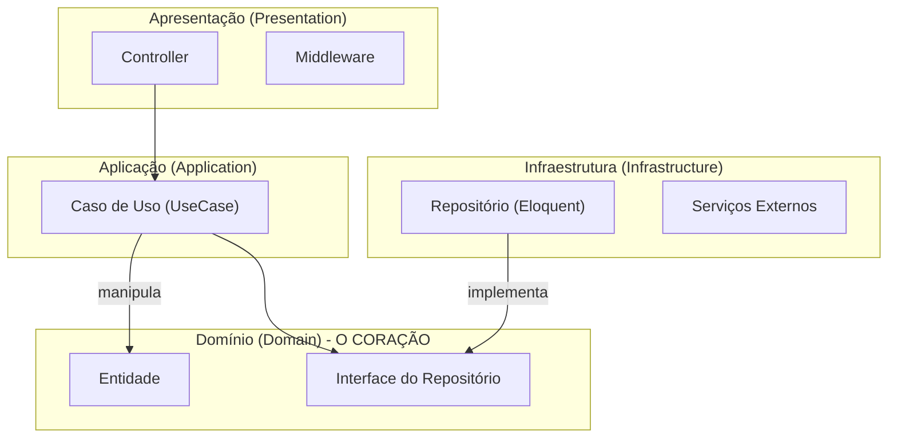
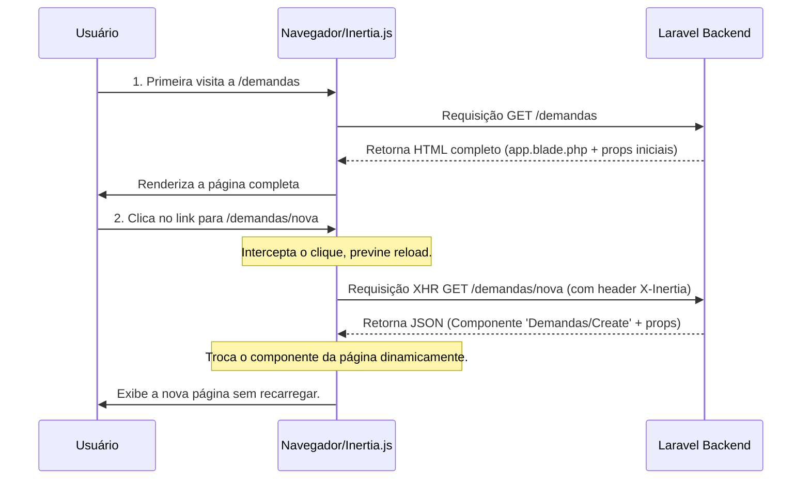

# Documentação Completa da Arquitetura NewSDC
## Um Guia Mestre para o Projeto

**Versão 1.0**

Este documento é a consolidação de todas as análises, conceitos e diagramas relacionados à arquitetura do projeto NewSDC. Ele serve como uma fonte única da verdade para desenvolvedores, arquitetos e stakeholders, detalhando a estrutura atual, a filosofia de design e os caminhos para a evolução futura.

---
---

# PARTE I: Manifesto da Arquitetura Atual

Esta parte detalha a filosofia e a implementação técnica do estado atual do sistema, servindo como uma introdução profunda aos princípios que guiam seu design.

## Capítulo 1: A Filosofia Arquitetural

A arquitetura do NewSDC é um design deliberado com dois pilares filosóficos centrais que criam uma **sinergia única**: a estrutura modular do domínio de negócio no backend é espelhada pela estrutura de componentes no frontend.

### Diagrama: Visão Geral da Arquitetura

```mermaid
graph TD
    subgraph "Cliente"
        A[Usuário] --> B{Navegador};
    end

    subgraph "Servidor"
        C(Frontend - Vue.js via Vite)
        D(Backend - Laravel)
        E[Banco de Dados (MySQL)]
        F[Cache/Filas (Redis)]
    end

    B --> |Requisição HTTP| C;
    C --> |Chamadas Inertia.js| D;
    D --> |Respostas (Props + Componente)| C;
    D --> E;
    D --> F;
```

1.  **Backend Orientado ao Domínio (Domain-Driven Design - DDD)**: A complexidade do negócio é o coração do software. O código é organizado em torno dos conceitos de negócio (Módulos como `Demandas`, `Pae`, `Rat`), tornando o software uma representação fiel do mundo real.

2.  **Frontend Atômico (Atomic Design)**: A interface do usuário é um sistema de design coeso. Componentes são construídos a partir de "átomos" e compostos progressivamente em "moléculas", "organismos", "templates" e "páginas", garantindo consistência e reutilização.

## Capítulo 2: O Coração do Backend - DDD na Prática

O backend é um **Monólito Modular**: a simplicidade de implantação de um único sistema com a organização e os limites claros de microsserviços.

### Diagrama: Fluxo de Dependência das Camadas DDD

O fluxo de controle segue de fora para dentro, mas a dependência é sempre de uma camada externa para uma mais interna. A Camada de Domínio não conhece nenhuma outra camada.



-   **2.1. O Domínio (`app/Modules/{Modulo}/Domain`)**: A camada mais pura e protegida, contendo a lógica de negócio em `Entities`, `ValueObjects`, `Repository Interfaces` e `Domain Services`.

-   **2.2. A Aplicação (`app/Modules/{Modulo}/Application`)**: Orquestra os casos de uso através de `UseCases` que recebem `DTOs`.

-   **2.3. A Infraestrutura (`app/Modules/{Modulo}/Infrastructure`)**: Implementa os contratos do domínio, como os `Repositories` que usam Eloquent para acessar o banco de dados.

-   **2.4. A Apresentação (`app/Modules/{Modulo}/Presentation`)**: A janela para o mundo, com `Controllers` finos, `Form Requests` para validação e `API Resources` para transformação de dados.

## Capítulo 3: A Fachada do Frontend - Ordem Atômica e Reatividade

O frontend é um sistema de design vivo, construído com componentes reutilizáveis e orquestrado de forma inteligente.

### Diagrama: Hierarquia de Composição do Atomic Design

```mermaid
graph TD
    subgraph "Fundação (Assets)"
        A[Átomos (Button, Input)]
    end
    subgraph "Componentes Funcionais"
        B[Moléculas (Campo de Busca)]
    end
    subgraph "Seções da Aplicação"
        C[Organismos (Barra Lateral, Tabela de Dados)]
    end
    subgraph "Estrutura da Visão"
        D[Templates (Layout Autenticado)]
    end
    subgraph "Resultado Final"
        E[Páginas (Página de Dashboard)]
    end

    A --> B; B --> C; C --> D; D --> E;
```

### 3.1. O Mapeamento Domínio-UI

A estrutura de pastas do frontend espelha a modularidade do backend, criando um "Bounded Context" também no lado cliente.

```
resources/js/
├── Pages/
│   ├── Rat/                 <-- Módulo do DDD
│   │   ├── Create.vue       (Página/Template)
│   │   ├── Index.vue
│   │   └── Partials/        <-- Organismos Específicos do Domínio
│   │       ├── RatForm.vue  (Usa Atoms/Molecules globais)
│   │       └── RatList.vue
│   ├── Pae/                 <-- Outro Módulo DDD
│   │   └── ...
```

### 3.2. Inertia.js: A Cola Invisível

Inertia.js provê a experiência de uma SPA reativa sem a necessidade de uma API REST completa, fazendo a ponte entre o backend Laravel e o frontend Vue.

### Diagrama: Fluxo de Requisição com Inertia.js



---
---

# PARTE II: Dicionário de Estrutura de Pastas

Esta parte serve como um mapa para navegar no projeto, detalhando o propósito de cada diretório principal.

## 📂 Raiz do Projeto (`NewSDC/`)
Contém a aplicação, documentação de alto nível e configurações globais.

-   📄 **Arquivos `.md`**: Base de conhecimento dinâmica do projeto.
-   📂 **`Doc/`**: Documentação arquitetural e estratégica.
-   📂 **`SDC/`**: O diretório da aplicação Laravel, detalhado abaixo.
-   📂 **`vars/`**: Scripts reutilizáveis de CI/CD (provavelmente Jenkins).

## 🚀 Aplicação Principal (`SDC/`)

-   📁 **`app/`**: Onde a lógica de negócio reside.
    -   📁 **`app/Modules/`**: A implementação central do DDD, com cada subpasta sendo um "Bounded Context".
-   📁 **`bootstrap/`**: Scripts de inicialização do framework.
-   📁 **`config/`**: Arquivos de configuração da aplicação (banco de dados, cache, etc.).
-   📁 **`database/`**: Migrations, Seeders e Factories.
-   📁 **`docker/`**: Configurações do ambiente de contêineres Docker (`docker-compose.yml`, etc.).
-   📁 **`public/`**: Raiz web, ponto de entrada para todas as requisições (`index.php`).
-   📁 **`resources/`**: Código-fonte frontend (Vue.js em `js/`) e views Blade.
-   📁 **`routes/`**: Definição de todos os endpoints da aplicação.
    -   📁 **`modules/`**: Subdiretório com rotas específicas para cada módulo DDD.
-   📁 **`storage/`**: Arquivos gerados pela aplicação (logs, cache, uploads).
-   📁 **`tests/`**: Suíte de testes automatizados (`Unit` e `Feature`).
-   📁 **`vendor/`, `node_modules/`**: Dependências de backend (Composer) e frontend (NPM).

---
---

# PARTE III: Recomendações e Evolução Estratégica

Esta parte detalha os próximos passos recomendados para aumentar a maturidade, resiliência e velocidade de desenvolvimento do projeto.

## 1. Fortalecer a Cobertura de Testes Automatizados

-   **Por quê?** Para garantir a qualidade, prevenir regressões e permitir refatorações seguras.
-   **Como (Técnico)**:
    -   **Testes de Unidade (Pest/PHPUnit)**: Focar na lógica pura dos `ValueObjects`, `Domain Services` e `UseCases` (mockando dependências).
    -   **Testes de Integração (Laravel/Pest)**: Validar a interação entre camadas, especialmente as implementações de `Repository` com o banco de dados (`RefreshDatabase`).
    -   **Testes End-to-End (Playwright)**: Simular fluxos críticos do usuário no navegador, desde o login até a criação de um registro, garantindo que a UI e o backend funcionem em conjunto.

## 2. Otimizar e Automatizar o Pipeline de CI/CD

-   **Por quê?** Para automatizar o processo de build, teste e deploy, garantindo consistência, velocidade e feedback rápido.
-   **Como (Técnico)**:
    -   **Integração Contínua (CI)**: Configurar um pipeline (GitHub Actions/Jenkins) para rodar a cada `push` ou `pull request`, executando:
        1.  **Static Analysis**: `PHPStan` e linters como `pint`.
        2.  **Execução de Testes**: `php artisan test`. O build deve falhar se os testes falharem.
        3.  **Build de Assets**: `npm run build`.
    -   **Entrega Contínua (CD)**: Automatizar o deploy para os ambientes de `staging` e `produção` após um build bem-sucedido na branch principal, utilizando os scripts Docker.

## 3. Aprimorar a Documentação da API com OpenAPI/Swagger

-   **Por quê?** Para fornecer documentação clara e interativa para a API, melhorando a experiência de desenvolvimento e facilitando integrações.
-   **Como (Técnico)**:
    -   **Geração Automática**: Utilizar anotações nos `Controllers` e `Form Requests` com uma biblioteca como `darkaonline/l5-swagger` para gerar uma especificação OpenAPI (JSON/YAML) dinamicamente a partir do código.

## Resultados Esperados (Impacto)

-   **Maior Confiabilidade**: Menos bugs em produção e segurança para alterar o código.
-   **Maior Velocidade de Entrega**: Feedback rápido de CI e deploys automatizados reduzem o tempo para lançar novas features.
-   **Melhor Escalabilidade (Técnica e Humana)**: Código mais fácil de manter e documentação clara facilitam a vida da equipe atual e a integração de novos membros.
