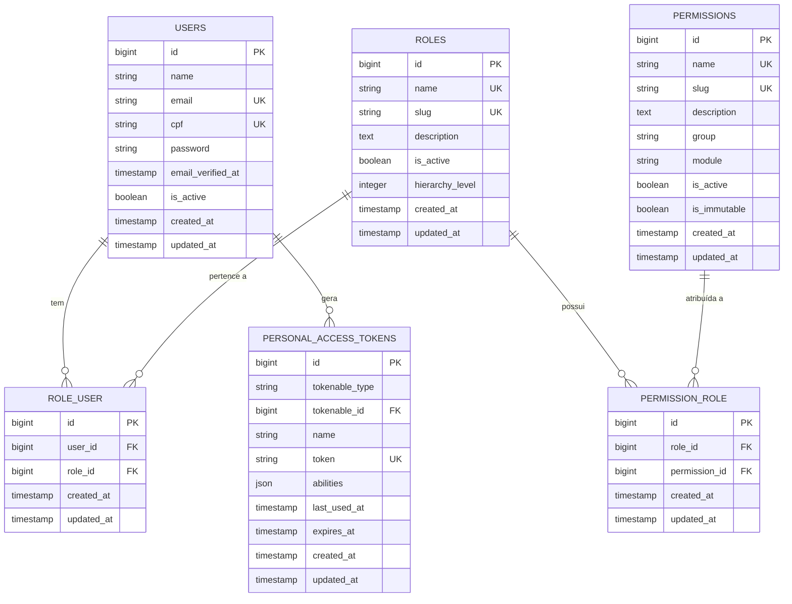
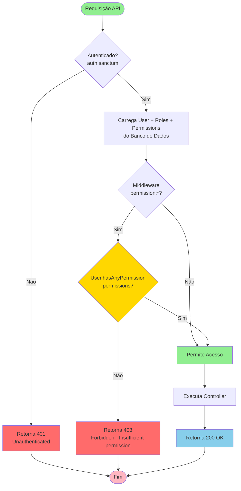
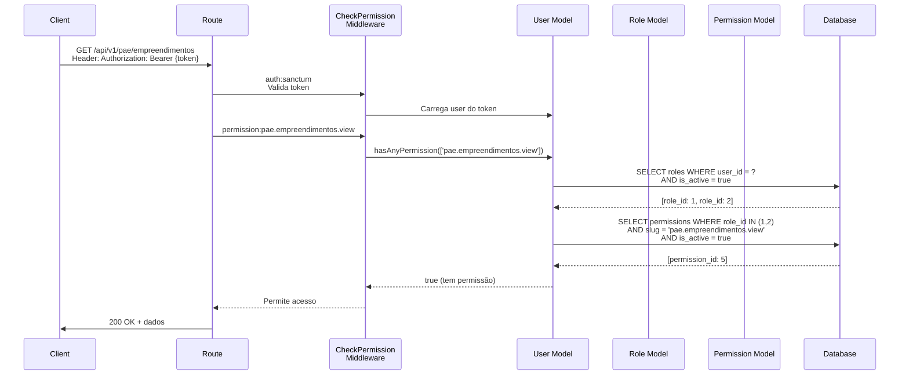
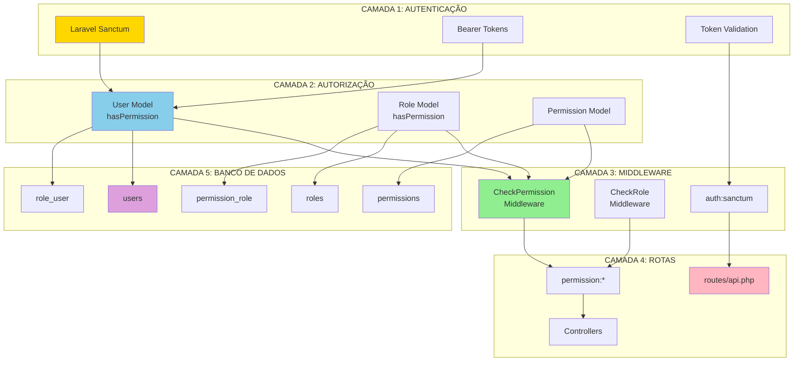

# Diagramas Mermaid - Sistema de Permissionamento NewSDC

**Data:** 2025-01-30  
**Status:** SISTEMA ATUAL EM PRODUÇÃO

---

## 1. Diagrama ER - Estrutura de Dados



---

## 2. Fluxo de Autorização (Runtime)



---

## 3. Hierarquia de Roles e Permissões

```mermaid
graph TB
    subgraph "ROLES (Cargos)"
        SUPER[Super Admin<br/>Nível 0<br/>BYPASS TOTAL]
        ADMIN[Admin<br/>Nível 1<br/>32 permissões]
        MANAGER[Manager<br/>Nível 2<br/>18 permissões]
        ANALYST[Analyst<br/>Nível 3<br/>12 permissões]
        OPERATOR[Operator<br/>Nível 4<br/>8 permissões]
        VIEWER[Viewer<br/>Nível 5<br/>6 permissões]
        USER[User<br/>Nível 6<br/>2 permissões]
    end
    
    subgraph "PERMISSÕES - USERS"
        U1[users.view]
        U2[users.create]
        U3[users.edit]
        U4[users.delete]
    end
    
    subgraph "PERMISSÕES - ROLES"
        R1[roles.view]
        R2[roles.create]
        R3[roles.edit]
        R4[roles.delete]
    end
    
    subgraph "PERMISSÕES - PERMISSIONS"
        P1[permissions.view]
        P2[permissions.manage]
    end
    
    subgraph "PERMISSÕES - PAE"
        PAE1[pae.empreendimentos.view]
        PAE2[pae.empreendimentos.create]
        PAE3[pae.empreendimentos.edit]
        PAE4[pae.empreendimentos.delete]
        PAE5[pae.empreendimentos.approve]
    end
    
    subgraph "PERMISSÕES - RAT"
        RAT1[rat.protocolos.view]
        RAT2[rat.protocolos.create]
        RAT3[rat.protocolos.edit]
        RAT4[rat.protocolos.delete]
        RAT5[rat.protocolos.finalize]
    end
    
    subgraph "PERMISSÕES - BI"
        BI1[bi.dashboards.view]
        BI2[bi.reports.export]
        BI3[bi.dashboards.create]
    end
    
    subgraph "PERMISSÕES - INTEGRATIONS"
        INT1[integrations.view]
        INT2[integrations.create]
        INT3[integrations.edit]
        INT4[integrations.execute]
    end
    
    subgraph "PERMISSÕES - WEBHOOKS"
        WH1[webhooks.send]
        WH2[webhooks.logs.view]
    end
    
    subgraph "PERMISSÕES - SYSTEM"
        SYS1[system.logs.view]
        SYS2[system.cache.clear]
        SYS3[system.settings.manage]
    end
    
    SUPER -.->|BYPASS| U1
    SUPER -.->|BYPASS| PAE1
    SUPER -.->|BYPASS| RAT1
    SUPER -.->|BYPASS| BI1
    
    ADMIN --> U1
    ADMIN --> U2
    ADMIN --> U3
    ADMIN --> U4
    ADMIN --> R1
    ADMIN --> R2
    ADMIN --> R3
    ADMIN --> PAE1
    ADMIN --> PAE2
    ADMIN --> PAE3
    ADMIN --> PAE4
    ADMIN --> PAE5
    ADMIN --> RAT1
    ADMIN --> RAT2
    ADMIN --> RAT3
    ADMIN --> RAT4
    ADMIN --> RAT5
    ADMIN --> BI1
    ADMIN --> BI2
    ADMIN --> BI3
    ADMIN --> INT1
    ADMIN --> INT2
    ADMIN --> INT3
    ADMIN --> INT4
    ADMIN --> WH1
    ADMIN --> WH2
    ADMIN --> SYS1
    ADMIN --> SYS2
    
    MANAGER --> PAE1
    MANAGER --> PAE2
    MANAGER --> PAE3
    MANAGER --> PAE5
    MANAGER --> RAT1
    MANAGER --> RAT2
    MANAGER --> RAT3
    MANAGER --> RAT5
    MANAGER --> BI1
    MANAGER --> BI2
    MANAGER --> INT1
    MANAGER --> INT4
    MANAGER --> WH1
    MANAGER --> WH2
    
    ANALYST --> PAE1
    ANALYST --> PAE2
    ANALYST --> PAE3
    ANALYST --> RAT1
    ANALYST --> RAT2
    ANALYST --> RAT3
    ANALYST --> BI1
    ANALYST --> BI2
    ANALYST --> INT1
    ANALYST --> WH2
    
    OPERATOR --> PAE1
    OPERATOR --> PAE2
    OPERATOR --> RAT1
    OPERATOR --> RAT2
    OPERATOR --> BI1
    
    VIEWER --> PAE1
    VIEWER --> RAT1
    VIEWER --> BI1
    
    USER --> PAE1
    USER --> RAT1
    
    style SUPER fill:#FFD700,stroke:#FF8C00,stroke-width:3px
    style ADMIN fill:#FF6B6B,stroke:#C92A2A,stroke-width:2px
    style MANAGER fill:#4ECDC4,stroke:#087F5B,stroke-width:2px
    style ANALYST fill:#95E1D3,stroke:#0CA678,stroke-width:2px
    style OPERATOR fill:#C7CEEA,stroke:#364FC7,stroke-width:2px
    style VIEWER fill:#FFDAC1,stroke:#FD7E14,stroke-width:2px
    style USER fill:#E0E0E0,stroke:#495057,stroke-width:1px
```



---

## 4. Proteção de Rotas API

```mermaid
graph LR
    subgraph "ROTAS API - MÓDULO PAE"
        PAE1[GET /api/v1/pae/empreendimentos<br/>permission:pae.empreendimentos.view]
        PAE2[GET /api/v1/pae/empreendimentos/{id}<br/>permission:pae.empreendimentos.view]
        PAE3[POST /api/v1/pae/empreendimentos<br/>permission:pae.empreendimentos.create]
        PAE4[PUT /api/v1/pae/empreendimentos/{id}<br/>permission:pae.empreendimentos.edit]
        PAE5[DELETE /api/v1/pae/empreendimentos/{id}<br/>permission:pae.empreendimentos.delete]
        PAE6[POST /api/v1/pae/empreendimentos/{id}/approve<br/>permission:pae.empreendimentos.approve]
    end
    
    subgraph "ROTAS API - MÓDULO RAT"
        RAT1[GET /api/v1/rat/protocolos<br/>permission:rat.protocolos.view]
        RAT2[GET /api/v1/rat/protocolos/{id}<br/>permission:rat.protocolos.view]
        RAT3[POST /api/v1/rat/protocolos<br/>permission:rat.protocolos.create]
        RAT4[PUT /api/v1/rat/protocolos/{id}<br/>permission:rat.protocolos.edit]
        RAT5[DELETE /api/v1/rat/protocolos/{id}<br/>permission:rat.protocolos.delete]
        RAT6[POST /api/v1/rat/protocolos/{id}/finalize<br/>permission:rat.protocolos.finalize]
    end
    
    subgraph "ROTAS API - MÓDULO BI"
        BI1[GET /api/v1/bi/entrada<br/>permission:bi.dashboards.view]
        BI2[GET /api/v1/bi/entrada/{id}<br/>permission:bi.dashboards.view]
    end
    
    subgraph "ROTAS API - INTEGRAÇÕES"
        INT1[GET /api/v1/integracao/rat/{id}/pae<br/>permission:integrations.view]
        INT2[GET /api/v1/integracao/pae/{id}/rat<br/>permission:integrations.view]
        INT3[POST /api/v1/power-bi/token<br/>permission:integrations.create]
        INT4[POST /api/v1/integration/execute<br/>permission:integrations.execute]
    end
    
    subgraph "ROTAS API - WEBHOOKS"
        WH1[POST /api/v1/webhooks/send<br/>permission:webhooks.send]
        WH2[POST /api/v1/webhooks/send-sync<br/>permission:webhooks.send]
        WH3[GET /api/v1/webhooks/logs<br/>permission:webhooks.logs.view]
    end
    
    subgraph "ROTAS API - SYSTEM"
        SYS1[GET /api/v1/logs/recent<br/>permission:system.logs.view]
        SYS2[GET /api/v1/logs/metrics<br/>permission:system.logs.view]
        SYS3[GET /api/v1/logs/errors<br/>permission:system.logs.view]
        SYS4[GET /api/v1/logs/stream<br/>permission:system.logs.view]
    end
    
    AUTH[auth:sanctum<br/>Middleware Global] --> PAE1
    AUTH --> RAT1
    AUTH --> BI1
    AUTH --> INT1
    AUTH --> WH1
    AUTH --> SYS1
    
    style AUTH fill:#FFD700,stroke:#FF8C00,stroke-width:3px
    style PAE1 fill:#87CEEB
    style RAT1 fill:#87CEEB
    style BI1 fill:#87CEEB
    style INT1 fill:#87CEEB
    style WH1 fill:#87CEEB
    style SYS1 fill:#87CEEB
```

---

## 5. Sequência de Verificação de Permissão



---

## 6. Arquitetura de Camadas



---

**Documento gerado em:** 2025-01-30  
**Baseado em:** Análise do código-fonte do NewSDC/SDC  
**Status:** SISTEMA ATUAL EM PRODUÇÃO

