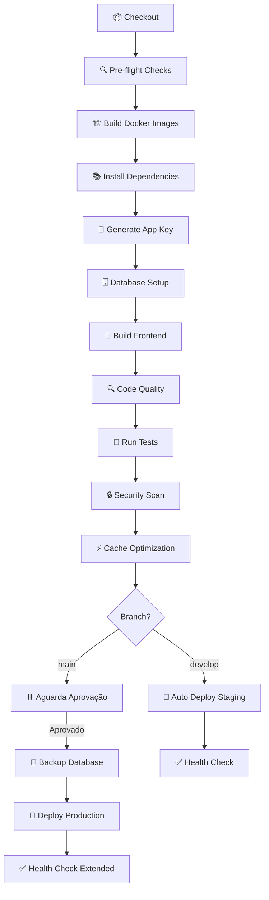
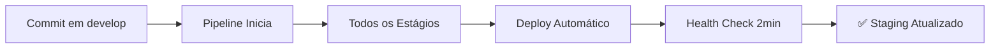
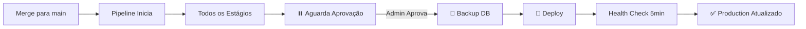

# 🚀 Pipeline CI/CD - Sistema SDC

> **Documentação completa do processo de integração contínua e deploy automatizado usando Jenkins**

---

## 📌 Índice

1. [Visão Geral](#-visão-geral)
2. [Arquitetura do Pipeline](#-arquitetura-do-pipeline)
3. [Estágios do Pipeline](#-estágios-do-pipeline)
4. [Fluxo de Deploy](#-fluxo-de-deploy)
5. [Configurações e Otimizações](#%EF%B8%8F-configurações-e-otimizações)
6. [Aprovação Manual](#-aprovação-manual)
7. [Monitoramento e Logs](#-monitoramento-e-logs)
8. [Troubleshooting](#-troubleshooting)
9. [Referências](#-referências)

---

## 🎯 Visão Geral

### O que é o Pipeline?

O Jenkins automatiza todo o ciclo de vida do código, desde o commit até a produção, garantindo:

- ✅ **Qualidade de Código**: Testes automatizados, análise estática e linting
- 🔒 **Segurança**: Auditoria de dependências e vulnerabilidades
- ⚡ **Performance**: Cache otimizado e builds paralelos
- 🚀 **Deploy Confiável**: Zero downtime e rollback automático
- 📊 **Rastreabilidade**: Logs completos e relatórios de cobertura

### Tecnologias Utilizadas

| Componente | Tecnologia | Versão |
|------------|-----------|---------|
| **CI/CD** | Jenkins | 2.440+ |
| **Container** | Docker | 24.0+ |
| **Orquestração** | Docker Compose | 2.20+ |
| **Backend** | PHP/Laravel | 8.2/11.x |
| **Frontend** | Vue.js + Vite | 3.x |
| **Database** | MySQL | 8.0 |

---

## 🏗️ Arquitetura do Pipeline

### Diagrama de Fluxo



### Agente de Build

```groovy
agent {
    docker {
        image 'php:8.2-cli'
        args '-v /var/run/docker.sock:/var/run/docker.sock --network sdc_network'
    }
}
```

**Por quê?**
- ✅ Build isolado e reproduzível
- 🔌 Acesso ao Docker host para builds de imagens
- 🌐 Conectado à rede `sdc_network` para comunicação entre containers

---

## 📋 Estágios do Pipeline

### 1️⃣ Checkout

**Objetivo**: Baixar o código-fonte do repositório Git

```bash
# Captura informações do commit
GIT_COMMIT_MSG=$(git log -1 --pretty=%B)
GIT_AUTHOR=$(git log -1 --pretty=%an)
```

**Saída Esperada**:
```
📦 Checking out code...
Commit: feat: Adiciona endpoint de webhooks
Author: João Silva
```

---

### 2️⃣ Pre-flight Checks

**Objetivo**: Validar ambiente antes de iniciar o build

| Verificação | Critério | Ação se Falhar |
|------------|----------|----------------|
| **Docker** | Instalado e rodando | ❌ Erro fatal |
| **Docker Compose** | Versão 2.0+ | ❌ Erro fatal |
| **Espaço em Disco** | Mínimo 5GB livre | ❌ Erro fatal |
| **Arquivo .env** | Existe | ⚠️ Copia de `.env.example` |

**Exemplo de Erro**:
```bash
❌ Espaço em disco insuficiente: 3GB. Mínimo: 5GB
```

---

### 3️⃣ Build Docker Images

**Objetivo**: Construir todas as imagens Docker do projeto

```bash
# Limpeza preventiva (economiza memória)
docker system prune -f --filter "until=24h"

# Build paralelo com cache
docker-compose -f docker-compose.prod.yml build --parallel
```

**Otimizações**:
- 🚀 **Build Paralelo**: Constrói múltiplas imagens simultaneamente
- 💾 **Docker Buildkit**: Build cache layers para reuso
- 🧹 **Cleanup**: Remove builds antigos automaticamente

---

### 4️⃣ Install Dependencies

**Execução em Paralelo**: PHP e Node executam simultaneamente

#### 📦 PHP Dependencies (Composer)

```bash
composer install \
    --no-interaction \
    --prefer-dist \
    --optimize-autoloader \
    --no-dev
```

**Cache**: `${WORKSPACE}/.composer-cache`

#### 📦 Node Dependencies (NPM)

```bash
npm ci --prefer-offline
```

**Cache**: `${WORKSPACE}/.npm-cache`

**Tempo Médio**:
- ⏱️ Primeira execução: ~3 minutos
- ⚡ Com cache: ~30 segundos

---

### 5️⃣ Generate Application Key

**Objetivo**: Gerar chave de criptografia do Laravel

```bash
php artisan key:generate --force
```

**Resultado**: Cria `APP_KEY` no arquivo `.env`

```
base64:Xj8k2L9mN4pQ7sR1tU5vW8xY0zA3bC6d...
```

---

### 6️⃣ Database Setup

**Objetivo**: Preparar banco de dados com migrations e seeds

```bash
# 1. Iniciar container MySQL
docker-compose up -d db

# 2. Aguardar MySQL estar pronto (timeout 60s)
until mysqladmin ping -h localhost --silent; do
    sleep 2
done

# 3. Executar migrations + seeds
php artisan migrate --force --seed
```

**Resolve Problema**: Race condition entre aplicação e banco

---

### 7️⃣ Build Frontend Assets

**Objetivo**: Compilar assets do frontend (Vue.js + Vite)

```bash
npm run build
```

**Output**:
```
vite v5.0.10 building for production...
✓ 847 modules transformed
dist/assets/app-4f2a1b3c.js    234.56 kB │ gzip: 78.23 kB
dist/assets/app-9e8d7c6f.css   45.67 kB  │ gzip: 12.34 kB
✓ built in 8.73s
```

---

### 8️⃣ Code Quality

**Execução em Paralelo**: Lint e análise estática simultâneos

#### 🔍 PHP Lint (Laravel Pint)

```bash
./vendor/bin/pint --test
```

**Verifica**: PSR-12, formatação, convenções Laravel

#### 🔬 Static Analysis (PHPStan)

```bash
./vendor/bin/phpstan analyse --memory-limit=2G
```

**Verifica**: Type safety, dead code, possíveis bugs

---

### 9️⃣ Run Tests

**Execução em Paralelo**: Unit e Feature tests simultâneos

#### 🧪 Unit Tests

```bash
php artisan test \
    --testsuite=Unit \
    --coverage-html coverage/unit \
    --log-junit reports/junit-unit.xml
```

#### 🧪 Feature Tests

```bash
php artisan test \
    --testsuite=Feature \
    --coverage-html coverage/feature \
    --log-junit reports/junit-feature.xml
```

**Relatórios Gerados**:
- 📊 HTML Coverage Report
- 📄 JUnit XML (integração Jenkins)

---

### 🔟 Security Scan

**Objetivo**: Identificar vulnerabilidades em dependências

```bash
# Audit PHP
composer audit

# Audit Node
npm audit --audit-level=moderate
```

**Exemplo de Saída**:
```
Found 0 vulnerabilities in PHP dependencies ✅
Found 2 moderate vulnerabilities in Node dependencies ⚠️
```

---

### 1️⃣1️⃣ Cache Optimization

**Objetivo**: Otimizar performance da aplicação Laravel

```bash
php artisan config:cache    # Cache de configurações
php artisan route:cache     # Cache de rotas
php artisan view:cache      # Cache de views Blade
php artisan event:cache     # Cache de eventos
```

**Benefício**: Reduz tempo de boot em ~40%

---

### 1️⃣2️⃣ Deploy

Deploy **condicional** baseado na branch:

| Branch | Ambiente | Aprovação | Backup | Health Check |
|--------|----------|-----------|---------|--------------|
| `develop` | 🔧 Staging | ✅ Automático | ❌ Não | 2 minutos |
| `main` | 🏭 Production | ⏸️ Manual | ✅ Sim | 5 minutos |

---

## 🔀 Fluxo de Deploy

### 🔧 Staging (Branch: `develop`)



**Características**:
- ✅ Deploy automático (sem intervenção humana)
- ⚡ Feedback rápido (ideal para testes)
- 🔄 Pode falhar sem impacto em produção

**Comando**:
```bash
docker-compose up -d --no-deps --build
```

---

### 🏭 Production (Branch: `main`)



**Características**:
- ⏸️ Requer aprovação manual de admin
- 💾 Backup automático antes do deploy
- 🔒 Health check estendido (5 minutos)
- ♻️ Rollback disponível via restore do backup

**Comando**:
```bash
# 1. Backup
./SDC/docker/jenkins/backup.sh backup

# 2. Deploy
docker-compose up -d --no-deps --build --force-recreate

# 3. Health Check
curl -f http://localhost:80/health
```

---

## 🔐 Aprovação Manual

### Como Funciona?

Quando o pipeline chega no estágio **"Deploy to Production"**:

1. **Pipeline Pausa** ⏸️
   ```
   🚀 Deploying to production environment...
   ⏸️  Aguardando aprovação manual...
   ```

2. **Admin Recebe Notificação** 📧
   - Via interface do Jenkins
   - (Opcional) Slack/Email se configurado

3. **Admin Acessa Jenkins** 🖥️
   - URL: `http://localhost:8080/job/SDC/`
   - Clica no build em andamento

4. **Decisão**:
   - ✅ **Deploy**: Continua pipeline
   - ❌ **Abort**: Cancela deploy

### Quem Pode Aprovar?

```groovy
input message: 'Deploy to production?',
      ok: 'Deploy',
      submitter: 'admin'
```

- 👤 Apenas usuários com role `admin` no Jenkins
- 🚫 **NÃO** depende de permissões do GitHub
- ⚙️ Configurável em: [Jenkinsfile:288](c:\Users\kdes\Documentos\GitHub\New_SDC\SDC\Jenkinsfile#L288)

### Configurando Aprovadores

1. Acesse Jenkins → **Manage Jenkins** → **Security**
2. Em **Authorization**, adicione usuário ao grupo `admin`
3. Salve as configurações

---

## ⚙️ Configurações e Otimizações

### Timeout Global

```groovy
timeout(time: 30, unit: 'MINUTES')
```

**Por quê?**: Evita pipelines travados consumindo recursos

---

### Build Retention

```groovy
buildDiscarder(logRotator(
    numToKeepStr: '10',        // Manter últimos 10 builds
    artifactNumToKeepStr: '5'  // Manter últimos 5 artifacts
))
```

**Economiza**: Espaço em disco no Jenkins

---

### Cache de Dependências

| Cache | Localização | Retenção | Economia de Tempo |
|-------|-------------|----------|-------------------|
| **Composer** | `${WORKSPACE}/.composer-cache` | 7 dias | ~2 minutos |
| **NPM** | `${WORKSPACE}/.npm-cache` | 7 dias | ~1.5 minutos |
| **Docker Layers** | Docker Buildkit | Automático | ~3 minutos |

**Limpeza Automática**:
```bash
find .composer-cache -type f -mtime +7 -delete
find .npm-cache -type f -mtime +7 -delete
```

---

### Execução Paralela

O pipeline utiliza **paralelização** em 3 estágios:

#### 1. Install Dependencies (Stage 4)
```
┌─────────────────────┐  ┌─────────────────────┐
│ PHP Dependencies    │  │ Node Dependencies   │
│ (Composer)          │  │ (NPM)               │
└─────────────────────┘  └─────────────────────┘
```

#### 2. Code Quality (Stage 8)
```
┌─────────────────────┐  ┌─────────────────────┐
│ PHP Lint            │  │ Static Analysis     │
│ (Pint)              │  │ (PHPStan)           │
└─────────────────────┘  └─────────────────────┘
```

#### 3. Run Tests (Stage 9)
```
┌─────────────────────┐  ┌─────────────────────┐
│ Unit Tests          │  │ Feature Tests       │
└─────────────────────┘  └─────────────────────┘
```

**Economia**: ~40% do tempo total de build

---

### Zero Downtime Deploy

**Estratégia**: Rolling update sem interrupção

```bash
docker-compose up -d --no-deps --build --force-recreate
```

**Como funciona**:
1. 🏗️ Cria novo container
2. ⏳ Aguarda estar healthy
3. 🔄 Redireciona tráfego
4. 🗑️ Remove container antigo

**Tempo de Downtime**: ~0 segundos

---

## 📊 Monitoramento e Logs

### Logs de Build

**No Jenkins**:
1. Acesse: `http://localhost:8080`
2. Clique no job **"SDC"**
3. Selecione o build desejado
4. **Console Output** → logs completos

**Via CLI**:
```bash
# Logs do último build
docker-compose -f docker-compose.jenkins.yml logs jenkins --tail=100

# Logs de um container específico
docker logs sdc-app-1 --tail=50 --follow
```

---

### Health Checks

**Endpoint**: `http://localhost:80/health`

**Resposta Esperada**:
```json
{
  "status": "healthy",
  "timestamp": "2025-01-21T10:30:00Z",
  "services": {
    "database": "ok",
    "cache": "ok",
    "storage": "ok"
  }
}
```

**Configuração**:
- 🔧 Staging: 2 minutos de verificação
- 🏭 Production: 5 minutos de verificação

---

### Relatórios Gerados

| Relatório | Formato | Localização | Descrição |
|-----------|---------|-------------|-----------|
| **Test Coverage** | HTML | `coverage/index.html` | Cobertura de testes |
| **JUnit Results** | XML | `reports/junit-*.xml` | Resultados dos testes |
| **Docker Logs** | TXT | `docker-logs.txt` | Logs em caso de falha |
| **Security Audit** | JSON | `audit-report.json` | Vulnerabilidades encontradas |

---

## 🚨 Troubleshooting

### ❌ Pipeline falha no "Pre-flight Checks"

**Erro**:
```
Espaço em disco insuficiente: 3GB. Mínimo: 5GB
```

**Soluções**:
```bash
# 1. Limpar Docker
docker system prune -a --volumes -f

# 2. Limpar builds antigos do Jenkins
# Jenkins → Manage Jenkins → Disk Usage

# 3. Verificar espaço
df -h
```

---

### ❌ Pipeline falha no "Database Setup"

**Erro**:
```
SQLSTATE[HY000] [2002] Connection refused
```

**Causas Comuns**:
1. MySQL ainda está inicializando
2. Porta 3306 já em uso
3. Credenciais incorretas no `.env`

**Soluções**:
```bash
# 1. Verificar status do container
docker-compose ps

# 2. Ver logs do MySQL
docker-compose logs db

# 3. Testar conexão manualmente
docker-compose exec db mysql -uroot -p

# 4. Aumentar timeout no Jenkinsfile (linha 155)
timeout 120 sh -c '...'  # Era 60, agora 120
```

---

### ⏸️ Deploy não aparece para aprovação

**Problema**: Branch não é `main`

**Verificar**:
```bash
git branch --show-current
```

**Solução**:
```bash
# Se estiver em outra branch
git checkout main
git pull origin main

# Criar PR do develop para main
git checkout develop
gh pr create --base main --head develop
```

---

### ❌ Aprovação não funciona

**Erro**:
```
User 'joao' is not authorized to approve this deployment
```

**Solução**:
1. **Verificar permissões**:
   - Jenkins → **Manage Jenkins** → **Security**
   - Confirmar que usuário tem role `admin`

2. **Alternativa**: Modificar `submitter` no Jenkinsfile
   ```groovy
   // Permitir múltiplos usuários
   submitter: 'admin,joao,maria'
   ```

---

### 🐢 Build muito lento

**Sintomas**:
- Build leva >20 minutos
- Cache não está funcionando

**Diagnóstico**:
```bash
# Verificar uso de cache
docker-compose build --progress=plain 2>&1 | grep "CACHED"

# Verificar espaço em disco
df -h ${WORKSPACE}
```

**Soluções**:
1. **Limpar cache corrompido**:
   ```bash
   rm -rf .composer-cache .npm-cache
   docker builder prune -a -f
   ```

2. **Aumentar recursos do Docker**:
   - Docker Desktop → Settings → Resources
   - CPU: 4+ cores
   - RAM: 8GB+

3. **Verificar paralelização**:
   - Confirmar que stages paralelos estão executando

---

### ❌ Testes falhando

**Erro**:
```
Tests: 142 passed, 3 failed, 145 total
```

**Investigação**:
```bash
# 1. Ver relatório HTML
open coverage/index.html

# 2. Executar testes localmente
docker-compose run --rm app php artisan test

# 3. Executar teste específico
php artisan test --filter=UserTest

# 4. Ver logs detalhados
php artisan test --stop-on-failure -vvv
```

---

### 🔒 Security Scan encontra vulnerabilidades

**Exemplo**:
```
Found 5 vulnerabilities (3 moderate, 2 high)
```

**Ações**:
```bash
# 1. Ver detalhes
npm audit
composer audit

# 2. Corrigir automaticamente (quando possível)
npm audit fix
composer update --with-dependencies

# 3. Ignorar falso positivo (com justificativa)
npm audit --audit-level=high  # Ignora moderate
```

---

### 💾 Backup falha

**Erro**:
```
./backup.sh: line 23: mysqldump: command not found
```

**Solução**:
```bash
# 1. Verificar script de backup
cat SDC/docker/jenkins/backup.sh

# 2. Executar manualmente
docker-compose exec db mysqldump -uroot -p sdc_db > backup.sql

# 3. Verificar permissões
chmod +x SDC/docker/jenkins/backup.sh
```

---

### 🔄 Rollback em Produção

**Quando usar**: Deploy causou problemas em produção

**Procedimento**:
```bash
# 1. Restaurar backup do banco
./SDC/docker/jenkins/backup.sh restore backup-2025-01-21.sql

# 2. Reverter para versão anterior
git revert HEAD
git push origin main

# 3. Ou: deploy manual da versão anterior
git checkout <commit-anterior>
docker-compose up -d --force-recreate

# 4. Verificar saúde
curl http://localhost:80/health
```

---

## 📚 Referências

### Arquivos do Projeto

| Arquivo | Descrição | Link |
|---------|-----------|------|
| **Jenkinsfile** | Definição do pipeline | [SDC/Jenkinsfile](c:\Users\kdes\Documentos\GitHub\New_SDC\SDC\Jenkinsfile) |
| **docker-compose.prod.yml** | Configuração de produção | [SDC/docker/docker-compose.yml](c:\Users\kdes\Documentos\GitHub\New_SDC\SDC\docker\docker-compose.yml) |
| **backup.sh** | Script de backup/restore | [SDC/docker/jenkins/backup.sh](c:\Users\kdes\Documentos\GitHub\New_SDC\SDC\docker\jenkins\backup.sh) |
| **casc.yaml** | Jenkins Configuration as Code | [SDC/docker/jenkins/casc.yaml](c:\Users\kdes\Documentos\GitHub\New_SDC\SDC\docker\jenkins\casc.yaml) |

---

### Comandos Úteis

```bash
# Ver status do Jenkins
docker-compose -f docker-compose.jenkins.yml ps

# Reiniciar Jenkins
docker-compose -f docker-compose.jenkins.yml restart jenkins

# Acessar Jenkins CLI
docker-compose -f docker-compose.jenkins.yml exec jenkins bash

# Trigger manual do pipeline
curl -X POST http://localhost:8080/job/SDC/build \
  --user admin:token

# Ver jobs agendados
curl http://localhost:8080/queue/api/json
```

---

### Estrutura de Diretórios Jenkins

```
jenkins/
├── backup.sh              # Script de backup
├── setup.sh              # Script de instalação
├── healthcheck.sh        # Health check do Jenkins
├── casc.yaml            # Configuration as Code
├── Dockerfile           # Imagem personalizada
├── nginx.conf           # Reverse proxy
├── .env.example         # Variáveis de ambiente
└── init.groovy.d/       # Scripts de inicialização
    ├── 01-security.groovy
    └── 02-docker-config.groovy
```

---

### Métricas do Pipeline

| Métrica | Valor Típico | Meta |
|---------|--------------|------|
| **Tempo Total** | 12-15 min | <10 min |
| **Taxa de Sucesso** | 85-90% | >95% |
| **Tempo de Deploy** | 2-3 min | <2 min |
| **Cobertura de Testes** | 75% | >80% |
| **Builds por Dia** | 15-20 | - |

---

### Links Externos

- 📖 [Documentação Jenkins](https://www.jenkins.io/doc/)
- 🐳 [Docker Best Practices](https://docs.docker.com/develop/dev-best-practices/)
- 🎯 [Laravel Deployment](https://laravel.com/docs/deployment)
- 🔧 [Configuration as Code Plugin](https://plugins.jenkins.io/configuration-as-code/)

---

## 🔄 Histórico de Alterações

| Data | Versão | Alterações |
|------|--------|------------|
| 2025-01-21 | 1.0.0 | Documentação inicial completa |
| 2025-01-15 | 0.9.0 | Adicionado suporte a PHP 8.2 |
| 2025-01-10 | 0.8.0 | Implementado zero downtime deploy |

---

<div align="center">

**🚀 Pipeline SDC - Documentação v1.0.0**

*Última atualização: 2025-01-21*

</div>
