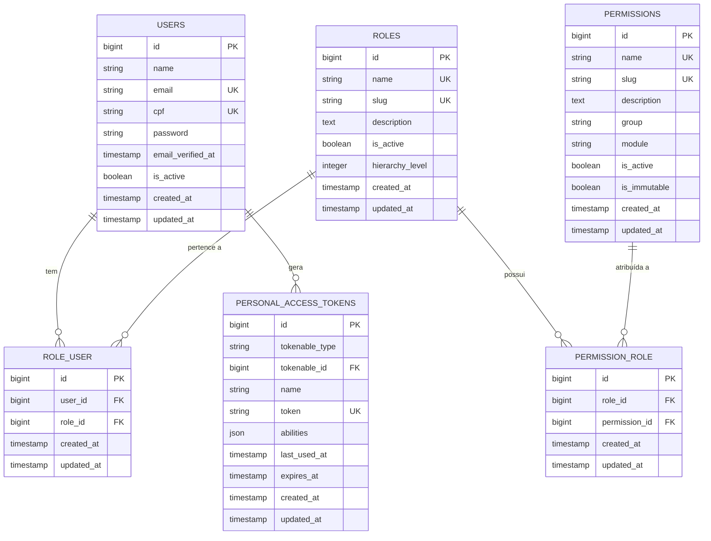
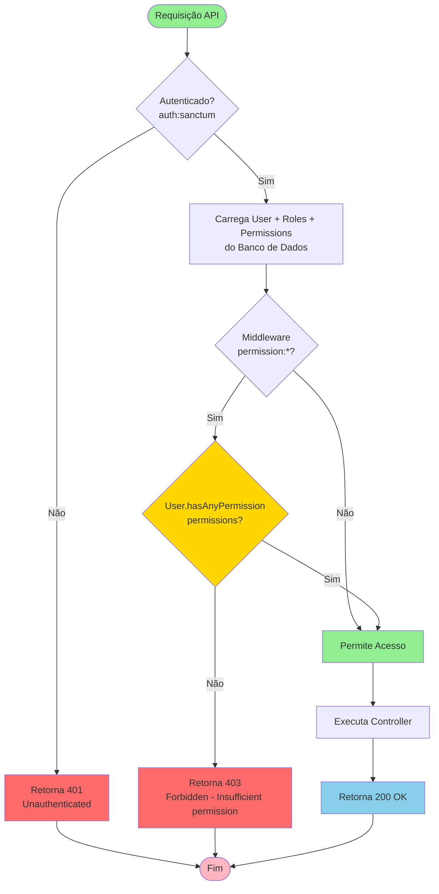
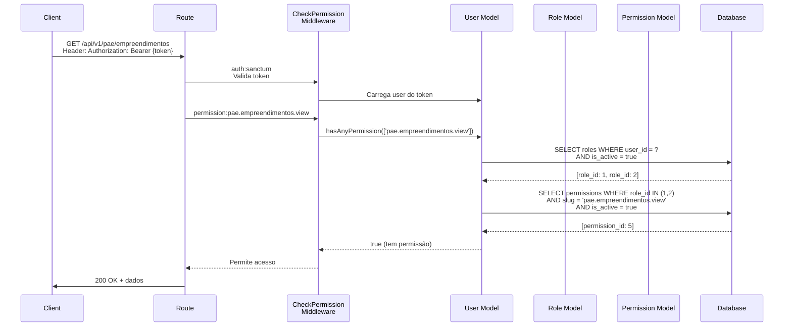

# Mapeamento do Sistema de Permissionamento - NewSDC

**Data:** 2025-01-30  
**Status:** SISTEMA ATUAL EM PRODUÇÃO  
**Versão:** 1.0

---

## Diagrama Mermaid - Estrutura de Dados



---

## Diagrama Mermaid - Fluxo de Autorização (Runtime)



---

## Diagrama Mermaid - Hierarquia de Roles e Permissões

```mermaid
graph TB
    subgraph "ROLES (Cargos)"
        SUPER[Super Admin<br/>Nível 0<br/>BYPASS TOTAL]
        ADMIN[Admin<br/>Nível 1<br/>32 permissões]
        MANAGER[Manager<br/>Nível 2<br/>18 permissões]
        ANALYST[Analyst<br/>Nível 3<br/>12 permissões]
        OPERATOR[Operator<br/>Nível 4<br/>8 permissões]
        VIEWER[Viewer<br/>Nível 5<br/>6 permissões]
        USER[User<br/>Nível 6<br/>2 permissões]
    end
    
    subgraph "PERMISSÕES - USERS"
        U1[users.view]
        U2[users.create]
        U3[users.edit]
        U4[users.delete]
    end
    
    subgraph "PERMISSÕES - ROLES"
        R1[roles.view]
        R2[roles.create]
        R3[roles.edit]
        R4[roles.delete]
    end
    
    subgraph "PERMISSÕES - PERMISSIONS"
        P1[permissions.view]
        P2[permissions.manage]
    end
    
    subgraph "PERMISSÕES - PAE"
        PAE1[pae.empreendimentos.view]
        PAE2[pae.empreendimentos.create]
        PAE3[pae.empreendimentos.edit]
        PAE4[pae.empreendimentos.delete]
        PAE5[pae.empreendimentos.approve]
    end
    
    subgraph "PERMISSÕES - RAT"
        RAT1[rat.protocolos.view]
        RAT2[rat.protocolos.create]
        RAT3[rat.protocolos.edit]
        RAT4[rat.protocolos.delete]
        RAT5[rat.protocolos.finalize]
    end
    
    subgraph "PERMISSÕES - BI"
        BI1[bi.dashboards.view]
        BI2[bi.reports.export]
        BI3[bi.dashboards.create]
    end
    
    subgraph "PERMISSÕES - INTEGRATIONS"
        INT1[integrations.view]
        INT2[integrations.create]
        INT3[integrations.edit]
        INT4[integrations.execute]
    end
    
    subgraph "PERMISSÕES - WEBHOOKS"
        WH1[webhooks.send]
        WH2[webhooks.logs.view]
    end
    
    subgraph "PERMISSÕES - SYSTEM"
        SYS1[system.logs.view]
        SYS2[system.cache.clear]
        SYS3[system.settings.manage]
    end
    
    SUPER -.->|BYPASS| U1
    SUPER -.->|BYPASS| PAE1
    SUPER -.->|BYPASS| RAT1
    SUPER -.->|BYPASS| BI1
    
    ADMIN --> U1
    ADMIN --> U2
    ADMIN --> U3
    ADMIN --> U4
    ADMIN --> R1
    ADMIN --> R2
    ADMIN --> R3
    ADMIN --> PAE1
    ADMIN --> PAE2
    ADMIN --> PAE3
    ADMIN --> PAE4
    ADMIN --> PAE5
    ADMIN --> RAT1
    ADMIN --> RAT2
    ADMIN --> RAT3
    ADMIN --> RAT4
    ADMIN --> RAT5
    ADMIN --> BI1
    ADMIN --> BI2
    ADMIN --> BI3
    ADMIN --> INT1
    ADMIN --> INT2
    ADMIN --> INT3
    ADMIN --> INT4
    ADMIN --> WH1
    ADMIN --> WH2
    ADMIN --> SYS1
    ADMIN --> SYS2
    
    MANAGER --> PAE1
    MANAGER --> PAE2
    MANAGER --> PAE3
    MANAGER --> PAE5
    MANAGER --> RAT1
    MANAGER --> RAT2
    MANAGER --> RAT3
    MANAGER --> RAT5
    MANAGER --> BI1
    MANAGER --> BI2
    MANAGER --> INT1
    MANAGER --> INT4
    MANAGER --> WH1
    MANAGER --> WH2
    
    ANALYST --> PAE1
    ANALYST --> PAE2
    ANALYST --> PAE3
    ANALYST --> RAT1
    ANALYST --> RAT2
    ANALYST --> RAT3
    ANALYST --> BI1
    ANALYST --> BI2
    ANALYST --> INT1
    ANALYST --> WH2
    
    OPERATOR --> PAE1
    OPERATOR --> PAE2
    OPERATOR --> RAT1
    OPERATOR --> RAT2
    OPERATOR --> BI1
    
    VIEWER --> PAE1
    VIEWER --> RAT1
    VIEWER --> BI1
    
    USER --> PAE1
    USER --> RAT1
    
    style SUPER fill:#FFD700,stroke:#FF8C00,stroke-width:3px
    style ADMIN fill:#FF6B6B,stroke:#C92A2A,stroke-width:2px
    style MANAGER fill:#4ECDC4,stroke:#087F5B,stroke-width:2px
    style ANALYST fill:#95E1D3,stroke:#0CA678,stroke-width:2px
    style OPERATOR fill:#C7CEEA,stroke:#364FC7,stroke-width:2px
    style VIEWER fill:#FFDAC1,stroke:#FD7E14,stroke-width:2px
    style USER fill:#E0E0E0,stroke:#495057,stroke-width:1px
```



---

## Diagrama Mermaid - Proteção de Rotas API

```mermaid
graph LR
    subgraph "ROTAS API - MÓDULO PAE"
        PAE1[GET /api/v1/pae/empreendimentos<br/>permission:pae.empreendimentos.view]
        PAE2[GET /api/v1/pae/empreendimentos/{id}<br/>permission:pae.empreendimentos.view]
        PAE3[POST /api/v1/pae/empreendimentos<br/>permission:pae.empreendimentos.create]
        PAE4[PUT /api/v1/pae/empreendimentos/{id}<br/>permission:pae.empreendimentos.edit]
        PAE5[DELETE /api/v1/pae/empreendimentos/{id}<br/>permission:pae.empreendimentos.delete]
        PAE6[POST /api/v1/pae/empreendimentos/{id}/approve<br/>permission:pae.empreendimentos.approve]
    end
    
    subgraph "ROTAS API - MÓDULO RAT"
        RAT1[GET /api/v1/rat/protocolos<br/>permission:rat.protocolos.view]
        RAT2[GET /api/v1/rat/protocolos/{id}<br/>permission:rat.protocolos.view]
        RAT3[POST /api/v1/rat/protocolos<br/>permission:rat.protocolos.create]
        RAT4[PUT /api/v1/rat/protocolos/{id}<br/>permission:rat.protocolos.edit]
        RAT5[DELETE /api/v1/rat/protocolos/{id}<br/>permission:rat.protocolos.delete]
        RAT6[POST /api/v1/rat/protocolos/{id}/finalize<br/>permission:rat.protocolos.finalize]
    end
    
    subgraph "ROTAS API - MÓDULO BI"
        BI1[GET /api/v1/bi/entrada<br/>permission:bi.dashboards.view]
        BI2[GET /api/v1/bi/entrada/{id}<br/>permission:bi.dashboards.view]
    end
    
    subgraph "ROTAS API - INTEGRAÇÕES"
        INT1[GET /api/v1/integracao/rat/{id}/pae<br/>permission:integrations.view]
        INT2[GET /api/v1/integracao/pae/{id}/rat<br/>permission:integrations.view]
        INT3[POST /api/v1/power-bi/token<br/>permission:integrations.create]
        INT4[POST /api/v1/integration/execute<br/>permission:integrations.execute]
    end
    
    subgraph "ROTAS API - WEBHOOKS"
        WH1[POST /api/v1/webhooks/send<br/>permission:webhooks.send]
        WH2[POST /api/v1/webhooks/send-sync<br/>permission:webhooks.send]
        WH3[GET /api/v1/webhooks/logs<br/>permission:webhooks.logs.view]
    end
    
    subgraph "ROTAS API - SYSTEM"
        SYS1[GET /api/v1/logs/recent<br/>permission:system.logs.view]
        SYS2[GET /api/v1/logs/metrics<br/>permission:system.logs.view]
        SYS3[GET /api/v1/logs/errors<br/>permission:system.logs.view]
        SYS4[GET /api/v1/logs/stream<br/>permission:system.logs.view]
    end
    
    AUTH[auth:sanctum<br/>Middleware Global] --> PAE1
    AUTH --> RAT1
    AUTH --> BI1
    AUTH --> INT1
    AUTH --> WH1
    AUTH --> SYS1
    
    style AUTH fill:#FFD700,stroke:#FF8C00,stroke-width:3px
    style PAE1 fill:#87CEEB
    style RAT1 fill:#87CEEB
    style BI1 fill:#87CEEB
    style INT1 fill:#87CEEB
    style WH1 fill:#87CEEB
    style SYS1 fill:#87CEEB
```

---

## Diagrama Mermaid - Verificação de Permissão (Detalhado)



---

## Resumo do Sistema Atual

### ✅ O QUE ESTÁ IMPLEMENTADO

1. **Estrutura de Dados Completa**
   - Tabelas: `users`, `roles`, `permissions`, `role_user`, `permission_role`
   - Campos: `hierarchy_level`, `module`, `is_immutable`, `is_active`

2. **Middleware de Autorização**
   - `CheckPermission` - Verifica permissões via `User::hasAnyPermission()`
   - `CheckRole` - Verifica roles via `User::hasAnyRole()`
   - Registrado no `Kernel.php` como `permission` e `role`

3. **Proteção de Rotas API**
   - Todas as rotas API protegidas com `auth:sanctum`
   - Rotas específicas protegidas com `permission:*`
   - Retorna 401 (não autenticado) ou 403 (sem permissão)

4. **Seeder de Roles e Permissões**
   - 7 roles: super-admin, admin, manager, analyst, operator, viewer, user
   - 32 permissões organizadas por módulo
   - Atribuição automática de permissões por role

5. **Gates e Policies (Infraestrutura)**
   - `Gate::before` para bypass de super-admin
   - Gates definidos para cada permissão
   - Policies criadas (UserPolicy, RolePolicy, PermissionPolicy, etc.)

### ⚠️ O QUE NÃO ESTÁ SENDO USADO (Mas Existe)

1. **Gates/Policies não são chamados nas rotas API**
   - As rotas usam middleware `permission:*` diretamente
   - Não há uso de `can:` ou `authorize()` nos controllers

2. **Hierarquia Transitiva não implementada**
   - Campo `hierarchy_level` existe, mas não é usado na lógica
   - Não há herança automática de permissões por nível

3. **Imutabilidade de Permissões**
   - Campo `is_immutable` existe, mas só é verificado nas Policies
   - Como Policies não são usadas, não há enforcement

4. **Cache de Permissões**
   - Não há cache Redis implementado
   - Cada requisição consulta o banco diretamente

---

## Como Funciona na Prática (Runtime)

### Fluxo de uma Requisição Protegida

1. **Cliente faz requisição** → `GET /api/v1/pae/empreendimentos`
2. **Middleware `auth:sanctum`** → Valida token Bearer, carrega `User`
3. **Middleware `permission:pae.empreendimentos.view`** → Chama `CheckPermission`
4. **CheckPermission** → Chama `$user->hasAnyPermission(['pae.empreendimentos.view'])`
5. **User::hasAnyPermission()** → Faz query no banco:
   ```sql
   SELECT * FROM roles 
   WHERE id IN (SELECT role_id FROM role_user WHERE user_id = ?)
   AND is_active = true
   AND EXISTS (
       SELECT * FROM permissions 
       WHERE id IN (SELECT permission_id FROM permission_role WHERE role_id = roles.id)
       AND slug = 'pae.empreendimentos.view'
       AND is_active = true
   )
   ```
6. **Se encontrar** → Retorna `true`, permite acesso
7. **Se não encontrar** → Retorna `false`, retorna 403 Forbidden

---

## Tabela de Mapeamento: Endpoint → Permissão → Roles que Têm Acesso

| Endpoint | Método | Permissão Exigida | Roles com Acesso (via Seeder) |
|----------|--------|-------------------|-------------------------------|
| `/api/v1/pae/empreendimentos` | GET | `pae.empreendimentos.view` | super-admin, admin, manager, analyst, operator, viewer, user |
| `/api/v1/pae/empreendimentos` | POST | `pae.empreendimentos.create` | super-admin, admin, manager, analyst, operator |
| `/api/v1/pae/empreendimentos/{id}` | PUT | `pae.empreendimentos.edit` | super-admin, admin, manager, analyst |
| `/api/v1/pae/empreendimentos/{id}` | DELETE | `pae.empreendimentos.delete` | super-admin, admin |
| `/api/v1/pae/empreendimentos/{id}/approve` | POST | `pae.empreendimentos.approve` | super-admin, admin, manager |
| `/api/v1/rat/protocolos` | GET | `rat.protocolos.view` | super-admin, admin, manager, analyst, operator, viewer, user |
| `/api/v1/rat/protocolos` | POST | `rat.protocolos.create` | super-admin, admin, manager, analyst, operator |
| `/api/v1/rat/protocolos/{id}` | PUT | `rat.protocolos.edit` | super-admin, admin, manager, analyst |
| `/api/v1/rat/protocolos/{id}` | DELETE | `rat.protocolos.delete` | super-admin, admin |
| `/api/v1/rat/protocolos/{id}/finalize` | POST | `rat.protocolos.finalize` | super-admin, admin, manager |
| `/api/v1/bi/entrada` | GET | `bi.dashboards.view` | super-admin, admin, manager, analyst, operator, viewer |
| `/api/v1/integracao/rat/{id}/pae` | GET | `integrations.view` | super-admin, admin, manager, analyst |
| `/api/v1/integration/execute` | POST | `integrations.execute` | super-admin, admin, manager |
| `/api/v1/webhooks/send` | POST | `webhooks.send` | super-admin, admin, manager |
| `/api/v1/webhooks/logs` | GET | `webhooks.logs.view` | super-admin, admin, manager, analyst |
| `/api/v1/logs/recent` | GET | `system.logs.view` | super-admin, admin |

---

**Documento gerado em:** 2025-01-30  
**Baseado em:** Análise do código-fonte do NewSDC/SDC  
**Status:** SISTEMA ATUAL EM PRODUÇÃO

