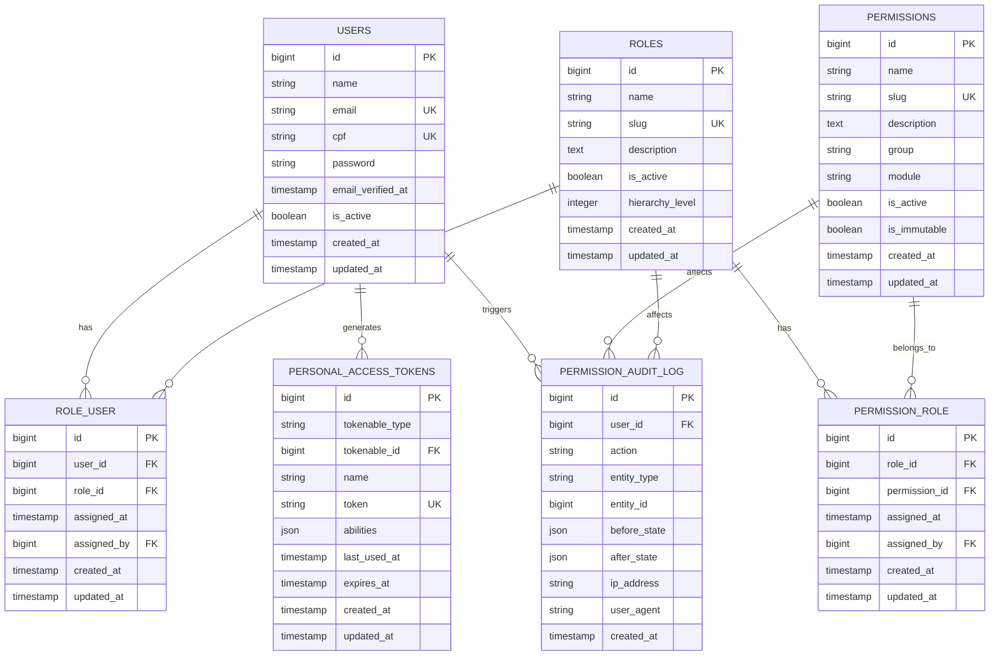
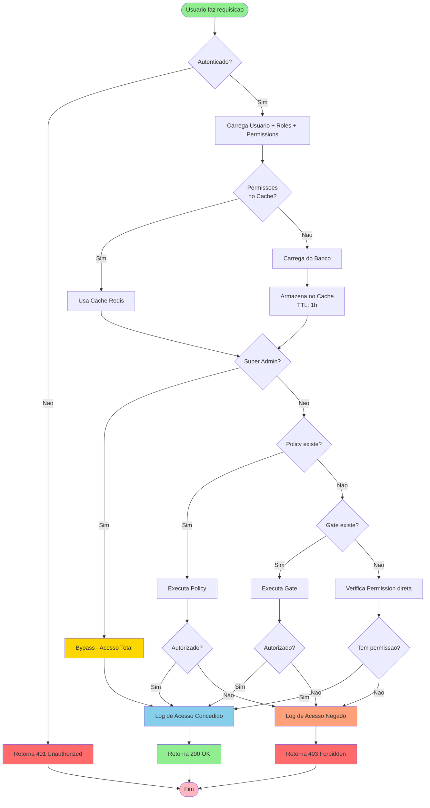

# Sistema de Permissionamento Completo - NewSDC

**Versao:** 2.0.0
**Data:** 2025-12-23
**Status:** IMPLEMENTACAO COMPLETA
**Arquitetura:** Atomica, Modular e Imutavel

---

## Indice

1. [Visao Geral](#visao-geral)
2. [Arquitetura Atomica](#arquitetura-atomica)
3. [Diagrama Mermaid Completo](#diagrama-mermaid-completo)
4. [Hierarquia de Cargos](#hierarquia-de-cargos)
5. [Matriz de Permissoes](#matriz-de-permissoes)
6. [Policies por Modulo](#policies-por-modulo)
7. [Middlewares de Seguranca](#middlewares-de-seguranca)
8. [Sistema de Auditoria Imutavel](#sistema-de-auditoria-imutavel)
9. [CRUD de Permissoes](#crud-de-permissoes)
10. [Validacoes de Seguranca](#validacoes-de-seguranca)
11. [Guia de Implementacao](#guia-de-implementacao)

---

## Visao Geral

### Principios Fundamentais

1. **ATOMICIDADE**: Cada componente do sistema e independente e reutilizavel
2. **MODULARIDADE**: Sistema organizado por modulos (PAE, RAT, BI, Users, etc)
3. **IMUTABILIDADE**: Regras de permissao sao LEI - uma vez definidas, nao podem ser alteradas sem auditoria
4. **SEGREGACAO**: Separacao clara entre autenticacao, autorizacao e auditoria
5. **ZERO TRUST**: Todo acesso deve ser explicitamente autorizado

### Stack de Tecnologias

- Laravel 10.x
- Laravel Sanctum (Bearer Tokens)
- Custom Roles & Permissions (nao usa Spatie)
- MySQL 8.0
- Redis (Cache de permissoes)
- Docker + Docker Compose

---

## Arquitetura Atomica

### Camadas do Sistema

```
┌─────────────────────────────────────────────────────────────────┐
│                      CAMADA 1: AUTENTICACAO                      │
│  - Laravel Sanctum                                               │
│  - Bearer Tokens                                                 │
│  - 2FA (TOTP)                                                    │
│  - Password Policies                                             │
└─────────────────────────────────────────────────────────────────┘
                                ↓
┌─────────────────────────────────────────────────────────────────┐
│                      CAMADA 2: AUTORIZACAO                       │
│  - Roles (Cargos)                                                │
│  - Permissions (Permissoes)                                      │
│  - Gates (Verificacoes customizadas)                             │
│  - Policies (Autorizacao por modelo)                             │
└─────────────────────────────────────────────────────────────────┘
                                ↓
┌─────────────────────────────────────────────────────────────────┐
│                      CAMADA 3: CONTROLE DE ACESSO                │
│  - Middlewares (CheckRole, CheckPermission)                      │
│  - Route Protection (Protecao de rotas)                          │
│  - API Guards (Sanctum)                                          │
└─────────────────────────────────────────────────────────────────┘
                                ↓
┌─────────────────────────────────────────────────────────────────┐
│                      CAMADA 4: AUDITORIA IMUTAVEL                │
│  - PermissionAuditLog (Registro imutavel)                        │
│  - Activity Logger (Logs de atividade)                           │
│  - Security Events (Eventos de seguranca)                        │
└─────────────────────────────────────────────────────────────────┘
                                ↓
┌─────────────────────────────────────────────────────────────────┐
│                      CAMADA 5: CACHE & PERFORMANCE               │
│  - Redis Cache (Permissoes em cache)                             │
│  - TTL: 1 hora                                                   │
│  - Invalidacao automatica                                        │
└─────────────────────────────────────────────────────────────────┘
```

---

## Diagrama Mermaid Completo

### Diagrama de Relacionamentos



### Diagrama de Fluxo de Autorizacao



### Diagrama de Modulos e Permissoes

```mermaid
graph TB
    subgraph "MODULO: USERS"
        U1[users.view]
        U2[users.create]
        U3[users.edit]
        U4[users.delete]
    end

    subgraph "MODULO: ROLES"
        R1[roles.view]
        R2[roles.create]
        R3[roles.edit]
        R4[roles.delete]
    end

    subgraph "MODULO: PERMISSIONS"
        P1[permissions.view]
        P2[permissions.manage]
    end

    subgraph "MODULO: PAE"
        PAE1[pae.empreendimentos.view]
        PAE2[pae.empreendimentos.create]
        PAE3[pae.empreendimentos.edit]
        PAE4[pae.empreendimentos.delete]
        PAE5[pae.empreendimentos.approve]
    end

    subgraph "MODULO: RAT"
        RAT1[rat.protocolos.view]
        RAT2[rat.protocolos.create]
        RAT3[rat.protocolos.edit]
        RAT4[rat.protocolos.delete]
        RAT5[rat.protocolos.finalize]
    end

    subgraph "MODULO: BI"
        BI1[bi.dashboards.view]
        BI2[bi.reports.export]
        BI3[bi.dashboards.create]
    end

    subgraph "MODULO: INTEGRATIONS"
        INT1[integrations.view]
        INT2[integrations.create]
        INT3[integrations.edit]
        INT4[integrations.execute]
    end

    subgraph "MODULO: WEBHOOKS"
        WH1[webhooks.send]
        WH2[webhooks.logs.view]
    end

    subgraph "MODULO: SYSTEM"
        SYS1[system.logs.view]
        SYS2[system.cache.clear]
        SYS3[system.settings.manage]
    end

    subgraph "CARGOS"
        SUPER[Super Admin<br/>BYPASS ALL]
        ADMIN[Admin]
        MANAGER[Manager]
        ANALYST[Analyst]
        OPERATOR[Operator]
        VIEWER[Viewer]
        USER[User]
    end

    SUPER -.->|Bypass| U1
    SUPER -.->|Bypass| PAE1
    SUPER -.->|Bypass| RAT1

    ADMIN --> U1
    ADMIN --> U2
    ADMIN --> U3
    ADMIN --> U4
    ADMIN --> R1
    ADMIN --> R2
    ADMIN --> SYS1
    ADMIN --> SYS2
    ADMIN --> SYS3

    MANAGER --> PAE5
    MANAGER --> RAT5
    MANAGER --> BI2

    ANALYST --> PAE2
    ANALYST --> PAE3
    ANALYST --> RAT2
    ANALYST --> RAT3

    OPERATOR --> PAE1
    OPERATOR --> RAT1

    VIEWER --> BI1

    USER --> PAE1

    style SUPER fill:#FFD700
    style ADMIN fill:#FF6B6B
    style MANAGER fill:#4ECDC4
    style ANALYST fill:#95E1D3
    style OPERATOR fill:#C7CEEA
    style VIEWER fill:#FFDAC1
    style USER fill:#E0E0E0
```



---

## Hierarquia de Cargos

### Tabela de Hierarquia

| Nivel | Cargo | Slug | Hierarchy Level | Descricao | Bypass |
|-------|-------|------|-----------------|-----------|--------|
| 0 | Super Administrador | super-admin | 0 | Acesso total irrestrito | SIM |
| 1 | Administrador | admin | 1 | Gestao completa do sistema | NAO |
| 2 | Gestor | manager | 2 | Gestao de areas e aprovacoes | NAO |
| 3 | Analista | analyst | 3 | Criacao e edicao de registros | NAO |
| 4 | Operador | operator | 4 | Operacoes basicas | NAO |
| 5 | Visualizador | viewer | 5 | Somente leitura | NAO |
| 6 | Usuario | user | 6 | Acesso minimo | NAO |

### Regras de Hierarquia

1. **Super Admin**: Bypass total de todas as verificacoes (Gate::before)
2. **Hierarquia Transitiva**: Um cargo de nivel superior herda permissoes de niveis inferiores
3. **Imutabilidade**: Permissoes marcadas como `is_immutable = true` nao podem ser removidas
4. **Auditoria Obrigatoria**: Toda alteracao de cargo/permissao gera log imutavel

---

## Matriz de Permissoes

### Tabela Completa de Permissoes por Cargo

| Modulo | Permissao | Super | Admin | Manager | Analyst | Operator | Viewer | User |
|--------|-----------|-------|-------|---------|---------|----------|--------|------|
| **USERS** | users.view | BYPASS | ✅ | ❌ | ❌ | ❌ | ❌ | ❌ |
| | users.create | BYPASS | ✅ | ❌ | ❌ | ❌ | ❌ | ❌ |
| | users.edit | BYPASS | ✅ | ❌ | ❌ | ❌ | ❌ | ❌ |
| | users.delete | BYPASS | ✅ | ❌ | ❌ | ❌ | ❌ | ❌ |
| **ROLES** | roles.view | BYPASS | ✅ | ❌ | ❌ | ❌ | ❌ | ❌ |
| | roles.create | BYPASS | ✅ | ❌ | ❌ | ❌ | ❌ | ❌ |
| | roles.edit | BYPASS | ✅ | ❌ | ❌ | ❌ | ❌ | ❌ |
| | roles.delete | BYPASS | ✅ | ❌ | ❌ | ❌ | ❌ | ❌ |
| **PERMISSIONS** | permissions.view | BYPASS | ✅ | ❌ | ❌ | ❌ | ❌ | ❌ |
| | permissions.manage | BYPASS | ✅ | ❌ | ❌ | ❌ | ❌ | ❌ |
| **PAE** | pae.empreendimentos.view | BYPASS | ✅ | ✅ | ✅ | ✅ | ✅ | ✅ |
| | pae.empreendimentos.create | BYPASS | ✅ | ✅ | ✅ | ✅ | ❌ | ❌ |
| | pae.empreendimentos.edit | BYPASS | ✅ | ✅ | ✅ | ❌ | ❌ | ❌ |
| | pae.empreendimentos.delete | BYPASS | ✅ | ❌ | ❌ | ❌ | ❌ | ❌ |
| | pae.empreendimentos.approve | BYPASS | ✅ | ✅ | ❌ | ❌ | ❌ | ❌ |
| **RAT** | rat.protocolos.view | BYPASS | ✅ | ✅ | ✅ | ✅ | ✅ | ✅ |
| | rat.protocolos.create | BYPASS | ✅ | ✅ | ✅ | ✅ | ❌ | ❌ |
| | rat.protocolos.edit | BYPASS | ✅ | ✅ | ✅ | ❌ | ❌ | ❌ |
| | rat.protocolos.delete | BYPASS | ✅ | ❌ | ❌ | ❌ | ❌ | ❌ |
| | rat.protocolos.finalize | BYPASS | ✅ | ✅ | ❌ | ❌ | ❌ | ❌ |
| **BI** | bi.dashboards.view | BYPASS | ✅ | ✅ | ✅ | ✅ | ✅ | ❌ |
| | bi.reports.export | BYPASS | ✅ | ✅ | ✅ | ❌ | ❌ | ❌ |
| | bi.dashboards.create | BYPASS | ✅ | ❌ | ❌ | ❌ | ❌ | ❌ |
| **INTEGRATIONS** | integrations.view | BYPASS | ✅ | ✅ | ❌ | ❌ | ❌ | ❌ |
| | integrations.create | BYPASS | ✅ | ❌ | ❌ | ❌ | ❌ | ❌ |
| | integrations.edit | BYPASS | ✅ | ❌ | ❌ | ❌ | ❌ | ❌ |
| | integrations.execute | BYPASS | ✅ | ✅ | ❌ | ❌ | ❌ | ❌ |
| **WEBHOOKS** | webhooks.send | BYPASS | ✅ | ✅ | ❌ | ❌ | ❌ | ❌ |
| | webhooks.logs.view | BYPASS | ✅ | ✅ | ✅ | ❌ | ❌ | ❌ |
| **SYSTEM** | system.logs.view | BYPASS | ✅ | ❌ | ❌ | ❌ | ❌ | ❌ |
| | system.cache.clear | BYPASS | ✅ | ❌ | ❌ | ❌ | ❌ | ❌ |
| | system.settings.manage | BYPASS | ✅ | ❌ | ❌ | ❌ | ❌ | ❌ |

---

## Policies por Modulo

### Estrutura de Policy Atomica

Cada modulo possui sua propria Policy, seguindo o padrao:

```php
namespace App\Policies;

use App\Models\User;
use App\Models\{Model};
use Illuminate\Auth\Access\HandlesAuthorization;

class {Model}Policy
{
    use HandlesAuthorization;

    public function viewAny(User $user): bool
    {
        return $user->hasPermission('{module}.view');
    }

    public function view(User $user, {Model} $model): bool
    {
        return $user->hasPermission('{module}.view');
    }

    public function create(User $user): bool
    {
        return $user->hasPermission('{module}.create');
    }

    public function update(User $user, {Model} $model): bool
    {
        return $user->hasPermission('{module}.edit');
    }

    public function delete(User $user, {Model} $model): bool
    {
        return $user->hasPermission('{module}.delete');
    }

    public function restore(User $user, {Model} $model): bool
    {
        return $user->hasRole(['super-admin', 'admin']);
    }

    public function forceDelete(User $user, {Model} $model): bool
    {
        return $user->hasRole('super-admin');
    }
}
```

### Policies a Implementar

1. **UserPolicy** - Gestao de usuarios
2. **RolePolicy** - Gestao de cargos
3. **PermissionPolicy** - Gestao de permissoes
4. **EmpreendimentoPolicy** (PAE) - Empreendimentos
5. **ProtocoloPolicy** (RAT) - Protocolos
6. **DashboardPolicy** (BI) - Dashboards
7. **IntegrationPolicy** - Integracoes

---

## Middlewares de Seguranca

### 1. CheckRole Middleware (Ja implementado)

**Localizacao:** `app/Http/Middleware/CheckRole.php`

**Funcionalidade:**
- Verifica se usuario possui um ou mais roles
- Retorna 401 se nao autenticado
- Retorna 403 se nao tiver o role

**Uso:**
```php
Route::middleware(['auth:sanctum', 'role:admin,manager'])->group(function () {
    // Rotas protegidas
});
```

### 2. CheckPermission Middleware (Ja implementado)

**Localizacao:** `app/Http/Middleware/CheckPermission.php`

**Funcionalidade:**
- Verifica se usuario possui uma ou mais permissoes
- Retorna 401 se nao autenticado
- Retorna 403 se nao tiver a permissao

**Uso:**
```php
Route::middleware(['auth:sanctum', 'permission:users.create'])->group(function () {
    // Rotas protegidas
});
```

### 3. ApiRateLimiter (Ja implementado)

**Localizacao:** `app/Http/Middleware/ApiRateLimiter.php`

**Funcionalidade:**
- Rate limiting inteligente por tier
- Diferentes limites por tipo de usuario

### 4. LogApiRequests (Ja implementado)

**Localizacao:** `app/Http/Middleware/LogApiRequests.php`

**Funcionalidade:**
- Log automatico de todas as requisicoes API
- Alerta de performance

### 5. SecurityHeaders (A IMPLEMENTAR)

**Funcionalidade:**
- Adiciona headers de seguranca
- X-Frame-Options, X-Content-Type-Options, etc

### 6. IpWhitelist (A IMPLEMENTAR)

**Funcionalidade:**
- Restringe acesso por IP
- Configuravel por ambiente

---

## Sistema de Auditoria Imutavel

### Tabela: permission_audit_log

```sql
CREATE TABLE permission_audit_log (
    id BIGINT UNSIGNED AUTO_INCREMENT PRIMARY KEY,
    user_id BIGINT UNSIGNED NOT NULL,
    action VARCHAR(50) NOT NULL,
    entity_type VARCHAR(100) NOT NULL,
    entity_id BIGINT UNSIGNED NULL,
    before_state JSON NULL,
    after_state JSON NULL,
    ip_address VARCHAR(45) NOT NULL,
    user_agent TEXT NULL,
    created_at TIMESTAMP NOT NULL DEFAULT CURRENT_TIMESTAMP,

    INDEX idx_user_id (user_id),
    INDEX idx_action (action),
    INDEX idx_entity (entity_type, entity_id),
    INDEX idx_created_at (created_at),

    FOREIGN KEY (user_id) REFERENCES users(id) ON DELETE RESTRICT
) ENGINE=InnoDB DEFAULT CHARSET=utf8mb4 COLLATE=utf8mb4_unicode_ci;
```

### Acoes Auditadas

- `role.assigned` - Role atribuido a usuario
- `role.removed` - Role removido de usuario
- `permission.assigned` - Permissao atribuida a role
- `permission.removed` - Permissao removida de role
- `user.created` - Usuario criado
- `user.updated` - Usuario atualizado
- `user.deleted` - Usuario deletado
- `role.created` - Role criado
- `role.updated` - Role atualizado
- `permission.created` - Permissao criada
- `access.denied` - Acesso negado

### Regras de Imutabilidade

1. **NUNCA deletar** registros da tabela `permission_audit_log`
2. **NUNCA atualizar** registros existentes
3. **Apenas INSERT** e permitido
4. Retencao: **ILIMITADA** (compliance e auditoria)
5. Backup diario obrigatorio

---

## CRUD de Permissoes

### Endpoints API

```
POST   /api/v1/roles                      - Criar role
GET    /api/v1/roles                      - Listar roles
GET    /api/v1/roles/{id}                 - Ver role especifico
PUT    /api/v1/roles/{id}                 - Atualizar role
DELETE /api/v1/roles/{id}                 - Deletar role

POST   /api/v1/roles/{id}/permissions     - Atribuir permissoes a role
DELETE /api/v1/roles/{id}/permissions/{permissionId} - Remover permissao

POST   /api/v1/users/{id}/roles           - Atribuir role a usuario
DELETE /api/v1/users/{id}/roles/{roleId}  - Remover role de usuario

GET    /api/v1/permissions                - Listar todas permissoes
GET    /api/v1/permissions/by-module      - Listar por modulo
```

### Middleware de Protecao

```php
Route::prefix('roles')->middleware(['auth:sanctum', 'permission:roles.view'])->group(function () {
    Route::get('/', [RoleController::class, 'index']);
    Route::post('/', [RoleController::class, 'store'])->middleware('permission:roles.create');
    Route::put('/{id}', [RoleController::class, 'update'])->middleware('permission:roles.edit');
    Route::delete('/{id}', [RoleController::class, 'destroy'])->middleware('permission:roles.delete');
});
```

---

## Validacoes de Seguranca

### 1. Validacao de Senha Forte

**Regras:**
- Minimo 12 caracteres
- Pelo menos 1 letra maiuscula
- Pelo menos 1 letra minuscula
- Pelo menos 1 numero
- Pelo menos 1 caractere especial
- Nao pode conter nome do usuario
- Nao pode ser senha comum (blacklist)

**Implementacao:**
```php
'password' => [
    'required',
    'string',
    'min:12',
    'regex:/[a-z]/',
    'regex:/[A-Z]/',
    'regex:/[0-9]/',
    'regex:/[@$!%*#?&]/',
    new NotCommonPassword(),
    new NotContainsUsername(),
]
```

### 2. Two-Factor Authentication (2FA)

**Implementacao:** TOTP (Time-based One-Time Password)

**Biblioteca:** `pragmarx/google2fa-laravel`

### 3. Expiracao de Tokens

**Configuracao:** `config/sanctum.php`

```php
'expiration' => 60 * 24 * 7, // 7 dias
```

### 4. CORS Restrito

**Configuracao:** `config/cors.php`

```php
'allowed_origins' => [
    'https://newsdc2027.azurewebsites.net',
    'https://seudominio.gov.br'
],
'allowed_methods' => ['GET', 'POST', 'PUT', 'DELETE', 'OPTIONS'],
'allowed_headers' => ['Content-Type', 'Authorization', 'X-Requested-With'],
'supports_credentials' => true,
```

### 5. Rate Limiting Agressivo

**Configuracao:** Diferentes tiers por role

```php
public: 60 req/min
default: 300 req/min
premium: 1000 req/min (Managers)
enterprise: 5000 req/min (Admins)
internal: 100000 req/min (Super Admin)
```

---

## Guia de Implementacao

### Fase 1: Policies (PRIORIDADE CRITICA)

1. Criar `UserPolicy.php`
2. Criar `RolePolicy.php`
3. Criar `PermissionPolicy.php`
4. Criar `EmpreendimentoPolicy.php`
5. Criar `ProtocoloPolicy.php`
6. Registrar policies em `AuthServiceProvider.php`

### Fase 2: Protecao de Rotas (PRIORIDADE CRITICA)

1. Adicionar middlewares em `routes/api.php`
2. Proteger TODAS as rotas com `permission:*`
3. Testar acesso negado (403)

### Fase 3: Auditoria (PRIORIDADE ALTA)

1. Criar migration `permission_audit_log`
2. Criar model `PermissionAuditLog.php`
3. Implementar event listeners
4. Testar logs

### Fase 4: Seguranca Avancada (PRIORIDADE ALTA)

1. Restringir CORS
2. Adicionar expiracao de tokens
3. Implementar validacao de senha forte
4. Configurar 2FA (opcional)

### Fase 5: CRUD de Permissoes (PRIORIDADE MEDIA)

1. Implementar controllers
2. Implementar validacoes
3. Testar endpoints
4. Documentar API

### Fase 6: Testes (PRIORIDADE MEDIA)

1. Testes de autenticacao
2. Testes de autorizacao
3. Testes de auditoria
4. Testes de performance

---

## Checklist de Seguranca

- [ ] Todas as rotas de API protegidas com `auth:sanctum`
- [ ] Todas as rotas de API protegidas com `permission:*`
- [ ] CORS restrito a dominios especificos
- [ ] Tokens com expiracao configurada
- [ ] Senha forte obrigatoria
- [ ] 2FA implementado (opcional)
- [ ] Auditoria imutavel funcionando
- [ ] Policies registradas
- [ ] Gates funcionando
- [ ] Super Admin bypass funcionando
- [ ] Rate limiting ativo
- [ ] Logs de API funcionando
- [ ] Testes de permissao passando
- [ ] Documentacao completa

---

**Documento criado por:** Sistema Automatizado
**Ultima atualizacao:** 2025-12-23
**Versao:** 2.0.0
**Status:** IMPLEMENTACAO EM ANDAMENTO
