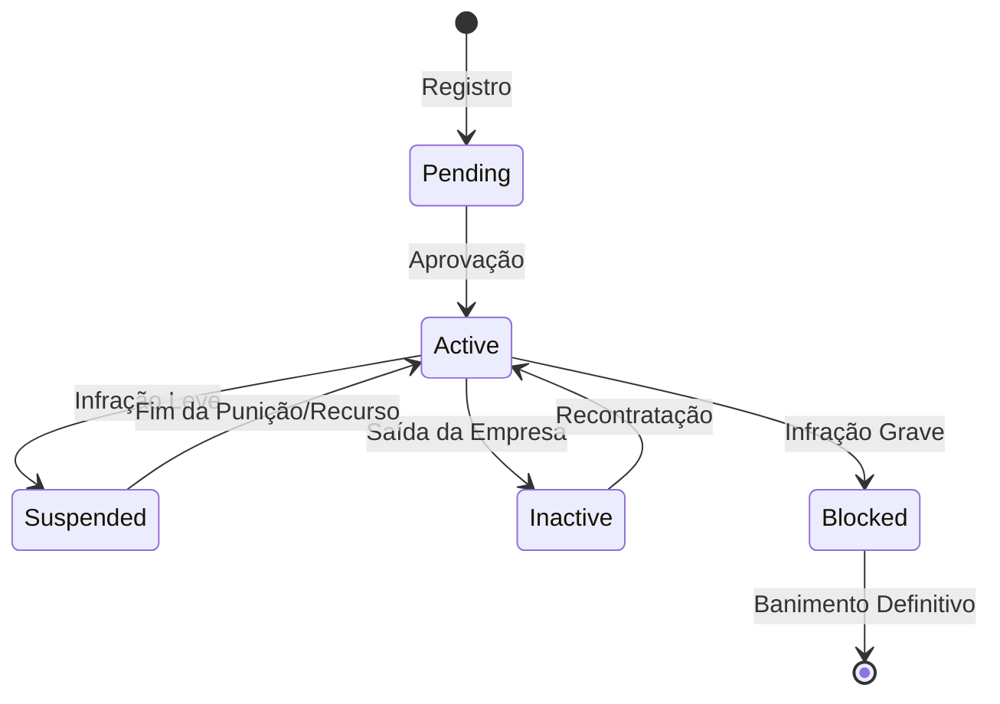

# Estrutura da Tabela Users

Este documento detalha os campos `active` e `status` da tabela `users` e a lógica de combinação entre eles.

## Campos Principais

| Campo | Tipo | Propósito |
| :--- | :--- | :--- |
| `active` | `tinyint(1)` (boolean) | Flag simples ON/OFF — filtro rápido |
| `status` | `enum('active','inactive','suspended','pending','blocked')` | Classificação granular do motivo |

A diferenciação principal não está apenas no `active`, mas sim na combinação com o `status` (enum).

## Lógica de Combinação (Prática)

| Situação | `active` | `status` | Significado |
| :--- | :---: | :--- | :--- |
| **Usuário normal** | `1` | `active` | Tudo ok, acesso total permitido |
| **Aguardando aprovação** | `1` | `pending` | Conta criada, aguarda ativação por admin/email |
| **Desativado pelo admin** | `0` | `inactive` | Saiu da organização ou foi removido sem punição |
| **Suspenso temporariamente** | `0` | `suspended` | Punição temporária (ex: comportamento inadequado) |
| **Bloqueado permanente** | `0` | `blocked` | Violação grave, acesso cortado permanentemente |

## Visualização Lógica

### Fluxo de Decisão

```mermaid
flowchart TD
    Start([Início]) --> CheckActive{Active = 1?}
    
    CheckActive -- Sim --> CheckStatusYes{Status?}
    CheckActive -- Não --> CheckStatusNo{Status?}
    
    CheckStatusYes -- active --> OK[Usuário Normal\n(Acesso Permitido)]
    CheckStatusYes -- pending --> Pending[Aguardando Aprovação\n(Sem Acesso)]
    
    CheckStatusNo -- inactive --> Inactive[Desativado\n(Saiu/Removido)]
    CheckStatusNo -- suspended --> Suspended[Suspenso\n(Temporário)]
    CheckStatusNo -- blocked --> Blocked[Bloqueado\n(Permanente)]
    
    OK :::success
    Pending :::warning
    Inactive :::neutral
    Suspended :::danger
    Blocked :::fatal
    
    classDef success fill:#d4edda,stroke:#155724,color:#155724
    classDef warning fill:#fff3cd,stroke:#856404,color:#856404
    classDef neutral fill:#e2e3e5,stroke:#383d41,color:#383d41
    classDef danger fill:#f8d7da,stroke:#721c24,color:#721c24
    classDef fatal fill:#343a40,stroke:#1d2124,color:#fff
```

### Ciclo de Vida do Usuário



## Implementação na Migration

A lógica no código fonte é definida na migration de criação:

```php
// database/migrations/2014_10_12_000000_create_users_table.php

$table->boolean('active')->default(true)->index();
$table->enum('status', ['active', 'inactive', 'suspended', 'pending', 'blocked'])->default('pending');
```

## Complementos de Implementação

Exemplos de como consultar e manipular esses estados no Eloquent.

### Scopes Recomendados (User Model)

```php
// Apenas usuários ativos e válidos
public function scopeValid($query)
{
    return $query->where('active', 1)->where('status', 'active');
}

// Usuários que requerem atenção (pendentes)
public function scopePending($query)
{
    return $query->where('active', 1)->where('status', 'pending');
}

// Usuários banidos/bloqueados
public function scopeBanned($query)
{
    return $query->where('active', 0)->where('status', 'blocked');
}
```

### Verificação de Acesso (Middleware/Policy)

```php
public function canAccess($user)
{
    // Verifica primeiro o flag rápido, depois o status específico
    if (!$user->active) {
        return false; 
    }
    
    return $user->status === 'active';
}
```
