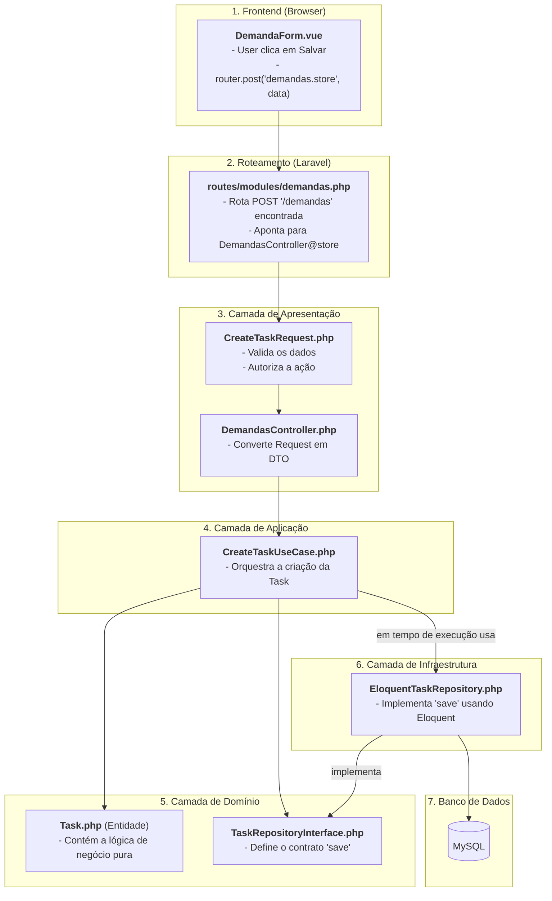

# Fluxo da Arquitetura em Ação: A Anatomia de uma Feature

Este documento abandona a teoria estática para fornecer um guia prático e detalhado, mostrando o esqueleto da arquitetura em funcionamento. Vamos rastrear uma única requisição, passo a passo, desde o clique do usuário até a persistência no banco de dados e a resposta na tela.

**Cenário**: O usuário preencheu o formulário para "Criar Nova Demanda" e clica no botão "Salvar".

---

### Diagrama de Fluxo: "Criar Nova Demanda"

Este diagrama ilustra o caminho que a requisição percorre através das camadas e arquivos.



---

## O Rastreamento Detalhado: Passo a Passo

### Etapa 1: O Frontend - O Ponto de Partida

O usuário está na tela de criação de uma nova demanda.

-   **O Quê Acontece**: O usuário clica no botão "Salvar". O Vue.js coleta os dados do formulário e o Inertia.js dispara a requisição.
-   **Arquivo Principal**: `resources/js/Pages/Demandas/Partials/DemandaForm.vue`
-   **Esqueleto em Ação**:
    ```
    resources/js/
    └── Pages/
        └── Demandas/
            └── Partials/
                └── DemandaForm.vue  <-- AQUI. O método 'salvar()' é chamado.
    ```
-   **Código-chave**: `router.post(route('demandas.store'), form.data())`

### Etapa 2: A Rota - O Porteiro

A requisição `POST` chega ao Laravel. O framework procura uma rota correspondente.

-   **O Quê Acontece**: Laravel encontra a definição da rota e sabe qual Controller deve ser acionado.
-   **Arquivo Principal**: `routes/modules/demandas.php`
-   **Esqueleto em Ação**:
    ```
    routes/
    └── modules/
        └── demandas.php  <-- AQUI. A rota 'demandas.store' está definida.
    ```
-   **Código-chave**: `Route::post('/demandas', [DemandasController::class, 'store'])->name('demandas.store');`

### Etapa 3: A Apresentação - O Mestre de Cerimônias

A requisição é entregue ao `DemandasController`. Antes que o método `store` execute, a Injeção de Dependência do Laravel resolve suas dependências.

-   **O Quê Acontece**:
    1.  O `CreateTaskRequest` é automaticamente acionado. Ele **valida** os dados do formulário e **autoriza** se o usuário pode realizar a ação. Se a validação falhar, o processo para aqui e retorna um erro 422.
    2.  Com a validação bem-sucedida, o fluxo continua para o método `store` do controller.
    3.  O Controller transforma os dados validados da requisição em um `CreateTaskDTO`. **DTO (Data Transfer Object)** é um objeto simples que carrega dados de forma estruturada, desacoplando o resto da aplicação dos detalhes da requisição HTTP.
-   **Arquivos Principais**: `CreateTaskRequest.php`, `DemandasController.php`, `CreateTaskDTO.php`
-   **Esqueleto em Ação**:
    ```
    app/
    └── Modules/
        └── Demandas/
            ├── Application/
            │   └── DTOs/
            │       └── CreateTaskDTO.php  <-- DTO é criado aqui.
            └── Presentation/
                ├── Http/
                │   ├── Controllers/
                │   │   └── DemandasController.php  <-- AQUI. Método 'store' é executado.
                │   └── Requests/
                │       └── CreateTaskRequest.php  <-- Validação acontece aqui primeiro.
    ```

### Etapa 4: A Aplicação - O Orquestrador

O Controller delega o trabalho para a camada de aplicação.

-   **O Quê Acontece**: O Controller invoca o `CreateTaskUseCase`, passando o `DTO` com os dados. O **Use Case** contém a lógica de orquestração da feature (os passos para criar uma demanda), mas não a lógica de negócio em si.
-   **Arquivo Principal**: `CreateTaskUseCase.php`
-   **Esqueleto em Ação**:
    ```
    app/
    └── Modules/
        └── Demandas/
            └── Application/
                └── UseCases/
                    └── CreateTaskUseCase.php  <-- AQUI. Lógica de aplicação é executada.
    ```

### Etapa 5: O Domínio - O Coração Inteligente

O Use Case interage com o núcleo do negócio.

-   **O Quê Acontece**:
    1.  O Use Case pode criar uma nova instância da **Entidade** `Task`. A entidade pode conter lógica de negócio pura (ex: definir um status padrão na criação).
    2.  O Use Case então usa a **Interface** do Repositório (`TaskRepositoryInterface`) para solicitar que a nova entidade seja salva. Ele não sabe *como* ela será salva, apenas que o contrato será cumprido.
-   **Arquivos Principais**: `Task.php`, `TaskRepositoryInterface.php`
-   **Esqueleto em Ação**:
    ```
    app/
    └── Modules/
        └── Demandas/
            └── Domain/
                ├── Entities/
                │   └── Task.php  <-- Entidade é instanciada.
                └── Repositories/
                    └── TaskRepositoryInterface.php  <-- AQUI. Contrato 'save' é invocado.
    ```

### Etapa 6: A Infraestrutura - O Trabalho Pesado

A Interface é uma abstração. Agora, a implementação concreta entra em ação.

-   **O Quê Acontece**: O Service Container do Laravel, que foi configurado para saber que `TaskRepositoryInterface` é implementada por `EloquentTaskRepository`, entrega uma instância desta classe para o Use Case. O método `save` é executado, usando o Eloquent ORM para persistir os dados no banco de dados.
-   **Arquivo Principal**: `EloquentTaskRepository.php`
-   **Esqueleto em Ação**:
    ```
    app/
    └── Modules/
        └── Demandas/
            └── Infrastructure/
                └── Repositories/
                    └── EloquentTaskRepository.php  <-- AQUI. O Eloquent salva os dados no MySQL.
    ```

### Etapa 7: O Retorno e a Resposta

Com os dados salvos, o fluxo se desenrola.

-   **O Quê Acontece**:
    1.  O Repositório retorna a entidade salva para o Use Case.
    2.  O Use Case retorna para o Controller.
    3.  O Controller instrui o Laravel a redirecionar para a página de detalhes da nova demanda (`demandas.show`).
    4.  O Inertia.js recebe essa resposta de redirecionamento e, de forma inteligente, faz uma nova requisição `GET` para a página de destino. O ciclo recomeça, mas desta vez para exibir os dados.
-   **Resultado Final**: O usuário é redirecionado para a página da nova demanda, vendo os dados que acabou de inserir. Tudo isso sem um recarregamento completo da página.
