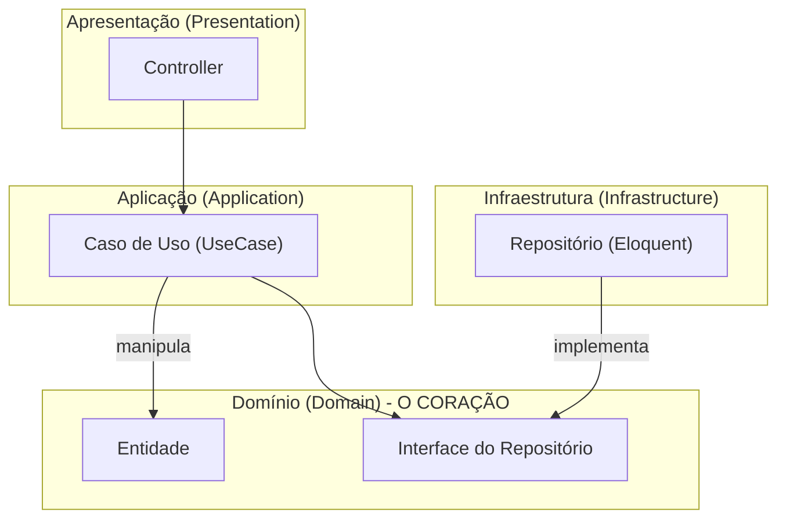
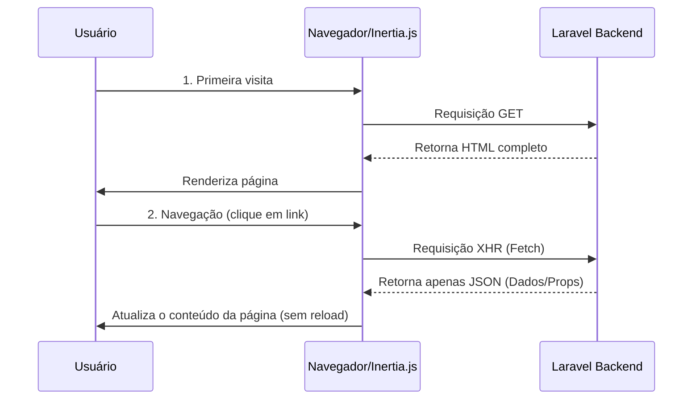

# Guia da Arquitetura NewSDC
## Do Conceito à Prática

Este guia é a referência definitiva para entender a arquitetura do projeto NewSDC. Ele foi projetado para ser lido de forma progressiva, levando o leitor do conceito mais abstrato até os detalhes de implementação.

---

### **Sumário**
1.  [**Capítulo 1: A Visão de Helicóptero**](#capítulo-1-a-visão-de-helicóptero)
2.  [**Capítulo 2: O Mapa do Tesouro - Navegando pelos Diretórios**](#capítulo-2-o-mapa-do-tesouro---navegando-pelos-diretórios)
3.  [**Capítulo 3: A Arquitetura em Detalhes**](#capítulo-3-a-arquitetura-em-detalhes)
4.  [**Capítulo 4: O Ecossistema de Ferramentas**](#capítulo-4-o-ecossistema-de-ferramentas)
5.  [**Capítulo 5: Evolução e Boas Práticas**](#capítulo-5-evolução-e-boas-práticas)

---

## Capítulo 1: A Visão de Helicóptero

Antes de mergulhar no código, vamos entender as peças principais e como elas se encaixam.

O NewSDC é uma aplicação web moderna que une um backend robusto em **Laravel** com um frontend reativo em **Vue.js**. A "mágica" que os conecta de forma transparente é o **Inertia.js**.

### Diagrama: Visão Geral

Este diagrama mostra os componentes principais e a interação entre eles.

```mermaid
graph TD
    subgraph "Cliente"
        A[Usuário] --> B{Navegador};
    end

    subgraph "Servidor"
        C(Frontend - Vue.js via Vite)
        D(Backend - Laravel)
        E[Banco de Dados (MySQL)]
        F[Cache/Filas (Redis)]
    end

    B --> |1. Requisição HTTP| C;
    C --> |2. Chamada Inertia.js| D;
    D --> |3. Resposta (Componente + Dados)| C;
    D --> E & F;
```

Em essência, a arquitetura é guiada por duas filosofias:
-   **Domain-Driven Design (DDD)** no backend, para organizar a lógica de negócio de forma clara e modular.
-   **Atomic Design** no frontend, para criar uma interface consistente e reutilizável.

---

## Capítulo 2: O Mapa do Tesouro - Navegando pelos Diretórios

Para entender a arquitetura, primeiro você precisa de um mapa. Aqui está o propósito de cada pasta principal.

### 📍 Raiz do Projeto (`NewSDC/`)
-   📄 **Arquivos `.md`**: Documentação e planejamento.
-   📂 **`Doc/`**: Documentação arquitetural e estratégica.
-   📂 **`SDC/`**: **O coração do projeto**. É a aplicação Laravel, detalhada abaixo.

### 🚀 Aplicação (`SDC/`)
-   📁 **`app/`**: **Onde a lógica vive.**
    -   📁 **`app/Modules/`**: A parte mais importante. Cada subpasta é um "módulo" de negócio (um Bounded Context do DDD) com suas próprias camadas internas.
-   📁 **`database/`**: Migrations, Seeders e Factories para o banco de dados.
-   📁 **`docker/`**: Arquivos de configuração do ambiente Docker (`docker-compose.yml`).
-   📁 **`resources/`**: Onde o código frontend reside.
    -   📁 **`js/`**: Todo o código Vue.js (Páginas, Componentes, etc.).
-   📁 **`routes/`**: Definição de todos os endpoints da aplicação.
    -   📁 **`modules/`**: Rotas específicas para cada módulo do DDD.
-   📁 **`tests/`**: Todos os testes automatizados.

---

## Capítulo 3: A Arquitetura em Detalhes

Agora que você tem o mapa, vamos explorar o território.

### 3.1. O Backend: Um Monólito Modular com DDD

Organizamos o backend em camadas, garantindo que a lógica de negócio (Domínio) seja independente de detalhes de implementação (framework, banco de dados).

#### Diagrama: Camadas do DDD


-   **A Camada de Domínio é o centro**: Contém as `Entities` e as regras de negócio puras. Ela define `Interfaces` (contratos) para o que precisa, como persistência.
-   **A Camada de Aplicação orquestra**: Os `UseCases` executam uma tarefa (ex: "Criar Demanda"), usando as interfaces do domínio.
-   **A Camada de Infraestrutura implementa**: Ela realiza o trabalho "sujo", implementando as interfaces do domínio usando ferramentas como o Eloquent.
-   **A Camada de Apresentação expõe**: Os `Controllers` recebem requisições HTTP e disparam os Casos de Uso.

### 3.2. O Frontend: Um Sistema de Design com Atomic Design

Construímos a UI de forma hierárquica, compondo peças pequenas para criar telas complexas.

#### Diagrama: Hierarquia Atômica

```mermaid
graph TD
    A[Átomos (Button, Input)] --> B[Moléculas (Campo de Busca)];
    B --> C[Organismos (Tabela de Dados)];
    C --> D[Templates (Layout Padrão)];
    D --> E[Páginas (Página de Dashboard)];
```

-   Essa abordagem garante máxima reutilização de código e consistência visual. A estrutura de pastas em `resources/js` reflete essa hierarquia e também a modularidade do backend:

```
resources/js/
├── Pages/
│   ├── Rat/                 <-- Módulo do DDD
│   │   ├── Create.vue       (Página)
│   │   └── Partials/
│   │       └── RatForm.vue  (Organismo específico do Módulo)
```

### 3.3. A Conexão: A Mágica do Inertia.js

O Inertia.js permite que o backend Laravel controle a navegação e passe dados para o frontend Vue como se fosse uma aplicação tradicional, mas com a fluidez de uma SPA.

#### Diagrama: Fluxo do Inertia.js



---

## Capítulo 4: O Ecossistema de Ferramentas

Um bom artesão precisa de boas ferramentas. Estas são as que sustentam nossa arquitetura.

-   **Docker**: Cria um ambiente de desenvolvimento **consistente e isolado** para todos os desenvolvedores.
-   **Vite**: Fornece um servidor de desenvolvimento **ultrarrápido** com Hot Module Replacement (HMR), para um ciclo de feedback instantâneo no frontend.
-   **Automação (`justfile`, `Jenkins`)**: Automatiza tarefas repetitivas (testar, buildar, fazer deploy), **reduzindo erros e economizando tempo**.

---

## Capítulo 5: Evolução e Boas Práticas

Uma arquitetura não é estática. Aqui estão as diretrizes para mantê-la saudável e evoluir.

1.  **Fortaleça os Testes Automatizados**:
    -   **O Quê?** Criar testes de Unidade, Integração e End-to-End (E2E).
    -   **Por Quê?** Para garantir que novas features não quebrem o que já existe e permitir refatorações seguras.

2.  **Automatize o Pipeline de CI/CD**:
    -   **O Quê?** Configurar Jenkins ou GitHub Actions para rodar testes e fazer deploy automaticamente.
    -   **Por Quê?** Para entregar valor mais rápido, com mais segurança e menos trabalho manual.

3.  **Documente a API com OpenAPI (Swagger)**:
    -   **O Quê?** Usar anotações no código para gerar documentação interativa da API.
    -   **Por Quê?** Para criar uma "fonte da verdade" para os endpoints, facilitando a vida da equipe de frontend e de futuros consumidores da API.
