# Sistema de Permissionamento Granular - NewSDC

Documentacao completa do sistema de permissionamento baseado em Spatie Laravel Permission com extensoes de hierarquia.

---

## 1. Visao Geral da Arquitetura

```mermaid
graph TB
    subgraph CLIENT["Cliente"]
        BROWSER["Browser"]
        VUE["Vue.js + Inertia"]
    end

    subgraph LARAVEL["Laravel Backend"]
        subgraph MIDDLEWARE_LAYER["Camada de Middleware"]
            AUTH_MW["auth:sanctum"]
            HIERARCHY_MW["hierarchy:user/role"]
            PERMISSION_MW["permission:nome"]
            ROLE_MW["role:nome"]
        end

        subgraph AUTH_LAYER["Camada de Autorizacao"]
            GATES["Gates"]
            POLICIES["Policies"]
            SPATIE["Spatie Permission"]
        end

        subgraph SERVICE_LAYER["Camada de Servicos"]
            HIERARCHY_SVC["HierarchyService"]
            AUTH_SVC["AuthService"]
            TOKEN_SVC["TokenService"]
        end

        subgraph MODEL_LAYER["Camada de Modelos"]
            USER_MODEL["User"]
            ROLE_MODEL["Role"]
            PERM_MODEL["Permission"]
            AUDIT_MODEL["PermissionAuditLog"]
        end
    end

    subgraph DATABASE["Banco de Dados"]
        USERS_TB["users"]
        ROLES_TB["roles"]
        PERMS_TB["permissions"]
        MHR_TB["model_has_roles"]
        MHP_TB["model_has_permissions"]
        RHP_TB["role_has_permissions"]
        AUDIT_TB["permission_audit_log"]
    end

    BROWSER --> VUE
    VUE --> AUTH_MW
    AUTH_MW --> HIERARCHY_MW
    HIERARCHY_MW --> PERMISSION_MW
    PERMISSION_MW --> ROLE_MW
    ROLE_MW --> GATES
    GATES --> POLICIES
    POLICIES --> SPATIE
    SPATIE --> SERVICE_LAYER
    SERVICE_LAYER --> MODEL_LAYER
    MODEL_LAYER --> DATABASE

    style HIERARCHY_MW fill:#3b82f6,color:#fff
    style HIERARCHY_SVC fill:#3b82f6,color:#fff
    style SPATIE fill:#8b5cf6,color:#fff
```

---

## 2. Hierarquia de Cargos (Roles)

### 2.1 Piramide de Niveis

```mermaid
graph TD
    subgraph PYRAMID["Piramide de Poder"]
        L0["SUPER ADMIN<br/>Level 0<br/>Acesso Total + Imutavel"]
        L1["ADMIN<br/>Level 1<br/>Gerenciamento Completo"]
        L2["MANAGER<br/>Level 2<br/>Aprovacao + Gestao"]
        L3["ANALYST<br/>Level 3<br/>Criacao + Edicao"]
        L4["OPERATOR<br/>Level 4<br/>Criacao Basica"]
        L5["VIEWER<br/>Level 5<br/>Somente Leitura"]
        L6["USER<br/>Level 6<br/>Acesso Minimo"]
    end

    L0 --> L1
    L1 --> L2
    L2 --> L3
    L3 --> L4
    L4 --> L5
    L5 --> L6

    style L0 fill:#dc2626,color:#fff,stroke:#991b1b,stroke-width:3px
    style L1 fill:#f59e0b,color:#fff,stroke:#d97706,stroke-width:2px
    style L2 fill:#3b82f6,color:#fff,stroke:#2563eb,stroke-width:2px
    style L3 fill:#10b981,color:#fff,stroke:#059669,stroke-width:2px
    style L4 fill:#8b5cf6,color:#fff,stroke:#7c3aed,stroke-width:2px
    style L5 fill:#6b7280,color:#fff,stroke:#4b5563,stroke-width:2px
    style L6 fill:#374151,color:#fff,stroke:#1f2937,stroke-width:2px
```

### 2.2 Tabela de Cargos

| Level | Slug | Nome | Descricao | Quantidade de Permissoes |
|-------|------|------|-----------|-------------------------|
| 0 | super-admin | Super Admin | Acesso total e irrestrito | TODAS |
| 1 | admin | Administrador | Gerenciamento completo | ~32 |
| 2 | manager | Gestor | Aprovacao e gestao de modulos | ~15 |
| 3 | analyst | Analista | Criacao e edicao de registros | ~10 |
| 4 | operator | Operador | Criacao basica | ~5 |
| 5 | viewer | Visualizador | Somente leitura | ~3 |
| 6 | user | Usuario | Acesso minimo | ~2 |

---

## 3. Sistema de Permissoes

### 3.1 Estrutura de Permissoes por Modulo

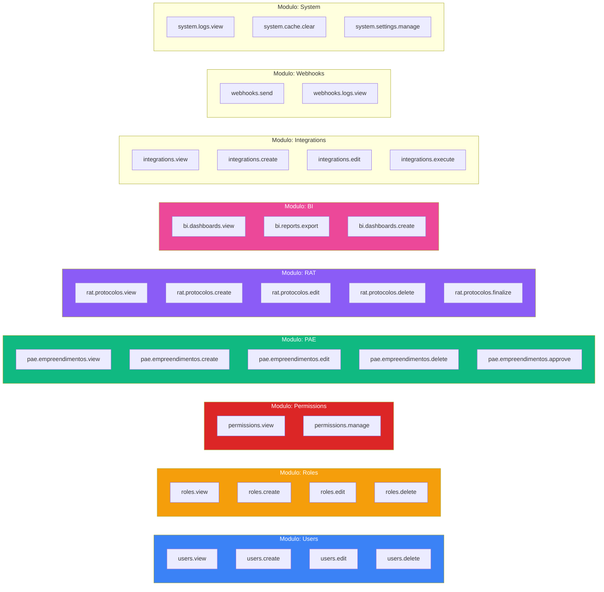

### 3.2 Matriz de Permissoes por Cargo

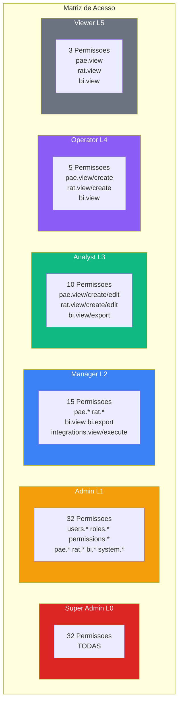

---

## 4. Fluxo de Verificacao de Acesso

### 4.1 Fluxo Completo de Autorizacao

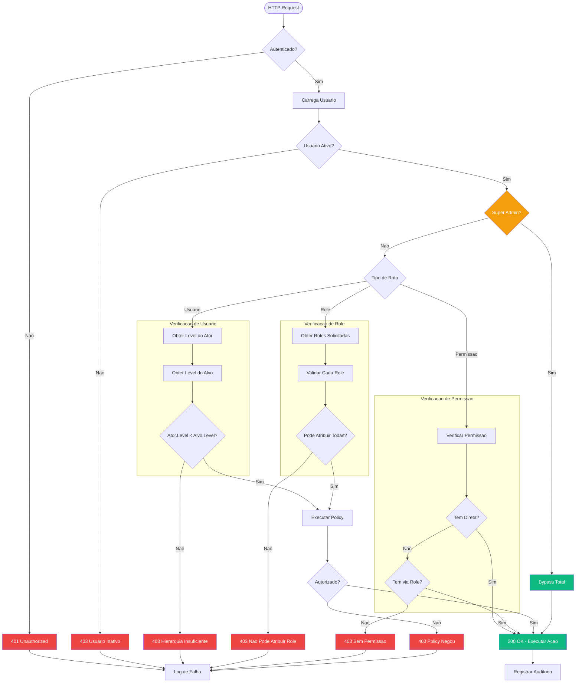

### 4.2 Regra de Gerenciamento por Hierarquia

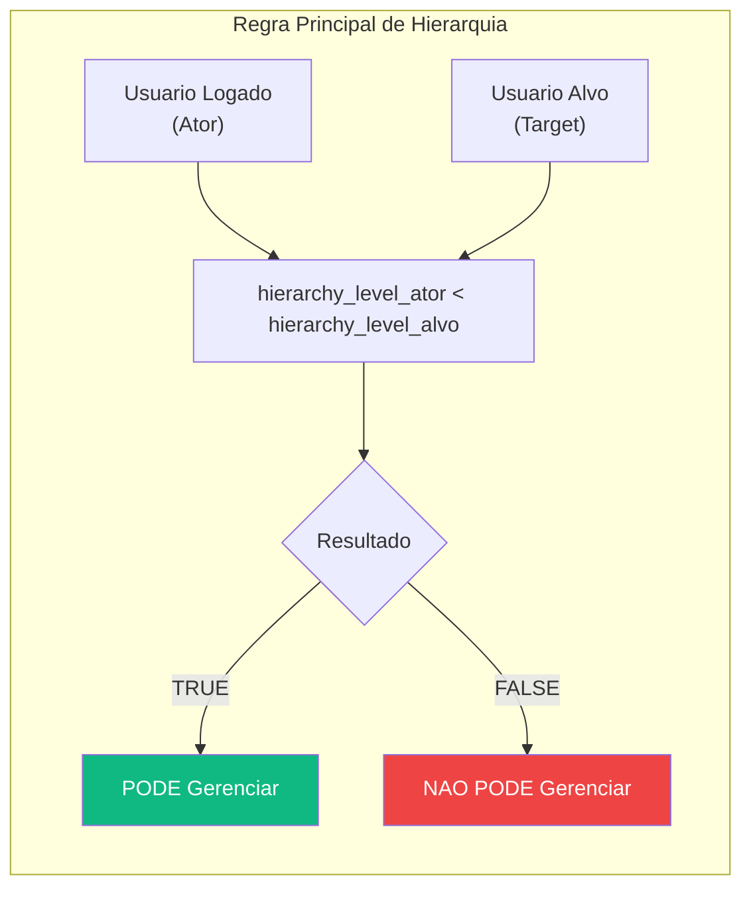

### 4.3 Exemplos de Verificacao

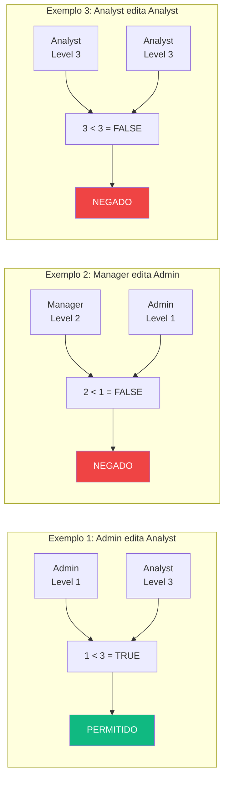

---

## 5. Estrutura do Banco de Dados

### 5.1 Diagrama ER Completo

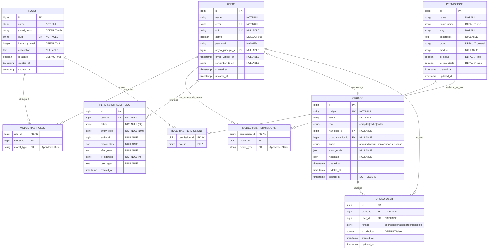

### 5.2 Indices e Constraints

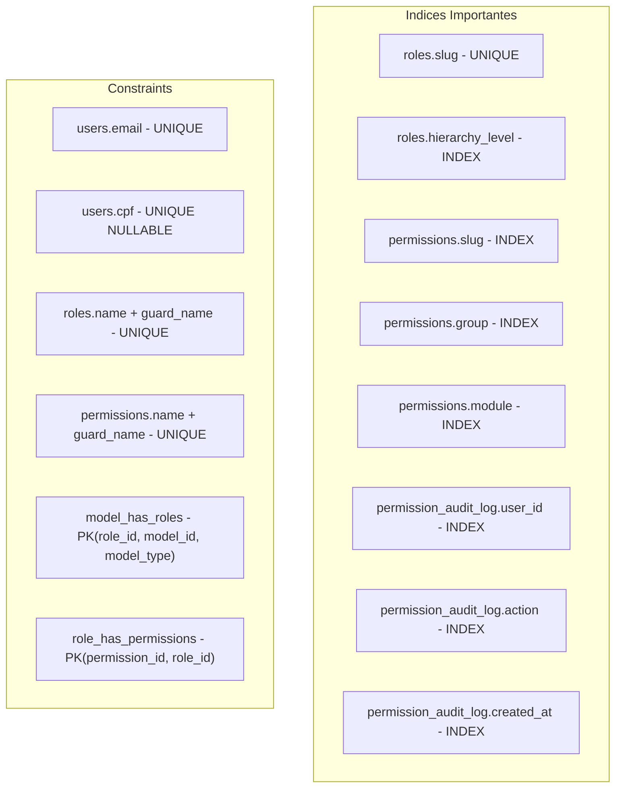

---

## 6. Arquitetura de Componentes

### 6.1 Backend (Laravel)

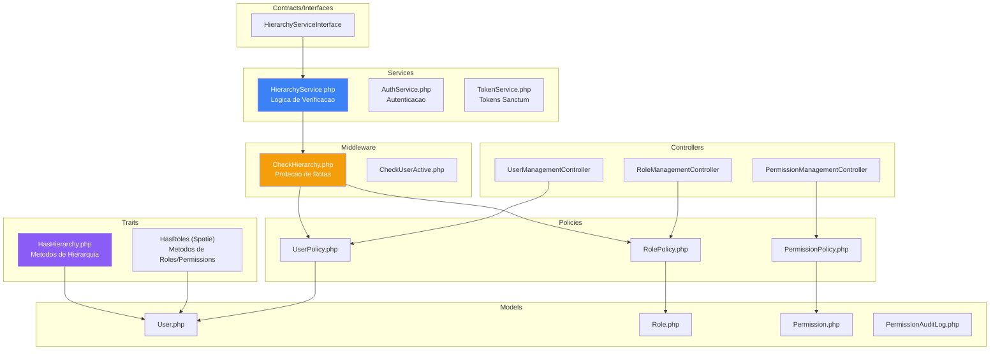

### 6.2 Frontend (Vue.js)

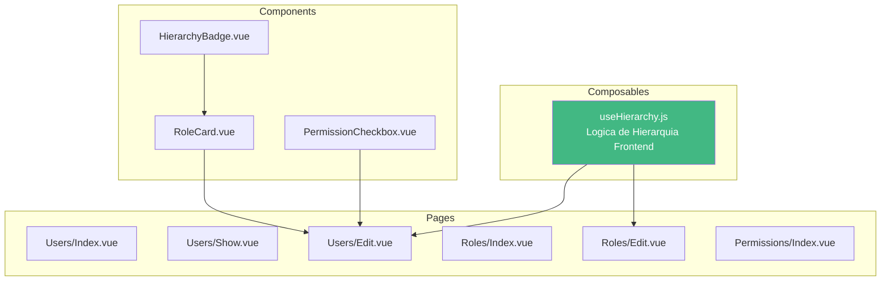

---

## 7. Diagramas de Sequencia

### 7.1 Login e Geracao de Token

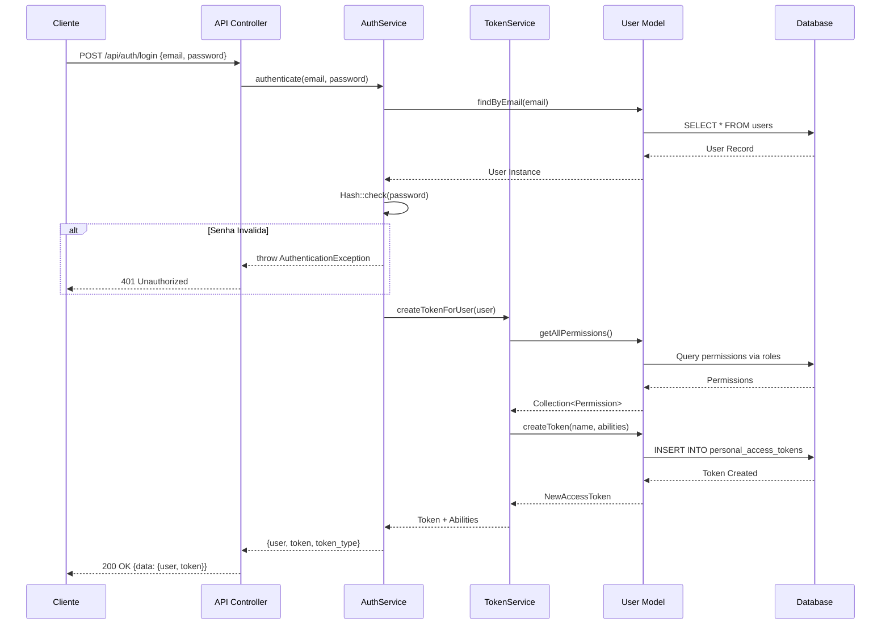

### 7.2 Edicao de Usuario com Verificacao de Hierarquia

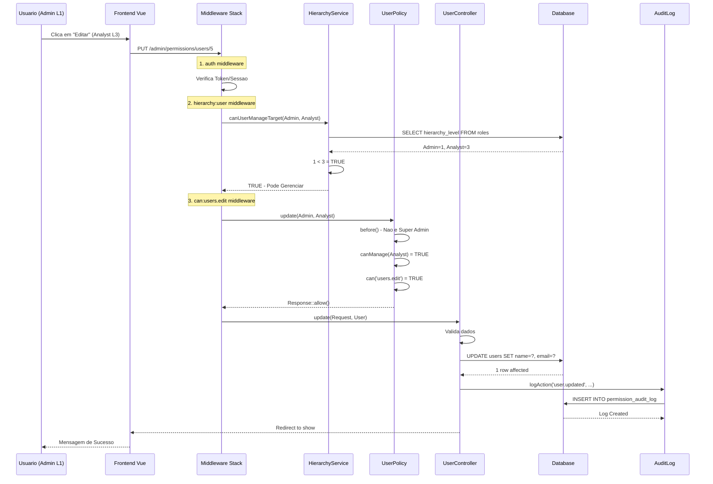

### 7.3 Tentativa de Edicao Bloqueada por Hierarquia

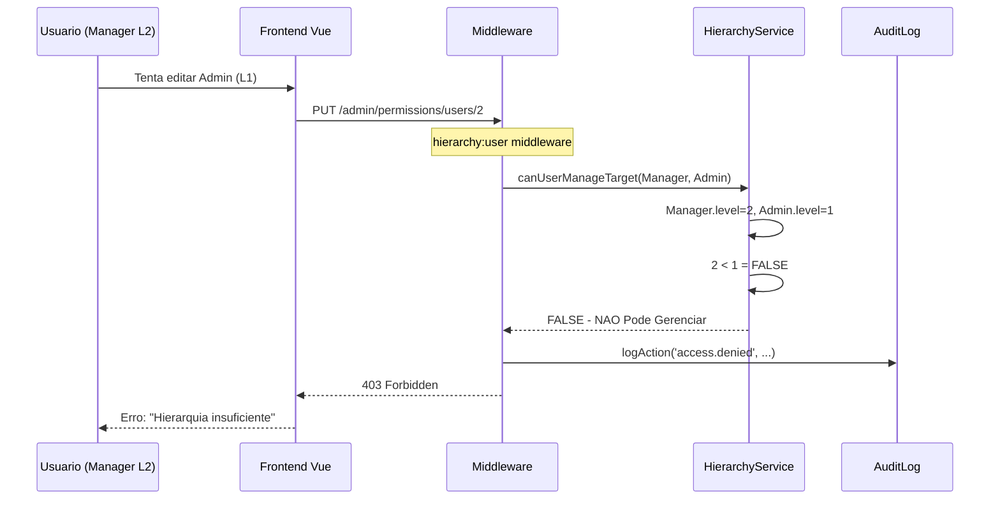

---

## 8. Configuracao do Sistema

### 8.1 Arquivo config/permission.php

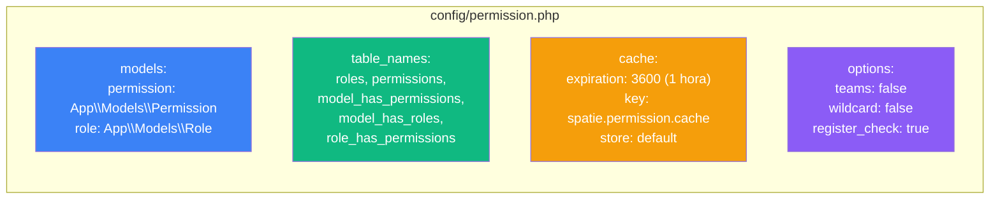

### 8.2 Registro no AppServiceProvider

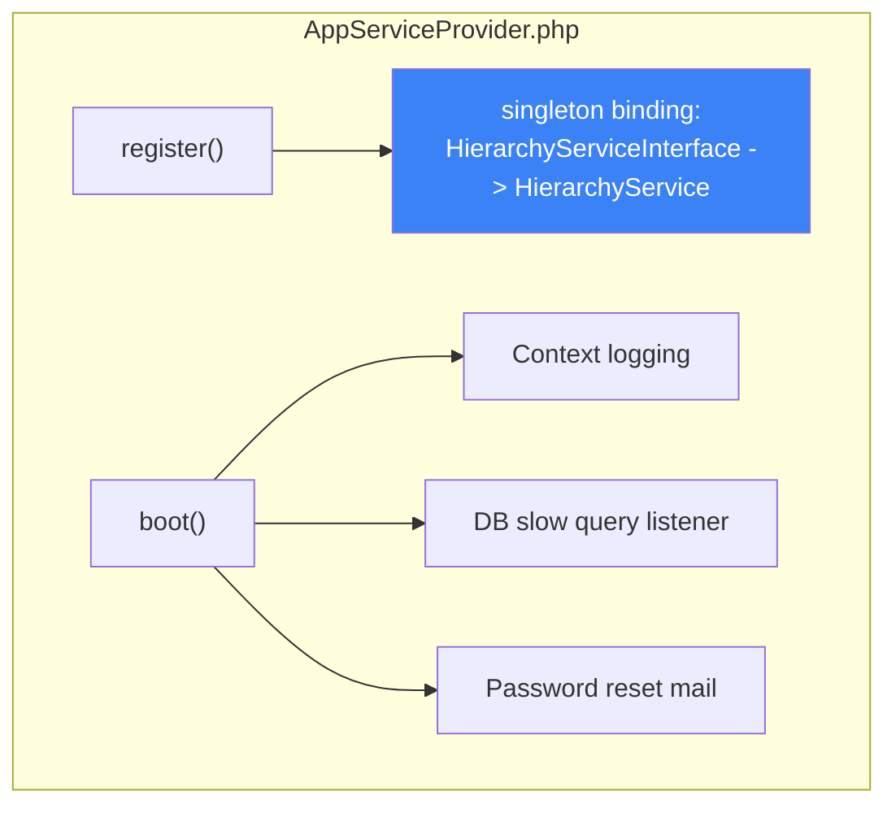

---

## 9. Sistema de Auditoria

### 9.1 Acoes Registradas

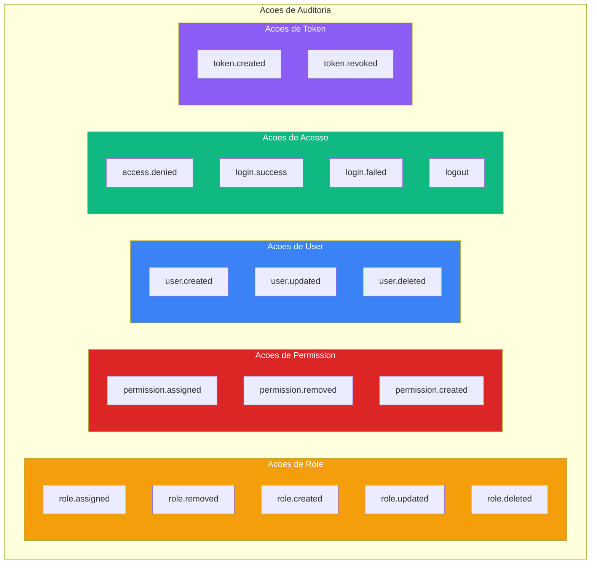

### 9.2 Estrutura do Log

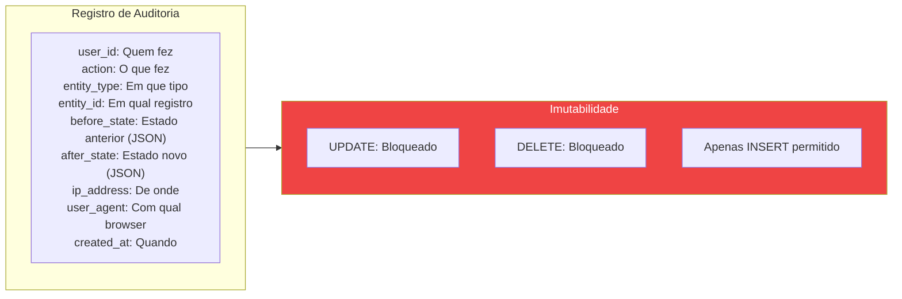

---

## 10. Resumo dos Arquivos

### 10.1 Arquivos Criados/Modificados

| Tipo | Arquivo | Descricao |
|------|---------|-----------|
| Trait | `app/Traits/HasHierarchy.php` | Metodos de hierarquia no User |
| Interface | `app/Contracts/HierarchyServiceInterface.php` | Contrato do service |
| Service | `app/Services/Auth/HierarchyService.php` | Logica de verificacao |
| Middleware | `app/Http/Middleware/CheckHierarchy.php` | Protecao de rotas |
| Policy | `app/Policies/UserPolicy.php` | Autorizacao de usuarios |
| Policy | `app/Policies/RolePolicy.php` | Autorizacao de roles |
| Model | `app/Models/User.php` | Model com HasHierarchy |
| Model | `app/Models/Role.php` | Extends Spatie Role |
| Model | `app/Models/Permission.php` | Extends Spatie Permission |
| Model | `app/Models/PermissionAuditLog.php` | Log imutavel |
| Composable | `resources/js/Composables/useHierarchy.js` | Logica no frontend |
| Seeder | `database/seeders/RolesAndPermissionsSeeder.php` | Dados iniciais |
| Config | `config/permission.php` | Configuracao Spatie |

### 10.2 Comandos Uteis

```bash
# Rodar seeder de permissoes
php artisan db:seed --class=RolesAndPermissionsSeeder

# Limpar cache de permissoes
php artisan permission:cache-reset

# Limpar todo cache
php artisan cache:clear

# Ver permissoes de um usuario
php artisan user:permissions admin@defesa.mg.gov.br
```

---

## 11. Melhorias Implementadas (2026-02-10)

### 11.1 Soft Deletes em Roles e Permissions

As tabelas `roles` e `permissions` agora suportam soft delete, permitindo manter historico de registros deletados.

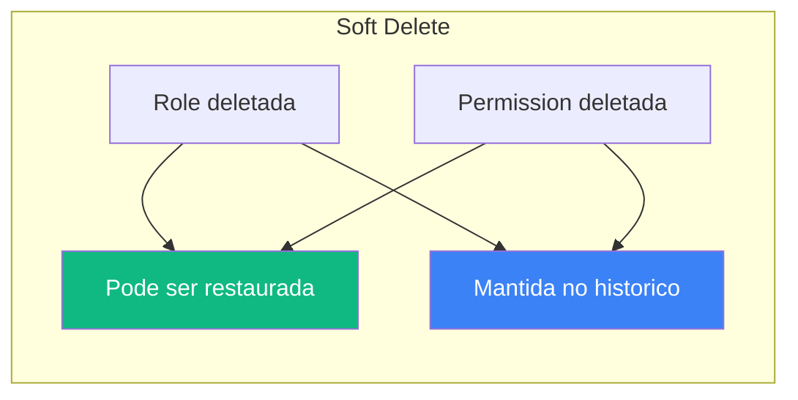

### 11.2 TTL para Permissoes Temporarias

Suporte a roles e permissions temporarias com expiracao automatica.

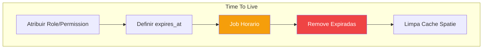

**Campos adicionados:**
- `model_has_roles.expires_at` (timestamp, nullable)
- `model_has_permissions.expires_at` (timestamp, nullable)

**Job de limpeza:** `CleanExpiredPermissions` executa a cada hora.

### 11.3 BasePolicy para DRY

Todas as policies agora estendem `BasePolicy`, centralizando:
- Super-admin bypass
- Helpers de hierarquia
- Verificacao de roles/permissions protegidas

```mermaid
graph TD
    subgraph POLICY_HIERARCHY["Hierarquia de Policies"]
        BASE["BasePolicy<br/>(abstrata)"]
        USER["UserPolicy"]
        ROLE["RolePolicy"]
        PERM["PermissionPolicy"]
    end

    BASE --> USER
    BASE --> ROLE
    BASE --> PERM

    style BASE fill:#8b5cf6,color:#fff
```

**Metodos uteis em BasePolicy:**
- `isSuperAdmin(User $user)` - Verifica super-admin
- `canManageTarget(User $actor, User $target)` - Verifica hierarquia
- `canModifyRoleByLevel(User $actor, int $roleLevel)` - Verifica nivel
- `isProtectedRole(string $slug)` - Verifica role protegida
- `isImmutablePermission(string $permission)` - Verifica permissao imutavel
- `denyHierarchy(string $action)` - Response de negacao padronizado
- `checkPermissionOrDeny(User $user, string $permission)` - Verifica e retorna

### 11.4 Event Subscriber para Auditoria

O `PermissionEventSubscriber` registra automaticamente no audit log todas as operacoes de attach/detach de roles e permissions.

```mermaid
graph LR
    subgraph EVENTS["Eventos Spatie"]
        E1["RoleAttached"]
        E2["RoleDetached"]
        E3["PermissionAttached"]
        E4["PermissionDetached"]
    end

    subgraph SUBSCRIBER["PermissionEventSubscriber"]
        H1["handleRoleAttached"]
        H2["handleRoleDetached"]
        H3["handlePermissionAttached"]
        H4["handlePermissionDetached"]
    end

    subgraph AUDIT["PermissionAuditLog"]
        LOG["Registro Imutavel"]
    end

    E1 --> H1
    E2 --> H2
    E3 --> H3
    E4 --> H4

    H1 --> LOG
    H2 --> LOG
    H3 --> LOG
    H4 --> LOG

    style SUBSCRIBER fill:#3b82f6,color:#fff
    style LOG fill:#10b981,color:#fff
```

### 11.5 Melhorias no Audit Log

Novos campos adicionados para compliance:

| Campo | Tipo | Descricao |
|-------|------|-----------|
| `reason` | string(500) | Motivo da alteracao |
| `session_id` | string(100) | ID da sessao do usuario |

### 11.6 CHECK Constraints (MySQL 8+)

Validacoes no nivel do banco de dados:

| Tabela | Constraint | Expressao |
|--------|------------|-----------|
| roles | chk_hierarchy_level | hierarchy_level >= 0 AND hierarchy_level <= 99 |
| roles | chk_roles_is_active | is_active IN (0, 1) |
| permissions | chk_permissions_is_active | is_active IN (0, 1) |
| permissions | chk_is_immutable | is_immutable IN (0, 1) |

### 11.7 Indices Compostos para Performance

```mermaid
graph TD
    subgraph INDEXES["Indices Compostos"]
        I1["roles_guard_hierarchy_active_idx<br/>(guard_name, hierarchy_level, is_active)"]
        I2["permissions_guard_group_active_idx<br/>(guard_name, group, is_active)"]
        I3["permissions_module_active_idx<br/>(module, is_active)"]
        I4["model_has_roles_type_role_idx<br/>(model_type, role_id)"]
    end

    style I1 fill:#3b82f6,color:#fff
    style I2 fill:#10b981,color:#fff
    style I3 fill:#f59e0b,color:#fff
    style I4 fill:#8b5cf6,color:#fff
```

### 11.8 Migration Consolidada

Todas as melhorias estao na migration:
`2026_02_10_000001_enhance_permission_system.php`

**Comandos Just:**

```bash
# Executar migration
just perm-migrate

# Rollback
just perm-rollback

# Limpar cache de permissoes
just perm-cache-clear
```

---

## 12. Arquivos Criados/Modificados (2026-02-10)

| Tipo | Arquivo | Descricao |
|------|---------|-----------|
| Migration | `database/migrations/2026_02_10_000001_enhance_permission_system.php` | Migration consolidada |
| Policy | `app/Policies/BasePolicy.php` | Policy base abstrata |
| Listener | `app/Listeners/PermissionEventSubscriber.php` | Auditoria de eventos |
| Job | `app/Jobs/CleanExpiredPermissions.php` | Limpeza de TTL |
| Model | `app/Models/Role.php` | Adicionado SoftDeletes |
| Model | `app/Models/Permission.php` | Adicionado SoftDeletes |
| Model | `app/Models/PermissionAuditLog.php` | Novos campos |
| Trait | `app/Traits/HasHierarchy.php` | Delega ao HierarchyService |
| Policy | `app/Policies/UserPolicy.php` | Extends BasePolicy |
| Policy | `app/Policies/RolePolicy.php` | Extends BasePolicy |
| Policy | `app/Policies/PermissionPolicy.php` | Extends BasePolicy |
| Provider | `app/Providers/AuthServiceProvider.php` | Removido backdoor CPF |
| Provider | `app/Providers/EventServiceProvider.php` | Registrado subscriber |
| Kernel | `app/Console/Kernel.php` | Agendado job de limpeza |
| Justfile | `justfile` | Comandos perm-migrate/rollback |
