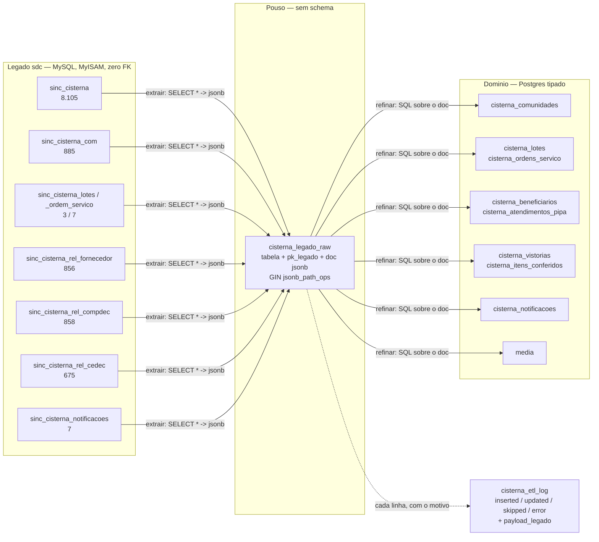

# Cisterna — arquitetura do banco, como ficou implantada

**Data:** 2026-08-14
**Estado:** 10 tabelas criadas e conferidas no Postgres de dev (`newsdc_dev_db`)
**Migrations:** `2026_08_14_100000_create_cisterna_dominio_tables`, `_100100_create_cisterna_legado_raw_table`, `_100200_create_cisterna_etl_log_table`, `_100300_add_documento_url_to_cisterna_ordens_servico`

Este documento foi gerado **consultando o banco real**, nao o desenho: as colunas, tipos, FKs e regras de exclusao abaixo saem de `pg_attribute`, `information_schema.table_constraints` e `pg_indexes`. E o que existe, nao o que se pretendia.

---

## 1. Visao geral

```mermaid
erDiagram
    municipios      ||--o{ cisterna_comunidades   : "possui"
    municipios      ||--o{ cisterna_beneficiarios : "localiza"
    cisterna_comunidades ||--o{ cisterna_beneficiarios : "agrupa"

    cisterna_lotes  ||--o{ cisterna_ordens_servico : "contem"
    cisterna_ordens_servico ||--o{ cisterna_beneficiarios : "aloca"

    cisterna_beneficiarios ||--o{ cisterna_atendimentos_pipa : "declara"
    cisterna_beneficiarios ||--o{ cisterna_vistorias : "recebe"

    cisterna_vistorias ||--o{ cisterna_itens_conferidos : "confere (morph)"
    cisterna_beneficiarios ||--o{ cisterna_notificacoes : "notificavel (morph)"
    cisterna_vistorias ||--o{ cisterna_notificacoes : "notificavel (morph)"

    cisterna_beneficiarios ||--o{ media : "model (morph)"
    cisterna_vistorias ||--o{ media : "model (morph)"
    cisterna_notificacoes ||--o{ media : "model (morph)"
    cisterna_ordens_servico ||--o{ media : "model (morph)"

    users ||--o{ cisterna_beneficiarios : "created_by"
    users ||--o{ cisterna_vistorias : "created_by"
    users ||--o{ cisterna_notificacoes : "created_by"

    cisterna_beneficiarios {
        bigserial id PK
        char cpf "11. unique PARCIAL"
        varchar nome "150"
        varchar telefone "15"
        date data_nascimento
        varchar cadastro_unico "12"
        bigint municipio_id FK "CASCADE"
        bigint comunidade_id FK "SET NULL"
        varchar endereco "150"
        numeric latitude "10 7"
        numeric longitude "10 7"
        bigint ordem_servico_id FK "SET NULL"
        varchar situacao_analise "20 + CHECK"
        varchar situacao_analise_obs "255"
        varchar situacao_obra "20 + CHECK"
        integer ranqueamento_ordem
        smallint qtd_pessoas
        numeric renda "12 2"
        numeric renda_per_capita "12 2"
        boolean possui_deficiencia
        boolean possui_crianca
        date data_nascimento_crianca
        boolean possui_idoso
        boolean chefiada_mulher
        varchar tipo_moradia "30"
        varchar tipo_moradia_outro "50"
        numeric comprimento_telhado "8 2"
        numeric largura_telhado "8 2"
        numeric area_telhado "8 2"
        numeric comprimento_testada "8 2"
        smallint num_caidas_telhado
        varchar cobertura_telhado "30"
        varchar cobertura_outro "150"
        boolean possui_fogao_lenha
        numeric medida_telhado_area_fogao "8 2"
        numeric testada_disp_parte_fogao "8 2"
        boolean atendido_por_pipa
        varchar agente_nome "70"
        char agente_cpf "11"
        varchar engenheiro_nome "150"
        varchar engenheiro_crea "20"
        text observacoes
        bigint created_by FK "SET NULL"
        bigint legacy_id "unique"
        timestamptz created_at
        timestamptz updated_at
        timestamptz deleted_at
    }

    cisterna_vistorias {
        bigserial id PK
        bigint beneficiario_id FK "CASCADE. unique com etapa"
        varchar etapa "20 + CHECK"
        integer numero_instalacao "unique PARCIAL"
        varchar engenheiro_nome "150"
        varchar engenheiro_crea "30"
        varchar engenheiro_art "50"
        date data_relatorio
        varchar local_relatorio "255"
        varchar processo_sei "100"
        varchar contrato "100"
        varchar empenho "100"
        smallint placa_obras
        varchar endereco "150"
        varchar bairro "100"
        numeric latitude "10 7"
        numeric longitude "10 7"
        text observacoes
        timestamptz concluida_em
        bigint created_by FK "SET NULL"
        bigint legacy_id "unique com etapa"
        timestamptz created_at
        timestamptz updated_at
        timestamptz deleted_at
    }

    cisterna_itens_conferidos {
        bigserial id PK
        varchar conferivel_type "100. morph"
        bigint conferivel_id "morph"
        varchar item "20 + CHECK"
        boolean conferido
        numeric quantidade "10 2"
        varchar unidade "5 + CHECK"
        jsonb detalhes
        text observacao
        timestamptz created_at
        timestamptz updated_at
    }

    cisterna_comunidades {
        bigserial id PK
        bigint municipio_id FK "CASCADE"
        varchar nome "70. unique com municipio_id"
        boolean ativa
        bigint legacy_id "unique"
        timestamptz created_at
        timestamptz updated_at
    }

    cisterna_lotes {
        bigserial id PK
        varchar nome "255"
        date data
        text observacao
        bigint legacy_id "unique"
        timestamptz created_at
        timestamptz updated_at
        timestamptz deleted_at
    }

    cisterna_ordens_servico {
        bigserial id PK
        bigint lote_id FK "CASCADE"
        varchar nome "255"
        text observacao
        varchar documento_url "500. URL do SEI, nao arquivo"
        bigint legacy_id "unique"
        timestamptz created_at
        timestamptz updated_at
        timestamptz deleted_at
    }

    cisterna_atendimentos_pipa {
        bigserial id PK
        bigint beneficiario_id FK "CASCADE"
        varchar responsavel "20 + CHECK. unique com beneficiario"
        varchar descricao "255"
    }

    cisterna_notificacoes {
        bigserial id PK
        varchar notificavel_type "100. morph"
        bigint notificavel_id "morph"
        text observacao
        boolean respondida
        timestamptz respondida_em
        bigint created_by FK "SET NULL"
        bigint legacy_id "unique"
        timestamptz created_at
        timestamptz updated_at
        timestamptz deleted_at
    }

    media {
        bigserial id PK
        varchar model_type "morph"
        bigint model_id "morph"
        varchar collection_name
        varchar file_name
        varchar disk
        jsonb custom_properties
    }

    municipios {
        bigserial id PK
        varchar nome
        varchar codigo_ibge "7. ponte com o legado"
        char uf
    }

    users {
        bigserial id PK
        varchar name
        bigint orgao_principal_id FK "perfil e territorio"
    }
```

## 2. Area de homologacao — a carga crua

Separada do dominio de proposito, e criada na **mesma etapa de banco**, para a homologacao comecar pela carga antes de existir service ou tela. Mesma abordagem de `ajuda_h_legado_raw`.

A extracao **nao conhece schema**: faz `SELECT *` e guarda a linha inteira. Foi isso que permitiu comecar sem o `SHOW CREATE TABLE` de producao em maos, e e o que permite refazer a extracao sem reimportar — o refino e SQL sobre o `doc`, testavel dentro do proprio Postgres, sem o MySQL no circuito.

`pk_legado` e `varchar(64)`, nao `bigint`: aceita origem com chave nao numerica sem a extracao precisar saber o tipo.

## 3. As tres decisoes de modelagem que mudam o mais visivel

### 3.1 As tres tabelas de relatorio viraram uma, com `etapa`

No legado, `rel_fornecedor`, `rel_compdec` e `rel_cedec` eram tabelas separadas para tres etapas do **mesmo documento**. Descobrir em que etapa uma cisterna estava custava tres `whereHas` aninhados.

Agora e uma linha por etapa em `cisterna_vistorias`, com `unique (beneficiario_id, etapa)`. A pergunta virou um lookup.

### 3.2 O checklist saiu de ~87 colunas para uma tabela polimorfica

Os mesmos 13 itens (`cisterna_logo`, `sucao`, `bomba`, `placa`, `calha`, `tubulacao`, `fixacao`, `filtro`, `bloco`, `te_pvc`, `joelho_pvc`, `luva_pvc`, `cap_pvc`) apareciam nas tres tabelas como booleano + quantidade + foto, com nomes divergentes entre elas: `calha_metros` numa, `qtd_calha` noutra, `calha_opcao` numa terceira.

`cisterna_itens_conferidos` guarda uma linha por item, polimorfica. Acrescentar item passou a ser um `case` no enum, nao migration em tres tabelas.

O `detalhes jsonb` existe por um motivo unico: `fixacao` no COMPDEC se desdobra em `fix_abracadeira`, `fix_bucha` e `fix_parafuso` — tres subquantidades que nao cabem numa coluna `quantidade`.

### 3.3 ~54 colunas de arquivo viraram zero

Todas as colunas de caminho de foto e anexo sairam do dominio: os arquivos vao para collections do Spatie MediaLibrary, na tabela `media`, que ja e polimorfica. Acrescentar tipo de foto deixou de ser migration.

## 4. O que o Postgres faz aqui que o MySQL do legado nao fazia

| Recurso | Onde | Por que |
|---|---|---|
| **Indice unico PARCIAL** | `cisterna_beneficiarios_cpf_unq` em `(cpf) WHERE situacao_analise <> 'duplicado' AND deleted_at IS NULL` | Producao tem 492 CPFs repetidos, 485 marcados como Duplicado — o legado usava o status como tombstone. Unique puro rejeitaria ~511 linhas legitimas; parcial preserva o historico e **impede cadastro novo duplicado** |
| **Indice parcial** | `cisterna_beneficiarios_ranqueamento_idx ... WHERE ranqueamento_ordem IS NOT NULL` | O legado fazia `whereNotNull` com full scan |
| **Indice unico parcial** | `cisterna_vistorias_numero_instalacao_unq ... WHERE numero_instalacao IS NOT NULL AND deleted_at IS NULL` | Concorda com o service, que consulta pelo model e ignora soft-deleted. Com indice total o service diria "livre" e o INSERT estouraria violacao crua |
| **GIN + pg_trgm** | `cisterna_beneficiarios_nome_trgm_idx` | Substitui `like '%termo%'` |
| **GIN jsonb_path_ops** | `cisterna_legado_raw_doc_idx` | Consulta de contencao no doc cru, menor e mais rapido que o GIN padrao |
| **CHECK constraint** | 7 constraints: situacao_analise, situacao_obra, etapa, item, unidade, responsavel, acao | Enum textual validado pelo banco, nao so pelo PHP |
| **`FILTER (WHERE ...)`** | agregacao dos indicadores | Uma consulta em vez das nove que o legado fazia com `->get()` so para contar |
| **FK de verdade** | 10 FKs, com `CASCADE` / `SET NULL` explicitos | O legado e **MyISAM em 6 das 10 tabelas**: zero FK, zero transacao, integridade so no PHP |

## 5. Duas coisas propositais que parecem inacabadas

**A tabela `cisternas` continua existindo, orfa.** Era do scaffold anterior, que modelava um dominio inventado (`codigo`, `capacidade_litros`, `tipo` comunitaria/individual/escolar) sem relacao com o legado. O dominio novo nao a usa e nenhuma FK aponta para ela — ha teste verificando isso. Ela **nao** foi derrubada pela migration do dominio porque DROP no `up()` e destrutivo e irreversivel em producao; a retirada e uma migration propria, explicita e revisavel.

**A migration do dominio e nova, nao a do scaffold reescrita.** A regra de consolidar migration vale enquanto nada foi aplicado. `2026_05_08_140000_create_cisternas_table` **ja consta** na tabela `migrations` onde o scaffold rodou, e o Laravel nao reexecuta migration registrada — reescrever seria no-op silencioso, e as 8 tabelas nunca apareceriam em producao.

## 6. Estado atual

| Tabela | Linhas | Observacao |
|---|---|---|
| `cisterna_comunidades` | 0 | aguardando ETL |
| `cisterna_lotes` | 0 | aguardando ETL |
| `cisterna_ordens_servico` | 0 | aguardando ETL |
| `cisterna_beneficiarios` | 0 | aguardando ETL — 8.105 esperados |
| `cisterna_atendimentos_pipa` | 0 | aguardando ETL |
| `cisterna_vistorias` | 0 | aguardando ETL — ~2.150 esperados nas tres etapas |
| `cisterna_itens_conferidos` | 0 | aguardando ETL |
| `cisterna_notificacoes` | 0 | aguardando ETL — 7 esperados, todos dado de teste |
| `cisterna_legado_raw` | 0 | aguardando extracao — ~11,4 mil documentos |
| `cisterna_etl_log` | 0 | preenche durante o refino |
| `cisternas` | 0 | orfa, do scaffold |

Estrutura pronta e verificada por 38 testes. A carga entra nas Tasks 15 a 18 do plano.
