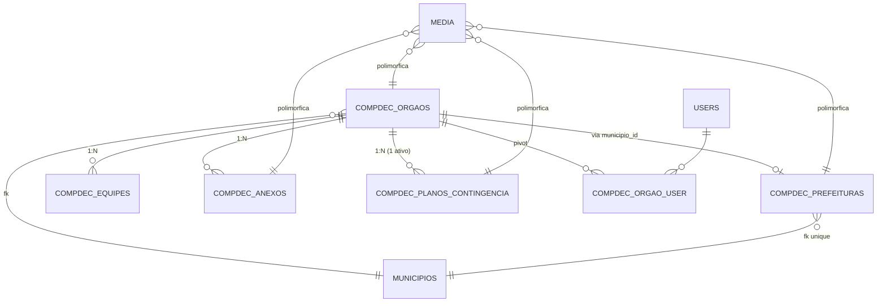

# COMPDEC — Spec de Design

## 1. Contexto

O sistema novo (`NewSDC/SDC`) já possui um scaffold do módulo `App\Modules\Compdec` com a entidade-raiz **Órgão de Defesa Civil** (`compdec`/`redec`/`cedec`) implementada parcialmente (Controller, Service, Domain Entity, Repository, Vue pages, policy, permissions). Falta migrar para esse scaffold a riqueza funcional do módulo COMPDEC do sistema legado (`sdc`), que contém:

- **60+ campos** sobre o COMPDEC (atos legais, capacidades estruturais, dados do prefeito, INSS) hoje na tabela `com_comdec`
- **Sub-recursos:** Equipe (`com_eq_comdec`), Anexos legais (`com_anexo`), Plano de Contingência (`com_plano_upload`)
- **Inconsistências legadas conhecidas:** PK híbrida `id_comdec`/`id`, FK comentadas em `com_eq_comdec`, typo `municioio_id` em `Rat::ComEquipe()`, tabela `com_plano_upload` sem migration formal
- **Integrações cross-module:** MAH/Ajuda Humanitária (consome dados do coordenador), Cisterna (relatórios COMPDEC)
- **Submódulos** que já existem no novo como módulos próprios: RAT, Vistoria, Interdição, Prepara — exigem apenas cross-link via `orgao_id`

O objetivo é **estender o scaffold existente** (não criar do zero) seguindo o padrão dos módulos `Decretacoes` e `Pae`, com **migração espelhada e correção de inconsistências**, em **5 fases incrementais** (cada fase um PR).

## 2. Decisões Aprovadas

| # | Decisão | Escolha |
|---|---|---|
| 1 | Estratégia de campos | Híbrida: colunas reais para queryáveis, `metadata jsonb` para soft fields, `compdec_prefeituras` separada |
| 2 | UX detalhe/edição | Show com tabs e partial reload Inertia (`router.reload({ only: ['equipe'] })`) |
| 3 | Migração de dados | Espelhamento completo + correção das inconsistências legadas |
| 4 | Modelagem de Equipe | Tabela própria `compdec_equipes` (pivot `compdec_orgao_user` continua só para usuários reais com login) |
| 5 | Plano de Contingência | Sub-recurso do COMPDEC (`compdec_planos_contingencia`) — não unificado com módulo standalone do sidebar |
| 6 | Fotos | Spatie Media Library |
| 7 | Rollout | Faseada por sub-recurso (5 fases atômicas) |
| 8 | Padrão arquitetural | Request → DTO → Controller → Service → Resource → Model (sem Domain/Entities/Repositories) |
| 9 | Convenção de nomes | Prefixo `compdec_` em TODAS as tabelas do módulo |
| 10 | Driver do banco | PostgreSQL 17 (com `pg_trgm`, partial unique indexes, CHECK constraints) |
| 11 | Frontend | Atomic Design canônico (Atoms → Molecules → Organisms → Templates/Layouts → Pages) |
| 12 | Performance | Eloquent strict mode + middleware `QueryThresholdMiddleware` (default 15) |
| 13 | Permissions | Slug-based em `config/permissions.php`, mesmo padrão de `pae.*`, `rat.*` |

## 3. Visão Arquitetural

### 3.1 Padrão do projeto

```
HTTP Request
   ↓
[Requests/StoreXxxRequest.php]   validação + authorize()
   ↓ $request->validated()
[DTOs/XxxDTO.php]                 envelope tipado
   ↓
[Controllers/XxxController.php]   thin: recebe DTO, chama Service, devolve Resource
   ↓
[Services/XxxService.php]         lógica de negócio + transações + uso direto do Model
   ↓
[Models/Xxx.php]                  Eloquent (queries, relations, scopes, casts, HasMedia)
   ↑
[Resources/XxxResource.php]       serializa Model → array para Inertia/JSON
```

### 3.2 Estrutura final do módulo

```
app/Modules/Compdec/
├── CompdecServiceProvider.php
├── Controllers/
│   ├── OrgaoController.php                 (existe — refatorar)
│   ├── PrefeituraController.php            (novo)
│   ├── EquipeController.php                (novo)
│   ├── AnexoController.php                 (novo)
│   └── PlanoContingenciaController.php     (novo)
├── Requests/
│   ├── StoreOrgaoRequest.php
│   ├── UpdateOrgaoRequest.php
│   ├── UpsertPrefeituraRequest.php
│   ├── StoreEquipeRequest.php
│   ├── UpdateEquipeRequest.php
│   ├── StoreAnexoRequest.php
│   ├── UpdateAnexoRequest.php
│   ├── StorePlanoContingenciaRequest.php
│   └── UpdatePlanoContingenciaRequest.php
├── DTOs/
│   ├── OrgaoDTO.php                        (existe — estender)
│   ├── PrefeituraDTO.php
│   ├── EquipeDTO.php
│   ├── AnexoDTO.php
│   └── PlanoContingenciaDTO.php
├── Services/
│   ├── OrgaoService.php                    (existe — refatorar)
│   ├── PrefeituraService.php
│   ├── EquipeService.php
│   ├── AnexoService.php
│   └── PlanoContingenciaService.php
├── Resources/
│   ├── OrgaoResource.php
│   ├── OrgaoIndexResource.php
│   ├── PrefeituraResource.php
│   ├── EquipeResource.php
│   ├── EquipeIndexResource.php
│   ├── AnexoResource.php
│   ├── AnexoIndexResource.php
│   ├── PlanoContingenciaResource.php
│   └── PlanoContingenciaIndexResource.php
├── Models/
│   ├── Orgao.php                           (existe — estender)
│   ├── Prefeitura.php                      (HasMedia)
│   ├── CompdecEquipe.php
│   ├── CompdecAnexo.php                    (HasMedia)
│   └── CompdecPlanoContingencia.php        (HasMedia)
├── Observers/
│   ├── CompdecEquipeObserver.php
│   └── CompdecPlanoContingenciaObserver.php
├── Enums/
│   ├── TipoOrgao.php
│   ├── StatusOrgao.php
│   ├── FuncaoEquipe.php
│   ├── TipoAnexo.php
│   └── StatusValidade.php
└── Support/
    └── LegacyParser.php
```

**Vivem fora do módulo (convenção do projeto):**

| Item | Local |
|---|---|
| Policies | `app/Policies/{Orgao,Prefeitura,CompdecEquipe,CompdecAnexo,CompdecPlanoContingencia}Policy.php` |
| Migrations | `database/migrations/` |
| Factories | `database/factories/` |
| Seeders | `database/seeders/` |
| Tests | `tests/{Unit,Feature,Integration,Browser}/Compdec/` |
| Vue Pages | `resources/js/Pages/Compdec/` |
| Vue Components | `resources/js/Components/Molecules/Compdec/`, `resources/js/Components/Organisms/Compdec/` |
| Routes | `routes/modules/compdec.php` (já incluído em `routes/web.php` linha 126) |
| ETL Command | `app/Console/Commands/MigrarCompdecLegadoCommand.php` |
| Config | `config/permissions.php` (estender), `config/compdec.php` (novo) |

### 3.3 Princípios SOLID/DRY

- **SRP:** cada Controller cuida de UM sub-recurso (5 controllers para 5 abas)
- **OCP:** novos sub-recursos seguem template idêntico
- **DIP:** Service injetado via DI; bindings centralizados em `CompdecServiceProvider`
- **DRY:** Atomic Design força reúso de Atoms/Molecules existentes

### 3.4 Refatoração do scaffold existente (parte da F1)

- Remover `app/Modules/Compdec/Domain/Entities/Orgao.php`
- Remover `app/Modules/Compdec/Domain/Repositories/OrgaoRepository.php` (interface + impl)
- `OrgaoService` passa a falar direto com Eloquent
- `OrgaoController` consome `StoreOrgaoRequest`/`UpdateOrgaoRequest` (hoje validação inline)
- `CompdecServiceProvider` perde binding `OrgaoRepositoryInterface`
- `AuthServiceProvider` aponta `OrgaoPolicy → Models\Orgao`
- `database/seeders/CompdecPermissionsSeeder.php` deletado (substituído pela seed global de `config/permissions.php`)

## 4. Schema do Banco (PostgreSQL 17)

### 4.1 Convenção e features alavancadas

- **Prefixo `compdec_`** em todas as tabelas do módulo
- **`bigint GENERATED ALWAYS AS IDENTITY`** (Laravel 11 `id()` emite isso em PG)
- **`jsonb`** com índices GIN para `metadata`
- **`pg_trgm`** com `gin_trgm_ops` para busca por código/nome
- **Partial unique indexes** (`WHERE` predicate) para "1 plano ativo por órgão"
- **CHECK constraints** explícitas para enums textuais
- **Soft delete** via `deleted_at` (timestamp NULL)
- **`legacy_id`** indexado em todas as tabelas migradas (idempotência ETL)

### 4.2 Renomeações de tabelas existentes

| Antes | Depois |
|---|---|
| `orgaos` | `compdec_orgaos` |
| `orgao_user` | `compdec_orgao_user` |

FKs em `users.orgao_principal_id` e `rats.orgao_emissor_id` reapontam para `compdec_orgaos(id)` via DROP+RECREATE da constraint.

### 4.3 ALTER `compdec_orgaos` — colunas adicionadas

| Coluna | Tipo | Origem |
|---|---|---|
| `lei_criacao_numero` | varchar(50) | INTERVENTION (`com_comdec.lei_num`) |
| `lei_criacao_data` | date | INTERVENTION (`com_comdec.lei_data`) |
| `decreto_numero` | varchar(50) | INTERVENTION |
| `decreto_data` | date | INTERVENTION |
| `portaria_numero` | varchar(50) | INTERVENTION (`com_comdec.port_numero`) |
| `portaria_data` | date | INTERVENTION |
| `qtd_efetivo` | smallint | INTERVENTION |
| `qtd_nupdec` | smallint | INTERVENTION (`com_comdec.nupdec_qtd`) |
| `tem_sede_propria` | boolean | INTERVENTION (parse Sim/Não) |
| `tem_viatura` | boolean | INTERVENTION |
| `tem_plano_contingencia` | boolean | GREEN (cache via observer pós-F4) |
| `tem_mapeamento_risco` | boolean | INTERVENTION |
| `tem_simulado` | boolean | INTERVENTION |
| `tem_cartao_pdc` | boolean | INTERVENTION |
| `telefone_secundario` | varchar(20) | INTERVENTION (`fone_com2`) |
| `fax` | varchar(20) | INTERVENTION |
| `email_secundario` | varchar(255) | INTERVENTION (`email2`) |
| `email_terciario` | varchar(255) | INTERVENTION (`email3`) |
| `legacy_id` | bigint indexed | INTERVENTION |

**Estrutura `compdec_orgaos.metadata` (JSONB), bloco `capacidades`:**

```json
{
  "capacidades": {
    "tem_computador": true,
    "tem_curso_gestao": true,
    "data_curso_gestao": "2024-03-15",
    "tem_curso_sco": false,
    "data_curso_sco": null,
    "tem_workshop_pdc": true,
    "data_workshop_pdc": "2023-11-20",
    "experiencia_dc": "...",
    "tipo_experiencia_dc": "...",
    "capacitacao_nupdec": "...",
    "nupdec_org_representado": "...",
    "obs_capacidades": null
  },
  "abrangencia": [...]
}
```

**Índices novos:** `(legacy_id)`, `(tem_plano_contingencia)`, `(qtd_efetivo)`.

### 4.4 CREATE `compdec_prefeituras`

| Coluna | Tipo | Notas |
|---|---|---|
| `id` | bigint identity PK | |
| `municipio_id` | foreignId | UNIQUE, constrained, cascadeOnDelete |
| `prefeito_nome` | varchar(255) | nullable |
| `prefeito_telefone` | varchar(20) | |
| `prefeito_celular` | varchar(20) | |
| `prefeito_email` | varchar(255) | |
| `endereco` | text | |
| `bairro` | varchar(120) | |
| `cep` | varchar(10) | |
| `latitude` | decimal(10,7) | |
| `longitude` | decimal(10,7) | |
| `inss_tem_cobranca` | boolean | default false |
| `inss_aliquota` | decimal(5,2) | |
| `inss_lei_cobranca` | varchar(120) | |
| `inss_responsavel` | varchar(255) | |
| `legacy_id` | bigint indexed | |
| timestamps + soft delete | | |

**Spatie media collection:** `foto_prefeito`.

### 4.5 CREATE `compdec_equipes`

| Coluna | Tipo | Notas |
|---|---|---|
| `id` | bigint identity PK | |
| `orgao_id` | foreignId | constrained `compdec_orgaos`, cascadeOnDelete |
| `nome` | varchar(255) | NOT NULL |
| `funcao` | varchar(20) CHECK | enum FuncaoEquipe |
| `telefone` | varchar(20) | |
| `celular` | varchar(20) | |
| `email` | varchar(255) | |
| `cpf` | varchar(14) | nullable (GREEN) |
| `ativo` | boolean | default true |
| `ordem` | smallint | default 0 |
| `observacoes` | text | |
| `legacy_id` | bigint indexed | |
| timestamps + soft delete | | |

**Índices:** `(orgao_id, funcao, ativo)`.

### 4.6 CREATE `compdec_anexos`

| Coluna | Tipo | Notas |
|---|---|---|
| `id` | bigint identity PK | |
| `orgao_id` | foreignId | constrained, cascadeOnDelete |
| `tipo` | varchar(20) CHECK | enum TipoAnexo |
| `titulo` | varchar(255) | NOT NULL |
| `descricao` | text | |
| `numero` | varchar(60) | nullable (GREEN) |
| `data_emissao` | date | |
| `data_validade` | date | |
| `legacy_arquivo` | varchar(255) | path no storage legado durante transição |
| `legacy_id` | bigint indexed | |
| timestamps + soft delete | | |

**Spatie media collection:** `anexo_arquivo` (single-file: PDF/DOC/DOCX/ODT, max 2MB).

**Índices:** `(orgao_id, tipo, data_validade)`.

### 4.7 CREATE `compdec_planos_contingencia`

| Coluna | Tipo | Notas |
|---|---|---|
| `id` | bigint identity PK | |
| `orgao_id` | foreignId | constrained, cascadeOnDelete |
| `versao` | varchar(40) | NOT NULL |
| `tamanho_bytes` | bigint | |
| `observacoes` | text | |
| `ativo` | boolean | default false |
| `aprovado_em` | timestamp | |
| `aprovado_por` | foreignId users | nullOnDelete |
| `legacy_arquivo` | varchar(255) | |
| `legacy_id` | bigint indexed | |
| timestamps + soft delete | | |

**Spatie media collection:** `plano_arquivo` (single-file: PDF/DOC/DOCX/ODT, max 20MB).

**Índices + constraint:**
- `(orgao_id, ativo, created_at DESC)`
- `UNIQUE INDEX (orgao_id) WHERE ativo = true` (partial unique — 1 ativo por órgão)

### 4.8 ER Diagram



## 5. Camadas Backend

### 5.1 Permissions slug-based (`config/permissions.php`)

Adicionar grupo `'COMPDEC'` no formato dos demais módulos:

```php
'COMPDEC' => [
    'Orgaos' => [
        'view'   => 'compdec.orgaos.view',
        'create' => 'compdec.orgaos.create',
        'edit'   => 'compdec.orgaos.edit',
        'delete' => 'compdec.orgaos.delete',
        'export' => 'compdec.orgaos.export',
    ],
    'Prefeitura' => [
        'view' => 'compdec.prefeitura.view',
        'edit' => 'compdec.prefeitura.edit',
    ],
    'Equipe' => [
        'view'   => 'compdec.equipe.view',
        'create' => 'compdec.equipe.create',
        'edit'   => 'compdec.equipe.edit',
        'delete' => 'compdec.equipe.delete',
    ],
    'Anexos' => [
        'view'     => 'compdec.anexos.view',
        'create'   => 'compdec.anexos.create',
        'edit'     => 'compdec.anexos.edit',
        'delete'   => 'compdec.anexos.delete',
        'download' => 'compdec.anexos.download',
    ],
    'Plano' => [
        'view'     => 'compdec.plano.view',
        'create'   => 'compdec.plano.create',
        'edit'     => 'compdec.plano.edit',
        'delete'   => 'compdec.plano.delete',
        'aprovar'  => 'compdec.plano.aprovar',
        'download' => 'compdec.plano.download',
    ],
    'UsuarioVinculo' => [
        'manage' => 'compdec.usuarios.manage',
    ],
],
```

**Atribuição aos roles existentes:**
- `admin` → `'compdec.*'`
- `manager` → todas exceto `*.delete` e `*.aprovar`
- `analyst` → views + creates + edits (sem delete/aprovar/usuarios)
- `operator` → views + downloads
- `viewer` → views
- `user` → apenas `compdec.orgaos.view`

### 5.2 Camada de Performance/Observability

**Eloquent strict mode** em `AppServiceProvider::boot()`:
```php
Model::preventLazyLoading(! $this->app->isProduction());
Model::preventSilentlyDiscardingAttributes(! $this->app->isProduction());
Model::preventAccessingMissingAttributes(! $this->app->isProduction());
```

**Middleware `QueryThresholdMiddleware`** (`app/Http/Middleware/`) aplicado ao grupo `compdec.*`:
- Hook em `DB::listen()`
- Threshold default `15`, customizável por rota (ex: `arvore` usa `25`)
- Log warning em canal dedicado `compdec-perf` com top 5 queries lentas + duplicações
- Em dev, response header `X-Query-Count` e `X-Query-Threshold-Exceeded`

**Channel de log** em `config/logging.php`: `compdec-perf` (daily, 14 dias).

**Disciplina nos Services:**
- Todo método de listagem usa `with([...])` eager para relações acessadas pelo Resource
- `withCount` para totais
- `select` enxuto onde aplicável
- Asserções de query count em testes de Performance

### 5.3 Rotas (`routes/modules/compdec.php`)

Substituir o arquivo inteiro por uma versão estendida:

```php
<?php

use App\Modules\Compdec\Controllers\OrgaoController;
use App\Modules\Compdec\Controllers\PrefeituraController;
use App\Modules\Compdec\Controllers\EquipeController;
use App\Modules\Compdec\Controllers\AnexoController;
use App\Modules\Compdec\Controllers\PlanoContingenciaController;
use Illuminate\Support\Facades\Route;

Route::model('orgao',  \App\Modules\Compdec\Models\Orgao::class);
Route::model('equipe', \App\Modules\Compdec\Models\CompdecEquipe::class);
Route::model('anexo',  \App\Modules\Compdec\Models\CompdecAnexo::class);
Route::model('plano',  \App\Modules\Compdec\Models\CompdecPlanoContingencia::class);

Route::middleware(['auth', 'compdec.query-threshold:15'])
    ->prefix('compdec')
    ->name('compdec.')
    ->group(function () {

        // Órgãos (raiz)
        Route::middleware('can:compdec.orgaos.view')->group(function () {
            Route::get('/orgaos',         [OrgaoController::class, 'index'])->name('index');
            Route::get('/orgaos/arvore',  [OrgaoController::class, 'arvore'])
                ->middleware('compdec.query-threshold:25')->name('arvore');
            Route::get('/orgaos/{orgao}', [OrgaoController::class, 'show'])->name('show');
        });

        Route::middleware('can:compdec.orgaos.create')->group(function () {
            Route::get('/orgaos/novo', [OrgaoController::class, 'create'])->name('create');
            Route::post('/orgaos',     [OrgaoController::class, 'store'])->name('store');
        });

        Route::middleware('can:compdec.orgaos.edit')->group(function () {
            Route::get('/orgaos/{orgao}/editar', [OrgaoController::class, 'edit'])->name('edit');
            Route::put('/orgaos/{orgao}',        [OrgaoController::class, 'update'])->name('update');
            Route::post('/orgaos/{orgao}/foto',  [OrgaoController::class, 'uploadFotoCoordenador'])->name('foto.upload');
            Route::delete('/orgaos/{orgao}/foto', [OrgaoController::class, 'removerFotoCoordenador'])->name('foto.destroy');
        });

        Route::middleware('can:compdec.orgaos.delete')->group(function () {
            Route::delete('/orgaos/{orgao}', [OrgaoController::class, 'destroy'])->name('destroy');
        });

        Route::middleware('can:compdec.usuarios.manage')->group(function () {
            Route::post('/orgaos/{orgao}/usuarios', [OrgaoController::class, 'vincularUsuario'])->name('usuarios.vincular');
        });

        // Sub-recursos com scoped bindings
        Route::scopeBindings()->group(function () {

            // Prefeitura
            Route::middleware('can:compdec.prefeitura.view')->group(function () {
                Route::get('/orgaos/{orgao}/prefeitura', [PrefeituraController::class, 'show'])->name('prefeitura.show');
            });
            Route::middleware('can:compdec.prefeitura.edit')->group(function () {
                Route::match(['post','put'], '/orgaos/{orgao}/prefeitura', [PrefeituraController::class, 'upsert'])->name('prefeitura.upsert');
                Route::post('/orgaos/{orgao}/prefeitura/foto', [PrefeituraController::class, 'uploadFoto'])->name('prefeitura.foto.upload');
                Route::delete('/orgaos/{orgao}/prefeitura/foto', [PrefeituraController::class, 'removerFoto'])->name('prefeitura.foto.destroy');
            });

            // Equipe
            Route::middleware('can:compdec.equipe.view')->group(function () {
                Route::get('/orgaos/{orgao}/equipe',          [EquipeController::class, 'index'])->name('equipe.index');
                Route::get('/orgaos/{orgao}/equipe/{equipe}', [EquipeController::class, 'show'])->name('equipe.show');
            });
            Route::middleware('can:compdec.equipe.create')->group(function () {
                Route::post('/orgaos/{orgao}/equipe', [EquipeController::class, 'store'])->name('equipe.store');
            });
            Route::middleware('can:compdec.equipe.edit')->group(function () {
                Route::put('/orgaos/{orgao}/equipe/{equipe}', [EquipeController::class, 'update'])->name('equipe.update');
                Route::post('/orgaos/{orgao}/equipe/{equipe}/restaurar', [EquipeController::class, 'restore'])->name('equipe.restore');
            });
            Route::middleware('can:compdec.equipe.delete')->group(function () {
                Route::delete('/orgaos/{orgao}/equipe/{equipe}', [EquipeController::class, 'destroy'])->name('equipe.destroy');
            });

            // Anexos
            Route::middleware('can:compdec.anexos.view')->group(function () {
                Route::get('/orgaos/{orgao}/anexos',         [AnexoController::class, 'index'])->name('anexos.index');
                Route::get('/orgaos/{orgao}/anexos/{anexo}', [AnexoController::class, 'show'])->name('anexos.show');
            });
            Route::middleware('can:compdec.anexos.create')->group(function () {
                Route::post('/orgaos/{orgao}/anexos', [AnexoController::class, 'store'])->name('anexos.store');
            });
            Route::middleware('can:compdec.anexos.edit')->group(function () {
                Route::put('/orgaos/{orgao}/anexos/{anexo}', [AnexoController::class, 'update'])->name('anexos.update');
            });
            Route::middleware('can:compdec.anexos.delete')->group(function () {
                Route::delete('/orgaos/{orgao}/anexos/{anexo}', [AnexoController::class, 'destroy'])->name('anexos.destroy');
            });
            Route::middleware('can:compdec.anexos.download')->group(function () {
                Route::get('/orgaos/{orgao}/anexos/{anexo}/download', [AnexoController::class, 'download'])->name('anexos.download');
            });

            // Plano de Contingência
            Route::middleware('can:compdec.plano.view')->group(function () {
                Route::get('/orgaos/{orgao}/planos',         [PlanoContingenciaController::class, 'index'])->name('planos.index');
                Route::get('/orgaos/{orgao}/planos/{plano}', [PlanoContingenciaController::class, 'show'])->name('planos.show');
            });
            Route::middleware('can:compdec.plano.create')->group(function () {
                Route::post('/orgaos/{orgao}/planos', [PlanoContingenciaController::class, 'store'])->name('planos.store');
            });
            Route::middleware('can:compdec.plano.edit')->group(function () {
                Route::put('/orgaos/{orgao}/planos/{plano}', [PlanoContingenciaController::class, 'update'])->name('planos.update');
                Route::post('/orgaos/{orgao}/planos/{plano}/ativar', [PlanoContingenciaController::class, 'ativar'])->name('planos.ativar');
            });
            Route::middleware('can:compdec.plano.aprovar')->group(function () {
                Route::post('/orgaos/{orgao}/planos/{plano}/aprovar', [PlanoContingenciaController::class, 'aprovar'])->name('planos.aprovar');
            });
            Route::middleware('can:compdec.plano.delete')->group(function () {
                Route::delete('/orgaos/{orgao}/planos/{plano}', [PlanoContingenciaController::class, 'destroy'])->name('planos.destroy');
            });
            Route::middleware('can:compdec.plano.download')->group(function () {
                Route::get('/orgaos/{orgao}/planos/{plano}/download', [PlanoContingenciaController::class, 'download'])->name('planos.download');
            });

        });

    });
```

### 5.4 Assinaturas dos Services

Cada Service expõe métodos consistentes (CRUD + listagem + ETL):

**`OrgaoService`:**
```
listarOrgaos(int $perPage = 15, array $filtros = []): LengthAwarePaginator
obterOrgao(int $id): Orgao
criarOrgao(OrgaoDTO $dto): Orgao
atualizarOrgao(int $id, OrgaoDTO $dto): Orgao
deletarOrgao(int $id): bool
restaurarOrgao(int $id): bool
obterCedecs(): Collection
obterRedecs(?int $cedecId = null): Collection
obterCompdecs(?int $redecId = null): Collection
obterArvoreHierarquica(): array
vincularUsuarioAOrgao(int $orgaoId, int $userId, FuncaoEquipe $funcao, bool $isPrincipal = false): bool
migrarLegado(int $chunk = 100, bool $dryRun = false): MigracaoReport
```

**`PrefeituraService`:**
```
obterPorOrgao(int $orgaoId): ?Prefeitura
upsertPorOrgao(int $orgaoId, PrefeituraDTO $dto): Prefeitura
uploadFoto(int $prefeituraId, UploadedFile $arquivo): Media
removerFoto(int $prefeituraId): bool
migrarLegado(int $chunk, bool $dryRun): MigracaoReport
```

**`EquipeService`:**
```
listarPorOrgao(int $orgaoId, int $perPage = 20): LengthAwarePaginator
obter(int $orgaoId, int $equipeId): CompdecEquipe
criar(int $orgaoId, EquipeDTO $dto): CompdecEquipe
atualizar(int $orgaoId, int $equipeId, EquipeDTO $dto): CompdecEquipe
deletar(int $orgaoId, int $equipeId): bool
restaurar(int $orgaoId, int $equipeId): bool
migrarLegado(int $chunk, bool $dryRun): MigracaoReport
```

**`AnexoService`:**
```
listarPorOrgao(int $orgaoId, int $perPage = 20, array $filtros = []): LengthAwarePaginator
obter(int $orgaoId, int $anexoId): CompdecAnexo
criar(int $orgaoId, AnexoDTO $dto): CompdecAnexo
atualizar(int $orgaoId, int $anexoId, AnexoDTO $dto): CompdecAnexo
deletar(int $orgaoId, int $anexoId): bool
download(int $orgaoId, int $anexoId): StreamedResponse
listarProximosDoVencimento(int $dias = 30): Collection
migrarLegado(int $chunk, bool $dryRun): MigracaoReport
```

**`PlanoContingenciaService`:**
```
listarPorOrgao(int $orgaoId, int $perPage = 20): LengthAwarePaginator
obter(int $orgaoId, int $planoId): CompdecPlanoContingencia
criar(int $orgaoId, PlanoContingenciaDTO $dto): CompdecPlanoContingencia
atualizar(int $orgaoId, int $planoId, PlanoContingenciaDTO $dto): CompdecPlanoContingencia
ativar(int $orgaoId, int $planoId): CompdecPlanoContingencia
aprovar(int $orgaoId, int $planoId, int $aprovadorId): CompdecPlanoContingencia
deletar(int $orgaoId, int $planoId): bool
download(int $orgaoId, int $planoId): StreamedResponse
migrarLegado(int $chunk, bool $dryRun): MigracaoReport
```

### 5.5 Eager loading padrão (queries esperadas ≤ 15)

| Endpoint | Queries | Notas |
|---|---|---|
| `GET /compdec/orgaos` | ~5 | paginate + 2 with + 3 withCount |
| `GET /compdec/orgaos/{id}` | ~4 | orgao + prefeitura + counts |
| `GET /compdec/orgaos/{id}/equipe` | ~3 | paginate sem joins |
| `GET /compdec/orgaos/{id}/anexos` | ~4 | paginate + media |
| `GET /compdec/orgaos/{id}/planos` | ~4 | idem + aprovador |
| `GET /compdec/orgaos/{id}/arvore` | ~10-25 | threshold relaxado para 25 |

### 5.6 Observers

Registrados em `CompdecServiceProvider::boot()`:

- `CompdecEquipeObserver` — em `saved/deleted/restored` recalcula `compdec_orgaos.qtd_efetivo`
- `CompdecPlanoContingenciaObserver` — em `saved/deleted` recalcula `compdec_orgaos.tem_plano_contingencia` e desativa outros planos quando um é ativado

## 6. Frontend (Atomic Design)

### 6.1 Reúso de componentes existentes

**Atoms** (todos reusados sem modificação):
`Button`, `ActionButton`, `PermissionButton`, `ButtonGroup`, `Badge`, `StatusBadge`, `CardBase`, `TextInput`, `SelectInput`, `DateInput`, `RadioInput`, `SearchInput`, `ToggleInput`, `CurrencyInput`, `TableCell`, `TableHeader`, `TableRow`, `Heading`, `Label`, `Text`.

**Molecules genéricos** (todos reusados):
`FormField`, `FormActions`, `FormDateField`, `FormDateRange`, `FormSelect`, `FormTextarea`, `RadioGroup`, `ToggleField`, `StatCard`, `EventStatCard`, `StatCardWithBreakdown`, `FilterSection`, `FilterField`, `FilterActions`, `ActiveFilters`, `TableActions`, `SmartTableActions`, `TableMobileCard`, `DropZone`, `FileUploadItem`, `FlashNotification`.

**Organisms genéricos** (reusados):
`PageHeader`, `ResponsiveTable`, `CommandPalette`.

**Templates** (Layouts):
`AuthenticatedLayout`.

### 6.2 Novos componentes module-specific

**`Components/Molecules/Compdec/`:**
- `StatusOrgaoBadge.vue` (ativo/inativo/em_implantacao/suspenso)
- `TipoOrgaoBadge.vue` (cedec/redec/compdec)
- `FuncaoEquipeBadge.vue` (coordenador/agente/tecnico/apoio/outro)
- `ValidadeAnexoBadge.vue` (vigente/vencido/prox_vencimento)
- `PlanoVigenciaBadge.vue` (ativo + flag aprovado)

**`Components/Organisms/Compdec/`:**
- `OrgaoForm.vue` (existe — estender)
- `OrgaosFiltersSection.vue` (existe — refatorar para usar `Molecules/Filter/*`)
- `OrgaoStatsCards.vue` (mirror `DecretacoesStatsCards`)
- `CompdecTabs.vue` (mirror `DecretacaoTabs.vue`)
- `PrefeituraForm.vue`
- `EquipeTable.vue`, `AnexosTable.vue`, `PlanosTable.vue`
- `Tabs/{GeralTab,CapacidadesTab,PrefeituraTab,EquipeTab,AnexosTab,PlanoContingenciaTab}.vue`
- `Modals/{EquipeFormModal,AnexoUploadModal,PlanoUploadModal,VincularUsuarioModal}.vue`

**`resources/js/types/compdec.ts`** — tipagens TS para `OrgaoData`, `CapacidadesData`, `PrefeituraData`, `EquipeData`, `AnexoData`, `PlanoData`, `PaginatedResponse<T>`.

### 6.3 Padrão de partial reload Inertia

`OrgaoController@show` retorna o orgao base sempre, mas tabs pesadas usam `Inertia::lazy()`:

```php
return Inertia::render('Compdec/OrgaoShow', [
    'orgao'        => OrgaoResource::make($orgao->loadMissing('prefeitura.media', 'media')),
    'estatisticas' => fn () => [...],
    'equipe' => Inertia::lazy(fn () => EquipeIndexResource::collection(
        $this->equipeService->listarPorOrgao($orgao->id))),
    'anexos' => Inertia::lazy(fn () => AnexoIndexResource::collection(...)),
    'planos' => Inertia::lazy(fn () => PlanoContingenciaIndexResource::collection(...)),
]);
```

`CompdecTabs.vue` controla `activeTab`, sincroniza com query string `?tab=`, e dispara `router.reload({ only: [tab.lazyKey], preserveScroll: true, preserveState: true })` quando uma tab lazy é aberta pela primeira vez. Cache local impede recarga ao revisitar.

## 7. ETL Legado → Novo

### 7.1 Comando Artisan

```
php artisan compdec:migrar-legado [--dry-run] [--only=orgaos,prefeituras,equipes,anexos,planos] [--municipio=ID] [--chunk=100] [--continue-on-error]
```

### 7.2 Pré-requisitos

1. Conexões duplas em `config/database.php`: `mysql`/`pgsql` (novo) e `legacy_sdc` (read-only)
2. Backup do banco legado antes de iniciar
3. Migrations da Fase 1 já aplicadas no banco novo
4. Disk `compdec` privado configurado em `config/filesystems.php`

### 7.3 Fluxo em 6 passos sequenciais

1. **Validação e relatório** — conta registros, detecta inconsistências, confirmação interativa
2. **Orgaos** — `com_comdec → compdec_orgaos` + `metadata.capacidades` + foto coordenador via Spatie
3. **Prefeituras** — união de `com_comdec` (prefeito_*) + `cedec_prefeitura` (geo + foto) → `compdec_prefeituras`
4. **Equipes** — `com_eq_comdec → compdec_equipes` (resolve `orgao_id` via `legacy_id` lookup; orfãos vão pro log)
5. **Anexos** — `com_anexo → compdec_anexos` + cópia de arquivos via Spatie (`anexo_arquivo` collection)
6. **Planos** — `com_plano_upload → compdec_planos_contingencia` + arquivo via Spatie + marca último como ativo

### 7.4 Tabela de log (`compdec_etl_log`)

Tabela efêmera (drop após 60 dias de validação):

```
id BIGINT PK
recurso VARCHAR(40)            -- orgaos|prefeituras|equipes|anexos|planos
legacy_table VARCHAR(40)
legacy_id BIGINT
new_id BIGINT NULL
acao VARCHAR(20)               -- inserted|updated|skipped|error
motivo TEXT NULL
payload_legado JSONB NULL
created_at TIMESTAMP
```

### 7.5 Tratamento de inconsistências legadas

| Inconsistência | Tratamento |
|---|---|
| PK `id_comdec` vs `id` | Lê `id_comdec`, mapeia para `legacy_id` na nova tabela |
| FK `id_compdec` comentada em `com_eq_comdec` | Lookup via `legacy_id`; orfãos → log com motivo `orgao_legado_inexistente` |
| Typo `municioio_id` em `Rat::ComEquipe()` | Não afeta ETL (rats já existem); cleanup separado |
| `com_plano_upload` sem migration | Lê via `DB::connection('legacy_sdc')->table(...)` direto |
| Storage paths legados | Mapeados em `config/compdec.php['legacy_paths']` |
| `varchar` "Sim/Não/S/N" | `LegacyParser::toBool()` |
| Datas `dd/mm/yyyy` ou string vazia | `LegacyParser::toDate()` retorna null se inválido |
| Decimais `2,5` | `LegacyParser::toDecimalBR()` |

`LegacyParser` (`app/Modules/Compdec/Support/LegacyParser.php`) é classe estática pura, com 100% de cobertura de testes.

### 7.6 Idempotência

- `INSERT ... ON CONFLICT (legacy_id) DO UPDATE` (Postgres)
- Rodar 2x produz mesmo estado final
- `--continue-on-error` permite recovery parcial
- Rollback: `DELETE FROM compdec_<tabela> WHERE legacy_id IS NOT NULL` + re-execução

### 7.7 Pós-ETL: Job de reconciliação

`RecalcularResponsaveisJob` roda após F2 (Equipe) e popula `compdec_orgaos.responsavel_*` (campos GREEN) com dados do coordenador ativo migrado.

## 8. Estratégia de Testes

### 8.1 Pirâmide

- **Unit:** DTOs, Resources, Policies, Enums, LegacyParser
- **Feature:** endpoints HTTP por sub-recurso
- **Integration:** observers, ETL command, Spatie media, Inertia partial reload
- **Performance:** asserções de query count com `DB::enableQueryLog()`
- **Browser/E2E:** 1-3 cenários críticos (fluxo completo de tabs)

### 8.2 Cobertura mínima

| Camada | Meta |
|---|---|
| Services | ≥ 90% |
| Controllers | ≥ 70% |
| DTOs/Enums/Resources | ≥ 80% |
| Policies | 100% |
| LegacyParser | 100% |
| Frontend Vue (se Vitest) | ≥ 50% |

### 8.3 Suite dedicada em `phpunit.xml`

```xml
<testsuite name="Compdec">
    <directory>./tests/Unit/Compdec</directory>
    <directory>./tests/Feature/Compdec</directory>
    <directory>./tests/Integration/Compdec</directory>
</testsuite>
```

### 8.4 Factories obrigatórias

`OrgaoFactory`, `PrefeituraFactory`, `CompdecEquipeFactory` (estados: `coordenador`, `agente`, `inativo`), `CompdecAnexoFactory` (estados: `vigente`, `vencido`, `proximoVencer`), `CompdecPlanoContingenciaFactory` (estados: `ativo`, `aprovado`).

### 8.5 Volume estimado

~120 testes distribuídos pelas fases (40 em F1, 20 em F2, 25 em F3, 25 em F4, 10 em F5).

## 9. Fases Concretas

### F1 — Fundação + Orgao Estendido + Prefeitura

**Migrations (8):** `enable_pg_extensions`, `rename_orgaos_to_compdec_orgaos`, `rename_orgao_user_to_compdec_orgao_user`, `update_fks_after_compdec_rename`, `add_compdec_fields_to_compdec_orgaos_table`, `create_compdec_prefeituras_table`, `create_compdec_etl_log_table`, `create_media_table` (Spatie publish).

**Backend novos (~13):** Requests Orgao+Prefeitura, DTO Prefeitura, PrefeituraController, PrefeituraService, Resources, Models Prefeitura, Enums TipoOrgao+StatusOrgao, LegacyParser.

**Backend modificados (~11):** `OrgaoController`, `OrgaoService`, `OrgaoDTO`, `Models/Orgao`, `CompdecServiceProvider`, `routes/modules/compdec.php`, `OrgaoPolicy`, `AuthServiceProvider`, `config/permissions.php`, `bootstrap/app.php`, `config/logging.php`, `config/database.php`, `config/filesystems.php`, `config/compdec.php` (NOVO).

**Backend deletados:** `Domain/Entities/Orgao.php`, `Domain/Repositories/OrgaoRepository.php` (interface+impl), pasta `Domain/`, `database/seeders/CompdecPermissionsSeeder.php`.

**Frontend (~9 novos + 6 modificados):** Molecules `StatusOrgaoBadge`+`TipoOrgaoBadge`, Organisms `CompdecTabs`+`OrgaoStatsCards`+`PrefeituraForm`+Tabs `Geral`/`Capacidades`/`Prefeitura`, types TS. Páginas `OrgaosIndex`/`OrgaoCreate`/`OrgaoEdit`/`OrgaoShow` refatoradas + `OrgaoForm`+`OrgaosFiltersSection` estendidos.

**ETL:** `MigrarCompdecLegadoCommand` esqueleto + chamadas a `OrgaoService::migrarLegado` e `PrefeituraService::migrarLegado`.

**Tests (~25):** Unit (Parser, DTOs, Resources, Policy, Enums), Feature (CRUD Orgao + Prefeitura + foto), Performance (Index/Show), Integration (Spatie + ETL parcial).

**DoD:** migrations aplicam; testes verde com coverage ≥ 80%; ETL `--only=orgaos,prefeituras` em staging; UI Index/Show renderiza tabs Geral/Capacidades/Prefeitura; threshold ≤ 15 queries.

### F2 — Equipe

**Migration (1):** `create_compdec_equipes_table`.

**Backend novos (~11):** Requests, DTO, Controller, Service, Resources, Model, Enum FuncaoEquipe, Observer, Policy.

**Backend modificados (~6):** Routes, ServiceProvider, AuthServiceProvider, ETL command (passo equipes), `OrgaoController@show` (lazy equipe), `OrgaoResource` (count).

**Frontend (~5 novos + 2 modificados):** Molecule FuncaoEquipeBadge, Organisms EquipeTable+Tabs/EquipeTab+Modals/EquipeFormModal+VincularUsuarioModal. Pages OrgaoShow + types TS.

**Tests (~12):** Unit, Feature CRUD, Integration observer qtd_efetivo, ETL `--only=equipes`, Performance.

**DoD:** Tab Equipe funcional; CRUD via modal; regra "1 coordenador ativo" enforçada; observer atualiza `qtd_efetivo`; ETL migra; permissions controlam botões.

### F3 — Anexos Legais

**Migration (1):** `create_compdec_anexos_table`.

**Backend novos (~11):** Requests, DTO, Controller (inclui download), Service, Resources, Model (HasMedia + accessor `status_validade`), Enums TipoAnexo+StatusValidade, Policy, command `AlertarAnexosProximosVencimentoCommand` (scheduled).

**Backend modificados (~6):** Routes, ServiceProvider, AuthServiceProvider, ETL command (passo anexos com cópia de arquivos), `OrgaoController@show`, `OrgaoResource`, `Console/Kernel`.

**Frontend (~4 novos + 2 modificados):** Molecule ValidadeAnexoBadge, Organisms AnexosTable+Tabs/AnexosTab+Modals/AnexoUploadModal. Page OrgaoShow + types TS.

**Tests (~13):** Unit, Feature (upload/download/validade), Integration (Spatie + ETL com arquivos missing), Performance.

**DoD:** Upload PDF/DOC funciona; status_validade reflete vencimento; ETL copia bytes; arquivos missing logados; alerta de vencimento agendado.

### F4 — Plano de Contingência

**Migration (1):** `create_compdec_planos_contingencia_table` (com partial unique index).

**Backend novos (~10):** Requests, DTO, Controller (ativar/aprovar/download), Service, Resources, Model (HasMedia, relação aprovador), Observer (atualiza `tem_plano_contingencia`), Policy.

**Backend modificados (~5):** Routes, ServiceProvider, AuthServiceProvider, ETL command (passo planos), `OrgaoController@show`.

**Frontend (~4 novos + 2 modificados):** Molecule PlanoVigenciaBadge, Organisms PlanosTable+Tabs/PlanoContingenciaTab+Modals/PlanoUploadModal. Page OrgaoShow + types TS.

**Tests (~12):** Unit, Feature (upload/ativar/aprovar/cache), Integration observer + partial unique + ETL, Performance.

**DoD:** Upload com versão; "Ativar" desativa outros; partial unique enforça no banco; "Aprovar" registra metadata; observer atualiza cache; ETL marca último como ativo; permission `aprovar` separada de `edit`.

### F5 — Cross-link, Cleanup e Cutover

**Backend modificados (~7):** `RatModel`/`RatResource` (confirmar FK aponta novo namespace), 4 controllers legados retornam redirect 301, `routes/web.php` (legado) com log de deprecation.

**Backend deletados:** `app/Http/Controllers/Sdc/CompdecController.php`, `app/Http/Controllers/Sdc/CompdecEquipeController.php` (mover `buscaCoordenador` para OrgaoService).

**Frontend modificados (~2):** Sidebar (validar item ativo), legacy blade `show-pedido-compdec` (decisão pontual).

**Tests (~5):** E2E `OrgaoTabFlowTest`, Integration `PostMigrationTest`, Feature `LegacyRedirectTest`.

**DoD:** Coverage ≥ 80%; PostMigrationTest verde; redirects 301 ativos; deprecation log pingando; RAT/MAH/Cisterna funcionando; E2E sem flake; runbook de cutover validado em staging.

### Resumo numérico final

| Fase | Migrations | Backend novo | Backend mod. | Frontend novo | Frontend mod. | Tests | Total |
|---|---|---|---|---|---|---|---|
| F1 | 8 | 13 | 11 | 9 | 6 | 25 | ~72 |
| F2 | 1 | 11 | 6 | 5 | 2 | 12 | ~37 |
| F3 | 1 | 11 | 6 | 4 | 2 | 13 | ~37 |
| F4 | 1 | 10 | 5 | 4 | 2 | 12 | ~34 |
| F5 | 0 | 0 | 7 | 0 | 2 | 5 | ~14 |
| **Total** | **11** | **45** | **35** | **22** | **14** | **~67** | **~194** |

Esforço estimado: 13-20 dias úteis distribuídos em 5-7 PRs.

## 10. Riscos e Mitigações

| Risco | Impacto | Mitigação |
|---|---|---|
| Inconsistências legadas além das mapeadas | Dados perdidos no ETL | Dry-run obrigatório + log de skip + relatório pré-execução |
| Quebra de FK em `users`/`rats` durante rename de `orgaos` | Outage parcial | Migration `update_fks_after_compdec_rename` testada em staging primeiro |
| Files do Spatie não conseguindo ler do disco legado | Anexos sem arquivo | `legacy_arquivo` preserva o path; jobs de reconciliação podem retentar |
| N+1 queries em listagens com filtros complexos | Performance | Eloquent strict mode + threshold middleware + testes Performance dedicados |
| Drift de scope frontend vs backend (Resources mudam shape) | Erros runtime Vue | Tipos TS sincronizados manualmente; integration tests de Resource |
| Permission slug typo em `can:compdec.x.y` | Rotas 403 silenciosas | Asserção em testes Feature de cada rota |
| Janela de manutenção do cutover | Downtime | Faseamento permite cutover por sub-recurso; ETL rápido por chunks |
| Conflito entre `Inertia::lazy` e `compdec.query-threshold` | False positive de threshold em show com many tabs | Tab inicial só carrega `orgao` base (~4 queries), threshold só dispara em uso real |

## 11. Glossário

- **CEDEC** — Coordenadoria Estadual de Defesa Civil (raiz da hierarquia)
- **REDEC** — Regional de Defesa Civil (intermediária)
- **COMPDEC** — Coordenadoria Municipal de Proteção e Defesa Civil (folha)
- **NUPDEC** — Núcleo Comunitário de Proteção e Defesa Civil
- **PDC** — Proteção e Defesa Civil
- **MAH** — Material de Ajuda Humanitária
- **RAT** — Relatório de Atividades Técnicas
- **SCO** — Sistema de Comando de Operações
- **INSS-aliquota** — % de cobrança previdenciária da prefeitura
- **Atos legais** — Lei de criação + Decreto + Portaria que formalizam a COMPDEC
- **INTERVENTION (campo)** — campo cujo valor vem do legado durante ETL (compatibilidade no nível do dado)
- **GREEN (campo)** — campo greenfield, sem origem no legado (default/derivação/NULL)
