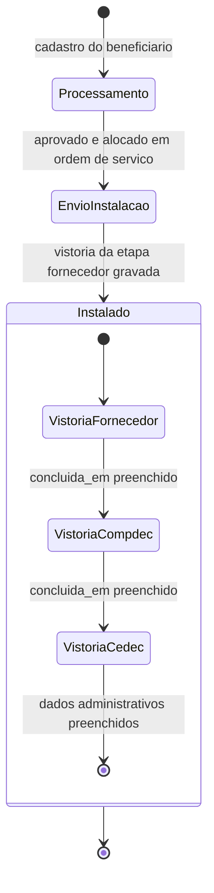

# Modulo CISTERNA — Migracao do Legado para o NewSDC

**Data:** 2026-08-10
**Status:** Design aprovado, pendente de revisao final
**Origem:** legados `sdc` (Laravel) e `gestaocedec` (PHP puro)
**Destino:** `NewSDC/SDC` — `app/Modules/Cisterna`

---

## 1. Contexto e levantamento

### 1.1 Onde o modulo realmente vive

| Repositorio | Contribuicao | Volume |
|---|---|---|
| `gestaocedec` (PHP puro) | Nao tem o modulo. Apenas as flags de permissao `mod_cisterna`, `mod_cisterna_view`, `mod_cisterna_edit`, `mod_cisterna_del` (`core/classe/Classe.Usuario.php:1588`, `core/classe/Classe.LoginExterno.php:1011`) e o tipo de material 9 = "Cisterna" no saldo da Ajuda Humanitaria (`mod_ajuda/classe/Classe.Saldo.php:269`), que e outro dominio. | ~4 referencias |
| `sdc` (Laravel legado) | Modulo completo. | ~3.328 linhas, 9 tabelas do modulo + 1 residual |
| `NewSDC/SDC` | `app/Modules/Cisterna` existente e um scaffold com dominio inventado, sem relacao com o legado. | ~841 linhas |

### 1.2 Inventario do legado `sdc`

**Controllers**

| Arquivo | Linhas | Papel |
|---|---|---|
| `app/Http/Controllers/Ajuda/CisternaController.php` | 1.925 | Nucleo: CRUD do beneficiario, filtros por perfil, os 3 relatorios, QR Code, export, acoes em massa, menu de indicadores |
| `app/Http/Controllers/Ajuda/CisternaComController.php` | 269 | CRUD de comunidades |
| `app/Http/Controllers/Ajuda/CisternaOrdemServicoController.php` | 128 | CRUD de ordens de servico + agregacao de logs |
| `app/Http/Controllers/Ajuda/NotificacaoFiscalizacaoController.php` | 114 | Notificacoes de fiscalizacao |
| `app/Http/Controllers/Ajuda/CisternaLotesController.php` | 55 | CRUD de lotes |
| `app/Http/Controllers/Auth/Api/CisternaController.php` | 269 | **100% comentado — codigo morto, nao sera portado** |
| `app/Exports/ExportCisterna.php` | 160 | Export Excel de 39 colunas |

**Tabelas**

| Tabela | Papel | Situacao local |
|---|---|---|
| `sinc_cisterna` | Cadastro socioeconomico do beneficiario | Ausente localmente |
| `sinc_cisterna_com` | Comunidades por municipio | `dbsdc`, 225 linhas |
| `sinc_cisterna_old` | Residual: schema anterior do cadastro, fora do modulo | `dbsdc`, 2.577 linhas |
| `sinc_cisterna_lotes` | Lotes de contratacao | Ausente localmente |
| `sinc_cisterna_ordem_servico` | OS dentro do lote | Ausente localmente |
| `sinc_cisterna_rel_fornecedor` | Relatorio de instalacao do fornecedor | Ausente localmente |
| `sinc_cisterna_rel_compdec` | Conferencia da COMPDEC | Ausente localmente |
| `sinc_cisterna_rel_cedec` | Fiscalizacao da CEDEC | Ausente localmente |
| `sinc_cisterna_notificacoes` | Notificacoes de fiscalizacao | Ausente localmente |
| `sinc_cisterna_relatorio` | Consolidado de 89 campos, sem rota nem controller | **Duplicata morta — descartada** |

### 1.3 O scaffold existente no NewSDC nao e o legado

`app/Modules/Cisterna` modela `codigo`, `capacidade_litros`, `tipo` (`comunitaria|individual|escolar`) e `status` (`ativa|pendente|inativa|em_obras`). O legado modela cadastro de beneficiario e fiscalizacao de instalacao. Sao dominios distintos.

**Decisao:** o scaffold e aposentado e o modulo reconstruido fiel ao legado.

Artefatos do scaffold a remover ou reescrever:

- `database/migrations/2026_05_08_140000_create_cisternas_table.php` — **consolidada** na nova migration do dominio (regra de ouro 9), nao empilhada
- `app/Modules/Cisterna/Enums/TipoCisterna.php`, `StatusCisterna.php`
- `app/Modules/Cisterna/DTOs/CisternaDTO.php`
- `app/Modules/Cisterna/Models/Cisterna.php`
- `app/Modules/Cisterna/Resources/CisternaResource.php`, `CisternaIndexResource.php`
- `app/Modules/Cisterna/Requests/StoreCisternaRequest.php`, `UpdateCisternaRequest.php`
- `app/Modules/Cisterna/Services/CisternaService.php`
- `app/Modules/Cisterna/Controllers/CisternaController.php`
- `database/factories/CisternaFactory.php`
- `resources/js/Pages/Cisterna/{Index,Create,Edit,Show}.vue`
- `resources/js/Templates/Cisterna/{CisternaFormTemplate,CisternaIndexTemplate}.vue`
- `resources/js/Components/Organisms/Cisterna/{CisternaForm,CisternaTable,CisternaFiltersSection,CisternaStatsCards}.vue`
- `resources/js/Components/Molecules/Cisterna/{StatusCisternaBadge,TipoCisternaBadge}.vue`

Preservado do scaffold: `CisternaServiceProvider`, `app/Policies/CisternaPolicy.php` (reescrita), o grupo `CISTERNAS` em `config/permissions.php` (expandido), `routes/modules/cisterna.php` (reescrito) e a adesao a `Rastreavel` + `TrilhaDeAcoes`.

---

## 2. Regras de negocio extraidas do legado

### 2.1 Dois ciclos de vida ortogonais

O legado tem duas colunas de estado que **nao se sobrepoem**: uma e analise documental, a outra e execucao fisica. Um beneficiario aprovado pode estar em Processamento; um em Ressalva pode ja estar Instalado. Ambas sao preservadas.

`aprovado` (`CisternaController.php:1230`) → `situacao_analise`

| Legado | Novo | Rotulo |
|---|---|---|
| 0 | `em_edicao` | Em Edicao |
| 1 | `aprovado` | Aprovado |
| 2 | `reprovado` | Reprovado |
| 3 | `ressalva` | Ressalva |
| 4 | `desconsiderado` | Desconsiderar Cadastro |
| 5 | `duplicado` | Duplicado |

`estado` (`CisternaController.php:48`) → `situacao_obra`

| Legado | Novo | Rotulo |
|---|---|---|
| 0 | `processamento` | Processamento |
| 1 | `envio_instalacao` | Envio Instalacao |
| 2 | `instalado` | Instalado |

Transicao automatica preservada: ao criar o relatorio do fornecedor, `situacao_obra` vai para `instalado` (`CisternaController.php:1681`).

### 2.2 Validacoes do cadastro do beneficiario

De `store()` (`CisternaController.php:665-785`) e `update()` (`CisternaController.php:1275-1316`):

- CPF unico. No legado a unicidade e verificada por `count()` em PHP antes do insert (`CisternaController.php:659`) — **race condition**. No novo: `UNIQUE` no banco.
- `data_nascimento` entre 1910-01-01 e hoje menos 18 anos (beneficiario maior de idade)
- `data_nascimento_crianca` obrigatoria se `possui_crianca = sim`, e deve ser posterior a hoje menos 12 anos (crianca menor de 12)
- `comprovante_deficiencia` obrigatorio se `possui_deficiencia = sim` (pdf/jpg/jpeg/png, 2 MB)
- `comprovante_chefia_mulher` obrigatorio se `chefiada_mulher = sim` (pdf/jpg/jpeg/png, 2 MB)
- `comprovante_observacao` opcional (pdf/jpg/jpeg/png, 2 MB)
- No `update`, o comprovante volta a ser opcional se ja existe arquivo salvo; e apagado quando a resposta muda para `nao`
- Renda e renda per capita chegam mascaradas (`R$ 0.000,00`) e sao normalizadas por closure no controller; medidas usam virgula decimal. No novo, a normalizacao vai para o FormRequest via `prepareForValidation`.
- Fotos do imovel: jpeg/png/jpg, 3 MB, com observacao de ate 262 caracteres cada (`CisternaController.php:1063-1148`)

### 2.3 Cadeia de vistoria

```
fornecedor  ->  compdec  ->  cedec
```

- O fornecedor cria o relatorio de instalacao com `numero_instalacao` (numero do QR Code), fotos em pares e assinatura do engenheiro. Ao gravar, o legado cria automaticamente a linha vazia do COMPDEC (`CisternaController.php:1682`).
- A COMPDEC confere item por item, com metragens de calha/tubulacao e contagem de fixacao, e assina.
- A CEDEC fiscaliza e acrescenta os dados administrativos: `processo_sei`, `contrato`, `empenho`, `placa_obras`, `art`.
- Marcador de conclusao no legado: `crea_mg` preenchido e diferente de vazio (`CisternaController.php:443-452`). No novo: `concluida_em`.

### 2.4 Os 13 itens de instalacao

`cisterna_logo`, `sucao`, `bomba`, `placa`, `calha`, `tubulacao`, `fixacao`, `filtro`, `bloco`, `te_pvc`, `joelho_pvc`, `luva_pvc`, `cap_pvc`.

Aparecem nas tres tabelas de relatorio como combinacoes inconsistentes de booleano, quantidade e foto: `calha_metros` no COMPDEC, `qtd_calha` no fornecedor, `calha_opcao` (`sim|nao`) tambem no fornecedor. `fixacao` no COMPDEC ainda se desdobra em `fix_abracadeira`, `fix_bucha`, `fix_parafuso`.

### 2.5 Visibilidade por perfil

De `index()` e `aplicarFiltros()` (`CisternaController.php:54-508`):

| Perfil no legado | Regra | Equivalente no NewSDC (secao 10.2) |
|---|---|---|
| `tipo = cedec` | Ve todos os municipios com `at_cisterna = 1` | orgao principal com `TipoOrgao::CEDEC` |
| `tipo = compdec` | Restrito ao proprio municipio (`user->municipio_id`); a lista inclui o `codmundv 3104452` fixo | orgao principal com `TipoOrgao::COMPDEC`, territorio em `compdec_orgaos.municipio_id`; o literal 3104452 sai (defeito C11) |
| `tipo = externo` + role `cisterna_fornecedor` | Somente registros com `situacao_obra` em `envio_instalacao` ou `instalado`; pode filtrar por `numero_instalacao` | nova role funcional `cisterna_fornecedor`, sem escopo territorial |

O legado repete essas condicoes em quatro metodos (`index`, `rank`, `aplicarFiltros`, `menu`). No novo, ficam em escopos do `BeneficiarioService` e nas policies.

### 2.6 Filtros da listagem

`comunidade` (multiplo), `situacao_analise`, `situacao_obra`, `lotes` (por `ordem_servico_id`), `cpf` (parcial), `atendPipa`, `ranqueamento`, `search` (nome), `municipio`, `numero_instalacao`, e os tres marcadores de etapa `validFornecedor` / `validCompdec` / `validCedec`.

### 2.7 Acoes em massa

`updateEstadoMass()` (`CisternaController.php:1473`): `adicionar_lote`, `remover_lote`, `alterar_estado`.

### 2.8 QR Code

- URL publica `cisterna/qrcode/{numero_instalacao}` mostra a ficha do beneficiario
- PDF individual e PDF em lote a partir de ids selecionados
- Geracao de folhas de QR Codes vazios por faixa, com teto de 1.700 por chamada

### 2.9 Export

39 colunas, geradas com `maatwebsite/excel` em `.xlsx`, `ShouldQueue` + `WithChunkReading` (1.000 linhas), com o `situacao_analise` traduzido para rotulo. **A dependencia nao existe no NewSDC** — ver secao 5.1.

---

## 3. Decisoes de arquitetura

| # | Decisao | Justificativa |
|---|---|---|
| D1 | Substituir o scaffold pelo dominio do legado | Dominios incompativeis; o scaffold nao tem dados nem usuarios reais |
| D2 | ETL completo dos dados de producao | O NewSDC substitui o legado; historico precisa acompanhar |
| D3 | Portar regra, corrigir defeito | Regras de negocio preservadas; defeitos tecnicos corrigidos e documentados na secao 6 |
| D4 | Backend + ETL nesta entrega; frontend em fase seguinte | Dominio verificado antes de investir nas telas |
| D5 | Unificar os 3 relatorios em `cisterna_vistorias` + `etapa` | Sao etapas do mesmo documento; elimina a consulta de 3 `whereHas` |
| D6 | Arquivos via Spatie MediaLibrary | `^11.10` ja instalado e em uso em 6 models; tabela `media` ja polimorfica |
| D7 | Checklist de itens em tabela polimorfica unica | Colapsa ~87 colunas repetidas em 3 tabelas |
| D8 | Fase de conferencia de DDL antes de escrever o ETL | O schema das 7 tabelas novas foi derivado de `$fillable` e validacoes, nao de DDL real |
| D9 | Manter os dois eixos de situacao | Sao ortogonais, nao redundantes |
| D10 | Sem split 1:1 do bloco socioeconomico | Split 1:1 adiciona join sem ganho; Postgres lida bem com a largura |
| D11 | Pastas seguem o padrao vigente: `Requests/` e `Resources/` na raiz, policies em `app/Policies/`, sem `Http/`, sem `Exports/` | 9 dos 20 modulos usam a forma plana contra 2 que usam `Http/`; nenhum modulo tem `Policies/` proprio (secao 5.1) |
| D12 | Export em csv streamado, nao xlsx | `maatwebsite/excel` nao existe no NewSDC; 8 metodos `export(): StreamedResponse` sao o padrao. Muda o formato entregue ao usuario — pendencia registrada |
| D13 | `jsonb` restrito ao que e variavel ou snapshot; o resto relacional | 55 usos de `jsonb` contra 5 de `json` no projeto. O caminho oposto do modulo Rat custou duas migrations so de indice (secao 4.7) |
| D14 | ETL em duas etapas: landing em `cisterna_legado_raw.doc jsonb`, depois refino | A extracao deixa de depender do DDL de producao, reduzindo o bloqueio da fase 0 apenas a etapa de mapeamento. Padrao de `ExtrairLegadoAjuCommand` -> `RefinarLegadoAjuCommand` |
| D15 | Sem `RanqueamentoService`: `ranqueamento_ordem` e coluna importada e ordenavel | Nao existe calculo de ranqueamento no legado — a rota do relatorio aponta para metodo inexistente. Inventar a regra seria feature nova disfarcada de porte (secao 10.1) |
| D16 | Perfil institucional vem de `compdec_orgaos.tipo` (`TipoOrgao`), territorio de `compdec_orgaos.municipio_id` | `users.tipo` e `users.municipio_id` nao existem no NewSDC; as roles sao funcionais, nao institucionais (secao 10.2) |
| D17 | Fornecedor externo entra como nova role funcional `cisterna_fornecedor`, nao como `TipoOrgao` novo | Fornecedor e contratado, nao orgao de defesa civil. Coerente com as roles do NewSDC serem funcionais (secao 10.2) |
| D18 | `at_cisterna` nao e duplicado: scope `Municipio::habilitadosCisterna()` faz join em `cedec_municipio` por `Codmundv = codigo_ibge` | `cedec_municipio` ja e a ponte oficial de municipio do legado, e o flag ja mora la (secao 10.3) |
| D19 | Disco de leitura dedicado `legado_cisterna`; destino e o disco padrao do MediaLibrary | Mesmo molde de `legado_rat`. Nenhum caminho de arquivo contendo CPF (secao 10.6) |
| D20 | CPF com **indice unico parcial**, nao unique puro: `WHERE situacao_analise <> 'duplicado'` | Producao tem 492 CPFs repetidos, 485 marcados como Duplicado — o legado usa esse status como tombstone. Unique puro rejeitaria 511 linhas legitimas (secao 4.6.5) |
| D21 | O refino **deduplica** as vistorias por `cisterna_id`, mantendo a linha mais completa | 65 relatorios de fornecedor e 17 de CEDEC sao double-submit do mesmo formulario, com a mesma data e o mesmo numero. Sem dedup, `UNIQUE (beneficiario_id, etapa)` rejeita todos (secao 4.6.6) |
| D22 | O refino marca `at_cisterna = 1` nos 55 municipios com beneficiario | O flag esta zerado no Postgres (0 de 854): sem isso todo select de municipio do modulo sobe vazio (secao 4.6.9-E) |
| D23 | `sinc_cisterna_relatorio_cedec` nao e portada | 2 linhas, sem model, controller ou rota no legado. Estrutura recente e mais rica que a `rel_cedec` em uso — decidir com a area se e o futuro do formulario (secao 4.6.9-A) |
| D24 | Quantidade do fornecedor: le `qtd_*` e cai para `*_metros` | A tabela tem os dois pares de colunas, de geracoes diferentes do formulario (secao 4.6.9-B) |
| D25 | Os 26 CPFs colidentes fora dos tombstones se dividem por **similaridade de nome**: 22 viram `duplicado`, 4 nao sao importados | Comparando os nomes, 4 dos 26 sao **pessoas diferentes com o mesmo CPF** — erro de digitacao, nao duplicidade. Marcar `ISABEL ALVES SEPO` como duplicata de `DOUGLAS SOARES BARBOSA` apagaria uma beneficiaria real. Detalhe e os 4 casos em `docs/superpowers/notas/2026-08-10-cisterna-ddl-legado.md` secao 5.1 |

---

## 4. Modelagem de dados

### 4.1 Diagrama ER

```mermaid
erDiagram
    municipios ||--o{ cisterna_comunidades : "possui"
    municipios ||--o{ cisterna_beneficiarios : "localiza"
    cisterna_comunidades ||--o{ cisterna_beneficiarios : "agrupa"

    cisterna_lotes ||--o{ cisterna_ordens_servico : "contem"
    cisterna_ordens_servico ||--o{ cisterna_beneficiarios : "aloca"

    cisterna_beneficiarios ||--o{ cisterna_atendimentos_pipa : "declara"
    cisterna_beneficiarios ||--o{ cisterna_vistorias : "recebe"

    cisterna_vistorias ||--o{ cisterna_itens_conferidos : "confere (morph)"
    cisterna_beneficiarios ||--o{ cisterna_notificacoes : "notificavel (morph)"
    cisterna_vistorias ||--o{ cisterna_notificacoes : "notificavel (morph)"

    cisterna_beneficiarios ||--o{ media : "model (morph)"
    cisterna_vistorias ||--o{ media : "model (morph)"
    cisterna_notificacoes ||--o{ media : "model (morph)"
    cisterna_ordens_servico ||--o{ media : "model (morph)"

    users ||--o{ cisterna_beneficiarios : "cadastrou"
    users ||--o{ cisterna_vistorias : "registrou"
    users ||--o{ cisterna_notificacoes : "emitiu"

    municipios {
        bigserial id PK
        varchar nome
        varchar codigo_ibge UK "7 digitos, ponte do ETL"
        char uf
    }

    cisterna_comunidades {
        bigserial id PK
        bigint municipio_id FK
        varchar nome "70"
        boolean ativa
        bigint legacy_id UK "sinc_cisterna_com.id"
        timestamptz created_at
        timestamptz updated_at
    }

    cisterna_lotes {
        bigserial id PK
        varchar nome "255"
        date data
        text observacao
        bigint legacy_id UK
        timestamptz created_at
        timestamptz updated_at
        timestamptz deleted_at
    }

    cisterna_ordens_servico {
        bigserial id PK
        bigint lote_id FK
        varchar nome "255"
        text observacao
        bigint legacy_id UK "link_doc vira collection documento_os"
        timestamptz created_at
        timestamptz updated_at
        timestamptz deleted_at
    }

    cisterna_beneficiarios {
        bigserial id PK
        char cpf UK "char 11 normalizado"
        varchar nome "150"
        varchar telefone "15"
        date data_nascimento "maior de 18"
        varchar cadastro_unico "12"
        bigint municipio_id FK
        bigint comunidade_id FK "nullable"
        varchar endereco "150"
        numeric latitude "10 7"
        numeric longitude "10 7"
        bigint ordem_servico_id FK "nullable, era os_id"
        varchar situacao_analise "enum 6 valores + CHECK"
        varchar situacao_analise_obs "255"
        varchar situacao_obra "enum 3 valores + CHECK"
        integer ranqueamento_ordem "nullable, indice parcial. importada, sem calculo no sistema"
        smallint qtd_pessoas
        numeric renda "12 2"
        numeric renda_per_capita "12 2"
        varchar tipo_moradia "enum + CHECK"
        varchar tipo_moradia_outro "50"
        boolean possui_deficiencia
        boolean possui_crianca
        date data_nascimento_crianca "menor de 12"
        boolean possui_idoso
        boolean chefiada_mulher
        numeric comprimento_telhado "8 2"
        numeric largura_telhado "8 2"
        numeric area_telhado "8 2"
        numeric comprimento_testada "8 2"
        smallint num_caidas_telhado
        varchar cobertura_telhado "enum + CHECK"
        varchar cobertura_outro "150"
        boolean possui_fogao_lenha
        numeric medida_telhado_area_fogao "8 2"
        numeric testada_disp_parte_fogao "8 2"
        boolean atendido_por_pipa
        varchar agente_nome "70"
        char agente_cpf "11"
        varchar engenheiro_nome "150"
        varchar engenheiro_crea "20"
        text observacoes
        bigint created_by FK
        bigint legacy_id UK "sinc_cisterna.id"
        timestamptz created_at
        timestamptz updated_at
        timestamptz deleted_at
    }

    cisterna_atendimentos_pipa {
        bigserial id PK
        bigint beneficiario_id FK
        varchar responsavel "enum 5 valores + CHECK"
        varchar descricao "255"
    }

    cisterna_vistorias {
        bigserial id PK
        bigint beneficiario_id FK
        varchar etapa "enum fornecedor compdec cedec + CHECK"
        integer numero_instalacao UK "nullable, numero do QR Code"
        varchar engenheiro_nome "150"
        varchar engenheiro_crea "30"
        varchar engenheiro_art "50"
        date data_relatorio
        varchar local_relatorio "255"
        varchar processo_sei "100"
        varchar contrato "100"
        varchar empenho "100"
        smallint placa_obras "int NOT NULL no rel_cedec de producao"
        varchar endereco "150"
        varchar bairro "100"
        numeric latitude "10 7"
        numeric longitude "10 7"
        text observacoes
        timestamptz concluida_em "nullable"
        bigint created_by FK
        bigint legacy_id "unique composto com etapa. 3 tabelas de origem"
        timestamptz created_at
        timestamptz updated_at
        timestamptz deleted_at
    }

    cisterna_itens_conferidos {
        bigserial id PK
        varchar conferivel_type "morph"
        bigint conferivel_id "morph"
        varchar item "enum 13 itens + CHECK"
        boolean conferido
        numeric quantidade "10 2, nullable"
        varchar unidade "enum un m, nullable"
        jsonb detalhes "atributos que variam por item. ver 4.7"
        text observacao
        timestamptz created_at
        timestamptz updated_at
    }

    cisterna_notificacoes {
        bigserial id PK
        varchar notificavel_type "morph"
        bigint notificavel_id "morph"
        text observacao
        boolean respondida
        timestamptz respondida_em
        bigint created_by FK
        bigint legacy_id UK
        timestamptz created_at
        timestamptz updated_at
        timestamptz deleted_at
    }

    media {
        bigserial id PK
        varchar model_type "morph"
        bigint model_id "morph"
        uuid uuid UK
        varchar collection_name
        varchar name
        varchar file_name
        varchar mime_type
        varchar disk
        bigint size
        jsonb custom_properties "item, angulo, tipo, origem_legado"
        integer order_column
    }

    cisterna_legado_raw {
        bigserial id PK
        varchar legacy_table "40. unique com legacy_id"
        bigint legacy_id
        jsonb doc "linha crua do legado. GIN jsonb_path_ops"
        timestamptz extraido_em
    }

    cisterna_etl_log {
        bigserial id PK
        varchar recurso "40"
        varchar legacy_table "40"
        bigint legacy_id
        bigint new_id
        varchar acao "20. inserted updated skipped error"
        text motivo
        jsonb payload_legado
        timestamptz created_at
    }

    users {
        bigserial id PK
        varchar name
        bigint municipio_id "escopo do perfil compdec"
    }
```



`cisterna_legado_raw` e `cisterna_etl_log` sao efemeras e **sem FK para o dominio de proposito**: a primeira e o espelho cru do legado, a segunda registra justamente as linhas que **nao** conseguiram virar registro — uma FK impediria o registro do erro. Ambas caem depois da validacao em producao, como `compdec_etl_log`.

### 4.2 Fluxo de estado da vistoria



A notificacao de fiscalizacao nao pertence a este fluxo: por ser polimorfica, pode ser emitida sobre o beneficiario ou sobre qualquer uma das tres vistorias, em qualquer momento.

### 4.3 Enums

| Enum | Casos |
|---|---|
| `SituacaoAnalise` | `em_edicao`, `aprovado`, `reprovado`, `ressalva`, `desconsiderado`, `duplicado` |
| `SituacaoObra` | `processamento`, `envio_instalacao`, `instalado` |
| `EtapaVistoria` | `fornecedor`, `compdec`, `cedec` |
| `ItemInstalacao` | `cisterna_logo`, `sucao`, `bomba`, `placa`, `calha`, `tubulacao`, `fixacao`, `filtro`, `bloco`, `te_pvc`, `joelho_pvc`, `luva_pvc`, `cap_pvc` |
| `UnidadeItem` | `un`, `m` |
| `TipoMoradia` | `propria`, `cedida`, `alugada`, `outros` — medidos em producao, com `PR?PRIA` (67 linhas, encoding corrompido) mapeando para `propria` e `0` para null (secao 4.6.3) |
| `CoberturaTelhado` | `pvc`, `ceramica`, `fibrocimento`, `zinco`, `concreto`, `metalica`, `amianto`, `outros` — medidos em producao; `0` (14 linhas) para null (secao 4.6.3) |
| `ResponsavelPipa` | `defesa_civil`, `exercito`, `particular`, `prefeitura`, `outros` |

Todos com `label()` e `options()`, no padrao dos enums atuais do modulo. `CHECK constraint` aplicada apenas em `pgsql`, seguindo a migration `2026_05_08_140000`.

### 4.4 Collections do MediaLibrary

| Model | Collection | Origem no legado | Propriedades |
|---|---|---|---|
| `CisternaBeneficiario` | `fotos_imovel` | `img_frontal`, `img_lat_direito`, `img_lat_esquerdo`, `img_fundo`, `img_local_ins_p1`, `img_local_ins_p2`, `img_op1..4` e os 10 `*_lk` do Google Drive | `angulo`, `observacao`, `origem_legado` |
| `CisternaBeneficiario` | `comprovantes` | `anexo_deficiencia`, `anexo_mulher`, `anexo_observacao` | `tipo` |
| `CisternaVistoria` | `fotos_vistoria` | 18 colunas `{item}_foto1/2` do fornecedor e 9 `{item}_foto` do COMPDEC | `item`, `sequencia` |
| `CisternaVistoria` | `assinatura_engenheiro` (singleFile) | `assinatura_eng_foto` nas 3 tabelas | — |
| `CisternaNotificacao` | `documentos` | `arquivo` | — |
| `CisternaOrdemServico` | `documento_os` (singleFile) | `link_doc` | — |

Total: **~54 colunas de arquivo eliminadas**.

### 4.5 Indices

| Tabela | Indice | Motivo |
|---|---|---|
| `cisterna_beneficiarios` | **unico parcial** `(cpf) WHERE situacao_analise <> 'duplicado' AND deleted_at IS NULL` | Substitui a checagem por `count()` em PHP. Parcial porque producao tem 492 CPFs repetidos, 485 deles marcados como Duplicado — ver secao 4.6.5 |
| `cisterna_beneficiarios` | `(municipio_id, situacao_analise)` | Listagem filtrada por perfil |
| `cisterna_beneficiarios` | `(situacao_obra)` | Filtro do fornecedor |
| `cisterna_beneficiarios` | `(ordem_servico_id)` | Filtro por lote e acoes em massa |
| `cisterna_beneficiarios` | parcial `(ranqueamento_ordem) WHERE ranqueamento_ordem IS NOT NULL` | Substitui `whereNotNull` com full scan |
| `cisterna_beneficiarios` | GIN `pg_trgm` em `nome` | Substitui `like '%termo%'` |
| `cisterna_beneficiarios` | `UNIQUE (legacy_id)` | Idempotencia do ETL |
| `cisterna_vistorias` | `UNIQUE (beneficiario_id, etapa)` | Uma vistoria por etapa. Exige que o refino deduplique os 65 double-submits de fornecedor e 17 de CEDEC — secao 4.6.6 |
| `cisterna_vistorias` | `UNIQUE (numero_instalacao)` | QR Code unico |
| `cisterna_vistorias` | `(etapa, concluida_em)` | Marcadores de etapa da listagem |
| `cisterna_vistorias` | `UNIQUE (etapa, legacy_id)` | Idempotencia do ETL: as 3 tabelas de origem tem ids independentes, `legacy_id` sozinho nao e unico |
| `cisterna_itens_conferidos` | `UNIQUE (conferivel_type, conferivel_id, item)` | Um registro por item |
| `cisterna_itens_conferidos` | `(conferivel_type, conferivel_id)` | Carga do checklist |
| `cisterna_notificacoes` | `(notificavel_type, notificavel_id, respondida)` | Pendencias por registro |
| `cisterna_comunidades` | `UNIQUE (municipio_id, nome)` | Evita duplicata de comunidade |
| `cisterna_legado_raw` | `UNIQUE (legacy_table, legacy_id)` | Idempotencia da extracao |
| `cisterna_legado_raw` | GIN `(doc jsonb_path_ops)` | Consulta ao espelho cru durante o refino e o `SELECT DISTINCT` que define os enums da fase 0 |
| `cisterna_etl_log` | `(recurso, acao)` e `(legacy_id)` | Auditoria da carga, igual a `compdec_etl_log` |

A extensao `pg_trgm` precisa ser criada na migration; se ja existir no banco, a criacao e condicional.

### 4.6 Reconciliacao com o DDL de producao

O dump `database/data/Cisternas.sql` (24 MB, 28.417 linhas, exportado de `200.198.29.227`, MySQL 8.0.31) traz **a estrutura e os dados reais de producao**. Isso resolve o bloqueio da secao 7.4 e **corrige varias premissas** deste spec, que tinham sido derivadas dos `$fillable` e das validacoes.

Analise feita importando o dump num banco isolado (`cisterna_analise`) e consultando.

#### 4.6.1 Volumes reais

| Tabela | Linhas | Engine |
|---|---|---|
| `sinc_cisterna` | **8.105** | MyISAM |
| `sinc_cisterna_com` | 885 | InnoDB |
| `sinc_cisterna_rel_compdec` | 858 | MyISAM |
| `sinc_cisterna_rel_fornecedor` | 856 | MyISAM |
| `sinc_cisterna_rel_cedec` | 675 | MyISAM |
| `sinc_cisterna_ordem_servico` | 7 | MyISAM |
| `sinc_cisterna_notificacoes` | 7 | MyISAM |
| `sinc_cisterna_lotes` | 3 | MyISAM |
| `sinc_cisterna_relatorio_cedec` | **2** | InnoDB |
| `sinc_cisterna_old` | 2.577 | residual, nao portada |

**6 das 10 tabelas sao MyISAM.** O legado nao tem uma unica FOREIGN KEY nem transacao — apenas `KEY` (indice) em `os_id`, `lote_id`, `cisterna_id` e `instalacao_id`. Toda integridade referencial era responsabilidade do PHP.

#### 4.6.2 Premissas deste spec que estavam ERRADAS

| Este spec dizia | O DDL real diz |
|---|---|
| "todas as 54 colunas sao `varchar(150)`" | Falso. `dtNasc` e `date`, `cadUnico` e `bigint`, `qtdPessoa`/`numCaidaTelhado` sao `int`, `compTelhado` e `decimal(7,2)`, `areaTotalTelhado` e `decimal(7,4)`, `respAt*` sao `tinyint(1)`. A tabela **ja e tipada** — o que era varchar(150) e o `sinc_cisterna_old`, que nao portamos |
| `estado` e um enum de 3 codigos | Confirmado nos dados (`0`=7.114, `2`=791, `1`=200), mas a coluna e `varchar(20)` |
| `aprovado` 0..5 | Confirmado, os seis valores existem. `5`=Duplicado tem **494 linhas** |
| `atendPipa` e booleano sim/nao | Falso. E `varchar(36)` e **34 linhas contem o nome do responsavel** (`prefeitura`, `respAtPrefeitura`, `respAtExercito`, `defesa civil`, `outros`) gravado na coluna do booleano |
| `renda` precisa de `numeric(12,2)` | E `float(10,0)` — **zero casas decimais**. Consulta confirma: nenhuma linha tem centavos. Os centavos foram perdidos **na origem**, nao na migracao |
| `latitude`/`longitude` precisam de normalizacao de virgula | Quase todos ja usam ponto: 7.937 com ponto, **2** com virgula, 33 vazios. Precisao de 7 casas, compativel com `numeric(10,7)` |
| `placa_obras` de semantica desconhecida | E `int NOT NULL` em `rel_cedec`. Mantido `smallint` |

#### 4.6.3 Os enums, agora com os valores reais

`moradia` (`varchar(7)`):

| Valor | Linhas | Tratamento |
|---|---|---|
| `PROPRIA` | 7.697 | `propria` |
| `PR?PRIA` | **67** | `propria` — **corrupcao de encoding**: "PRÓPRIA" nao cabe em `varchar(7)` utf8mb3 |
| `0` | 162 | null |
| `Outros` | 108 | `outros` |
| `CEDIDA` | 57 | `cedida` |
| `ALUGADA` | 14 | `alugada` |

`coberturaTelhado` (`varchar(12)`):

| Valor | Linhas |
|---|---|
| `pvc` | 4.963 |
| `ceramica` | 2.883 |
| `fibrocimento` | 157 |
| `zinco` | 39 |
| `Outros` | 22 |
| `0` | 14 → null |
| `Concreto` | 11 |
| `metalica` | 10 |
| `amianto` | 6 |

`fibrocimento` e `amianto` sao o mesmo material tecnicamente, mas os usuarios os distinguem: **dois casos separados**, nao unificar.

#### 4.6.4 Integridade referencial real — as FKs do modelo novo sao viaveis

| Relacao | Linhas | Orfaos |
|---|---|---|
| `rel_fornecedor.cisterna_id` -> `sinc_cisterna` | 856 | **0** |
| `rel_cedec.cisterna_id` -> `sinc_cisterna` | 675 | **0** |
| `rel_compdec.instalacao_id` -> `rel_fornecedor` | 858 | **2** |
| `notificacoes.cisterna_id` -> `sinc_cisterna` | 7 | **0** |
| `ordem_servico.lote_id` -> `lotes` | 7 | **0** |
| `sinc_cisterna.os_id` -> `ordem_servico` | 936 | **0** |
| `codmundv` -> `municipios.codigo_ibge` | 55 distintos | **0** |

Praticamente limpo. **Os 55 codigos IBGE do legado casam 100%** com `municipios.codigo_ibge` do NewSDC — a `PonteMunicipio` funciona sem fallback por nome.

#### 4.6.5 CPF: o `UNIQUE` do modelo era inviavel — corrigido para indice parcial

- **492 CPFs distintos aparecem repetidos, em 1.003 linhas**
- Dessas, **485 estao marcadas `aprovado=5` (Duplicado)** e 488 como `aprovado=1` (Aprovado)

O padrao e claro: o legado **nao impedia** a duplicata, ele a marcava com o status Duplicado. O par tipico e "um aprovado + um marcado como duplicado" — `aprovado=5` funciona como *tombstone*.

`UNIQUE (cpf)` puro rejeitaria ~511 linhas legitimas. **Correcao:** indice unico parcial, que o Postgres tem e o MySQL nao:

```sql
CREATE UNIQUE INDEX cisterna_beneficiarios_cpf_unq
    ON cisterna_beneficiarios (cpf)
    WHERE situacao_analise <> 'duplicado' AND deleted_at IS NULL;
```

Preserva os 485 tombstones importados, **impede cadastro novo duplicado**, e o banco passa a garantir o que o legado tentava garantir com um `count()` em PHP. Excluindo os marcados como Duplicado, **restam 26 CPFs colidindo** — duplicatas nao tratadas, que entram no `cisterna_etl_log` como `error` para a area resolver.

#### 4.6.6 Vistorias: `UNIQUE (beneficiario_id, etapa)` exige deduplicacao no ETL

| Etapa | Linhas | Beneficiarios distintos | Excedente |
|---|---|---|---|
| fornecedor | 856 | **791** | 65 |
| cedec | 675 | **658** | 17 |
| compdec | 858 | 858 instalacoes | 0 — e 1:1 perfeito com o fornecedor |

55 beneficiarios tem 2 relatorios de fornecedor e 5 tem 3. **Investigado: nao sao reinstalacoes.** Em todos os casos as copias tem o mesmo `num_instalacao` e a mesma `data_relatorio` — `DATEDIFF` entre a primeira e a ultima e **0 dia** em todos, menos um. Sao **duplicatas de double-submit do formulario**, que o legado nao prevenia. Nas copias, um dos registros costuma ter `num_instalacao` ou `data_relatorio` nulo e o outro preenchido.

**Decisao:** o refino deduplica por `cisterna_id`, mantendo a linha **mais completa** (mais campos nao nulos; `id` maior como desempate) e registrando as descartadas no `cisterna_etl_log` como `skipped`. Com isso `UNIQUE (beneficiario_id, etapa)` passa a valer, e o modelo continua correto.

Excecao a conferir com a area: `cisterna_id = 8088` tem tres relatorios com numeros `35`, `35` e `50000` em dias diferentes. `50000` esta fora de qualquer faixa plausivel — provavelmente teste.

#### 4.6.7 `numero_instalacao`: o `UNIQUE` e viavel e corrige um defeito real

- 856 linhas, **28 sem numero**, 792 numeros distintos
- Faixa real: **1 a 50.000** — o teto de 1.800 que o codigo do legado dizia impor **nao foi respeitado**
- Consulta decisiva: **nenhum numero e usado por beneficiarios diferentes.** Toda repeticao vem das duplicatas de double-submit do mesmo beneficiario

Ou seja: depois da deduplicacao da secao 4.6.6, `UNIQUE (numero_instalacao)` **nao rejeita nada** e passa a impedir o que o endpoint `check_duplicated_qrcode` tentava impedir em PHP.

Divergencia de tipo entre as tabelas: `rel_fornecedor.num_instalacao` e `int`, `rel_cedec.num_instalacao` e `varchar(50)` — a mesma informacao com dois tipos. No modelo novo e `integer` em uma coluna so.

#### 4.6.8 Comunidades homonimas: o defeito C18 medido

**75 nomes de comunidade aparecem em mais de um municipio.** Como `CisternaComunidadeController::index` contava com `leftJoin` por nome sem o municipio, esses 75 nomes tinham a contagem de cadastros somada entre municipios diferentes. O `UNIQUE (municipio_id, nome)` do modelo novo separa os pares corretamente.

#### 4.6.9 Achados novos, nao previstos neste spec

**A. `sinc_cisterna_relatorio_cedec` — uma 10a tabela, orfa de codigo.**
Nao esta em nenhum model, controller ou rota do legado (a rota `cisterna.relatorio_cedec.store` grava em `sinc_cisterna_rel_cedec`, outra tabela). E um checklist de fiscalizacao **muito mais rico** que o `rel_cedec` atual: 26 itens de conformidade, cada um com `_conforme tinyint` **e** `_obs text`, agrupados por bloco (canteiro, reservatorio, calha, tubos, protecao, bomba, gerais), mais `pendencias`, dados do representante com assinatura, e 6 colunas `*_uploads text`.

Tem **2 linhas** e e InnoDB com `CURRENT_TIMESTAMP` — estrutura recente. E um formulario novo comecado e nao concluido, ou preenchido por fora do sistema. **Nao portada nesta entrega**, mas registrada: se e para onde a fiscalizacao da CEDEC esta indo, o modelo de `cisterna_itens_conferidos` ja acomoda (item + conferido + observacao), bastando ampliar o enum `ItemInstalacao` e acrescentar um agrupador.

**B. `rel_fornecedor` tem quantidade em duplicidade.**
A tabela tem `calha_metros decimal(8,2)` **e** `qtd_calha decimal(20,6)`; `tubulacao_metros decimal(8,2)` **e** `qtd_tubulacao decimal(20,6)`. Dois pares de colunas para a mesma medida, de gerações diferentes do formulario. `decimal(20,6)` para metros de calha e precisao absurda. No modelo novo e uma coluna `quantidade numeric(10,2)`; o refino le a coluna preenchida, preferindo `qtd_*` (a mais nova) e caindo para `*_metros`.

**C. `rel_cedec` nao tem indice em `cisterna_id`.**
Só `PRIMARY KEY (id)`. Toda busca de fiscalizacao por cisterna era full scan em 675 linhas — pequeno hoje, mas o `whereHas` da listagem fazia isso por pagina.

**D. `anexo_observacao varchar(255) NOT NULL` sem default.**
Obriga string vazia quando nao ha anexo. No modelo novo e ausencia de media na collection.

**E. `at_cisterna` esta ZERADO no Postgres do NewSDC.**
`SELECT COUNT(*) FILTER (WHERE at_cisterna = 1) FROM cedec_municipio` retorna **0 de 854**. O `Municipio::habilitadosCisterna()` da secao 10.3 devolveria **lista vazia**, e todo select de municipio do modulo ficaria em branco.

O dado e derivavel: os **55 municipios** que tem beneficiario no legado sao exatamente os habilitados. **Decisao:** o refino do ETL marca `at_cisterna = 1` nos municipios presentes em `sinc_cisterna`, e invalida o cache do scope ao final. Sem isso o modulo sobe vazio.

**F. `sinc_cisterna` tem colunas que este spec ignorava.**
`id_cad int` (id do cadastro no app mobile), `dt_cadastro varchar(26)`, `localiza varchar(25)`, `user_id int`, `municipio_id int NOT NULL` (id legado, nao o do NewSDC), e **duas** colunas de observacao: `obs1 varchar(646)` e `outrObs varchar(255)`. O refino importa `outrObs` como `observacoes`; `obs1` vai junto quando `outrObs` for nulo. `id_cad`, `dt_cadastro` e `localiza` **nao sao portados** — ficam preservados no `cisterna_legado_raw.doc`.

### 4.7 Politica de jsonb

O projeto usa **`jsonb`, nunca `json`** — 55 ocorrencias de `$table->jsonb(` contra 5 de `->json(` nas migrations. `jsonb` e binario, deduplica chaves, suporta indice GIN e os operadores `@>` / `?` / `jsonb_path_query`; `json` guarda o texto cru e nao indexa. Toda coluna semiestruturada deste modulo e `jsonb`.

**Onde jsonb entra**

| Coluna | Motivo | Precedente no projeto |
|---|---|---|
| `cisterna_legado_raw.doc` | Espelho cru do legado antes do refino. Nao precisa conhecer o schema de producao, o que remove o bloqueio da fase 0 da etapa de extracao. GIN `jsonb_path_ops`. | `ajuda_h_legado_raw.doc` |
| `cisterna_etl_log.payload_legado` | Linha de origem anexada ao registro de erro, para reprocessar sem voltar ao legado. | `compdec_etl_log.payload_legado` |
| `cisterna_itens_conferidos.detalhes` | Atributos que **variam por item**: `fixacao` no COMPDEC tem `fix_abracadeira`, `fix_bucha` e `fix_parafuso` — tres subquantidades que nao cabem numa unica coluna `quantidade`. Ver nota abaixo. | `tasks.campos_customizados` |
| `media.custom_properties` | Dado do Spatie MediaLibrary; guarda `item`, `angulo`, `tipo` e `origem_legado`. | ja existente |

Uma coluna `ranqueamento_detalhe jsonb` chegou a ser proposta para guardar o snapshot dos criterios de pontuacao, mas foi **retirada**: nao existe calculo de ranqueamento no legado (lacuna L1), logo nao ha criterio nenhum para snapshotar.

**Nota sobre `detalhes` — corrige uma lacuna do modelo anterior**

A tabela `cisterna_itens_conferidos` com uma unica coluna `quantidade` nao conseguia representar o item `fixacao`, que no legado se desdobra em tres campos (`fix_abracadeira`, `fix_bucha`, `fix_parafuso` — `CisternaController.php:1763-1765`). As alternativas eram criar tres itens novos no enum, poluindo-o com subcomponentes, ou tres colunas nullable usadas por um item so. `detalhes jsonb` resolve sem nenhum dos dois: `{"abracadeira": "12", "bucha": "12", "parafuso": "24"}` para `fixacao`, `null` para os outros doze itens.

**Onde jsonb NAO entra, e por que**

| Tentacao | Por que fica relacional |
|---|---|
| Bloco socioeconomico do beneficiario em um `dados_sociais jsonb` | Alimenta os filtros da listagem e as 39 colunas do export. Em jsonb, cada filtro viraria expressao sobre path, sem indice btree. |
| `cisterna_itens_conferidos` inteira como `itens jsonb` na vistoria | Mata as agregacoes que a fiscalizacao usa — "quantas instalacoes tiveram bomba reprovada por municipio" — e perde o `UNIQUE (conferivel, item)`. Sao ~39 linhas por beneficiario, ~100 mil no total: volume trivial para o Postgres. |
| Snapshot de endereco da vistoria como `endereco jsonb` | `latitude` e `longitude` precisam ser `numeric` para calculo e para o mapa. |
| Campos administrativos do CEDEC em `dados_administrativos jsonb` | `processo_sei` e campo de busca. |

O modulo `Rat` seguiu o caminho oposto e modelou quase tudo em `jsonb` (`dados_gerais`, `local`, `endereco`, `comunicacao`, `recursos`, `envolvidos`, `vistoria`, `historico`, `anexos`). Nao seguimos esse precedente aqui: a consequencia la foi precisar de duas migrations posteriores so de indice (`2026_03_25_120000`, `2026_06_08_000001`). Neste modulo, jsonb fica restrito ao que e **realmente variavel ou realmente snapshot**.

**Casts nos models**

Colunas `jsonb` recebem cast `'array'` nos models (ou `AsArrayObject` quando houver escrita parcial), como nos models que ja usam jsonb no projeto. `detalhes` e nullable e nunca le chave inexistente sem default.

---

## 5. Estrutura do modulo

### 5.1 Padrao de pastas vigente no projeto

Levantamento dos 20 modulos em `app/Modules`:

| Convencao | Modulos | Veredito |
|---|---|---|
| `Requests/` e `Resources/` na raiz do modulo | AjudaHumanitaria, Cisterna, Compdec, Decretacoes, Pae, PlanCon, Pmda, Suporte, Tdap | **Padrao** (9 modulos) |
| `Http/Requests/` e `Http/Resources/` | Rat, Treinamento | Excecao (2 modulos) |
| Policies dentro do modulo | nenhum | **Nao existe no projeto** |
| Policies em `app/Policies/` com `BasePolicy` | 19 policies, incluindo a `CisternaPolicy` atual | **Padrao** |
| `Console/` dentro do modulo | AjudaHumanitaria (ETL do legado), Notificacoes | Aceito para comando de dominio |
| `Exports/` | nenhum; `maatwebsite/excel` **nao esta instalado** | Export e CSV via `StreamedResponse` em `Controllers` + service |
| `Observers/` | Compdec, Decretacoes, Demandas, Pmda, Tdap | Aceito |

Duas correcoes em relacao a arvore inicialmente proposta, para nao criar padrao novo:

- `Policies/` **nao** fica no modulo. As 8 policies vao para `app/Policies/`, ao lado das outras 19, herdando `BasePolicy`.
- `Exports/BeneficiariosExport.php` **nao** existe. `maatwebsite/excel` nao esta no `composer.json` do NewSDC, enquanto o legado exporta `.xlsx` com ele. O padrao daqui e CSV streamado (`AjudaHumanitaria`, `Decretacoes`, `Demandas` — 8 metodos `export(): StreamedResponse`). Vira `Services/BeneficiarioExportService.php` + `BeneficiarioController::export()`. **Isso muda o formato do arquivo entregue ao usuario, de xlsx para csv** — se a area exigir xlsx, e preciso adicionar a dependencia, e essa decisao fica registrada como pendencia da fase 1.

### 5.1.1 Dependencias que o legado usa e o NewSDC nao tem

| Legado | Uso | Situacao no NewSDC | Decisao |
|---|---|---|---|
| `maatwebsite/excel` | Export de 39 colunas em `.xlsx` | ausente | CSV streamado, padrao do projeto (acima) |
| `simplesoftwareio/simple-qrcode` | Geracao do SVG do QR Code | ausente, mas **`endroid/qr-code ^5.1` esta instalado** e em uso em `Treinamento\Services\GeradorQrCodeService` | Reescrever sobre Endroid, seguindo o precedente |
| `barryvdh/laravel-dompdf` | 3 features de PDF: QR individual, QR em lote e folhas de QR vazios | **ausente, e o projeto nao tem nenhuma biblioteca de PDF** — nem dompdf, nem snappy, nem mpdf, nem Browsershot; nao existe uma unica chamada `Pdf::loadView` no codigo | Ver abaixo |

**As tres features de PDF de QR Code ficam fora desta entrega.** `QrCodeService` gera PNG e SVG via Endroid, e a ficha publica lida pelo QR continua sendo pagina web, como no legado. A impressao em lote — que e o uso real: folhas de adesivos para colar nas cisternas — exige escolher e introduzir uma biblioteca de PDF no projeto, decisao que extrapola o porte deste modulo e afeta todo o NewSDC. Fica registrada como pendencia, com a nota de que **e uma perda de funcionalidade em relacao ao legado** e precisa ser decidida antes do corte de producao.

### 5.2 Estrutura

```
app/Modules/Cisterna/
  CisternaServiceProvider.php
  Console/
    ExtrairCisternaLegadoCommand.php  landing do legado em cisterna_legado_raw
    RefinarCisternaLegadoCommand.php  raw jsonb -> tabelas do dominio
  Controllers/
    BeneficiarioController.php        CRUD, listagem, acoes em massa, export
    VistoriaController.php            as 3 etapas
    ComunidadeController.php
    LoteController.php
    OrdemServicoController.php
    NotificacaoFiscalizacaoController.php
    QrCodeController.php              ficha publica, PDF individual, PDF em lote
  DTOs/
    BeneficiarioDTO.php  VistoriaDTO.php  ItemConferidoDTO.php
    ComunidadeDTO.php  LoteDTO.php  OrdemServicoDTO.php  NotificacaoDTO.php
  Enums/
    SituacaoAnalise.php  SituacaoObra.php  EtapaVistoria.php  ItemInstalacao.php
    UnidadeItem.php  TipoMoradia.php  CoberturaTelhado.php  ResponsavelPipa.php
  Models/
    CisternaBeneficiario.php          InteractsWithMedia, TrilhaDeAcoes, SoftDeletes
    CisternaVistoria.php              InteractsWithMedia, TrilhaDeAcoes, SoftDeletes
    CisternaComunidade.php
    CisternaLote.php
    CisternaOrdemServico.php          InteractsWithMedia
    CisternaItemConferido.php
    CisternaNotificacao.php           InteractsWithMedia
    CisternaAtendimentoPipa.php
  Observers/
    CisternaVistoriaObserver.php      avanca situacao_obra ao gravar etapa fornecedor
  Requests/
    StoreBeneficiarioRequest.php      UpdateBeneficiarioRequest.php
    StoreVistoriaRequest.php          UpdateVistoriaRequest.php
    StoreComunidadeRequest.php        UpdateComunidadeRequest.php
    StoreLoteRequest.php              UpdateLoteRequest.php
    StoreOrdemServicoRequest.php      UpdateOrdemServicoRequest.php
    StoreNotificacaoRequest.php       UpdateNotificacaoRequest.php
    AcaoEmMassaRequest.php
  Resources/
    BeneficiarioIndexResource.php     BeneficiarioResource.php
    VistoriaResource.php              ComunidadeResource.php
    LoteResource.php                  OrdemServicoResource.php
    NotificacaoResource.php
  Services/
    BeneficiarioService.php           listagem com escopo por perfil, CRUD, acoes em massa
    BeneficiarioExportService.php     CSV streamado, 39 colunas do legado
    VistoriaService.php               cadeia fornecedor -> compdec -> cedec
    NumeracaoInstalacaoService.php    aloca numero de QR sem race condition
    QrCodeService.php                 SVG, PDF individual, PDF em lote, folhas vazias
    ComunidadeService.php
    LoteService.php
    OrdemServicoService.php           CRUD + timeline() do lote, ver secao 10.5
    NotificacaoFiscalizacaoService.php
```

`StoreVistoriaRequest` unico, com as regras por etapa resolvidas em `rules()` a partir de `EtapaVistoria` — as tres etapas compartilham engenheiro, data, local e checklist; so os campos administrativos do CEDEC divergem. Tres Requests separados duplicariam ~30 regras.

Fora do modulo, seguindo o que ja existe:

- `app/Policies/` — `CisternaBeneficiarioPolicy`, `CisternaVistoriaPolicy`, `CisternaComunidadePolicy`, `CisternaLotePolicy`, `CisternaOrdemServicoPolicy`, `CisternaNotificacaoPolicy`, todas herdando `BasePolicy`. A `CisternaPolicy.php` atual e substituida por `CisternaBeneficiarioPolicy`.
- `config/permissions.php` — grupo `CISTERNAS` expandido em subgrupos `Beneficiarios`, `Comunidades`, `Lotes`, `OrdensServico`, `Vistorias`, `Notificacoes`, cada um com `view`/`create`/`edit`/`delete` e `export` onde couber
- `routes/modules/cisterna.php` — reescrito
- `database/migrations/` — migrations do dominio, com a `2026_05_08_140000_create_cisternas_table` consolidada
- `database/factories/` — factories dos 8 models, no lugar da `CisternaFactory` atual
- `app/Models/Municipio.php` — novo scope `habilitadosCisterna()`, join em `cedec_municipio` por `Codmundv = codigo_ibge` com `at_cisterna = 1`, cacheado no padrao de `catalogo()` (secao 10.3)
- `config/filesystems.php` — disco de leitura `legado_cisterna`, molde de `legado_rat` (secao 10.6)

### 5.3 Isolamento e responsabilidade

### 5.4 Isolamento e responsabilidade

| Unidade | Faz | Depende de |
|---|---|---|
| `BeneficiarioService` | Listagem com escopo por perfil, CRUD, acoes em massa | `CisternaBeneficiario`, `BeneficiarioDTO` |
| `VistoriaService` | Cria e avanca a cadeia de etapas, grava itens conferidos e fotos | `CisternaVistoria`, `NumeracaoInstalacaoService` |
| `NumeracaoInstalacaoService` | Aloca o proximo `numero_instalacao` de forma atomica | sequence Postgres |
| `QrCodeService` | Gera SVG, PDF individual, PDF em lote e folhas vazias | `CisternaVistoria` |
| `NotificacaoFiscalizacaoService` | Emite notificacao polimorfica e dispara o modulo `Notificacoes` | `CisternaNotificacao`, `TrilhaDeAcoes` |

Nenhum service conhece o `Request`; a normalizacao de mascaras (moeda, decimal com virgula, CPF) fica nos FormRequests via `prepareForValidation`.

---

## 6. Defeitos do legado e o que muda

| # | Defeito | Onde | Correcao |
|---|---|---|---|
| C1 | E-mail de notificacao para um Gmail pessoal hardcoded | `NotificacaoFiscalizacaoController.php:56` | Modulo `Notificacoes` com destinatarios por perfil |
| C2 | `numero_instalacao` limitado a `range(1, 1800)` com `array_diff` sobre todos os usados a cada abertura de formulario | `CisternaController.php:1736`, `:1518` | `NumeracaoInstalacaoService` com sequence + `UNIQUE`; sem teto artificial |
| C3 | Unicidade de CPF por `count()` em PHP antes do insert | `CisternaController.php:659` | `UNIQUE (cpf)` no banco |
| C4 | CPF com mascara em `varchar(150)` e usado como nome de diretorio no storage | `CisternaController.php:916`, `:1173` | `char(11)` normalizado; arquivos no MediaLibrary |
| C5 | `paginate(400)` com geracao de QR Code por linha dentro do `map()` | `CisternaController.php:80-98` | Paginacao padrao 25, ajustavel por `per_page` com teto de 100; QR gerado sob demanda, nunca na listagem |
| C6 | Etapa da vistoria descoberta com 3 `whereHas` aninhados | `CisternaController.php:441-457` | Join unico em `cisterna_vistorias(beneficiario_id, etapa)` |
| C7 | Tabela `sinc_cisterna_relatorio` com 89 campos, sem rota nem controller | `app/Models/Cisterna/Relatorio.php` | Descartada |
| C8 | API mobile inteira comentada | `Auth/Api/CisternaController.php` | Nao portada |
| C9 | Todas as colunas em `varchar(150)`, inclusive datas, moeda, medidas e booleanos | schema `sinc_cisterna` | Tipos reais no Postgres |
| C10 | Nome de municipio e de comunidade denormalizados em 4 tabelas | `sinc_cisterna`, `rel_fornecedor`, `rel_compdec` | FK `municipio_id` e `comunidade_id` |
| C11 | `codmundv 3104452` fixo no codigo para o perfil COMPDEC | `CisternaController.php:67`, `:349` | Configuracao, nao literal no codigo |
| C12 | Visibilidade por perfil replicada em 4 metodos | `CisternaController.php` | Escopos no service + `CisternaPolicy` |
| C13 | `storeRelatorioFinalCompdec` itera `$i = 1..2` mas usa sempre o mesmo campo `{item}_foto`, gravando o arquivo duas vezes | `CisternaController.php:1797-1806` | Iteracao correta por foto |
| C14 | `valida_cedec()` termina em `dd($request)` em rota registrada | `CisternaController.php:1910` | Removido |
| C15 | Rotas duplicadas (`cisterna.externo.fornecedor` e `validacedec` registradas duas vezes) | `routes/web.php:771-774`, `:816-818` | Rotas unicas |
| C16 | `menu()` carrega colecoes inteiras com `->get()` so para contar | `CisternaController.php:1843-1853` | Agregacao em SQL |
| C17 | `$dados` pode ficar indefinido em `menu()` quando o perfil nao e `compdec` nem `cedec` | `CisternaController.php:1856-1887` | Inicializacao explicita |
| C18 | Contagem de cadastros por comunidade joina por **nome** de comunidade, sem o municipio: homonimos em municipios diferentes somam | `CisternaComController.php:49` | Join por `comunidade_id`, com a ambiguidade resolvida no ETL (lacuna L5) |
| C19 | Rota `cisterna/relatorio/ranqueamento` aponta para metodo inexistente `CisternaController@ranqueamento` — 500 garantido | `routes/web.php:838` | Rota removida; ver lacuna L1 |
| C20 | `GET /adicionar-permissoes-compdec` concede permissoes em massa a todos os usuarios compdec | `routes/web.php:1527` | Nao portado; permissoes pelo seeder (lacuna L8) |

Cada correcao acima e um desvio deliberado do comportamento do legado e deve ser conferida com a area antes do corte de producao.

---

## 7. ETL do legado

Dois comandos, idempotentes por `legacy_id`, no padrao de `ExtrairLegadoAjuCommand` -> `RefinarLegadoAjuCommand`:

```
php artisan cisterna:extrair-legado    # legado MySQL -> cisterna_legado_raw.doc jsonb
php artisan cisterna:refinar-legado    # cisterna_legado_raw -> tabelas do dominio
```

Opcoes do refino: `--dry-run`, `--chunk=500`, `--only=comunidades|lotes|os|beneficiarios|vistorias|itens|notificacoes|midia`, `--desde=`.

Ordem de carga (respeitando FK):

1. `cisterna_comunidades` — de `sinc_cisterna_com`, resolvendo `codmundv` para `municipios.codigo_ibge`
2. `cisterna_lotes` — de `sinc_cisterna_lotes`
3. `cisterna_ordens_servico` — de `sinc_cisterna_ordem_servico`
4. `cisterna_beneficiarios` — de `sinc_cisterna`, com normalizacao de CPF, datas, moeda e medidas; `os_id` resolvido para `ordem_servico_id`
5. `cisterna_atendimentos_pipa` — explodindo os 5 `respAt*` em linhas
6. `cisterna_vistorias` — tres passes, um por tabela de relatorio, gerando uma linha com a `etapa` correspondente
7. `cisterna_itens_conferidos` — explodindo as ~87 colunas de item das 3 tabelas em linhas
8. `cisterna_notificacoes` — de `sinc_cisterna_notificacoes`
9. Midia — copia dos arquivos do storage legado para as collections do MediaLibrary; os `img_*_lk` do Google Drive tem a URL preservada em `custom_properties.origem_legado`

### 7.2 Landing em jsonb antes do refino

O ETL e de duas etapas, seguindo `ExtrairLegadoAjuCommand` -> `RefinarLegadoAjuCommand` do modulo AjudaHumanitaria:

```
cisterna_legado_raw            -- espelho cru do legado, efemera
  id            bigserial PK
  legacy_table  varchar(40)    -- sinc_cisterna, sinc_cisterna_rel_fornecedor, ...
  legacy_id     bigint
  doc           jsonb          -- a linha inteira, como veio
  extraido_em   timestamptz
  unique (legacy_table, legacy_id)
  index doc USING gin (doc jsonb_path_ops)
```

**Esta tabela e a resposta ao bloqueio da secao 7.3.** Como o DDL real das 7 tabelas de producao e desconhecido, a extracao nao precisa conhecer o schema: `SELECT *` vira `jsonb` sem mapeamento. O refino le do `jsonb`, e uma coluna inesperada em producao aparece como chave a mais no `doc` em vez de quebrar a carga. Precedente direto: `ajuda_h_legado_raw` com `doc jsonb` + GIN `jsonb_path_ops` (`2026_08_06_110000`).

Drop apos a validacao em producao, como `compdec_etl_log`.

### 7.3 Log do ETL

Mesma forma de `compdec_etl_log` (`2026_05_07_100000`), para nao inventar padrao:

```
cisterna_etl_log               -- efemera, drop apos validacao em producao
  id             bigserial PK
  recurso        varchar(40)   -- comunidades|lotes|os|beneficiarios|vistorias|itens|notificacoes|midia
  legacy_table   varchar(40)
  legacy_id      bigint
  new_id         bigint nullable
  acao           varchar(20)   -- inserted|updated|skipped|error
  motivo         text nullable
  payload_legado jsonb nullable
  created_at     timestamptz
  index (recurso, acao)
  index (legacy_id)
```

Registra as quatro acoes, nao apenas as falhas: `skipped` por idempotencia e `updated` por reprocesso sao o que permite auditar uma carga de milhares de linhas. Municipio sem correspondencia, arquivo ausente ou valor de enum desconhecido entram como `error` com o `payload_legado`, sem abortar a carga.

### 7.4 Bloqueio RESOLVIDO — o DDL de producao esta no repositorio

Este spec registrava como bloqueio o fato de as 7 tabelas novas nao existirem no MySQL local, e a estrutura ter sido derivada dos `$fillable` e das validacoes.

**O bloqueio caiu:** `database/data/Cisternas.sql` (24 MB, 28.417 linhas) e o dump de producao com estrutura **e** dados das 10 tabelas. A analise completa esta na secao 4.6, e corrigiu varias premissas erradas deste spec.

Consequencias para o ETL:

- Os enums `TipoMoradia` e `CoberturaTelhado` **ja tem seus casos definidos** (secao 4.6.3), com a frequencia de cada valor. Nao dependem mais de medicao futura.
- A fase 0 do plano deixa de ser levantamento e passa a ser **verificacao**: conferir que o dump no repositorio e o mesmo de producao, e que nao houve carga nova depois da exportacao.
- O refino ganha duas etapas obrigatorias que nao existiam: **deduplicar as vistorias** (secao 4.6.6) e **marcar `at_cisterna`** (secao 4.6.9-E).
- A extracao pode ler o dump direto em vez de conectar no MySQL de producao: `cisterna:extrair-legado --arquivo=database/data/Cisternas.sql` e uma alternativa util para rodar sem VPN.

O que **ainda** exige conferencia com a area, e nao se resolve por consulta:

1. Os **26 CPFs que colidem** mesmo fora dos marcados como Duplicado (secao 4.6.5)
2. O caso `cisterna_id = 8088`, com `num_instalacao = 50000` (secao 4.6.6)
3. O destino de `sinc_cisterna_relatorio_cedec`, com 2 linhas e sem codigo (secao 4.6.9-A)
4. Se os 55 municipios com beneficiario sao exatamente os que devem ficar habilitados

---

## 8. Testes

| Nivel | Cobertura |
|---|---|
| Unit | Enums (`label`, `options`), DTOs, `NumeracaoInstalacaoService` (incluindo alocacao concorrente), normalizacao de moeda/decimal/CPF nos FormRequests, scope `Municipio::habilitadosCisterna()` |
| Feature | CRUD de beneficiario com as validacoes de idade e anexos condicionais; cadeia de vistoria nas 3 etapas; unicidade de CPF e de `numero_instalacao`; acoes em massa; escopo por perfil nos tres casos (`TipoOrgao::CEDEC`, `TipoOrgao::COMPDEC` com territorio, role `cisterna_fornecedor`); `OrdemServicoService::timeline()`; export |
| Integracao | `cisterna:extrair-legado` e `cisterna:refinar-legado --dry-run` contra fixture, verificando idempotencia em duas execucoes seguidas e o comportamento do refino diante de uma chave inesperada no `doc jsonb` |

Factories para todos os models. Conforme o registro de testes do projeto, os testes rodam no host com PHP 8.3 do Laragon e Postgres na 5434; as migrations nao rodam em sqlite.

---

## 9. Fora de escopo desta entrega

- Telas Vue/Inertia (fase seguinte): index com filtros por perfil, formulario do beneficiario, os 3 formularios de vistoria, comunidades, lotes/OS, notificacoes, visualizacao de QR Code
- Telas de QR Code: `QrCodeService` e `QrCodeController` entram nesta fase (ficha publica, PDF individual, PDF em lote, folhas vazias), mas a tela de selecao em massa que dispara o PDF em lote vem na fase de frontend
- Portar a API mobile (codigo morto no legado)
- O tipo de material 9 = "Cisterna" do saldo da Ajuda Humanitaria no `gestaocedec` (outro dominio)
- Desativar o modulo no legado `sdc` (corte de producao, decisao operacional)

---

## 10. Lacunas de mapeamento

O que ainda **nao** foi levantado, e o peso de cada lacuna.

### 10.1 L1 — Ranqueamento: nao existe calculo no legado. RESOLVIDA

A rota `cisterna/relatorio/ranqueamento` aponta para `CisternaController@ranqueamento` (`routes/web.php:838`), e **esse metodo nao existe** — a rota da 500 (defeito C19). O unico metodo relacionado e `rank()` (`CisternaController.php:336`), que apenas renderiza a mesma listagem com `whereNotNull('ranqueamento_ordem')->orderBy('ranqueamento_ordem')`. Na interface e so um checkbox "Usar Ranqueamento", visivel para o perfil `cedec` (`index.blade.php:275`).

Conclusao: `ranqueamento_ordem` **e populada fora do sistema** — SQL manual ou processo externo. Nao existe regra de pontuacao em codigo algum.

**Decisao:** `ranqueamento_ordem` e tratada como coluna importada e ordenavel. Nao ha `RanqueamentoService` e nao ha `ranqueamento_detalhe jsonb` — ambos foram retirados da secao 5 e da secao 4.6. O calculo fica **fora de escopo**, com a nota de que hoje e manual. Se a area formalizar os criterios depois, entra como feature nova, nao como porte.

### 10.2 L2 — Perfis e escopo territorial. RESOLVIDA

O legado filtra por `user->tipo` (`cedec|compdec|externo`) e por `user->municipio_id` (`CisternaController.php:468`). Nenhum dos dois existe no NewSDC. O que existe:

| Legado | NewSDC |
|---|---|
| `users.tipo` | **nao existe.** As roles do NewSDC sao funcionais, nao institucionais: `super-admin`, `admin`, `manager`, `analyst`, `operator`, `viewer`, `user` (`config/permissions.php:26`) |
| `user->municipio_id` | **nao existe** em `users`. O vinculo e `users.orgao_principal_id` -> `compdec_orgaos.id`, mais o pivot `compdec_orgao_user` para multiplos orgaos (`User::orgaoPrincipal()`, `User::orgaos()`) |
| `tipo = cedec` / `tipo = compdec` | `compdec_orgaos.tipo`, do enum `TipoOrgao`: `cedec` \| `redec` \| `compdec` |
| territorio do usuario | `compdec_orgaos.municipio_id` (`Orgao::municipio()`) |
| `tipo = externo` + role `cisterna_fornecedor` | **sem equivalente.** Nao ha orgao de fornecedor nem role externa; no legado a autenticacao passa por `Classe.LoginExterno` no `gestaocedec` |

**Decisao:**

- A distincao institucional sai de `compdec_orgaos.tipo`, nao de role. `BeneficiarioService` recebe o `TipoOrgao` do orgao principal do usuario e o `municipio_id` dele.
- Perfil CEDEC (`TipoOrgao::CEDEC`): ve todos os municipios habilitados.
- Perfil COMPDEC (`TipoOrgao::COMPDEC`): restrito a `compdec_orgaos.municipio_id` do proprio orgao. Isso **substitui** o `codmundv 3104452` literal do legado (defeito C11).
- Fornecedor: **nova role funcional `cisterna_fornecedor`**, coerente com as roles do NewSDC serem funcionais. Nao e um `TipoOrgao` novo — fornecedor e contratado, nao orgao de defesa civil. Escopo: sem restricao territorial, mas somente `situacao_obra` em `envio_instalacao` ou `instalado`, como no legado.

### 10.3 L3 — `at_cisterna` e a tabela de municipios. RESOLVIDA

`cedec_municipio` **ja e, por definicao do projeto, a ponte de municipio do legado**. O proprio `ImportCedecMunicipioCommand` documenta: *"Essa tabela e a ponte entre o [id legado] e a tabela `municipios` do NewSDC: `cedec_municipio.Codmundv = municipios.codigo_ibge`"*. E o flag `at_cisterna tinyint` esta la (`2026_03_03_000001`).

**Decisao:** a FK canonica do modulo continua `municipios.id`; o flag **nao e duplicado**. A habilitacao vem de um scope `Municipio::habilitadosCisterna()`, que faz join em `cedec_municipio` por `Codmundv = codigo_ibge` filtrando `at_cisterna = 1`, cacheado no mesmo padrao de `Municipio::catalogo()` (memo por worker + Redis) — a lista muda raramente e alimenta select de toda tela do modulo.

Verificar na fase 0 se `cedec_municipio.at_cisterna` esta populado no Postgres, e nao apenas presente no dump `database/data/cedec_municipio.sql`.

### 10.4 L5 — Ambiguidade de comunidades homonimas. RESOLVIDA

`CisternaComController::index` faz `leftJoin('sinc_cisterna', 'sinc_cisterna.comunidade', '=', 'sinc_cisterna_com.comunidade')` e agrupa por `sinc_cisterna.comunidade`, **sem o municipio** (`CisternaComController.php:49`). Comunidades homonimas em municipios diferentes tem a contagem de cadastros somada — defeito C18.

**Decisao:** o modelo novo resolve pela FK, com `UNIQUE (municipio_id, nome)` em `cisterna_comunidades` e `comunidade_id` no beneficiario. O refino do ETL resolve a comunidade pelo par `(municipio_id, nome)`; quando o nome existir em mais de um municipio, cada par vira uma comunidade distinta — o que corrige a contagem. Beneficiario cujo nome de comunidade nao casar com nenhum par entra no `cisterna_etl_log` com `acao = error` e `comunidade_id` nulo, sem travar a carga.

A medicao de quantos homonimos existem hoje ficou pendente: o MySQL local caiu no meio da verificacao. E um `SELECT comunidade, COUNT(DISTINCT codmundv) FROM sinc_cisterna_com GROUP BY comunidade HAVING COUNT(DISTINCT codmundv) > 1`, a rodar na fase 0 sobre as 225 linhas de `sinc_cisterna_com`. O defeito esta confirmado pelo codigo; so o volume e desconhecido.

### 10.5 L6 — Timeline mesclada da ordem de servico. RESOLVIDA

`CisternaOrdemServicoController::fetchLogs` mescla os logs da propria OS com as movimentacoes de beneficiarios, achando-as por `whereJsonContains('valores_novos->os_id')` sobre `ModelActivityLog`, e enriquece cada linha com o nome do beneficiario. Responde "quem entrou e saiu deste lote".

**Decisao:** feature preservada, reimplementada sobre a `TrilhaDeAcoes` que o modulo `Notificacoes` ja fornece — ela registra alteracao campo a campo, e `CisternaBeneficiario` a usa. A timeline da OS e a uniao da trilha da propria `CisternaOrdemServico` com as entradas de trilha de beneficiarios cujo campo alterado foi `ordem_servico_id`, apontando de ou para aquela OS. Fica em `OrdemServicoService::timeline()`. Sem `whereJsonContains` com cast duplo de tipo, que era o remendo do legado para `os_id` gravado as vezes como string e as vezes como int.

### 10.6 L7 — Disco de storage. RESOLVIDA

O legado grava no disco `public` em `cisterna/{cpf}/` e `relatorios/cisterna/{form}/{id}/`.

**Decisao:** disco de **leitura** `legado_cisterna`, no mesmo molde de `legado_rat` (`config/filesystems.php:129`): driver local, `visibility: private`, `throw: false`, root de `LEGADO_CISTERNA_ANEXOS_ROOT`, usado somente pelo ETL para copiar os arquivos. O **destino** e o disco padrao do MediaLibrary, pelas collections da secao 4.4 — nenhum caminho contendo CPF, ao contrario do legado (defeito C4).

### 10.7 L8 — Rota administrativa a nao portar. RESOLVIDA

`GET /adicionar-permissoes-compdec` (`routes/web.php:1527`) percorre todos os usuarios `tipo = compdec` e concede `cisterna_edit`, `cisterna_view`, `cisterna_del`. Endpoint descartavel deixado nas rotas de producao — defeito C20. Nao portado; as permissoes vem do seeder, do grupo `CISTERNAS` de `config/permissions.php`.

### 10.8 L4 — As 22 views Blade. EM ABERTO, por escolha

7.632 linhas nao lidas: `analise.blade.php`, `create.blade.php`, `edit.blade.php`, os tres `relatorio_formulario_*`, `imagens.blade.php`, `menu.blade.php`, `relatorios.blade.php`, `view.blade.php`, `qrcode*.blade.php` e os subdiretorios `comunidade/`, `lotes/`, `notificacoes/`, `ordem_servico/`.

E onde estao os rotulos reais dos campos, as mascaras JS, os campos de exibicao condicional e o comportamento do checkbox de ranqueamento. **Nao bloqueia a fase de backend** — as regras de persistencia e validacao saem dos controllers, que foram lidos por inteiro. **Bloqueia a fase de frontend**, e a leitura completa e o primeiro passo dela.

---

## 11. Criterios de verificacao

1. `php artisan migrate:fresh` cria as 8 tabelas do dominio (`cisterna_comunidades`, `cisterna_lotes`, `cisterna_ordens_servico`, `cisterna_beneficiarios`, `cisterna_atendimentos_pipa`, `cisterna_vistorias`, `cisterna_itens_conferidos`, `cisterna_notificacoes`) mais as duas efemeras de ETL (`cisterna_legado_raw`, `cisterna_etl_log`), com todas as CHECK constraints e indices, sem residuo da tabela `cisternas` do scaffold
2. Suite de testes do modulo verde, sem regressao no baseline conhecido do projeto
3. `larastan`/`pint` sem novos apontamentos no diretorio do modulo
4. `cisterna:refinar-legado --dry-run` reporta contagem por recurso e as linhas com `acao = error`, sem escrever no dominio
5. Executado duas vezes seguidas, o ETL nao duplica registro algum (idempotencia por `legacy_id`)
6. Cada uma das 20 correcoes da secao 6 tem teste ou verificacao manual registrada
10. `Municipio::habilitadosCisterna()` retorna a mesma lista que o legado servia com `at_cisterna = 1`, e `cedec_municipio.at_cisterna` conferido como populado no Postgres (nao apenas presente no dump)
11. Escopo verificado com tres usuarios de teste: orgao `TipoOrgao::CEDEC` ve todos os municipios habilitados, orgao `TipoOrgao::COMPDEC` ve so o proprio, role `cisterna_fornecedor` ve so `situacao_obra` em `envio_instalacao` ou `instalado`
12. Nenhum `RanqueamentoService` no codigo: `ranqueamento_ordem` importada e apenas ordenavel
13. Contagem de comunidades homonimas medida na fase 0 e o tratamento delas registrado no `cisterna_etl_log`
7. Nenhuma referencia remanescente a `TipoCisterna`, `StatusCisterna`, `CisternaPolicy`, `CisternaDTO` ou a tabela `cisternas` no codigo, nas rotas, no `ziggy.js` ou nos assets
8. Nenhuma pasta nova fora do padrao do projeto: `Requests/` e `Resources/` na raiz do modulo, policies em `app/Policies/`, sem `Http/` e sem `Exports/`
9. Decisao sobre o formato do export (csv streamado ou reintroduzir `maatwebsite/excel`) registrada antes da fase 1 ser considerada concluida
