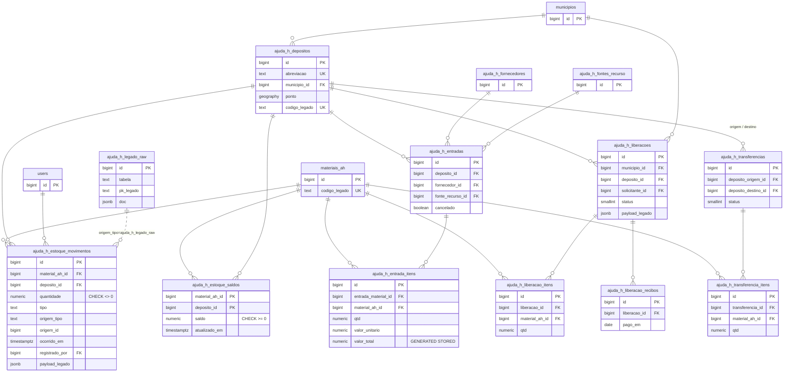

# Estoque de Ajuda Humanitaria - Fase 1: Schema Postgres e Ponte com o Legado - Implementation Plan

> **For agentic workers:** REQUIRED SUB-SKILL: Use superpowers:subagent-driven-development (recommended) or superpowers:executing-plans to implement this plan task-by-task. Steps use checkbox (`- [ ]`) syntax for tracking.

**Goal:** Trazer o nucleo de estoque do sistema procedural `gestaocedec` (tabelas `aju_*`) para o Postgres do NewSDC, substituindo o saldo editavel do legado por um ledger append-only com invariante de saldo garantida pelo banco.

**Architecture:** A carga do legado nao normaliza durante a extracao: cada linha MySQL entra no Postgres como documento `jsonb` em uma landing zone (`ajuda_h_legado_raw`), e todo o refino vira SQL sobre esse documento. O modelo destino troca `aju_estoque.saldo` (coluna editavel, sem trilha) por `ajuda_h_estoque_movimentos` (append-only) mais `ajuda_h_estoque_saldos` (projecao com `CHECK (saldo >= 0)`), de modo que saldo negativo passa a ser impossivel por construcao em vez de por validacao na aplicacao. Nenhuma escrita e feita na base legada em nenhum momento.

**Tech Stack:** PHP 8.3, Laravel 12, PostgreSQL 18 + PostGIS 3.6, PHPUnit 11.

## Status de execucao

| Task | Estado | Evidencia |
| --- | --- | --- |
| 1. Extensoes e landing zone | **APLICADA** em 06/08/2026 | migration `2026_08_06_110000_create_ajuda_h_legado_raw_table`; `btree_gist`, `citext` e `postgis` presentes; indice GIN `ajuda_h_legado_raw_doc_idx` criado |
| 2. Comando de extracao | **EXECUTADA** em 06/08/2026 | `legado:aju:extrair` carregou 13.598 linhas em 15 tabelas a partir do snapshot de producao; `aju_cfornecedor` pulada por ausencia na base. Contagem conferida 1:1 com a origem em todas as tabelas |
| 3. Schema do nucleo | **APLICADA** em 06/08/2026 | migration `2026_08_06_110100_create_ajuda_h_estoque_tables`; 13 tabelas `ajuda_h_*`; os 4 CHECK verificados por teste transacional (saldo negativo, quantidade zero e transferencia para o mesmo deposito recusados; `valor_total` calculado em 31.50; `geography` gravada) |
| 4. Servico de movimentacao | pendente | |
| 5. Refino da landing zone | **EXECUTADA** em 06/08/2026, sete etapas | 187 materiais, 24 depositos, 10 fornecedores, 36 fontes, 118 saldos, 752 entradas com 752 itens, 69 transferencias com 205 itens. Agregados de saldo identicos a origem (soma 46.204, min 1, max 4.896) e **MD5 das tuplas (material, deposito, saldo) igual dos dois lados**: `07067c0945e624e6fa24a2d8e9c22051`. Reexecucao completa nao alterou nenhuma contagem |

### Regra do ledger na carga

Somente a etapa `saldos` escreve em `ajuda_h_estoque_movimentos`, e escreve um unico movimento `ABERTURA` por par material/deposito, com o saldo que o legado tem hoje. As etapas `entradas` e `transferencias` carregam o historico como registro, **sem lancar movimento**: a abertura ja embute o efeito acumulado delas.

Lancar as duas coisas dobraria o saldo e quebraria a invariante `saldo = soma dos movimentos`. A verificacao de que a regra se sustenta: depois de carregar as 752 entradas e as 69 transferencias, o ledger continuou com 118 linhas, todas de tipo `ABERTURA`, soma 46.204 e o mesmo MD5 de antes.

### Dado sujo encontrado na carga de producao

Quatro casos, todos tratados sem afrouxar constraint:

| Caso | Ocorrencias | Tratamento |
| --- | --- | --- |
| `aju_produto` sem `id_dep_destino` | 1 (id 1038, correcao manual de saldo de -5 cestas) | Recuperada pelo nome textual em `depDestino` (`TEOFILO OTONI`), que casa com o deposito 12. Nenhuma linha perdida |
| `aju_transferencia` com origem igual ao destino | 1 (id 37, deposito 1 para deposito 1) | Fica de fora. O CHECK `ajuda_h_transf_depositos_distintos_ck` esta certo; o dado e que nao. Os 2 itens dela caem junto, o que explica 205 de 207 |
| `cpfcnpj` de preenchimento em `aju_fornecedores` | 3 (`00.000.000-0000-00` repetido em dois fornecedores, e `00.000.0` truncado) | Vira `NULL` por regra estrutural: menos de 11 digitos ou nenhum digito diferente de zero. Documento invalido nao e identidade, e o Postgres aceita varios `NULL` sob `UNIQUE` |
| `aju_produto.origem` fora de `aju_fonte` | 215 de 752 | `origem` e texto livre que mistura fonte de recurso (CAMPANHA DOACAO, LBV) com tipo de movimento (`Transferencia entre Depositos` em tres grafias, `Correcao Manual de Saldo`). So o que casa com `aju_fonte` vira `fonte_recurso_id` (537); o resto fica em `ajuda_h_entradas.payload_legado`, em vez de virar cadastro inventado |

### Tabelas que seguem vazias, e por que

`ajuda_h_liberacoes`, `ajuda_h_liberacao_itens` e `ajuda_h_liberacao_recibos` ainda nao tem etapa de refino. O dado esta na area de pouso (`aju_liberacao` 3.582, `aju_pagamento` 3.364), mas **`aju_item` esta vazia na producao**: as 3.582 liberacoes nao tem um unico item registrado nessa tabela. Carregar as liberacoes agora produziria 3.582 registros orfaos de item. Antes de modelar essa etapa e preciso descobrir com quem opera o modulo se o item da liberacao vive em outro lugar ou se a tabela foi abandonada.
| 6. Troca da leitura de saldo | pendente | |

**Banco alvo.** O schema foi aplicado no Postgres `sdc` em `localhost:5434` (container `newsdc_dev_db`, postgis 18-3.6), que e onde vivem `municipios`, `materiais_ah` e `users`. A porta 5433 do `compose.dev.yml` pertence ao `db_ai` (Citus + pgvector, base `sdc_ai`), destinado a carga analitica e vetorial, e nao ao OLTP deste modulo.

**Fonte da carga.** `SDC/database/data/aju_humanitaria.sql`, dump HeidiSQL da producao (200.198.29.227, MySQL 8.0.31, base `dbsdc`), de 06/08/2026. Carregado em um schema MySQL isolado, `aju_prod_snapshot`, e nao no `dbsdc` local: o dump traz `USE dbsdc` e `INSERT` sem truncate, entao aplica-lo direto somaria linhas a base local existente. Conexao `legacy` apontada para esse snapshot via `DB_LEGACY_*`; do container, o host se alcanca por `host.docker.internal`.

**Divergencia de chave entre as bases.** O `MapaTabelasLegado` implementado difere do desenho original desta Task 2: em vez de uma coluna de chave por tabela, declara uma **lista de candidatas em ordem de preferencia**, e o extrator escolhe a primeira presente na origem. Foi o que permitiu o mesmo mapa atender o `dbsdc` (`aju_deposito.id`) e o `gestaocedec_local` (`aju_deposito.id_deposito`) sem bifurcar codigo. `resolverChave()` retorna `null` quando nenhuma candidata existe, e o comando aborta nomeando a tabela em vez de gravar `pk_legado` vazio.

**Nomenclatura.** Prefixo de modulo `ajuda_h_`, seguindo a convencao do NewSDC (`pae_`, `dec_`, `tdap_`, `rat_`, `pmda_`, `compdec_`). As tabelas anteriores do modulo usam sufixo `_ah` (`materiais_ah`, `pedidos_ah`): convivem por ora, e uma eventual uniformizacao e trabalho a parte, porque renomear alcanca Models, Resources e consultas ja escritas.

## Global Constraints

- Todo arquivo PHP novo comeca com `<?php` seguido de linha em branco e `declare(strict_types=1);`
- Namespace raiz do modulo: `App\Modules\AjudaHumanitaria`
- Proibido emoji em codigo
- Proibido acento em nome de classe, metodo, propriedade, arquivo, coluna de banco e chave de array. Acento e permitido apenas em valor de string destinado a exibicao
- Nada sob `Domain/` pode importar `Illuminate\*`, `App\Models\*`, nem qualquer Model Eloquent. A unica dependencia externa permitida em `Domain/` e `Carbon\CarbonImmutable`. Servicos que usam `DB` ficam em `Services/`, nunca em `Domain/`
- Fase aditiva. Nenhuma tabela existente e removida ou renomeada. As unicas alteracoes em objeto existente sao as duas descritas na Task 3 (constraint `UNIQUE` em `materiais_ah.codigo_legado`) e na Task 6 (troca de um bind no ServiceProvider)
- **A base legada e somente leitura.** Nenhum `INSERT`, `UPDATE`, `DELETE`, `CREATE TRIGGER` ou DDL na conexao `legacy`, em nenhuma task. O sistema procedural continua em producao durante toda esta fase
- Commits seguem gitmoji: `<emoji> tipo(escopo): descricao em pt-BR`. Escopo desta fase: `estoque-ah`
- Nunca incluir trailer `Co-Authored-By` em commit
- **Arquivos de teste nao entram em commit.** Regra permanente do usuario. Os testes sao escritos, executados e permanecem no disco sem versionamento; os comandos `git add` das tasks abaixo cobrem apenas codigo de producao, mesmo quando o texto do passo citar o arquivo de teste
- Usar `Illuminate\Foundation\Testing\DatabaseTransactions`, nunca `RefreshDatabase`. As migrations do projeto nao rodam em SQLite e `RefreshDatabase` sobre o Postgres de desenvolvimento apagaria o banco do usuario
- **Runner de teste.** Nenhum comando documentado no repositorio funciona neste ambiente. O comando canonico, a partir de `SDC/`, e:

  ```powershell
  $php = "C:\laragon\bin\php\php-8.3.16-Win32-vs16-x64\php.exe"
  $ext = "C:\laragon\bin\php\php-8.3.16-Win32-vs16-x64\ext"
  $dot = @{}
  Get-Content .env | Where-Object { $_ -match '^\s*DB_(USERNAME|PASSWORD|DATABASE)\s*=' } | ForEach-Object {
      $par = $_ -split '=', 2
      $dot[$par[0].Trim()] = $par[1].Trim().Trim('"')
  }
  $env:APP_CONFIG_CACHE = "$env:TEMP\sem-cache-newsdc.php"
  $env:DB_CONNECTION = "pgsql"
  $env:DB_HOST = "127.0.0.1"
  $env:DB_PORT = "5434"
  $env:DB_DATABASE = $dot['DB_DATABASE']
  $env:DB_USERNAME = $dot['DB_USERNAME']
  $env:DB_PASSWORD = $dot['DB_PASSWORD']
  & $php -d "extension_dir=$ext" -d "extension=php_pgsql.dll" -d "extension=php_pdo_pgsql.dll" `
      vendor/bin/phpunit <argumentos>
  ```

  `APP_CONFIG_CACHE` aponta para arquivo inexistente de proposito: faz o Laravel ler configuracao fresca sem apagar `bootstrap/cache/config.php`, compartilhado com o container em execucao. Nao rodar `artisan config:clear`.

  Nos passos seguintes, `TESTAR` designa esse bloco. Salve-o em um `.ps1` fora do repositorio e invoque com os argumentos indicados.
- Como os testes de banco rodam sobre o Postgres de desenvolvimento, cada migration precisa estar aplicada nele antes dos testes da propria task. Aplicar com o mesmo bloco acima trocando `vendor/bin/phpunit <args>` por `artisan migrate`

---

## 1. Conceito: como o banco fica em Postgres

### 1.1 A inversao central

No legado, `aju_estoque.saldo` e uma coluna `int` sofrendo `UPDATE` direto a partir de cinco caminhos diferentes (`aju_baixa`, `aju_transf`, `aju_transferencia`, `aju_liberacao`/`aju_item`, `aju_produto`), em MyISAM, sem transacao e sem trilha. `aju_estoque_anterior` existe apenas para compensar a ausencia de historico, guardando um snapshot diario do saldo.

No destino isso inverte:

| Legado | Destino | Ganho |
| --- | --- | --- |
| `aju_estoque.saldo` editavel | `ajuda_h_estoque_movimentos` append-only | toda mutacao tem autor, origem e instante |
| `aju_estoque_anterior` (snapshot diario) | `SUM(quantidade) WHERE ocorrido_em <= :data` | historico em qualquer granularidade, sem job noturno |
| saldo negativo possivel | `CHECK (saldo >= 0)` em `ajuda_h_estoque_saldos` | o banco recusa a saida que estoura o saldo |
| MyISAM sem FK | FK com `RESTRICT`/`CASCADE` explicitos | orfao deixa de existir |
| `val_total` gravado a mao em 3 tabelas | coluna `GENERATED ALWAYS AS ... STORED` | impossivel divergir de `qtd * valor_unitario` |

`ajuda_h_estoque_saldos` e projecao, nao fonte de verdade. Nenhum codigo escreve nela fora do servico da Task 4.

### 1.2 Mapa legado para destino

Escopo desta fase. As colunas do legado sem destino nomeado sobrevivem em `payload_legado jsonb` (ver 1.4).

| Origem (`aju_*`) | Destino Postgres | Observacao |
| --- | --- | --- |
| `aju_unidade` | `materiais_ah` (ja existe) | catalogo de material; `codigo_legado` = `id_unidade` |
| `aju_deposito` | `ajuda_h_depositos` | PK diverge entre as bases: `id` no `dbsdc`, `id_deposito` no `gestaocedec_local` |
| `aju_estoque` | `ajuda_h_estoque_saldos` + movimento `ABERTURA` | `id_produto` aponta para `aju_unidade`, nao para `aju_produto` |
| `aju_estoque_anterior` | descartada | reconstruida por consulta ao ledger |
| `aju_baixa` | `ajuda_h_estoque_movimentos` tipo `BAIXA` | |
| `aju_produto` | `ajuda_h_entradas` + `ajuda_h_entrada_itens` | apesar do nome, e registro de entrada, nao catalogo |
| `aju_transf` + `aju_transferencia` | `ajuda_h_transferencias` | duas tabelas do mesmo conceito, fundidas |
| `aju_item_transf` | `ajuda_h_transferencia_itens` | |
| `aju_liberacao` | `ajuda_h_liberacoes` | |
| `aju_item` | `ajuda_h_liberacao_itens` | |
| `aju_pagamento` | `ajuda_h_liberacao_recibos` | PK composta do legado vira `id` proprio |
| `aju_fonte` | `ajuda_h_fontes_recurso` | |
| `aju_fornecedores` / `aju_cfornecedor` | `ajuda_h_fornecedores` | nome da tabela diverge entre as duas bases |
| `aju_municipio` | `municipios` (ja existe) | casar por nome; 853 linhas |
| `aju_usuario` | `users` (ja existe) | |
| `aju_log` | `audit_logs` (ja existe) | fora do escopo desta fase |
| `aju_unidade_descr` | `payload_legado` de `materiais_ah` | 3 linhas; nao justifica tabela |

### 1.3 Diagrama do destino



### 1.4 Por que `jsonb` e onde ele nao entra

`jsonb` aparece em exatamente tres lugares, e cada um tem uma razao distinta:

1. **`ajuda_h_legado_raw.doc`** - landing zone. Permite extrair as tabelas do MySQL com um unico script, sem decidir schema antes de olhar o dado, e reexecutar a extracao sem reimportar (`ON CONFLICT`). Todo refino vira SQL sobre o documento, testavel dentro do proprio Postgres sem MySQL no loop.
2. **`payload_legado`** em `ajuda_h_liberacoes` e `ajuda_h_estoque_movimentos` - resíduo. `aju_liberacao` tem 22 colunas, entre elas `resp_receb_ci`, `resp_receb_veiculo`, `resp_receb_placa`, `m_cancela`, `hora_libera`, sem consumidor conhecido. Levar todas para colunas polui o schema; descartar perde dado. Ficam no `jsonb` e, se em seis meses ninguem consultar, a coluna cai.
3. Nada mais.

`jsonb` **nao** e usado para item de pedido, saldo, movimentacao nem beneficiario. Guardar esses como documento devolveria exatamente o problema do MyISAM: nenhuma integridade referencial. A regra e: `jsonb` para o que atravessa a fronteira do legado, coluna para o que o dominio novo governa.

### 1.5 O que esta fase deliberadamente nao faz

- **Particionamento, materialized view, replica, sharding, Citus.** O dominio `aju_*` inteiro tem ~250 mil linhas; a maior tabela tem 98k. Cabe em `shared_buffers`. O ganho da migracao aqui e integridade, nao throughput
- **Broker novo (Kafka, RabbitMQ, Debezium).** O `outbox_events` transacional ja existente cobre o caso
- **CDC bidirecional ou dual-write.** Sem transacao distribuida e com MyISAM na outra ponta, divergencia e certa. O legado fica somente leitura ate o corte
- **Almoxarifado (`aju_c*`), conformidade DEC (`aju_dec_*`), permissoes (`aju_permissao`).** Cada um vira plano proprio, listados na secao 4
- **Refino de `ajuda_h_liberacoes`, `ajuda_h_transferencias` e `ajuda_h_entradas`.** As tabelas sao criadas nesta fase, mas o ETL cobre so tres etapas: `materiais`, `ajuda_h_depositos` e `saldos`. Isso e proposital: o saldo de abertura e o que destrava a troca da ponte de leitura na Task 6, e carregar o historico de liberacao antes de validar o saldo dobraria a superficie de erro. O refino do historico entra na fase 2, reusando a mesma landing zone ja carregada

---

## 2. Estrutura de arquivos

| Arquivo | Responsabilidade |
| --- | --- |
| `database/migrations/2026_08_06_090000_create_legado_aju_raw_table.php` | extensoes `btree_gist`/`citext` e landing zone |
| `database/migrations/2026_08_06_100000_create_estoque_ah_tables.php` | as 12 tabelas do nucleo de estoque, consolidadas |
| `app/Modules/AjudaHumanitaria/Domain/Etl/MapaTabelasLegado.php` | mapa tabela legada para coluna de PK; puro |
| `app/Modules/AjudaHumanitaria/Console/ExtrairLegadoAjuCommand.php` | MySQL legado para `ajuda_h_legado_raw` |
| `app/Modules/AjudaHumanitaria/Console/RefinarLegadoAjuCommand.php` | `ajuda_h_legado_raw` para tabelas destino |
| `app/Modules/AjudaHumanitaria/Domain/Estoque/MovimentoEstoque.php` | DTO imutavel de movimento; puro |
| `app/Modules/AjudaHumanitaria/Domain/Estoque/SaldoInsuficiente.php` | excecao de dominio |
| `app/Modules/AjudaHumanitaria/Services/RegistrarMovimentoEstoque.php` | transacao ledger mais projecao de saldo |
| `app/Modules/AjudaHumanitaria/Infrastructure/Persistence/PostgresSaldoMaterialRepository.php` | leitura de saldo nativo |

Regra 9 do usuario (consolidar migrations) aplicada: as 12 tabelas do nucleo entram em **uma** migration. Alteracao de desenho durante a construcao edita esse arquivo, nao empilha patch.

---

## 3. Tasks

### Task 1: Extensoes Postgres e landing zone do ETL

**Files:**
- Create: `database/migrations/2026_08_06_090000_create_legado_aju_raw_table.php`
- Test: `tests/Feature/EstoqueAh/LandingZoneSchemaTest.php`

**Interfaces:**
- Consumes: nada
- Produces: tabela `ajuda_h_legado_raw(id bigint, tabela text, pk_legado text, doc jsonb, extraido_em timestamptz)` com `UNIQUE (tabela, pk_legado)` e indice GIN `jsonb_path_ops` em `doc`. Extensoes `btree_gist` e `citext` disponiveis no banco

- [ ] **Step 1: Escrever o teste que falha**

```php
<?php

declare(strict_types=1);

namespace Tests\Feature\EstoqueAh;

use Illuminate\Foundation\Testing\DatabaseTransactions;
use Illuminate\Support\Facades\DB;
use Illuminate\Support\Facades\Schema;
use Tests\TestCase;

final class LandingZoneSchemaTest extends TestCase
{
    use DatabaseTransactions;

    public function test_tabela_de_landing_zone_existe_com_as_colunas_esperadas(): void
    {
        $this->assertTrue(Schema::hasTable('ajuda_h_legado_raw'));
        $this->assertTrue(Schema::hasColumns('ajuda_h_legado_raw', [
            'id', 'tabela', 'pk_legado', 'doc', 'extraido_em',
        ]));
    }

    public function test_coluna_doc_e_jsonb(): void
    {
        $tipo = DB::selectOne(
            "select data_type from information_schema.columns
             where table_name = 'ajuda_h_legado_raw' and column_name = 'doc'"
        );

        $this->assertSame('jsonb', $tipo->data_type);
    }

    public function test_par_tabela_e_pk_legado_e_unico(): void
    {
        DB::table('ajuda_h_legado_raw')->insert([
            'tabela' => 'aju_unidade', 'pk_legado' => '1',
            'doc' => json_encode(['nome' => 'CESTA BASICA']), 'extraido_em' => now(),
        ]);

        $this->expectException(\Illuminate\Database\QueryException::class);

        DB::table('ajuda_h_legado_raw')->insert([
            'tabela' => 'aju_unidade', 'pk_legado' => '1',
            'doc' => json_encode(['nome' => 'OUTRO']), 'extraido_em' => now(),
        ]);
    }

    public function test_extensoes_necessarias_estao_instaladas(): void
    {
        $instaladas = DB::table('pg_extension')->pluck('extname')->all();

        $this->assertContains('btree_gist', $instaladas);
        $this->assertContains('citext', $instaladas);
    }
}
```

- [ ] **Step 2: Rodar o teste e confirmar que falha**

`TESTAR tests/Feature/EstoqueAh/LandingZoneSchemaTest.php`

Esperado: FAIL em `test_tabela_de_landing_zone_existe_com_as_colunas_esperadas`, com `Failed asserting that false is true`.

- [ ] **Step 3: Escrever a migration**

```php
<?php

declare(strict_types=1);

use Illuminate\Database\Migrations\Migration;
use Illuminate\Database\Schema\Blueprint;
use Illuminate\Support\Facades\DB;
use Illuminate\Support\Facades\Schema;

/**
 * Landing zone da carga do sistema procedural gestaocedec.
 *
 * Cada linha das tabelas aju_* entra aqui como documento jsonb, sem
 * normalizacao. Isso permite extrair as 52 tabelas com um unico comando, sem
 * decidir schema antes de olhar o dado, e refazer a extracao sem reimportar do
 * MySQL: o refino subsequente e SQL sobre o documento, testavel dentro do
 * proprio Postgres.
 *
 * Tabela transitoria. Depois do corte, ela e do banco legado saem juntos.
 *
 * btree_gist e pre-requisito das constraints EXCLUDE das fases seguintes
 * (vigencia de decreto, slot de agendamento). citext atende login e e-mail
 * case-insensitive sem LOWER() em todo WHERE.
 */
return new class extends Migration
{
    public function up(): void
    {
        DB::statement('CREATE EXTENSION IF NOT EXISTS btree_gist');
        DB::statement('CREATE EXTENSION IF NOT EXISTS citext');

        Schema::create('ajuda_h_legado_raw', function (Blueprint $table): void {
            $table->id();
            $table->string('tabela', 64);
            $table->string('pk_legado', 64);
            $table->jsonb('doc');
            $table->timestampTz('extraido_em')->useCurrent();

            $table->unique(['tabela', 'pk_legado']);
            $table->index('tabela');
        });

        DB::statement(
            'CREATE INDEX legado_aju_raw_doc_idx ON ajuda_h_legado_raw USING gin (doc jsonb_path_ops)'
        );
    }

    public function down(): void
    {
        Schema::dropIfExists('ajuda_h_legado_raw');
    }
};
```

- [ ] **Step 4: Aplicar a migration e rodar o teste**

Aplicar: bloco `TESTAR` com `artisan migrate` no lugar de `vendor/bin/phpunit`.

`TESTAR tests/Feature/EstoqueAh/LandingZoneSchemaTest.php`

Esperado: PASS, 4 testes.

Se `CREATE EXTENSION` falhar com `permission denied to create extension`, o usuario do banco nao e superusuario. Nesse caso peca ao DBA que execute os dois `CREATE EXTENSION` uma vez e reexecute a migration: `IF NOT EXISTS` a torna idempotente.

- [ ] **Step 5: Commit**

```bash
git add database/migrations/2026_08_06_090000_create_legado_aju_raw_table.php
git commit -m "🗃️ db(estoque-ah): landing zone jsonb da carga do legado aju"
```

---

### Task 2: Comando de extracao do legado para a landing zone

**Files:**
- Create: `app/Modules/AjudaHumanitaria/Domain/Etl/MapaTabelasLegado.php`
- Create: `app/Modules/AjudaHumanitaria/Console/ExtrairLegadoAjuCommand.php`
- Test: `tests/Unit/EstoqueAh/MapaTabelasLegadoTest.php`

**Interfaces:**
- Consumes: `ajuda_h_legado_raw` da Task 1
- Produces: `MapaTabelasLegado::tabelas(): array<string, string>` mapeando nome de tabela para coluna de PK; `MapaTabelasLegado::chavePrimaria(string $tabela): string`, que lanca `InvalidArgumentException` para tabela fora do mapa. Comando `legado:aju:extrair {--tabela=*} {--chunk=1000}`

- [ ] **Step 1: Escrever o teste que falha**

```php
<?php

declare(strict_types=1);

namespace Tests\Unit\EstoqueAh;

use App\Modules\AjudaHumanitaria\Domain\Etl\MapaTabelasLegado;
use InvalidArgumentException;
use PHPUnit\Framework\TestCase;

final class MapaTabelasLegadoTest extends TestCase
{
    public function test_cobre_as_tabelas_do_nucleo_de_estoque(): void
    {
        $tabelas = MapaTabelasLegado::tabelas();

        foreach ([
            'aju_unidade', 'aju_deposito', 'aju_estoque', 'aju_baixa',
            'aju_produto', 'aju_transferencia', 'aju_item_transf',
            'aju_liberacao', 'aju_item', 'aju_pagamento',
            'aju_fonte', 'aju_municipio',
        ] as $tabela) {
            $this->assertArrayHasKey($tabela, $tabelas);
        }
    }

    public function test_resolve_a_coluna_de_chave_primaria(): void
    {
        $this->assertSame('id_unidade', MapaTabelasLegado::chavePrimaria('aju_unidade'));
        $this->assertSame('id_estoque', MapaTabelasLegado::chavePrimaria('aju_estoque'));
        $this->assertSame('id_liberacao', MapaTabelasLegado::chavePrimaria('aju_liberacao'));
    }

    public function test_deposito_usa_id_deposito_do_gestaocedec(): void
    {
        // A base dbsdc chama a PK de "id" e a gestaocedec_local de "id_deposito".
        // O mapa fixa a fonte oficial: gestaocedec_local.
        $this->assertSame('id_deposito', MapaTabelasLegado::chavePrimaria('aju_deposito'));
    }

    public function test_tabela_fora_do_mapa_e_recusada(): void
    {
        $this->expectException(InvalidArgumentException::class);

        MapaTabelasLegado::chavePrimaria('aju_inexistente');
    }

    public function test_inclui_fornecedor_sob_os_dois_nomes_que_o_legado_usa(): void
    {
        // dbsdc chama de aju_fornecedores, gestaocedec_local de aju_cfornecedor.
        // As duas entram no mapa; a extracao pula a que nao existir na origem.
        $tabelas = MapaTabelasLegado::tabelas();

        $this->assertArrayHasKey('aju_fornecedores', $tabelas);
        $this->assertArrayHasKey('aju_cfornecedor', $tabelas);
    }
}
```

- [ ] **Step 2: Rodar o teste e confirmar que falha**

`TESTAR tests/Unit/EstoqueAh/MapaTabelasLegadoTest.php`

Esperado: FAIL com `Class "App\Modules\AjudaHumanitaria\Domain\Etl\MapaTabelasLegado" not found`.

- [ ] **Step 3: Escrever o mapa**

```php
<?php

declare(strict_types=1);

namespace App\Modules\AjudaHumanitaria\Domain\Etl;

use InvalidArgumentException;

/**
 * Tabelas do legado que entram na carga do nucleo de estoque, com a coluna que
 * as identifica.
 *
 * O legado nao usa convencao unica de PK, entao o mapa e explicito. Atencao ao
 * aju_deposito: a base dbsdc chama a coluna de "id" e a gestaocedec_local de
 * "id_deposito". A fonte oficial desta migracao e a gestaocedec_local, que e a
 * base que o LegadoSaldoMaterialRepository ja consulta.
 *
 * Classe pura de proposito: nao toca banco, e o unico ponto que precisa mudar
 * quando uma tabela entra ou sai do escopo da carga.
 *
 * O mapa e a uniao das duas bases, nao a intersecao: aju_fornecedores so existe
 * na dbsdc e aju_cfornecedor so na gestaocedec_local. A extracao pula em
 * silencio o que nao existir na origem, entao o mesmo mapa serve as duas.
 */
final class MapaTabelasLegado
{
    /** @var array<string, string> */
    private const TABELAS = [
        'aju_unidade'       => 'id_unidade',
        'aju_unidade_descr' => 'id_unid_descr',
        'aju_deposito'      => 'id_deposito',
        'aju_estoque'       => 'id_estoque',
        'aju_baixa'         => 'id_baixa',
        'aju_produto'       => 'id_produto',
        'aju_transf'        => 'id_transf',
        'aju_transferencia' => 'id_transferencia',
        'aju_item_transf'   => 'id_item',
        'aju_liberacao'     => 'id_liberacao',
        'aju_item'          => 'id_item',
        // A PK real de aju_pagamento e composta (id_pagamento, id_liberacao).
        // id_pagamento sozinho foi verificado como unico na base oficial
        // (4960 linhas, 4960 valores distintos), entao serve de identificador
        // da landing zone. O schema nao garante isso: se uma carga futura
        // acusar menos linhas em ajuda_h_legado_raw do que em aju_pagamento, e
        // porque a premissa caiu e a chave precisa virar composta.
        'aju_pagamento'     => 'id_pagamento',
        'aju_fonte'         => 'id',
        'aju_fornecedores'  => 'id',
        'aju_cfornecedor'   => 'id_fornecedor',
        'aju_municipio'     => 'id_municipio',
    ];

    /** @return array<string, string> */
    public static function tabelas(): array
    {
        return self::TABELAS;
    }

    public static function chavePrimaria(string $tabela): string
    {
        return self::TABELAS[$tabela]
            ?? throw new InvalidArgumentException("Tabela fora do mapa de carga: {$tabela}");
    }
}
```

- [ ] **Step 4: Rodar o teste e confirmar que passa**

`TESTAR tests/Unit/EstoqueAh/MapaTabelasLegadoTest.php`

Esperado: PASS, 4 testes.

- [ ] **Step 5: Escrever o comando de extracao**

```php
<?php

declare(strict_types=1);

namespace App\Modules\AjudaHumanitaria\Console;

use App\Modules\AjudaHumanitaria\Domain\Etl\MapaTabelasLegado;
use Illuminate\Console\Command;
use Illuminate\Support\Facades\DB;
use Throwable;

/**
 * Copia as tabelas aju_* da base legada para a landing zone, como documento.
 *
 * Somente leitura no legado: o comando executa apenas SELECT na conexao
 * configurada em ajuda-humanitaria.legacy_connection.
 *
 * Idempotente por (tabela, pk_legado): reexecutar atualiza o documento em vez
 * de duplicar, entao a carga pode rodar quantas vezes for preciso ate o corte.
 */
final class ExtrairLegadoAjuCommand extends Command
{
    protected $signature = 'legado:aju:extrair {--tabela=* : Limita a extracao a estas tabelas} {--chunk=1000}';

    protected $description = 'Extrai as tabelas aju_* do gestaocedec para ajuda_h_legado_raw';

    public function handle(): int
    {
        $conexao = (string) config('ajuda-humanitaria.legacy_connection', 'legacy');

        try {
            DB::connection($conexao)->getPdo();
        } catch (Throwable $erro) {
            $this->error("Conexao legada indisponivel ({$conexao}): {$erro->getMessage()}");

            return self::FAILURE;
        }

        $escolhidas = (array) $this->option('tabela');
        $tabelas    = $escolhidas === []
            ? MapaTabelasLegado::tabelas()
            : array_intersect_key(MapaTabelasLegado::tabelas(), array_flip($escolhidas));

        if ($tabelas === []) {
            $this->error('Nenhuma tabela conhecida entre as informadas.');

            return self::FAILURE;
        }

        $total   = 0;
        $puladas = 0;

        foreach ($tabelas as $tabela => $chave) {
            $schema = Schema::connection($conexao);

            // O mapa e a uniao das duas bases legadas. Tabela ausente na origem
            // nao e erro: e a outra base.
            if (! $schema->hasTable($tabela)) {
                $this->line(sprintf('%-20s ausente nesta base, pulada', $tabela));
                $puladas++;

                continue;
            }

            // Coluna de PK errada geraria pk_legado vazio e colapsaria a tabela
            // inteira em uma linha no upsert. Falha alto em vez de corromper.
            if (! $schema->hasColumn($tabela, $chave)) {
                $this->error("Coluna de chave '{$chave}' nao existe em {$tabela}. Corrija MapaTabelasLegado.");

                return self::FAILURE;
            }

            $extraidas = 0;

            DB::connection($conexao)
                ->table($tabela)
                ->orderBy($chave)
                ->chunk((int) $this->option('chunk'), function ($linhas) use ($tabela, $chave, &$extraidas): void {
                    $lote = [];

                    foreach ($linhas as $linha) {
                        $dados = (array) $linha;

                        $lote[] = [
                            'tabela'      => $tabela,
                            'pk_legado'   => (string) $dados[$chave],
                            'doc'         => json_encode($dados, JSON_UNESCAPED_UNICODE),
                            'extraido_em' => now(),
                        ];
                    }

                    DB::table('ajuda_h_legado_raw')->upsert($lote, ['tabela', 'pk_legado'], ['doc', 'extraido_em']);

                    $extraidas += count($lote);
                });

            $this->line(sprintf('%-20s %6d linhas', $tabela, $extraidas));
            $total += $extraidas;
        }

        $this->info(sprintf(
            'Extracao concluida: %d linhas em %d tabelas (%d puladas).',
            $total,
            count($tabelas) - $puladas,
            $puladas
        ));

        return self::SUCCESS;
    }
}
```

O `use Illuminate\Support\Facades\Schema;` precisa entrar no topo do arquivo, junto dos demais imports.

- [ ] **Step 6: Registrar o comando no ServiceProvider do modulo**

Em `app/Modules/AjudaHumanitaria/AjudaHumanitariaServiceProvider.php`, dentro de `boot()`, adicionar:

```php
if ($this->app->runningInConsole()) {
    $this->commands([
        \App\Modules\AjudaHumanitaria\Console\ExtrairLegadoAjuCommand::class,
    ]);
}
```

Se `boot()` ja tiver um bloco `runningInConsole()` com `$this->commands([...])`, apenas acrescente a classe ao array existente em vez de abrir um segundo bloco.

- [ ] **Step 7: Verificar o comando manualmente**

Preencher no `.env` do SDC, apontando para a base oficial:

```
DB_LEGACY_HOST=127.0.0.1
DB_LEGACY_PORT=3306
DB_LEGACY_DATABASE=gestaocedec_local
DB_LEGACY_USERNAME=root
DB_LEGACY_PASSWORD=
```

Rodar, com o bloco `TESTAR` trocando `vendor/bin/phpunit <args>` por `artisan legado:aju:extrair --tabela=aju_unidade --tabela=aju_deposito`.

Esperado: duas linhas de saida, `aju_unidade` com 236 linhas e `aju_deposito` com 24. Rodar o mesmo comando de novo deve repetir os mesmos numeros, sem duplicar: confirmar com

```sql
SELECT tabela, count(*) FROM ajuda_h_legado_raw GROUP BY tabela;
```

- [ ] **Step 8: Commit**

```bash
git add app/Modules/AjudaHumanitaria/Domain/Etl/MapaTabelasLegado.php \
        app/Modules/AjudaHumanitaria/Console/ExtrairLegadoAjuCommand.php \
        app/Modules/AjudaHumanitaria/AjudaHumanitariaServiceProvider.php
git commit -m "✨ feat(estoque-ah): extracao do legado aju para a landing zone"
```

---

### Task 3: Schema consolidado do nucleo de estoque

**Files:**
- Create: `database/migrations/2026_08_06_100000_create_estoque_ah_tables.php`
- Test: `tests/Feature/EstoqueAh/EstoqueSchemaTest.php`

**Interfaces:**
- Consumes: `materiais_ah`, `municipios`, `users` (ja existentes no banco `sdc`; conferido em 06/08/2026: 160 tabelas, `municipios` com 853 linhas, `materiais_ah` vazia)
- Produces: as 12 tabelas descritas em 1.3, mais `UNIQUE (codigo_legado)` em `materiais_ah`. Invariantes que as tasks seguintes assumem: `ajuda_h_estoque_saldos.saldo >= 0`, `ajuda_h_estoque_movimentos.quantidade <> 0`, `ajuda_h_entrada_itens.valor_total` gerada, `ajuda_h_transferencias.deposito_origem_id <> deposito_destino_id`

- [ ] **Step 1: Escrever o teste que falha**

```php
<?php

declare(strict_types=1);

namespace Tests\Feature\EstoqueAh;

use Illuminate\Database\QueryException;
use Illuminate\Foundation\Testing\DatabaseTransactions;
use Illuminate\Support\Facades\DB;
use Illuminate\Support\Facades\Schema;
use Tests\TestCase;

final class EstoqueSchemaTest extends TestCase
{
    use DatabaseTransactions;

    public function test_todas_as_tabelas_do_nucleo_existem(): void
    {
        foreach ([
            'ajuda_h_depositos', 'ajuda_h_fornecedores', 'ajuda_h_fontes_recurso',
            'ajuda_h_estoque_movimentos', 'ajuda_h_estoque_saldos',
            'ajuda_h_entradas', 'ajuda_h_entrada_itens',
            'ajuda_h_transferencias', 'ajuda_h_transferencia_itens',
            'ajuda_h_liberacoes', 'ajuda_h_liberacao_itens', 'ajuda_h_liberacao_recibos',
        ] as $tabela) {
            $this->assertTrue(Schema::hasTable($tabela), "Falta a tabela {$tabela}");
        }
    }

    public function test_saldo_negativo_e_recusado_pelo_banco(): void
    {
        [$materialId, $depositoId] = $this->materialEDeposito();

        $this->expectException(QueryException::class);

        DB::table('ajuda_h_estoque_saldos')->insert([
            'material_ah_id' => $materialId,
            'deposito_id'    => $depositoId,
            'saldo'          => -1,
            'atualizado_em'  => now(),
        ]);
    }

    public function test_movimento_com_quantidade_zero_e_recusado(): void
    {
        [$materialId, $depositoId] = $this->materialEDeposito();

        $this->expectException(QueryException::class);

        DB::table('ajuda_h_estoque_movimentos')->insert([
            'material_ah_id' => $materialId,
            'deposito_id'    => $depositoId,
            'quantidade'     => 0,
            'tipo'           => 'AJUSTE',
            'ocorrido_em'    => now(),
            'created_at'     => now(),
        ]);
    }

    public function test_valor_total_do_item_de_entrada_e_calculado_pelo_banco(): void
    {
        [$materialId, $depositoId] = $this->materialEDeposito();

        $entradaId = DB::table('ajuda_h_entradas')->insertGetId([
            'deposito_id' => $depositoId,
            'recebido_em' => now(),
            'cancelado'   => false,
            'created_at'  => now(),
            'updated_at'  => now(),
        ]);

        $itemId = DB::table('ajuda_h_entrada_itens')->insertGetId([
            'entrada_material_id' => $entradaId,
            'material_ah_id'      => $materialId,
            'qtd'                 => 3,
            'valor_unitario'      => 10.50,
        ]);

        $item = DB::table('ajuda_h_entrada_itens')->find($itemId);

        $this->assertEquals(31.50, (float) $item->valor_total);
    }

    public function test_transferencia_para_o_mesmo_deposito_e_recusada(): void
    {
        [, $depositoId] = $this->materialEDeposito();

        $this->expectException(QueryException::class);

        DB::table('ajuda_h_transferencias')->insert([
            'deposito_origem_id'  => $depositoId,
            'deposito_destino_id' => $depositoId,
            'status'              => 0,
            'created_at'          => now(),
            'updated_at'          => now(),
        ]);
    }

    public function test_codigo_legado_do_material_e_unico(): void
    {
        DB::table('materiais_ah')->insert([
            'nome' => 'TESTE A', 'unidade_medida' => 'UN',
            'disponivel_para_pedido' => true, 'codigo_legado' => 'ZZ-999',
            'created_at' => now(), 'updated_at' => now(),
        ]);

        $this->expectException(QueryException::class);

        DB::table('materiais_ah')->insert([
            'nome' => 'TESTE B', 'unidade_medida' => 'UN',
            'disponivel_para_pedido' => true, 'codigo_legado' => 'ZZ-999',
            'created_at' => now(), 'updated_at' => now(),
        ]);
    }

    /** @return array{0: int, 1: int} */
    private function materialEDeposito(): array
    {
        $materialId = DB::table('materiais_ah')->insertGetId([
            'nome' => 'MATERIAL DE TESTE', 'unidade_medida' => 'UN',
            'disponivel_para_pedido' => true,
            'created_at' => now(), 'updated_at' => now(),
        ]);

        $depositoId = DB::table('ajuda_h_depositos')->insertGetId([
            'nome' => 'DEPOSITO DE TESTE', 'abreviacao' => 'TST',
            'ativo' => true, 'created_at' => now(), 'updated_at' => now(),
        ]);

        return [$materialId, $depositoId];
    }
}
```

- [ ] **Step 2: Rodar o teste e confirmar que falha**

`TESTAR tests/Feature/EstoqueAh/EstoqueSchemaTest.php`

Esperado: FAIL em `test_todas_as_tabelas_do_nucleo_existem`, com `Falta a tabela ajuda_h_depositos`.

- [ ] **Step 3: Escrever a migration consolidada**

```php
<?php

declare(strict_types=1);

use Illuminate\Database\Migrations\Migration;
use Illuminate\Database\Schema\Blueprint;
use Illuminate\Support\Facades\DB;
use Illuminate\Support\Facades\Schema;

/**
 * Nucleo de estoque de Ajuda Humanitaria.
 *
 * Consolidado em um unico arquivo: o schema nasce inteiro aqui, e alteracoes de
 * desenho durante a construcao editam esta migration em vez de empilhar patch.
 *
 * A inversao em relacao ao legado: aju_estoque.saldo era coluna editavel por
 * cinco caminhos distintos, em MyISAM, sem trilha. Aqui a verdade e o ledger
 * ajuda_h_estoque_movimentos (append-only) e ajuda_h_estoque_saldos e projecao, protegida por
 * CHECK (saldo >= 0). aju_estoque_anterior nao tem equivalente: historico vira
 * consulta ao ledger por janela de tempo.
 */
return new class extends Migration
{
    public function up(): void
    {
        Schema::create('ajuda_h_fontes_recurso', function (Blueprint $table): void {
            $table->id();
            $table->string('nome')->unique();
            $table->string('codigo_legado', 30)->nullable()->unique()
                ->comment('aju_fonte.id');
            $table->timestamps();
        });

        Schema::create('ajuda_h_fornecedores', function (Blueprint $table): void {
            $table->id();
            $table->string('nome');
            $table->string('cpf_cnpj', 20)->nullable()->unique();
            $table->foreignId('municipio_id')->nullable()->constrained('municipios')->nullOnDelete();
            $table->text('endereco')->nullable();
            $table->string('telefone', 20)->nullable();
            $table->string('codigo_legado', 30)->nullable()->unique()
                ->comment('aju_fornecedores.id ou aju_cfornecedor.id, conforme a base');
            $table->timestamps();
        });

        Schema::create('ajuda_h_depositos', function (Blueprint $table): void {
            $table->id();
            $table->string('nome');
            $table->string('abreviacao', 10)->unique();
            $table->foreignId('municipio_id')->nullable()->constrained('municipios')->nullOnDelete();
            // Sem orgao_id: nao existe tabela "orgaos" neste banco (a que existe
            // e compdec_orgaos, de outro dominio) e o legado nao tem o conceito
            // em aju_deposito, que traz regiao e id_rpm. YAGNI.
            $table->geography('ponto', 'point', 4326)->nullable()
                ->comment('localizacao para roteirizar transferencia e achar deposito mais proximo');
            $table->text('endereco')->nullable();
            $table->boolean('ativo')->default(true);
            $table->string('codigo_legado', 30)->nullable()->unique()
                ->comment('aju_deposito.id_deposito');
            $table->timestamps();

            $table->index('ativo');
        });

        Schema::create('ajuda_h_estoque_movimentos', function (Blueprint $table): void {
            $table->id();
            $table->foreignId('material_ah_id')->constrained('materiais_ah')->restrictOnDelete();
            $table->foreignId('deposito_id')->constrained('ajuda_h_depositos')->restrictOnDelete();
            $table->decimal('quantidade', 14, 3)
                ->comment('sinal define o sentido: positivo entra, negativo sai');
            $table->string('tipo', 20)
                ->comment('ABERTURA|ENTRADA|SAIDA|BAIXA|TRANSF_SAIDA|TRANSF_ENTRADA|AJUSTE');
            $table->string('origem_tipo', 40)->nullable();
            $table->unsignedBigInteger('origem_id')->nullable();
            $table->timestampTz('ocorrido_em');
            $table->foreignId('registrado_por')->nullable()->constrained('users')->nullOnDelete();
            $table->jsonb('payload_legado')->nullable();
            $table->timestampTz('created_at')->useCurrent();

            $table->index(['material_ah_id', 'deposito_id', 'ocorrido_em']);
            $table->index(['origem_tipo', 'origem_id']);
        });

        DB::statement(
            'ALTER TABLE ajuda_h_estoque_movimentos
                ADD CONSTRAINT estoque_movimentos_quantidade_ck CHECK (quantidade <> 0)'
        );
        DB::statement(
            'ALTER TABLE ajuda_h_estoque_movimentos
                ADD CONSTRAINT estoque_movimentos_origem_ck
                CHECK ((origem_tipo IS NULL) = (origem_id IS NULL))'
        );
        // BRIN: a tabela e append-only e sempre consultada por janela de tempo.
        // Ocupa uma fracao do espaco de um btree para o mesmo ganho aqui.
        DB::statement(
            'CREATE INDEX estoque_movimentos_ocorrido_brin
                ON ajuda_h_estoque_movimentos USING brin (ocorrido_em)'
        );

        Schema::create('ajuda_h_estoque_saldos', function (Blueprint $table): void {
            $table->foreignId('material_ah_id')->constrained('materiais_ah')->restrictOnDelete();
            $table->foreignId('deposito_id')->constrained('ajuda_h_depositos')->restrictOnDelete();
            $table->decimal('saldo', 14, 3)->default(0);
            $table->timestampTz('atualizado_em')->useCurrent();

            $table->primary(['material_ah_id', 'deposito_id']);
        });

        DB::statement(
            'ALTER TABLE ajuda_h_estoque_saldos
                ADD CONSTRAINT estoque_saldos_nao_negativo_ck CHECK (saldo >= 0)'
        );

        Schema::create('ajuda_h_entradas', function (Blueprint $table): void {
            $table->id();
            $table->foreignId('deposito_id')->constrained('ajuda_h_depositos')->restrictOnDelete();
            $table->foreignId('fornecedor_id')->nullable()->constrained('ajuda_h_fornecedores')->nullOnDelete();
            $table->foreignId('fonte_recurso_id')->nullable()->constrained('ajuda_h_fontes_recurso')->nullOnDelete();
            $table->string('nota_fiscal', 70)->nullable();
            $table->timestampTz('recebido_em');
            $table->boolean('cancelado')->default(false);
            $table->foreignId('registrado_por')->nullable()->constrained('users')->nullOnDelete();
            $table->string('codigo_legado', 30)->nullable()->unique()
                ->comment('aju_produto.id_produto');
            $table->timestamps();

            $table->index(['deposito_id', 'recebido_em']);
        });

        Schema::create('ajuda_h_entrada_itens', function (Blueprint $table): void {
            $table->id();
            $table->foreignId('entrada_material_id')->constrained('ajuda_h_entradas')->cascadeOnDelete();
            $table->foreignId('material_ah_id')->constrained('materiais_ah')->restrictOnDelete();
            $table->decimal('qtd', 14, 3);
            $table->decimal('valor_unitario', 16, 2)->nullable();
            // O legado gravava val_total a mao em tres tabelas distintas, com
            // tres oportunidades de divergir. Aqui o banco calcula.
            $table->decimal('valor_total', 16, 2)->nullable()->storedAs('qtd * valor_unitario');
            $table->date('data_validade')->nullable();

            $table->index('entrada_material_id');
        });

        Schema::create('ajuda_h_transferencias', function (Blueprint $table): void {
            $table->id();
            $table->foreignId('deposito_origem_id')->constrained('ajuda_h_depositos')->restrictOnDelete();
            $table->foreignId('deposito_destino_id')->constrained('ajuda_h_depositos')->restrictOnDelete();
            $table->string('motorista', 70)->nullable();
            $table->string('veiculo', 45)->nullable();
            $table->string('placa', 10)->nullable();
            $table->timestampTz('saiu_em')->nullable();
            $table->timestampTz('chegou_em')->nullable();
            $table->unsignedSmallInteger('status')->default(0);
            $table->string('responsavel', 70)->nullable();
            $table->text('observacao')->nullable();
            $table->string('codigo_legado', 30)->nullable()->unique()
                ->comment('aju_transferencia.id_transferencia');
            $table->timestamps();

            $table->index(['status', 'saiu_em']);
        });

        DB::statement(
            'ALTER TABLE ajuda_h_transferencias
                ADD CONSTRAINT transferencias_depositos_distintos_ck
                CHECK (deposito_origem_id <> deposito_destino_id)'
        );

        Schema::create('ajuda_h_transferencia_itens', function (Blueprint $table): void {
            $table->id();
            $table->foreignId('transferencia_id')->constrained('ajuda_h_transferencias')->cascadeOnDelete();
            $table->foreignId('material_ah_id')->constrained('materiais_ah')->restrictOnDelete();
            $table->decimal('qtd', 14, 3);
            $table->unsignedSmallInteger('status')->default(0);

            $table->index('transferencia_id');
        });

        Schema::create('ajuda_h_liberacoes', function (Blueprint $table): void {
            $table->id();
            $table->foreignId('municipio_id')->constrained('municipios')->restrictOnDelete();
            $table->foreignId('deposito_id')->constrained('ajuda_h_depositos')->restrictOnDelete();
            $table->foreignId('solicitante_id')->nullable()->constrained('users')->nullOnDelete();
            $table->text('beneficiario')->nullable();
            $table->date('data_libera');
            $table->date('data_limite')->nullable();
            $table->unsignedSmallInteger('status')->default(0);
            $table->text('observacao')->nullable();
            $table->timestampTz('cancelado_em')->nullable();
            $table->text('motivo_cancelamento')->nullable();
            // Colunas do legado sem consumidor conhecido (resp_receb_ci,
            // resp_receb_veiculo, resp_receb_placa, hora_libera, entrega).
            // Ficam aqui ate alguem provar que sao usadas; se ninguem consultar,
            // a coluna cai inteira.
            $table->jsonb('payload_legado')->nullable();
            $table->string('codigo_legado', 30)->nullable()->unique()
                ->comment('aju_liberacao.id_liberacao');
            $table->timestamps();
            $table->softDeletes();

            $table->index(['municipio_id', 'status']);
            $table->index(['deposito_id', 'data_libera']);
        });

        Schema::create('ajuda_h_liberacao_itens', function (Blueprint $table): void {
            $table->id();
            $table->foreignId('liberacao_id')->constrained('ajuda_h_liberacoes')->cascadeOnDelete();
            $table->foreignId('material_ah_id')->constrained('materiais_ah')->restrictOnDelete();
            $table->decimal('qtd', 14, 3);
            $table->unsignedSmallInteger('status')->default(0);
            $table->string('codigo_legado', 30)->nullable()->unique()
                ->comment('aju_item.id_item');

            $table->index('liberacao_id');
        });

        Schema::create('ajuda_h_liberacao_recibos', function (Blueprint $table): void {
            $table->id();
            $table->foreignId('liberacao_id')->constrained('ajuda_h_liberacoes')->cascadeOnDelete();
            $table->date('pago_em')->nullable();
            $table->string('n_documento', 45)->nullable();
            $table->unsignedInteger('n_recibo')->nullable();
            $table->string('responsavel_recebimento', 70)->nullable();
            $table->string('cpf_responsavel', 20)->nullable();
            $table->string('placa_veiculo', 10)->nullable();
            $table->unsignedSmallInteger('status')->default(0);
            $table->text('motivo')->nullable();
            $table->timestamps();

            $table->index(['liberacao_id', 'pago_em']);
        });

        // materiais_ah.codigo_legado ja existia como indice simples. O ETL usa
        // ON CONFLICT sobre ele, o que exige unicidade. Postgres permite
        // multiplos NULL sob UNIQUE, entao material sem correspondente no
        // legado continua valido.
        DB::statement(
            'ALTER TABLE materiais_ah
                ADD CONSTRAINT materiais_ah_codigo_legado_unique UNIQUE (codigo_legado)'
        );
    }

    public function down(): void
    {
        DB::statement('ALTER TABLE materiais_ah DROP CONSTRAINT IF EXISTS materiais_ah_codigo_legado_unique');

        Schema::dropIfExists('ajuda_h_liberacao_recibos');
        Schema::dropIfExists('ajuda_h_liberacao_itens');
        Schema::dropIfExists('ajuda_h_liberacoes');
        Schema::dropIfExists('ajuda_h_transferencia_itens');
        Schema::dropIfExists('ajuda_h_transferencias');
        Schema::dropIfExists('ajuda_h_entrada_itens');
        Schema::dropIfExists('ajuda_h_entradas');
        Schema::dropIfExists('ajuda_h_estoque_saldos');
        Schema::dropIfExists('ajuda_h_estoque_movimentos');
        Schema::dropIfExists('ajuda_h_depositos');
        Schema::dropIfExists('ajuda_h_fornecedores');
        Schema::dropIfExists('ajuda_h_fontes_recurso');
    }
};
```

- [ ] **Step 4: Aplicar a migration e rodar o teste**

Aplicar com `artisan migrate`.

Se a migration falhar com `could not create unique index "materiais_ah_codigo_legado_unique"`, ha duplicata previa. Diagnosticar e resolver antes de reexecutar:

```sql
SELECT codigo_legado, count(*) FROM materiais_ah
WHERE codigo_legado IS NOT NULL GROUP BY 1 HAVING count(*) > 1;
```

`TESTAR tests/Feature/EstoqueAh/EstoqueSchemaTest.php`

Esperado: PASS, 6 testes.

- [ ] **Step 5: Commit**

```bash
git add database/migrations/2026_08_06_100000_create_estoque_ah_tables.php
git commit -m "🗃️ db(estoque-ah): ledger de estoque e schema do nucleo em postgres"
```

---

### Task 4: Servico de movimentacao com invariante de saldo

**Files:**
- Create: `app/Modules/AjudaHumanitaria/Domain/Estoque/MovimentoEstoque.php`
- Create: `app/Modules/AjudaHumanitaria/Domain/Estoque/SaldoInsuficiente.php`
- Create: `app/Modules/AjudaHumanitaria/Services/RegistrarMovimentoEstoque.php`
- Test: `tests/Feature/EstoqueAh/RegistrarMovimentoEstoqueTest.php`

**Interfaces:**
- Consumes: `ajuda_h_estoque_movimentos` e `ajuda_h_estoque_saldos` da Task 3
- Produces: `RegistrarMovimentoEstoque::registrar(MovimentoEstoque $movimento): int` retornando o id do movimento gravado, e lancando `SaldoInsuficiente` quando a saida estoura o saldo. `MovimentoEstoque` e `readonly` com construtor `(int $materialAhId, int $depositoId, string $quantidade, string $tipo, ?string $origemTipo = null, ?int $origemId = null, ?int $registradoPor = null, ?CarbonImmutable $ocorridoEm = null)`

- [ ] **Step 1: Escrever o teste que falha**

```php
<?php

declare(strict_types=1);

namespace Tests\Feature\EstoqueAh;

use App\Modules\AjudaHumanitaria\Domain\Estoque\MovimentoEstoque;
use App\Modules\AjudaHumanitaria\Domain\Estoque\SaldoInsuficiente;
use App\Modules\AjudaHumanitaria\Services\RegistrarMovimentoEstoque;
use Illuminate\Foundation\Testing\DatabaseTransactions;
use Illuminate\Support\Facades\DB;
use Tests\TestCase;

final class RegistrarMovimentoEstoqueTest extends TestCase
{
    use DatabaseTransactions;

    public function test_entrada_cria_movimento_e_projeta_saldo(): void
    {
        [$material, $deposito] = $this->materialEDeposito();
        $servico = app(RegistrarMovimentoEstoque::class);

        $servico->registrar(new MovimentoEstoque($material, $deposito, '100', 'ENTRADA'));

        $this->assertSame('100.000', $this->saldo($material, $deposito));
        $this->assertSame(1, DB::table('ajuda_h_estoque_movimentos')
            ->where('material_ah_id', $material)->count());
    }

    public function test_saldo_e_a_soma_dos_movimentos(): void
    {
        [$material, $deposito] = $this->materialEDeposito();
        $servico = app(RegistrarMovimentoEstoque::class);

        $servico->registrar(new MovimentoEstoque($material, $deposito, '100', 'ENTRADA'));
        $servico->registrar(new MovimentoEstoque($material, $deposito, '-30', 'SAIDA'));
        $servico->registrar(new MovimentoEstoque($material, $deposito, '5', 'AJUSTE'));

        $this->assertSame('75.000', $this->saldo($material, $deposito));
    }

    public function test_saida_maior_que_o_saldo_e_recusada(): void
    {
        [$material, $deposito] = $this->materialEDeposito();
        $servico = app(RegistrarMovimentoEstoque::class);

        $servico->registrar(new MovimentoEstoque($material, $deposito, '10', 'ENTRADA'));

        $this->expectException(SaldoInsuficiente::class);

        $servico->registrar(new MovimentoEstoque($material, $deposito, '-11', 'SAIDA'));
    }

    public function test_recusa_nao_deixa_movimento_orfao(): void
    {
        [$material, $deposito] = $this->materialEDeposito();
        $servico = app(RegistrarMovimentoEstoque::class);

        $servico->registrar(new MovimentoEstoque($material, $deposito, '10', 'ENTRADA'));

        try {
            $servico->registrar(new MovimentoEstoque($material, $deposito, '-11', 'SAIDA'));
        } catch (SaldoInsuficiente) {
            // esperado
        }

        $this->assertSame(1, DB::table('ajuda_h_estoque_movimentos')
            ->where('material_ah_id', $material)->count());
        $this->assertSame('10.000', $this->saldo($material, $deposito));
    }

    private function saldo(int $material, int $deposito): string
    {
        return (string) DB::table('ajuda_h_estoque_saldos')
            ->where('material_ah_id', $material)
            ->where('deposito_id', $deposito)
            ->value('saldo');
    }

    /** @return array{0: int, 1: int} */
    private function materialEDeposito(): array
    {
        $material = DB::table('materiais_ah')->insertGetId([
            'nome' => 'MATERIAL LEDGER', 'unidade_medida' => 'UN',
            'disponivel_para_pedido' => true,
            'created_at' => now(), 'updated_at' => now(),
        ]);

        $deposito = DB::table('ajuda_h_depositos')->insertGetId([
            'nome' => 'DEPOSITO LEDGER', 'abreviacao' => 'LDG',
            'ativo' => true, 'created_at' => now(), 'updated_at' => now(),
        ]);

        return [$material, $deposito];
    }
}
```

- [ ] **Step 2: Rodar o teste e confirmar que falha**

`TESTAR tests/Feature/EstoqueAh/RegistrarMovimentoEstoqueTest.php`

Esperado: FAIL com `Class "App\Modules\AjudaHumanitaria\Domain\Estoque\MovimentoEstoque" not found`.

- [ ] **Step 3: Escrever o DTO e a excecao**

`app/Modules/AjudaHumanitaria/Domain/Estoque/MovimentoEstoque.php`:

```php
<?php

declare(strict_types=1);

namespace App\Modules\AjudaHumanitaria\Domain\Estoque;

use Carbon\CarbonImmutable;
use InvalidArgumentException;

/**
 * Um lancamento no ledger de estoque.
 *
 * quantidade e string de proposito: float perde precisao em decimal(14,3) e o
 * valor viaja direto para o Postgres, que faz a aritmetica em numeric. O sinal
 * carrega o sentido, entao nao existe campo "entrada ou saida" separado para
 * divergir do numero.
 */
final readonly class MovimentoEstoque
{
    public function __construct(
        public int $materialAhId,
        public int $depositoId,
        public string $quantidade,
        public string $tipo,
        public ?string $origemTipo = null,
        public ?int $origemId = null,
        public ?int $registradoPor = null,
        public ?CarbonImmutable $ocorridoEm = null,
    ) {
        if (! is_numeric($this->quantidade) || (float) $this->quantidade === 0.0) {
            throw new InvalidArgumentException('Quantidade do movimento deve ser numerica e diferente de zero.');
        }

        if (($this->origemTipo === null) !== ($this->origemId === null)) {
            throw new InvalidArgumentException('origemTipo e origemId devem ser informados juntos.');
        }
    }
}
```

`app/Modules/AjudaHumanitaria/Domain/Estoque/SaldoInsuficiente.php`:

```php
<?php

declare(strict_types=1);

namespace App\Modules\AjudaHumanitaria\Domain\Estoque;

use RuntimeException;

final class SaldoInsuficiente extends RuntimeException
{
    public static function para(int $materialAhId, int $depositoId, string $quantidade): self
    {
        return new self(
            "Saldo insuficiente para movimentar {$quantidade} do material {$materialAhId} no deposito {$depositoId}."
        );
    }
}
```

- [ ] **Step 4: Escrever o servico**

`app/Modules/AjudaHumanitaria/Services/RegistrarMovimentoEstoque.php`:

```php
<?php

declare(strict_types=1);

namespace App\Modules\AjudaHumanitaria\Services;

use App\Modules\AjudaHumanitaria\Domain\Estoque\MovimentoEstoque;
use App\Modules\AjudaHumanitaria\Domain\Estoque\SaldoInsuficiente;
use Illuminate\Database\QueryException;
use Illuminate\Support\Facades\DB;

/**
 * Unico caminho de escrita no estoque.
 *
 * Grava o lancamento no ledger e reprojeta o saldo na MESMA transacao. Quem
 * garante que o saldo nao fica negativo e o CHECK do banco, nao um SELECT
 * previo: a leitura antes da escrita seria uma condicao de corrida sob Swoole,
 * onde varias requisicoes atendem o mesmo material em paralelo.
 *
 * O ON CONFLICT DO UPDATE toma lock de linha em ajuda_h_estoque_saldos, entao duas
 * transacoes concorrentes sobre o mesmo par material/deposito serializam.
 */
final class RegistrarMovimentoEstoque
{
    private const VIOLACAO_DE_CHECK = '23514';

    public function registrar(MovimentoEstoque $movimento): int
    {
        try {
            return DB::transaction(function () use ($movimento): int {
                $id = DB::table('ajuda_h_estoque_movimentos')->insertGetId([
                    'material_ah_id' => $movimento->materialAhId,
                    'deposito_id'    => $movimento->depositoId,
                    'quantidade'     => $movimento->quantidade,
                    'tipo'           => $movimento->tipo,
                    'origem_tipo'    => $movimento->origemTipo,
                    'origem_id'      => $movimento->origemId,
                    'ocorrido_em'    => $movimento->ocorridoEm ?? now(),
                    'registrado_por' => $movimento->registradoPor,
                    'created_at'     => now(),
                ]);

                DB::statement(
                    'INSERT INTO ajuda_h_estoque_saldos (material_ah_id, deposito_id, saldo, atualizado_em)
                     VALUES (?, ?, ?, now())
                     ON CONFLICT (material_ah_id, deposito_id)
                     DO UPDATE SET saldo = ajuda_h_estoque_saldos.saldo + EXCLUDED.saldo,
                                   atualizado_em = now()',
                    [$movimento->materialAhId, $movimento->depositoId, $movimento->quantidade]
                );

                return $id;
            });
        } catch (QueryException $erro) {
            if (($erro->errorInfo[0] ?? null) === self::VIOLACAO_DE_CHECK) {
                throw SaldoInsuficiente::para(
                    $movimento->materialAhId,
                    $movimento->depositoId,
                    $movimento->quantidade
                );
            }

            throw $erro;
        }
    }
}
```

- [ ] **Step 5: Rodar o teste e confirmar que passa**

`TESTAR tests/Feature/EstoqueAh/RegistrarMovimentoEstoqueTest.php`

Esperado: PASS, 4 testes.

Se `test_recusa_nao_deixa_movimento_orfao` falhar contando 2 movimentos, a transacao nao esta revertendo: conferir se o `INSERT` do saldo esta dentro do closure de `DB::transaction`.

- [ ] **Step 6: Commit**

```bash
git add app/Modules/AjudaHumanitaria/Domain/Estoque/MovimentoEstoque.php \
        app/Modules/AjudaHumanitaria/Domain/Estoque/SaldoInsuficiente.php \
        app/Modules/AjudaHumanitaria/Services/RegistrarMovimentoEstoque.php
git commit -m "✨ feat(estoque-ah): ledger de movimentacao com invariante de saldo"
```

---

### Task 5: Refino da landing zone para as tabelas destino

**Files:**
- Create: `app/Modules/AjudaHumanitaria/Console/RefinarLegadoAjuCommand.php`
- Modify: `app/Modules/AjudaHumanitaria/AjudaHumanitariaServiceProvider.php`
- Test: `tests/Feature/EstoqueAh/RefinarLegadoAjuTest.php`

**Interfaces:**
- Consumes: `ajuda_h_legado_raw` (Task 1), tabelas destino (Task 3)
- Produces: comando `legado:aju:refinar {--etapa=*}` com as etapas `materiais`, `ajuda_h_depositos` e `saldos`, nessa ordem de dependencia. Idempotente: reexecutar converge para o mesmo estado

Esta task e integralmente testavel sem MySQL: a landing zone ja esta em Postgres, entao o teste semeia `ajuda_h_legado_raw` e verifica o destino.

- [ ] **Step 1: Escrever o teste que falha**

```php
<?php

declare(strict_types=1);

namespace Tests\Feature\EstoqueAh;

use Illuminate\Foundation\Testing\DatabaseTransactions;
use Illuminate\Support\Facades\DB;
use Tests\TestCase;

final class RefinarLegadoAjuTest extends TestCase
{
    use DatabaseTransactions;

    public function test_refina_material_a_partir_do_documento(): void
    {
        $this->semear('aju_unidade', 'ZZ1', [
            'id_unidade' => 'ZZ1', 'nome' => 'CESTA BASICA TESTE', 'uni_medida' => 'CX',
        ]);

        $this->artisan('legado:aju:refinar --etapa=materiais')->assertSuccessful();

        $material = DB::table('materiais_ah')->where('codigo_legado', 'ZZ1')->first();

        $this->assertNotNull($material);
        $this->assertSame('CESTA BASICA TESTE', $material->nome);
        $this->assertSame('CX', $material->unidade_medida);
    }

    public function test_refino_de_material_e_idempotente(): void
    {
        $this->semear('aju_unidade', 'ZZ2', [
            'id_unidade' => 'ZZ2', 'nome' => 'LONA TESTE', 'uni_medida' => 'UN',
        ]);

        $this->artisan('legado:aju:refinar --etapa=materiais')->assertSuccessful();
        $this->artisan('legado:aju:refinar --etapa=materiais')->assertSuccessful();

        $this->assertSame(1, DB::table('materiais_ah')->where('codigo_legado', 'ZZ2')->count());
    }

    public function test_refina_deposito_seja_qual_for_o_nome_da_pk_na_base_de_origem(): void
    {
        $this->semear('aju_deposito', 'ZZ8', [
            'id_deposito' => 'ZZ8', 'nome' => 'DEPOSITO GESTAOCEDEC', 'abreviacao' => 'ZG8',
        ]);
        $this->semear('aju_deposito', 'ZZ9', [
            'id' => 'ZZ9', 'nome' => 'DEPOSITO DBSDC', 'abreviacao' => 'ZD9',
        ]);

        $this->artisan('legado:aju:refinar --etapa=ajuda_h_depositos')->assertSuccessful();

        $this->assertSame(1, DB::table('ajuda_h_depositos')->where('codigo_legado', 'ZZ8')->count());
        $this->assertSame(1, DB::table('ajuda_h_depositos')->where('codigo_legado', 'ZZ9')->count());
    }

    public function test_saldo_do_legado_vira_movimento_de_abertura_e_projecao(): void
    {
        $this->semear('aju_unidade', 'ZZ3', [
            'id_unidade' => 'ZZ3', 'nome' => 'COLCHAO TESTE', 'uni_medida' => 'UN',
        ]);
        $this->semear('aju_deposito', 'ZZ4', [
            'id_deposito' => 'ZZ4', 'nome' => 'DEPOSITO TESTE', 'abreviacao' => 'ZT4',
        ]);
        $this->semear('aju_estoque', 'ZZ5', [
            'id_estoque' => 'ZZ5', 'id_produto' => 'ZZ3', 'id_deposito' => 'ZZ4', 'saldo' => '1510',
        ]);

        $this->artisan('legado:aju:refinar')->assertSuccessful();

        $material = DB::table('materiais_ah')->where('codigo_legado', 'ZZ3')->value('id');
        $deposito = DB::table('ajuda_h_depositos')->where('codigo_legado', 'ZZ4')->value('id');

        $this->assertSame('1510.000', (string) DB::table('ajuda_h_estoque_saldos')
            ->where('material_ah_id', $material)->where('deposito_id', $deposito)->value('saldo'));

        $this->assertSame(1, DB::table('ajuda_h_estoque_movimentos')
            ->where('material_ah_id', $material)->where('tipo', 'ABERTURA')->count());
    }

    public function test_saldo_zerado_no_legado_nao_gera_movimento(): void
    {
        $this->semear('aju_unidade', 'ZZ6', [
            'id_unidade' => 'ZZ6', 'nome' => 'KIT TESTE', 'uni_medida' => 'UN',
        ]);
        $this->semear('aju_deposito', 'ZZ7', [
            'id_deposito' => 'ZZ7', 'nome' => 'DEPOSITO ZERO', 'abreviacao' => 'ZZ7',
        ]);
        $this->semear('aju_estoque', 'ZZ0', [
            'id_estoque' => 'ZZ0', 'id_produto' => 'ZZ6', 'id_deposito' => 'ZZ7', 'saldo' => '0',
        ]);

        $this->artisan('legado:aju:refinar')->assertSuccessful();

        $material = DB::table('materiais_ah')->where('codigo_legado', 'ZZ6')->value('id');

        $this->assertSame(0, DB::table('ajuda_h_estoque_movimentos')
            ->where('material_ah_id', $material)->count());
    }

    /** @param array<string, mixed> $doc */
    private function semear(string $tabela, string $pk, array $doc): void
    {
        DB::table('ajuda_h_legado_raw')->insert([
            'tabela'      => $tabela,
            'pk_legado'   => $pk,
            'doc'         => json_encode($doc, JSON_UNESCAPED_UNICODE),
            'extraido_em' => now(),
        ]);
    }
}
```

- [ ] **Step 2: Rodar o teste e confirmar que falha**

`TESTAR tests/Feature/EstoqueAh/RefinarLegadoAjuTest.php`

Esperado: FAIL com `The command "legado:aju:refinar" does not exist.`

- [ ] **Step 3: Escrever o comando de refino**

```php
<?php

declare(strict_types=1);

namespace App\Modules\AjudaHumanitaria\Console;

use Illuminate\Console\Command;
use Illuminate\Support\Facades\DB;

/**
 * Normaliza a landing zone para as tabelas destino.
 *
 * Todo o trabalho e SQL dentro do proprio Postgres: nenhuma conexao com o
 * MySQL legado. Isso torna o refino reexecutavel e testavel sem depender da
 * base procedural estar de pe.
 *
 * Todas as etapas sao idempotentes por codigo_legado, entao a carga pode rodar
 * em ciclos ate o corte, convergindo para o mesmo estado.
 *
 * aju_deposito nao tem o mesmo nome de PK nas duas bases (id no dbsdc,
 * id_deposito no gestaocedec_local). O coalesce absorve as duas sem exigir
 * dois caminhos de codigo.
 */
final class RefinarLegadoAjuCommand extends Command
{
    protected $signature = 'legado:aju:refinar {--etapa=* : materiais, ajuda_h_depositos, saldos}';

    protected $description = 'Refina ajuda_h_legado_raw para as tabelas destino do estoque';

    private const ETAPAS = ['materiais', 'ajuda_h_depositos', 'saldos'];

    public function handle(): int
    {
        $pedidas = (array) $this->option('etapa');
        $etapas  = $pedidas === [] ? self::ETAPAS : array_values(array_intersect(self::ETAPAS, $pedidas));

        if ($etapas === []) {
            $this->error('Nenhuma etapa valida. Use materiais, ajuda_h_depositos ou saldos.');

            return self::FAILURE;
        }

        foreach ($etapas as $etapa) {
            $afetadas = match ($etapa) {
                'materiais' => $this->refinarMateriais(),
                'ajuda_h_depositos' => $this->refinarDepositos(),
                'saldos'    => $this->refinarSaldos(),
            };

            $this->line(sprintf('%-12s %6d linhas', $etapa, $afetadas));
        }

        return self::SUCCESS;
    }

    private function refinarMateriais(): int
    {
        return DB::affectingStatement(
            "INSERT INTO materiais_ah
                 (nome, descricao, unidade_medida, disponivel_para_pedido, codigo_legado, created_at, updated_at)
             SELECT
                 coalesce(nullif(trim(doc->>'nome'), ''), 'SEM NOME'),
                 nullif(trim(doc->>'descricao'), ''),
                 coalesce(nullif(trim(doc->>'uni_medida'), ''), 'UN'),
                 true,
                 doc->>'id_unidade',
                 now(), now()
             FROM ajuda_h_legado_raw
             WHERE tabela = 'aju_unidade'
               AND doc->>'id_unidade' IS NOT NULL
             ON CONFLICT (codigo_legado) DO UPDATE
                 SET nome           = EXCLUDED.nome,
                     unidade_medida = EXCLUDED.unidade_medida,
                     updated_at     = now()"
        );
    }

    private function refinarDepositos(): int
    {
        return DB::affectingStatement(
            "INSERT INTO ajuda_h_depositos
                 (nome, abreviacao, endereco, ativo, codigo_legado, created_at, updated_at)
             SELECT
                 coalesce(nullif(trim(doc->>'nome'), ''), 'SEM NOME'),
                 coalesce(
                     nullif(trim(doc->>'abreviacao'), ''),
                     'L' || coalesce(doc->>'id_deposito', doc->>'id')
                 ),
                 nullif(trim(doc->>'endereco'), ''),
                 true,
                 coalesce(doc->>'id_deposito', doc->>'id'),
                 now(), now()
             FROM ajuda_h_legado_raw
             WHERE tabela = 'aju_deposito'
               AND coalesce(doc->>'id_deposito', doc->>'id') IS NOT NULL
             ON CONFLICT (codigo_legado) DO UPDATE
                 SET nome       = EXCLUDED.nome,
                     endereco   = EXCLUDED.endereco,
                     updated_at = now()"
        );
    }

    private function refinarSaldos(): int
    {
        // Saldo do legado entra como um unico movimento de ABERTURA por par
        // material/deposito, com o documento de origem preso em payload_legado.
        // Reexecutar nao duplica: o par (origem_tipo, origem_id) identifica a
        // linha da landing zone que gerou o movimento.
        DB::affectingStatement(
            "INSERT INTO ajuda_h_estoque_movimentos
                 (material_ah_id, deposito_id, quantidade, tipo,
                  origem_tipo, origem_id, ocorrido_em, payload_legado, created_at)
             SELECT
                 m.id, d.id, (r.doc->>'saldo')::numeric, 'ABERTURA',
                 'ajuda_h_legado_raw', r.id, now(), r.doc, now()
             FROM ajuda_h_legado_raw r
             JOIN materiais_ah m ON m.codigo_legado = r.doc->>'id_produto'
             JOIN ajuda_h_depositos    d ON d.codigo_legado = r.doc->>'id_deposito'
             WHERE r.tabela = 'aju_estoque'
               AND (r.doc->>'saldo') ~ '^-?[0-9]+(\\.[0-9]+)?$'
               AND (r.doc->>'saldo')::numeric <> 0
               AND NOT EXISTS (
                   SELECT 1 FROM ajuda_h_estoque_movimentos em
                   WHERE em.origem_tipo = 'ajuda_h_legado_raw' AND em.origem_id = r.id
               )"
        );

        return DB::affectingStatement(
            'INSERT INTO ajuda_h_estoque_saldos (material_ah_id, deposito_id, saldo, atualizado_em)
             SELECT material_ah_id, deposito_id, sum(quantidade), now()
             FROM ajuda_h_estoque_movimentos
             GROUP BY material_ah_id, deposito_id
             ON CONFLICT (material_ah_id, deposito_id) DO UPDATE
                 SET saldo         = EXCLUDED.saldo,
                     atualizado_em = now()'
        );
    }
}
```

- [ ] **Step 4: Registrar o comando**

Em `app/Modules/AjudaHumanitaria/AjudaHumanitariaServiceProvider.php`, acrescentar ao array de `$this->commands([...])` criado na Task 2:

```php
\App\Modules\AjudaHumanitaria\Console\RefinarLegadoAjuCommand::class,
```

- [ ] **Step 5: Rodar o teste e confirmar que passa**

`TESTAR tests/Feature/EstoqueAh/RefinarLegadoAjuTest.php`

Esperado: PASS, 5 testes.

- [ ] **Step 6: Rodar a carga completa e conferir contra o legado**

Com `DB_LEGACY_DATABASE=gestaocedec_local` no `.env`:

```
artisan legado:aju:extrair
artisan legado:aju:refinar
```

Conferir os totais no Postgres contra a origem:

```sql
SELECT count(*) FROM materiais_ah WHERE codigo_legado IS NOT NULL;  -- esperado 236
SELECT count(*) FROM ajuda_h_depositos    WHERE codigo_legado IS NOT NULL;  -- esperado 24
SELECT count(*) FROM ajuda_h_estoque_saldos;                                -- <= 5709
```

`ajuda_h_estoque_saldos` fica abaixo de 5709 porque linhas com saldo zero nao geram movimento. Divergencia alem disso indica material ou deposito sem correspondente: diagnosticar com

```sql
SELECT r.doc->>'id_produto', r.doc->>'id_deposito', r.doc->>'saldo'
FROM ajuda_h_legado_raw r
LEFT JOIN materiais_ah m ON m.codigo_legado = r.doc->>'id_produto'
LEFT JOIN ajuda_h_depositos    d ON d.codigo_legado = r.doc->>'id_deposito'
WHERE r.tabela = 'aju_estoque'
  AND (m.id IS NULL OR d.id IS NULL)
  AND (r.doc->>'saldo')::numeric <> 0;
```

- [ ] **Step 7: Commit**

```bash
git add app/Modules/AjudaHumanitaria/Console/RefinarLegadoAjuCommand.php \
        app/Modules/AjudaHumanitaria/AjudaHumanitariaServiceProvider.php
git commit -m "✨ feat(estoque-ah): refino da landing zone para o schema destino"
```

---

### Task 6: Trocar a leitura de saldo do legado para o Postgres

**Files:**
- Create: `app/Modules/AjudaHumanitaria/Infrastructure/Persistence/PostgresSaldoMaterialRepository.php`
- Modify: `app/Modules/AjudaHumanitaria/AjudaHumanitariaServiceProvider.php`
- Test: `tests/Feature/EstoqueAh/PostgresSaldoMaterialRepositoryTest.php`

**Interfaces:**
- Consumes: `ajuda_h_estoque_saldos`, `ajuda_h_depositos`, `materiais_ah`
- Produces: `PostgresSaldoMaterialRepository` implementando `SaldoMaterialRepositoryInterface`, com `saldoPorDeposito(?string $codigoLegado = null): array` retornando `array<int, array{deposito: string, material: string, saldo: int}>` e `disponivel(): bool` sempre `true`

O contrato existente devolve `saldo` como `int`. `ajuda_h_estoque_saldos.saldo` e `numeric(14,3)`. A conversao para `int` fica no repositorio para nao propagar mudanca de assinatura para controllers e telas nesta fase. Quando o dominio passar a lidar com fracao, contrato e consumidores mudam juntos, em plano proprio.

- [ ] **Step 1: Escrever o teste que falha**

```php
<?php

declare(strict_types=1);

namespace Tests\Feature\EstoqueAh;

use App\Modules\AjudaHumanitaria\Infrastructure\Persistence\PostgresSaldoMaterialRepository;
use Illuminate\Foundation\Testing\DatabaseTransactions;
use Illuminate\Support\Facades\DB;
use Tests\TestCase;

final class PostgresSaldoMaterialRepositoryTest extends TestCase
{
    use DatabaseTransactions;

    public function test_lista_saldo_por_deposito(): void
    {
        [$material, $deposito] = $this->comSaldo('300');

        $linhas = (new PostgresSaldoMaterialRepository())->saldoPorDeposito();

        $encontrada = array_values(array_filter(
            $linhas,
            static fn (array $l): bool => $l['deposito'] === 'DEPOSITO SALDO'
        ));

        $this->assertCount(1, $encontrada);
        $this->assertSame('MATERIAL SALDO', $encontrada[0]['material']);
        $this->assertSame(300, $encontrada[0]['saldo']);

        unset($material, $deposito);
    }

    public function test_filtra_por_codigo_legado_do_material(): void
    {
        $this->comSaldo('300');

        $linhas = (new PostgresSaldoMaterialRepository())->saldoPorDeposito('YY1');

        $this->assertCount(1, $linhas);
        $this->assertSame(300, $linhas[0]['saldo']);
    }

    public function test_saldo_zero_nao_aparece(): void
    {
        $this->comSaldo('0');

        $linhas = (new PostgresSaldoMaterialRepository())->saldoPorDeposito('YY1');

        $this->assertSame([], $linhas);
    }

    public function test_esta_sempre_disponivel(): void
    {
        $this->assertTrue((new PostgresSaldoMaterialRepository())->disponivel());
    }

    /** @return array{0: int, 1: int} */
    private function comSaldo(string $saldo): array
    {
        $material = DB::table('materiais_ah')->insertGetId([
            'nome' => 'MATERIAL SALDO', 'unidade_medida' => 'UN',
            'disponivel_para_pedido' => true, 'codigo_legado' => 'YY1',
            'created_at' => now(), 'updated_at' => now(),
        ]);

        $deposito = DB::table('ajuda_h_depositos')->insertGetId([
            'nome' => 'DEPOSITO SALDO', 'abreviacao' => 'YS1',
            'ativo' => true, 'created_at' => now(), 'updated_at' => now(),
        ]);

        DB::table('ajuda_h_estoque_saldos')->insert([
            'material_ah_id' => $material, 'deposito_id' => $deposito,
            'saldo' => $saldo, 'atualizado_em' => now(),
        ]);

        return [$material, $deposito];
    }
}
```

- [ ] **Step 2: Rodar o teste e confirmar que falha**

`TESTAR tests/Feature/EstoqueAh/PostgresSaldoMaterialRepositoryTest.php`

Esperado: FAIL com `Class "App\Modules\AjudaHumanitaria\Infrastructure\Persistence\PostgresSaldoMaterialRepository" not found`.

- [ ] **Step 3: Escrever o repositorio**

```php
<?php

declare(strict_types=1);

namespace App\Modules\AjudaHumanitaria\Infrastructure\Persistence;

use App\Modules\AjudaHumanitaria\Domain\Repositories\SaldoMaterialRepositoryInterface;
use Illuminate\Support\Facades\DB;

/**
 * RN-25 servida pelo estoque nativo, sem depender da base procedural.
 *
 * Substitui LegadoSaldoMaterialRepository, que cruzava aju_estoque, aju_deposito
 * e aju_unidade em outro banco e precisava de cache justamente por isso. Aqui a
 * leitura e local, entao nao ha cache: o dado sai sempre atual.
 *
 * disponivel() e sempre true porque a fonte agora e o banco da propria
 * aplicacao; se ele estiver fora, nada mais responde de qualquer forma.
 */
final class PostgresSaldoMaterialRepository implements SaldoMaterialRepositoryInterface
{
    /**
     * @return array<int, array{deposito: string, material: string, saldo: int}>
     */
    public function saldoPorDeposito(?string $codigoLegado = null): array
    {
        $consulta = DB::table('ajuda_h_estoque_saldos as s')
            ->join('ajuda_h_depositos as d', 's.deposito_id', '=', 'd.id')
            ->join('materiais_ah as m', 's.material_ah_id', '=', 'm.id')
            ->where('s.saldo', '<>', 0)
            ->orderBy('d.nome')
            ->orderBy('m.nome')
            ->select([
                'd.nome as deposito',
                'm.nome as material',
                's.saldo as saldo',
            ]);

        if ($codigoLegado !== null) {
            $consulta->where('m.codigo_legado', $codigoLegado);
        }

        return $consulta->get()
            ->map(static fn (object $linha): array => [
                'deposito' => (string) $linha->deposito,
                'material' => (string) $linha->material,
                'saldo'    => (int) $linha->saldo,
            ])
            ->all();
    }

    public function disponivel(): bool
    {
        return true;
    }
}
```

- [ ] **Step 4: Rodar o teste e confirmar que passa**

`TESTAR tests/Feature/EstoqueAh/PostgresSaldoMaterialRepositoryTest.php`

Esperado: PASS, 4 testes.

- [ ] **Step 5: Trocar o bind no ServiceProvider**

Em `app/Modules/AjudaHumanitaria/AjudaHumanitariaServiceProvider.php`, no array de bindings, trocar a linha:

```php
SaldoMaterialRepositoryInterface::class  => LegadoSaldoMaterialRepository::class,
```

por:

```php
SaldoMaterialRepositoryInterface::class  => PostgresSaldoMaterialRepository::class,
```

e ajustar o `use` correspondente para `PostgresSaldoMaterialRepository`.

`LegadoSaldoMaterialRepository` **nao e removido**: fica no repositorio como caminho de rollback ate o corte definitivo do legado. Remove-lo e task do plano de encerramento.

- [ ] **Step 6: Rodar a suite do modulo inteira**

`TESTAR tests/Feature/EstoqueAh tests/Unit/EstoqueAh`

Esperado: PASS em todos os arquivos das Tasks 1 a 6.

Rodar tambem a suite ja existente do modulo, para confirmar que a troca de bind nao quebrou nada:

`TESTAR --filter AjudaHumanitaria`

Esperado: mesmo resultado de antes da fase. Se havia falha previa, ela permanece igual; falha nova indica regressao da troca de bind.

- [ ] **Step 7: Commit**

```bash
git add app/Modules/AjudaHumanitaria/Infrastructure/Persistence/PostgresSaldoMaterialRepository.php \
        app/Modules/AjudaHumanitaria/AjudaHumanitariaServiceProvider.php
git commit -m "♻️ refactor(estoque-ah): saldo de material lido do postgres nativo"
```

---

## 4. Fora do escopo, em ordem sugerida

Cada item vira plano proprio. Nenhum bloqueia esta fase.

1. **Almoxarifado (`aju_c*`)** - 19 tabelas InnoDB com FK real. `aju_cunidade` nao vira tabela nova: e o mesmo catalogo de `materiais_ah`, duplicado pelo legado. `aju_cc` e `aju_ccc` viram linhas de `ajuda_h_estoque_movimentos`
2. **Ajustes em `pedidos_ah`** - `daterange` de vigencia de decreto, `tstzrange` mais `EXCLUDE USING gist` no slot de agendamento, e a ponte `pedido_ah_liberacao` que hoje falta para fechar o ciclo pedido aprovado para material entregue
3. **Permissoes** - as 47 colunas booleanas de `aju_permissao`, `aju_cpermissao` e `aju_h_permissao` viram slugs em `spatie/laravel-permission`. O ETL e um unpivot da landing zone
4. **Conformidade DEC / carro-pipa (`aju_dec_*`)** - so existe na base `dbsdc`. Reaproveita `comunidades`, que ja e o registro mestre no NewSDC
5. **PgBouncer** - independente da migracao. Com Octane segurando conexao persistente e `max_connections = 80`, o teto de conexao satura antes de qualquer problema de query. O dispatcher do outbox precisa conectar fora do pooler, porque `LISTEN/NOTIFY` nao sobrevive a transaction mode

## 5. Riscos

| Risco | Mitigacao |
| --- | --- |
| `CREATE EXTENSION` sem superusuario no ambiente on-prem | `IF NOT EXISTS` torna a migration idempotente; DBA executa uma vez e a migration reexecuta limpa |
| Divergencia de schema entre `dbsdc` e `gestaocedec_local` | `MapaTabelasLegado` fixa a fonte oficial; o refino de deposito absorve as duas com `coalesce` |
| `materiais_ah.codigo_legado` com duplicata previa impedindo o `UNIQUE` | consulta de diagnostico no Step 4 da Task 3, antes de reexecutar |
| Escrita acidental no legado | nenhuma task emite DDL ou DML na conexao `legacy`; o unico comando que a toca so executa `SELECT` |
| `int` no contrato de `SaldoMaterialRepositoryInterface` truncando fracao | esta fase carrega saldo inteiro do legado, entao nao ha fracao a truncar; a mudanca de contrato entra no plano que introduzir unidade fracionaria |
| PostGIS ausente no Postgres onde os testes rodam, quebrando a coluna `geography` de `ajuda_h_depositos` | a imagem do `db` e `postgis/postgis:18-3.6-alpine`, entao a extensao esta presente. Se a migration falhar com `type "geography" does not exist`, rodar `CREATE EXTENSION IF NOT EXISTS postgis` e reexecutar. Nenhuma task desta fase le ou escreve a coluna: ela e preparacao para a roteirizacao de transferencia |
| Coluna de PK errada no mapa colapsando uma tabela inteira em uma linha no upsert | todas as 15 chaves do mapa foram conferidas contra `information_schema` da base oficial em 06/08/2026. Alem disso o comando da Task 2 valida `hasColumn` e aborta nomeando a tabela, em vez de gravar `pk_legado` vazio |
| `aju_pagamento` tem PK composta e o mapa usa so `id_pagamento` | verificado unico na base oficial (4960 de 4960). O Step 6 da Task 5 compara contagens entre origem e `ajuda_h_legado_raw`, o que detecta a quebra da premissa se ela ocorrer |
