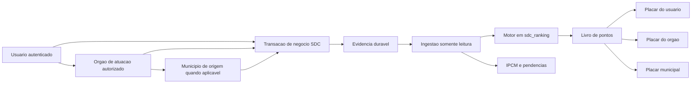
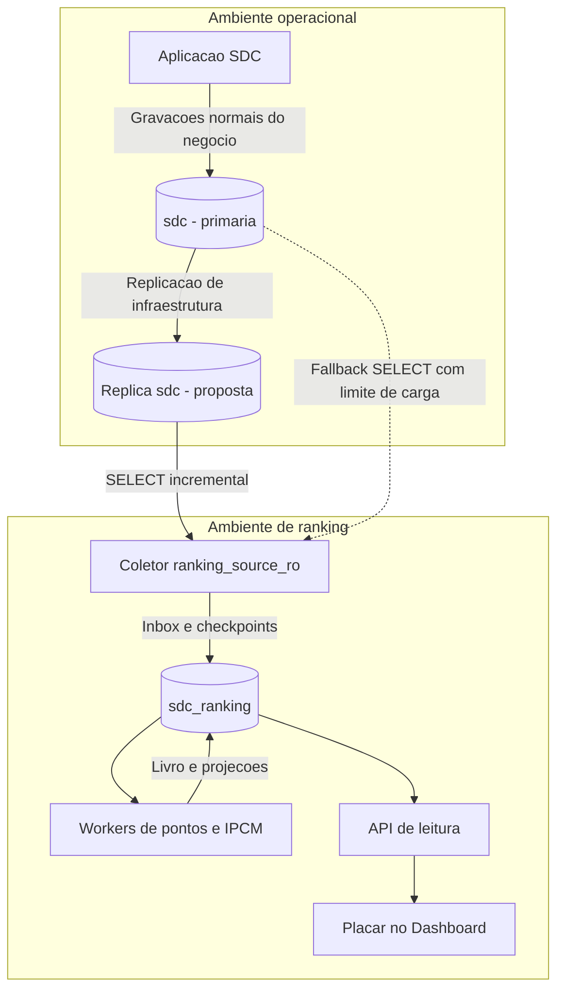
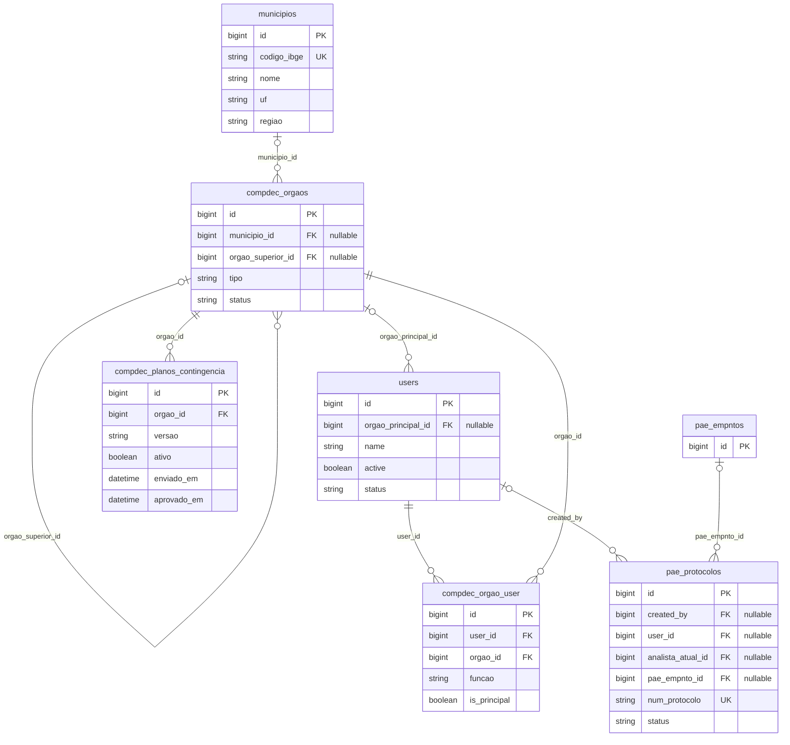
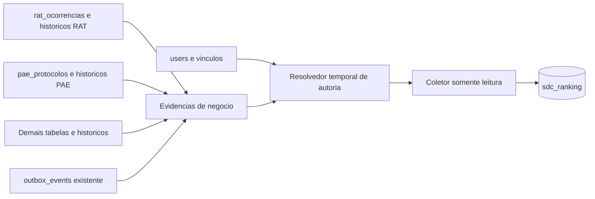
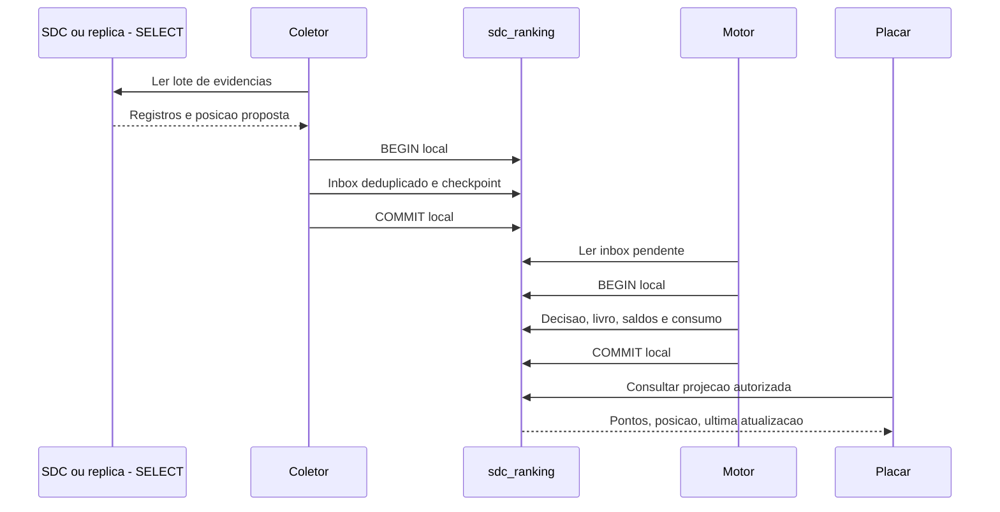
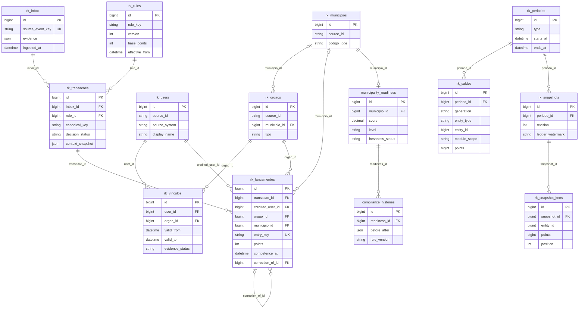

# Plano de implementação — Ranking transacional, placar e IPCM em base independente

> Revisão 3 — 21/09/2026. Consolida pontos por transações de todos os módulos, usuário → órgão → município e database própria, separada de `sdc`, com origem somente de leitura. Substitui integralmente a primeira versão. Esta entrega é documental; nenhum banco ou código de aplicação foi alterado.
>
> Execução futura: seguir `superpowers:executing-plans`, uma etapa por vez, com as verificações deste documento.

**Objetivo:** reconhecer entregas realizadas no SDC por meio de pontos auditáveis, elevar a posição dos usuários, órgãos e municípios nos respectivos placares e apresentar o IPCM como avaliação de conformidade separada.

**Arquitetura:** database PostgreSQL exclusiva `sdc_ranking`, ingestão incremental de evidências da origem, livro de pontos imutável e projeções de leitura. Workers próprios processam pontuação e IPCM. Saldos, posições e extratos são consultados exclusivamente na base do ranking.

**Stack observada:** PHP 8.3+, Laravel 12, PostgreSQL, Vue/Inertia, filas, eventos de domínio, outbox e Octane. Valores e metas apresentados são propostas para implementação/homologação, não resultados medidos ou normas já vigentes.

## 1. Visão funcional



Cada transação de negócio recebe decisão explícita: crédito confirmado, crédito pendente de validação, zero com motivo ou estorno. Entrega válida aumenta o saldo e pode elevar a posição. Clique, autosave ou transação SQL isolada não equivalem necessariamente a entrega premiável.

| Informação | Escala | Uso |
|---|---|---|
| Pontos de atividade | Inteiros acumuláveis, sem limite global. | Reconhecer entregas. |
| Posição no ranking | 1º, 2º, 3º etc., por escopo/período. | Compor o placar e acompanhar evolução. |
| IPCM | 0–100 e Verde/Amarelo/Vermelho ou Em apuração. | Avaliar validade documental, prontidão e impedimentos. |

Pontos de RAT, PAE ou treinamento não apagam prestação de contas vencida. Município pode liderar em atividade e apresentar restrição de conformidade. As duas informações são visíveis e rotuladas separadamente.

O produto inclui Meu placar, Meu órgão, Meu município, classificação estadual/regional, extrato e regras publicadas. RAT e PAE integram a primeira entrega funcional; todos os módulos têm cobertura explícita no catálogo.

## 2. Banco próprio e isolamento de carga

### 2.1 Decisão e conexões

Criar **uma database PostgreSQL `sdc_ranking`**, não apenas um schema em `sdc`. A imagem fornecida mostra outras bases separadas no ambiente; o nome proposto segue essa organização. Ela não comprova existência de réplica, permissões ou recursos dedicados, que serão verificados na implantação.

| Conexão proposta | Destino | Privilégio | Consumidor |
|---|---|---|---|
| `ranking_source_ro` | `sdc`, preferencialmente em réplica. | SELECT restrito; sem escrita/DDL. | Coletor incremental. |
| `ranking` | `sdc_ranking`. | Leitura/escrita local. | Motor, projeções e ajustes. |
| `ranking_read` | `sdc_ranking`. | SELECT em dados autorizados. | API/controller de leitura. |
| Conexão operacional existente | `sdc`. | Permissões atuais dos módulos. | Operações normais do SDC. |

O coletor não pode executar INSERT, UPDATE, DELETE, TRUNCATE, criar triggers, adicionar colunas de pontos, marcar eventos consumidos ou gravar cursores em `sdc`. Inbox, checkpoints, regras, pontos, placares e históricos de conformidade ficam em `sdc_ranking`.

Não consumir a origem pelo `OutboxDispatcher`: ele atualiza os registros. Ler independentemente a outbox existente, reaproveitando seu contrato. Não presumir que a conexão `carga` seja réplica PostgreSQL: a configuração consultada declara driver MySQL.

Separar database isola tabelas e permissões, mas **não isola CPU, RAM ou disco se estiver no mesmo servidor**. Recomendar instância/container próprio para ranking, com limites de recursos, e réplica de leitura para SDC. Se iniciar no mesmo cluster, tratar como isolamento lógico e medir contenção. Leitura e replicação também têm custo; não prometer carga zero.

### 2.2 Implantação



A réplica é recomendação, não recurso já confirmado. Sem ela, iniciar leitura primária controlada somente após medição. Não usar FDW/dblink ou JOIN remoto por acesso ao placar; trazer dados mínimos e relacionar localmente.

A autenticação continua no SDC. Não copiar senhas, tokens, CPF ou dados pessoais de beneficiários para montar ranking. A autorização das páginas usa sessão/políticas existentes, e a consulta de saldos usa a base própria.

### 2.3 Orçamento inicial proposto

- Lotes de 200 registros, uma conexão concorrente de coleta, intervalo de 30 segundos e timeout de consulta de 2 segundos; ajustar com medição.
- Colunas explícitas, paginação por chave e queries indexadas. Sem `SELECT *`, anexos binários ou varredura de todos os módulos a cada ciclo.
- Workers/filas próprios, com concorrência limitada; backoff em timeout, erro ou atraso de réplica.
- Bootstrap histórico fora do pico, pausável e retomável.
- Meta de atualização: até 60 segundos em carga normal, incluindo coleta, fila e réplica. Dez segundos só após comprovar capacidade e fonte adequada.
- Monitorar tempo de consulta/linhas lidas na origem, volume transferido, lag, backlog, memória e divergência de saldos.

## 3. Base relacional original SDC — Mermaid

### 3.1 Identidade institucional existente

Diagrama derivado de migrations/modelos do repositório. Os nomes atuais `compdec_orgaos` e `compdec_orgao_user` resultam de renomeações. Não foi consultado banco vivo; conferir constraints/tipos efetivos pelo catálogo PostgreSQL durante a implantação.



A pivot tem unicidade por órgão/usuário/função. Duas funções no mesmo órgão não geram dois créditos. Município de órgão estadual pode ser sede administrativa; a atribuição competitiva municipal depende do tipo/contexto, não só de campo preenchido.

### 3.2 Origem das evidências



As setas acima são processamento, não FKs físicas. `outbox_events.aggregate_type/aggregate_id` é referência polimórfica; não FK universal. `metadata` não garante autoria completa de todos os eventos.

No RAT, a migration consultada declara `created_by`/`updated_by` como texto e há migrations posteriores de UUID para ocorrências. Não inventar FK para `users.id` nem presumir ID bigint; o adaptador valida tipos e resolve autoria comprovada. Ambiguidade vai para apuração.

## 4. Usuário → órgão → município no instante da ação

O usuário autenticado é a origem da autoria. Órgão principal é padrão; múltiplos vínculos exigem órgão ativo autorizado e registrado na evidência. Município/órgão enviados pelo cliente nunca bastam como prova.

| Situação | Crédito |
|---|---|
| Usuário da COMPDEC A realiza entrega. | Usuário + órgão A + município A. |
| Usuário tem A/B e atua com B autorizado. | Usuário + órgão B + município B. |
| CEDEC/REDEC atende município B. | Usuário + órgão estadual/regional; B fica como território beneficiário. |
| Agente de A atende ocorrência em B. | A recebe contribuição institucional; B é território atendido. |
| Usuário muda de órgão depois. | Créditos e estornos antigos mantêm o vínculo original. |
| Automação/importação sem autoria comprovada. | Zero competitivo; nunca usar último usuário conectado. |
| Autoria/vínculo não reconstruível. | Em apuração, sem crédito presumido. |

Um prêmio de 20 aparece nas três dimensões, mas continua sendo **um lançamento de 20**, não 60.

Ordem de prova: contexto do evento/histórico; auditoria mais vínculo temporal comprovado; caso contrário apuração. Copiar o órgão atual do usuário não prova vínculo histórico. Dimensões locais preservam versões e intervalos; data de observação não é automaticamente data de mudança.

O coletor read-only não pode completar retroativamente fato inexistente. Módulo sem autoria/histórico suficiente requer disponibilidade de eventos/auditoria ou CDC com contexto adequado antes da cobertura integral. Instrumentar o negócio é mudança própria do SDC, separada do ranking e de sua credencial SELECT.

Guardar executor (`actor_user_id`), beneficiário do crédito (`credited_user_id`) e validador. Por padrão executor e creditado são o autor da etapa. Validador não herda o prêmio; parecer próprio pode gerar outro marco. Em treinamento, conclusão pontua participante comprovado na inscrição, com executor separado e vínculo na competência. Não permitir destinatário livre de pontos na interface.

No MVP há um responsável creditado por marco. Colaboradores ficam auditados, sem multiplicar pontos por equipe. Correção de autoria exige estorno e crédito corretivo relacionado.

## 5. Pontuação e proteção contra duplicidade

| Marco padrão | Base | Condição |
|---|---:|---|
| Registro completo aceito | 5 | Criação vazia/rascunho vale zero. |
| Envio completo | 10 | Primeiro envio válido do ciclo. |
| Entrega técnica validada | 20 | Resultado comprovado. |
| Revisão periódica aceita | 20 | Um crédito por ciclo reconhecido. |
| Contas aceitas | 30 | Obrigação concluída e aceita. |
| Entrega operacional simples | 10 | Resultado aceito, não cada edição. |

```text
bonus = floor(base × 20 / 100), se entrega tempestiva e prazo aplicável comprovado
bonus = 0, se prazo ausente, desconhecido ou descumprido
credito = base + bonus
saldo = soma(creditos confirmados) - soma(estornos confirmados)
```

Usar inteiros, catálogo versionado e regra vigente na competência. Não multiplicar por cargo, dinheiro, vítimas, gravidade ou anexos. Bônus usa entrega posteriormente aceita e vencimento efetivo com prorrogação, sem penalizar demora do analista.

- Rascunho, autosave, leitura, login, reenvio idêntico e alteração cosmética: zero com motivo.
- Um prêmio por recurso/ciclo/marco, mesmo com outro UUID, rota ou usuário repetidor.
- Nova viagem/ciclo/vistoria reconhecida pode pontuar; versão técnica não basta.
- Reabertura retira o crédito invalidado; reconclusão restaura no máximo o retirado.
- Cancelamento gera estorno referenciado, incluindo bônus; não pode exceder o crédito.
- Importação histórica exige lote aprovado com autoria/competência comprovadas; não premiar o operador da importação.
- Ajustes preservam livro original, justificativa, solicitante/aprovador e lançamentos corretivos.

Pontos históricos não decaem. Temporadas mensais/anuais mudam a janela; vencimento documental afeta IPCM separadamente.

## 6. Cobertura de todos os módulos

Foram identificados **24 diretórios** em `SDC/app/Modules`. Marcos abaixo são contratos propostos, não garantia de eventos já existentes. `tdap.viagem.validada` foi encontrado; os demais exigem mapeamento de fonte concreta antes de ativação.

| Módulo | Marcos propostos | Base | Unidade/controle |
|---|---|---:|---|
| Rat | Registro completo; relatório finalizado; vistoria validada. | 5 / 20 / 15 | Ocorrência/marco e vistoria distinta. |
| Pae | Protocolo enviado; formulário validado; revisão aceita; parecer concluído. | 10 / 20 / 20 / 15 | Protocolo/ciclo/marco; parecer para seu autor. |
| PlanCon | Plano enviado; revisão aceita. | 10 / 20 | Plano/ciclo municipal, mesma identidade usada em Compdec. |
| Compdec | Cadastro revalidado; equipe revalidada. | 20 / 10 | Órgão/ciclo; plano pontua uma vez via PlanCon. |
| Decretacoes | Processo enviado; instrução validada. | 10 / 20 | Processo/marco, sem bônus por gravidade. |
| AjudaHumanitaria | Pedido completo; entrega comprovada; contas aceitas. | 5 / 20 / 30 | Pedido/entrega/obrigação; identidade compartilhada com Estoque. |
| Pmda | Plano enviado; execução comprovada; contas aceitas. | 10 / 20 / 30 | Plano/ciclo/obrigação; linhas/comunidades não multiplicam o plano. |
| Tdap | Cronograma ativado; viagem validada; vistoria validada. | 10 / 10 / 15 | Cronograma/viagem/vistoria. |
| Cisterna | OS emitida; vistoria validada; entrega validada. | 5 / 15 / 20 | OS/vistoria/entrega; leitura de QR code: zero. |
| Estoque | Movimento confirmado; inventário conciliado. | 5 / 20 | Movimento/ciclo; sem duplicar movimento AH. |
| Inventario | Bem validado; ciclo conciliado. | 5 / 20 | Bem/ciclo; editar campos não multiplica. |
| Plantao | Turno assumido; passagem validada; missão concluída. | 5 / 15 / 20 | Turno/passagem/missão; reabrir não reinicia prêmio. |
| Demandas | Entrega aceita. | 10 | Demanda; mover card: zero. |
| Geoespacial | Camada validada; revisão aceita. | 15 / 10 | Conteúdo/ciclo; reprocessamento e arquivo repetido: zero. |
| Treinamento | Curso concluído; turma encerrada pelo responsável. | 20 / 15 | Participante/edição e turma/instrutor; presença isolada: zero. |
| Cedec | Cadastro institucional validado. | 10 | Entidade/ciclo; evitar duplicação com Compdec. |
| Suporte | Solução aceita. | 5 | Chamado/responsável; abrir chamado/mensagem: zero. |
| Cemaden | Leitura e ingestão automática. | 0 | Atendimento humano pontua no domínio operacional que o registra. |
| Inmet | Consulta/ingestão meteorológica. | 0 | Sem crédito por coleta automática. |
| Sismos | Consulta/ingestão sísmica. | 0 | Evento natural não é entrega do usuário. |
| Medalhao | Ingestão, normalização, rollup, arquivamento. | 0 | Infraestrutura; não duplicar fatos da origem. |
| Notificacoes | Envio, leitura, recebimento. | 0 | Não multiplicar a transação que originou o aviso. |
| Dashboard | Visualização, filtro, exportação. | 0 | Consome placar. |
| Shared | Helpers e eventos genéricos. | 0 | Infraestrutura transversal. |

Ranking/Compliance futuros também têm zero de prêmio pelo próprio processamento. Estorno é correção negativa, nunca nova atividade premiada.

Cada módulo deve ter regra ou motivo de zero/lacuna. Workflow ausente: `workflow_not_available`; evidência insuficiente: `source_evidence_missing`. Não inferir aprovação por upload ou `updated_at`. Diretório novo sem catálogo aparece como pendência de cobertura; nenhuma regra genérica concede crédito automaticamente.

## 7. Ranking, períodos e placar

### 7.1 Dimensões e visibilidade

- Meu placar: saldo pessoal, extrato e posição entre usuários do órgão ativo.
- Meu órgão: lançamentos atribuídos ao órgão, contribuição da equipe e posição entre órgãos do mesmo tipo.
- Meu município: lançamentos de origem municipal, posição estadual/regional e composição por módulo.
- Visão ampliada: autorizada institucionalmente; agregados municipais não implicam divulgar extratos pessoais de todos os usuários.

Total pessoal acompanha o usuário; contribuição ao órgão considera o vínculo histórico. CEDEC/REDEC não entram na lista padrão das COMPDECs. Usuário sem município vê placar pessoal/institucional e indicação da ausência de vínculo aplicável.

### 7.2 Períodos, empates e faixas

Padrão: mês atual. Alternativas: ano e acumulado desde ativação. Persistir UTC e delimitar calendário `America/Sao_Paulo` com intervalos `[início, fim)`.

Ordenar por saldo confirmado decrescente. Empates compartilham posição densa: 1, 2, 2, 3. ID serve apenas à paginação estável. Participante elegível sem entrega aparece com zero; vínculo em apuração fica fora da classificação.

Guardar participantes, região/tipo por período. Comparar evolução somente com snapshot do mesmo escopo/período; sem base comparável mostrar “sem comparação”. Reorganização administrativa não reescreve ranking antigo.

Faixas propostas: Iniciante 0–99; Participante 100–299; Colaborador 300–699; Destaque 700–1.499; Referência 1.500+. São faixas de atividade, não cores do IPCM. Ranking principal usa pontos brutos; número de participantes e módulos contextualizam volume. Não aplicar normalização populacional sem decisão explícita.

### 7.3 Competência e exemplo

Guardar ocorrência, envio, validação, ingestão e competência. Entrega aceita depois pontua no período da entrega válida original. Estorno afeta o mesmo período e o acumulado. Resultado já publicado recebe revisão com motivo, preservando snapshot anterior. Instante desconhecido não vira silenciosamente horário da coleta.

Ana, da COMPDEC A, registra RAT completo (5), finaliza RAT no prazo (20+4), envia protocolo PAE (10), tem formulário PAE validado (20) e conclui curso (20). Os três últimos marcos deste exemplo não têm prazo bonificável.

Saldo: **79 para Ana**, contribuição de **79 para COMPDEC A** e **79 para município A**. É o mesmo conjunto de 79 pontos, não 237. Com 50 de Bruno no mesmo órgão, instituição/município têm 129, e Ana mantém 79.

Reenviar RAT não aumenta saldo. Invalidar somente a finalização estorna 24: Ana fica com 55 e órgão/município com 105. Mudança posterior para B não transfere o histórico; novas entregas comprovadas em B contribuem para B.

## 8. Ingestão read-only e integridade

### 8.1 Fontes e completude

Priorizar eventos imutáveis já existentes em `outbox_events`; históricos/auditorias duráveis; dados de estado para dimensões/reconciliação. Não ler apenas `dispatched_at IS NULL`: o consumidor operacional pode já ter despachado um evento que o ranking ainda não recebeu.

Polling de `updated_at` **não captura necessariamente cada transação**: alterações intermediárias, exclusões físicas e autorias sobrescritas podem desaparecer. Fonte de estado isolada não atende a promessa de cobertura integral. Habilitar marco somente com evidência durável ou CDC e contexto suficiente.

CDC requer configuração de replicação/retenção/identidade de exclusões pelo DBA e monitoramento de WAL; não é permissão SELECT comum. A conta SQL do ranking continua sem escrita em `sdc`. CDC de linha sem ator não resolve autoria; essa informação precisa existir em evidência complementar.

### 8.2 Cursor e retenção

Checkpoints ficam em `sdc_ranking`, por fonte. Para CDC usar offset de commit e índice na transação. Para leitura de históricos/outbox, usar paginação estável, sobreposição, deduplicação e reconciliação dentro da retenção.

UUIDv7, ID crescente e `occurred_at` não garantem ordem de commit: transação longa pode aparecer depois com chave antiga. Sobreposição reduz risco, mas não prova completude ilimitada. Sem limite demonstrável de atraso e retenção suficiente, classificar fonte como parcial ou exigir offset de commit antes de declarar cobertura integral.

Retenção deve superar indisponibilidade máxima mais recuperação. Se houver intervalo perdido, registrar incompletude e suspender publicação afetada até recuperação; não declarar conciliação sem evidência.

### 8.3 Copiar antes de avançar



Não há transação atômica compartilhada entre as databases. Checkpoint avança junto com cópia local durável; consumo, livro e saldos são atômicos somente no destino. Queda antes do commit relê o lote; queda depois não duplica por causa das unicidades. Ranking indisponível não desfaz operação já confirmada no SDC.

### 8.4 Duas barreiras de unicidade

1. Técnica: origem + ID de evento/histórico + consumidor.
2. Negócio: recurso canônico + ciclo + marco + família da regra. Usuário/versão da regra não criam outro prêmio.

Revisão aceita do plano 123/ciclo 2026 é o mesmo fato em Compdec/PlanCon. Correção referencia crédito e decisão única; lock limita saldo estornável. Cancelamento anterior à confirmação exige conciliação causal por sequência/versão, sem crédito indevido temporário.

## 9. Modelo relacional de sdc_ranking

IDs de `sdc` são referências externas com `source_system/source_id`, **sem FK entre databases**. FKs existem apenas entre cópias locais. As relações com a origem são lógicas e verificadas pela ingestão.



O ER é um recorte, complementado pelos requisitos abaixo:

| Estrutura | Complementos obrigatórios |
|---|---|
| `rk_sync_checkpoints` | Fonte, cursor/offset, janela, último sucesso, lag e completude; somente no destino. |
| Dimensões/vínculos | Unicidade origem/ID; histórico de vínculo com prova temporal; datas desconhecidas identificadas. |
| `rk_inbox` | Evidência mínima, hash, versão, sequência/commit e estado. Não copiar payload sensível integral sem necessidade. |
| `rk_rules` | Único regra/versão, vigência sem sobreposição, bônus, confirmação, estorno; publicação imutável. |
| `rk_transacoes` | pending/confirmed/zero/under_review/reversed, motivo, executor/creditado/validador e beneficiários territoriais. Regra pode ser nula em apuração. |
| `rk_lancamentos` | Base, bônus, regra/versão, pontos assinados e referências; append-only. Unicidade de prêmio e de correção. |
| `rk_participantes` | Período, dimensão, entidade, região/tipo congelados e elegibilidade; inclui saldo zero. |
| `rk_saldos` | Único geração/período/dimensão/entidade/módulo; valor explícito `all`, não NULL para total. |
| `rk_snapshot_itens` | Tipo e ID da entidade; único snapshot/tipo/ID para evitar colisão entre usuário e órgão. |
| `rk_adjustment_requests` | Crédito, motivo, solicitante, aprovador e decisão; sem edição livre de saldo. |
| `compliance_exceptions` | Município, programa/operação, processo, autoridade, justificativa, vigência; não altera pontos. |

Índices: usuário/competência, órgão/competência, município/competência, chave canônica, referência corretiva e pendências. Não apagar lançamentos em cascata com remoção de usuário da origem. Dimensão atrasada deixa transação pendente; não fabricar autoria para satisfazer FK. Projeções polimórficas validam tipo/entidade na escrita.

Consolidar todas as tabelas novas de ranking/conformidade em `SDC/database/migrations/ranking/2026_09_21_100000_create_ranking_database_tables.php`, executada explicitamente contra `ranking`. A migration valida o destino e recusa `sdc`; tabela de controle de migrations fica na base própria. Não rodar o diretório geral de migrations SDC na database nova.

## 10. IPCM na base própria

IPCM é calculado e persistido em `sdc_ranking` a partir de evidências lidas. Não soma/subtrai pontos transacionais.

| Critério | Peso | Regra proposta |
|---|---:|---|
| COMPDEC | 30 | Revalidar em 12 meses, configurável para 6; aviso 30 dias antes; inatividade impeditiva. |
| Plano municipal aplicável | 30 | Revisão anual; alerta aos 11 meses; vencimento conforme homologação. PAE de empreendimento não substitui PlanCon automaticamente. |
| RAT/FIDE tempestivo | 15 | Entregas no prazo / obrigações avaliáveis em 12 meses; prazo de 72 horas é hipótese a homologar. |
| Contas AH/PMDA | 25 | Obrigações exigíveis regulares; pendência vencida gera impedimento. |

Fatores documentais: 1 regular, redução linear de 1 a 0,5 na advertência, 0 no vencimento. Operação: proporção tempestiva. Contas: 1 sem pendência vencida e 0 com pendência. `IPCM = round(100 × soma(peso × fator) / soma(pesos aplicáveis), 2)`.

Ausência confirmada de obrigação é não aplicável. Fonte incompleta é Em apuração, não nota zero ou regularidade presumida. Sem critérios avaliáveis, nota nula. Meses reais, calendário institucional, prorrogações comprovadas e data de entrega reconhecida; upload repetido não renova validade.

- Verde: ≥90, sem advertência/impedimento.
- Amarelo: sem impedimento, mas advertência, pendência menor ou nota inferior a 90.
- Vermelho: impedimento comprovado prevalece sobre nota.
- Tolerância menor proposta: 30 dias após vencimento; aviso prévio não consome prazo. Inatividade/contas vencidas seguem regra específica.

Calcular diariamente às 03:30 e por chegada de evidência/transição temporal. Guardar `source_as_of`, `calculated_at`, `next_transition_at` e freshness. Réplica atrasada não sustenta novo bloqueio sem confirmação suficiente.

Restrições futuras são aplicadas pelo domínio operacional responsável, que pode ler resultado IPCM, mas valida evidência relevante/atualidade na autorização. Ranking não grava bloqueios em `sdc` nem concede recursos automaticamente. Emergências têm processo, autoridade, justificativa e vigência; “emergência gravíssima” requer definição institucional. Exceção não altera pontos nem apaga pendência; regularização continua acessível.

## 11. Arquivos e contratos propostos

Todos os caminhos são relativos à raiz do repositório. Os componentes novos são especificação, não implementação existente.

| Arquivo/local | Responsabilidade |
|---|---|
| `SDC/config/database.php` | Três conexões explícitas, sem fallback de escrita para SDC. |
| `SDC/config/ranking.php` | Flags, fontes permitidas, limites e parâmetros operacionais. |
| Migration dedicada da seção 9 | Schema completo na base própria. |
| `SDC/database/seeders/RankingRuleSeeder.php` | Catálogo inicial, conexão própria explícita. |
| `SDC/app/Modules/Ranking/Domain/DTOs/ScoringTransaction.php` | Fato, autoria/evidência, ciclo e competência. |
| `SDC/app/Modules/Ranking/Domain/DTOs/ScoreDecision.php` | Estado, base, bônus, total, regra e motivo. |
| `SDC/app/Modules/Ranking/Domain/Services/ScoreCalculator.php` | Cálculo puro, sem sessão/banco. |
| `SDC/app/Modules/Ranking/Ingestion/SourceReader.php` | SELECT controlado; sem models operacionais com observers de escrita. |
| `SDC/app/Modules/Ranking/Ingestion/SyncBatch.php` | Inbox/checkpoint atômicos no destino. |
| `SDC/app/Modules/Ranking/Services/InstitutionalContextResolver.php` | Contexto histórico, nunca usuário atual do worker. |
| `SDC/app/Modules/Ranking/Adapters/RatAdapter.php` e `PaeAdapter.php` | Normalizar fontes e marcos reais. |
| `SDC/app/Modules/Ranking/Adapters/` | Demais adaptadores por domínio e deduplicação canônica. |
| `SDC/app/Modules/Ranking/Services/RecordScoreTransaction.php` | Consumo, livro e saldos locais. |
| `SDC/app/Modules/Ranking/Services/ReverseScoreEntry.php` | Correção limitada e auditada. |
| `SDC/app/Modules/Ranking/Services/LeaderboardQuery.php` | Consulta autorizada/paginada. |
| `SDC/app/Modules/Ranking/Services/RebuildLeaderboard.php` | Reconstrução por geração. |
| `SDC/app/Modules/Ranking/Services/MunicipalityReadinessService.php` | IPCM local. |
| `SDC/app/Modules/Ranking/Controllers/RankingController.php` | Consultas e pedidos de correção. |
| `SDC/app/Modules/Ranking/RankingServiceProvider.php` | Dependências/adaptadores/rotas no padrão existente. |

```text
SourceReader.readBatch(source, cursor, limit) -> SourceBatch
SyncBatch.persist(SourceBatch) -> LocalCheckpoint
InstitutionalContextResolver.resolve(evidence) -> confirmed_context | under_review
ModuleAdapter.normalize(evidence, context) -> ScoringTransaction
ScoreCalculator.calculate(transaction, published_rule) -> ScoreDecision
RecordScoreTransaction.handle(transaction) -> ScoreDecision
LeaderboardQuery.get(authorized_filters) -> paginated_leaderboard
```

`SourceBatch` contém registros, posição proposta, completude e instante da origem. `LocalCheckpoint` só avança com inbox durável. Na implementação, criar interfaces/DTOs tipados; as linhas acima não são código PHP executável.

Endpoints propostos: `GET /ranking/me`, `/ranking/leaderboard`, `/ranking/entries`, `/ranking/rules`; `POST /ranking/adjustment-requests` e `/ranking/adjustment-requests/{id}/decision`. Escritas de ajustes são apenas na base própria. Não criar endpoint livre de adicionar pontos.

Criar `SDC/resources/js/Pages/Ranking/Index.vue` e componentes `Components/Ranking/ScoreSummary.vue`, `LeaderboardTable.vue`, `ScoreStatement.vue`. Integrar `SDC/resources/js/Pages/Dashboard.vue` e `SDC/app/Http/Controllers/DashboardController.php`.

Mostrar saldo confirmado, pendente, regra/base/bônus, posição, contribuição por módulo e última sincronização. Contexto atual autoriza a visualização; contexto histórico atribui os pontos. Extrato/canais/links respeitam políticas do SDC. Cache inclui escopo, período, dimensão, módulo e geração; autorização indisponível não autoriza extrato sensível por cache antigo.

## 12. Etapas detalhadas de implementação

### Etapa 1 — Inventário e contrato de cobertura

**Dependência:** nenhuma. **Referências:** 24 módulos, migrations de identidade/outbox, `User`, `Orgao` e `Municipio`.

- [ ] Listar transações reais de cada módulo, incluindo APIs/jobs, e relacionar ao catálogo da seção 6.
- [ ] Mapear tabelas, PKs, históricos/eventos, sequência, retenção, autoria, ciclo e prazo de cada marco.
- [ ] Conferir schema efetivo pelo catálogo PostgreSQL somente leitura; corrigir diagramas se houver divergência.
- [ ] Classificar fonte como completa/parcial/ausente e indicar dependência de eventos/auditoria/CDC.
- [ ] Definir chaves canônicas compartilhadas: Compdec/PlanCon, Cedec/Compdec e AH/Estoque.
- [ ] Homologar valores, autoria de treinamento e correções; recuperar ENGINEER/PAPIROS.

**Verificação:** seguir RAT e PAE reais da evidência até autoria/vínculo histórico. **Aceite:** todos os módulos classificados; nenhuma regra ativa depende de campo presumido. **Entrega:** catálogo pronto para seed e contrato de ingestão.

### Etapa 2 — Provisionar base e credenciais independentes

**Depende:** etapa 1. **Arquivos:** `SDC/config/database.php`, configuração de ambiente pelo mecanismo existente, migration dedicada.

- [ ] Criar `sdc_ranking` em instância dedicada preferencialmente; medir orçamento se compartilhar cluster.
- [ ] Criar usuário SELECT restrito na origem e usuários separados de migration, escrita e leitura no destino.
- [ ] Configurar réplica quando disponível; não presumir a conexão `carga` como réplica PostgreSQL.
- [ ] Definir conexões explícitas nos models/commands, sem fallback para `sdc`.
- [ ] Separar workers/filas, limitar conexões e configurar backup/restauração próprios.
- [ ] Verificar privilégios via catálogo; provar rejeição de escrita/DDL em ambiente descartável, sem tentar alterar dados reais.

**Aceite:** coletor apenas lê; migrations recusam destino `sdc`; falha do ranking não interrompe operação SDC. **Entrega:** infraestrutura pronta sem tabelas de ranking na origem.

### Etapa 3 — Schema local, catálogo e cálculo puro

**Depende:** etapa 2. **Arquivos:** migration da seção 9, seed, DTOs e `ScoreCalculator.php`.

- [ ] Criar dimensões, inbox, checkpoint, regras, livro, saldos, períodos, snapshots e Compliance na migration consolidada.
- [ ] Aplicar unicidades técnica/de negócio, índices, referência de correção e retenção sem cascade destrutivo.
- [ ] Publicar catálogo versionado com regras habilitadas somente para fontes comprovadas.
- [ ] Implementar base/bônus inteiro, zero/pendente/apuração e regra por competência.
- [ ] Testar 20+4=24; atraso=20; rascunho=0; regra desabilitada sem crédito.
- [ ] Validar instalação limpa em banco descartável e atualização controlada de base instalada; nunca `migrate:fresh` sobre dados preservados.

**Aceite:** motor determinístico e constraints impedindo duplicidade, exclusivamente no destino. **Entrega:** persistência/cálculo preparados, sem coleta ativa.

### Etapa 4 — Ingestão e contexto institucional histórico

**Depende:** etapa 3. **Arquivos:** `SourceReader`, `SyncBatch`, `InstitutionalContextResolver` e adaptadores de identidade.

- [ ] Fazer bootstrap mínimo de municípios/órgãos/usuários/vínculos, excluindo senhas, CPF e informações desnecessárias.
- [ ] Implementar leitura incremental limitada, timeout, paginação e checkpoint local.
- [ ] Persistir inbox deduplicado/checkpoint na mesma transação de destino.
- [ ] Resolver vínculo no instante do fato; não preencher ausência com órgão atual.
- [ ] Tratar ordem de commit, transações longas, exclusões, lag e retenção conforme seção 8.
- [ ] Simular queda antes/depois do commit, lote repetido e dimensão que chega depois do evento.

**Aceite:** retomada sem perda/duplicação; fonte parcial identificada; nenhuma escrita na origem. **Entrega:** coletor recuperável com completude observável.

### Etapa 5 — Livro de pontos e projeções idempotentes

**Depende:** etapa 4. **Arquivos:** `RecordScoreTransaction`, `ReverseScoreEntry` e models locais.

- [ ] Normalizar fatos e aplicar regra versionada com contexto histórico.
- [ ] Gravar decisão, lançamento, saldos e consumo em transação local única.
- [ ] Implementar as duas unicidades, sem premiar outro UUID/usuário pelo mesmo marco.
- [ ] Implementar estorno/restauração limitados e tratamento causal de cancelamento antes da confirmação.
- [ ] Atualizar concorrentemente os três escopos sem perder incrementos.
- [ ] Repetir o mesmo fato 100 vezes e conciliar ledger/projeções; testar fatos distintos concorrentes.

**Aceite:** um prêmio por marco e contribuição coerente por usuário/órgão/município. **Entrega:** pipeline local em modo sombra.

### Etapa 6 — Primeira fatia funcional: RAT e PAE

**Depende:** etapa 5. **Fontes reais para mapear:** `SDC/app/Modules/Rat/Services/RatWriteService.php`, `Pae/Services/PaeProtocoloService.php`, `Pae/Services/PaeFormularioService.php` e suas tabelas/históricos. Os dois últimos caminhos são relativos a `SDC/app/Modules/`.

- [ ] RAT: distinguir criação vazia, registro completo, finalização e vistoria; `saveDraft` vale zero.
- [ ] Validar tipos de IDs/autoria e fatos disponíveis; não presumir FK de `created_by` textual.
- [ ] PAE: mapear envio, formulário validado, revisão aceita e parecer; não substituir pelo PlanCon.
- [ ] Identificar autor, validador, ciclo legítimo e prazo; não usar `updated_at` como prova suficiente.
- [ ] Cobrir cancelamento/reabertura; upload/versão técnica não criam novo prêmio.
- [ ] Comparar jornadas municipal/estadual com saldos locais; manter marco desabilitado quando faltar evidência.

**Aceite:** RAT/PAE com extrato explicável e autoria correta, sem escrita do coletor na origem. **Entrega:** piloto dos módulos prioritários.

### Etapa 7 — Programas de atendimento e logística

**Depende:** etapa 6. **Fontes:** serviços/tabelas AH, PMDA, TDAP, Cisterna, Estoque/Inventario e evento TDAP existente.

- [ ] AH: pedido, entrega e contas, com identidade de movimento compartilhada com Estoque.
- [ ] PMDA: envio, execução e contas somente onde houver fluxo/prova disponíveis.
- [ ] TDAP: ler `tdap.viagem.validada` sem alterar `dispatched_at`; distinguir autor do validador.
- [ ] Mapear cronogramas, vistorias, ordens de serviço/inventários sem premiar linhas filhas.
- [ ] Verificar atendimento a vários municípios sem multiplicar crédito institucional.
- [ ] Testar lotes, reenvio, reprovação, cancelamento e fato presente em mais de uma fonte.

**Aceite:** evento compartilhado pontua uma vez; volume financeiro não altera base. **Entrega:** segunda onda e relatório de fontes atualizado.

### Etapa 8 — Demais módulos e fechamento da cobertura

**Depende:** etapa 5; executar após a onda prioritária. **Arquivos:** adaptadores Compdec, PlanCon, Cedec, Decretacoes, Plantao, Demandas, Geoespacial, Treinamento, Suporte e catálogo dos automáticos.

- [ ] Unificar identidade de planos/cadastros e ciclos de revalidação.
- [ ] Mapear instrução de decretação, passagem de plantão, missão e demanda aceita.
- [ ] Distinguir camada/revisão de reprocessamento técnico por conteúdo/ciclo.
- [ ] Treinamento: validar participante/executor/vínculo; Suporte: solução aceita para seu responsável.
- [ ] Registrar zero explícito para rotinas Cemaden, Inmet, Sismos, Medalhao, Notificacoes, Dashboard e Shared.
- [ ] Comparar catálogo com diretórios reais; workflows/evidências ausentes permanecem como lacunas visíveis.

**Aceite:** 24 módulos classificados e toda regra ativa com fonte comprovada. Só declarar cobertura transacional integral após resolver as lacunas. **Entrega:** catálogo integral instrumentado para os fluxos verificáveis.

### Etapa 9 — Períodos, consultas e reconstrução

**Depende:** etapa 5. **Arquivos:** `LeaderboardQuery`, `RebuildLeaderboard`, comandos e períodos/snapshots.

- [ ] Implementar mês/ano/acumulado, participantes com zero e filtros de dimensão/módulo.
- [ ] Implementar posição densa e paginação estável entre empatados.
- [ ] Comparar somente snapshots compatíveis.
- [ ] Reconstruir em nova geração a partir do livro com watermark e deltas concorrentes.
- [ ] Conciliar contagens/somas antes de trocar o ponteiro ativo atomicamente; não truncar placar em uso.
- [ ] Publicar correções tardias com revisão e histórico anterior preservado.

**Aceite:** reconstrução coincide com ledger e não perde eventos concorrentes; leitura do placar não consulta `sdc`. **Entrega:** leitura local rápida e recuperável.

### Etapa 10 — Interface e permissões

**Depende:** etapas 6 e 9. **Arquivos:** controller/provider/policy de Ranking, Dashboard e componentes Vue da seção 11.

- [ ] Construir Meu placar/Meu órgão/Meu município, contexto ativo e filtros.
- [ ] Mostrar saldo, posição, evolução, pendências, regras e extrato com base/bônus/competência.
- [ ] Mostrar última sincronização, falta de município e completude da fonte.
- [ ] Atualizar após processamento local, sem recalcular módulos na abertura da página.
- [ ] Aplicar autorização no backend para consultas, extratos, exportação, links e canais; separar visualizar/aprovar ajustes.
- [ ] Validar celular, teclado, empates, zero, fila atrasada e filtros adulterados.

**Aceite:** contribuição institucional compreensível e nenhum vazamento de extrato por URL/cache. **Entrega:** placar visível ao piloto.

### Etapa 11 — IPCM e elegibilidade

**Depende:** etapa 10 e homologação institucional. **Arquivos:** `MunicipalityReadinessService`, projeções locais, componentes de conformidade e integração de leitura no domínio operacional quando aprovada.

- [ ] Mapear evidências/prazos reais, confirmando PAE versus PlanCon para obrigação municipal.
- [ ] Implementar cálculo versionado/histórico, ciclo diário e transições temporais na base própria.
- [ ] Exibir IPCM ao lado dos pontos com checklist acionável.
- [ ] Detectar fonte atrasada/incompleta e impedir sanção nova baseada só em projeção desatualizada.
- [ ] Definir consulta por programa/operação, com verificação final no domínio responsável e sem escrita do ranking em `sdc`.
- [ ] Implementar exceções e alertas no armazenamento/dispatcher próprios. Reuso de canal existente exige contrato explícito, nunca escrita pelo coletor read-only.

**Aceite:** pontos não anulam restrição; incompletude não vira sanção; emergência/regularização continuam disponíveis. **Entrega:** prontidão integrada ao placar.

### Etapa 12 — Operação, rollout e recuperação

**Depende:** etapas anteriores da onda. **Arquivos:** comandos, workers/scheduler e flags próprias.

- [ ] Implementar `ranking:verify-catalog`, `ranking:sync --source=outbox --limit=200`, `ranking:reconcile --dry-run`, `ranking:rebuild --period=2026-09 --dry-run` e `ranking:snapshot --period=2026-09`.
- [ ] Garantir que sync/rebuild escrevem apenas na base própria; os comandos acima ainda serão criados.
- [ ] Agendar coleta/conciliação/snapshots uma vez; conferir `php artisan schedule:list` e os agendamentos existentes em `routes/console.php` e `app/Console/Kernel.php`.
- [ ] Implementar métricas, backoff, recuperação dentro da retenção e backup/restauração da base própria.
- [ ] Rodar testes focados/carga medida, retirar logs temporários e conferir staging sem testes temporários.
- [ ] Ativar captura em modo sombra, validar amostra RAT/PAE, publicar regras e habilitar placar por onda.
- [ ] Ativar IPCM inicialmente sem enforcement; restrições exigem homologação/comunicação específicas.
- [ ] Em rollback, ocultar placar/suspender regra afetada, preservando inbox/livro/checkpoints; retomar com competência original.

**Aceite final:** banco independente, origem read-only, cobertura demonstrável, saldos conciliados e recuperação ensaiada. **Entrega:** operação institucional pronta.

## 13. Matriz de verificação

Na implementação, usar bancos descartáveis e relógio fixo. Testes temporários em `SDC/tests/Feature/Ranking/` e `SDC/tests/Feature/Compliance/`; executar `php artisan test --filter=Ranking` e `php artisan test --filter=Compliance` a partir de `SDC/`. Esses testes temporários não entram no commit, conforme regra do projeto.

| Caso | Resultado esperado |
|---|---|
| Privilégio e migration | SELECT permitido; escrita/DDL negados na origem; migration recusa `sdc`. |
| Placar com coletor parado | Consulta destino e informa atraso, sem varrer origem. |
| Database no mesmo host | Medir contenção; não declarar isolamento físico pela separação lógica. |
| Lote repetido/queda antes do commit | Inbox único, cursor consistente e retomada segura. |
| Transação longa com ID anterior | Não perdida silenciosamente; fonte retentiva/CDC ou apuração de cobertura. |
| Alterações intermediárias/exclusão | Fonte durável captura; estado atual isolado não é certificado como completo. |
| Mudança de órgão antes da coleta | Vínculo histórico comprovado ou apuração. |
| Múltiplas funções na pivot | Um crédito. |
| Agente estadual atende município | Crédito pessoal/órgão; território atendido não vira origem indevida. |
| Instrutor registra conclusão | Crédito ao participante comprovado e executor auditado. |
| Mesma entrega em dois módulos | Um prêmio canônico. |
| Eventos legítimos concorrentes | Soma completa sem incremento perdido. |
| Reabrir/concluir/repetir | Ganho líquido máximo igual ao prêmio original. |
| Estorno repetido/fora de ordem | Causalidade respeitada, sem estorno além do crédito. |
| Entrega pontual/análise atrasada | Bônus preservado quando aceita. |
| Nova regra/replay antigo | Regra original e nenhuma segunda premiação. |
| Saldos 100, 90, 90, 80 | Posições 1, 2, 2, 3. |
| Período encerrado/correção tardia | Revisão da competência original com histórico. |
| Rebuild concorrente | Delta incorporado e nova geração igual ao livro. |
| Extrato/filtro alheio | Backend nega acesso, inclusive link/cache/canal. |
| Inmet/Medalhao/notificação | Zero competitivo e nenhuma autoria do último usuário. |
| Muitos pontos/contas vencidas | Placar preservado e IPCM restrito separadamente. |
| Fonte IPCM incompleta | Sem regularidade/inadimplência presumida. |
| Retenção ultrapassada | Intervalo incompleto sinalizado, sem conciliação fictícia. |

Metas propostas: consulta paginada p95 até 500 ms no ambiente acordado; atualização normal até 60 segundos; IPCM diário até 15 minutos para cadastro atual. Registrar hardware, volume, concorrência e lag antes de aceitar metas. Não foram executadas medições nesta revisão documental.

## 14. Referências, regras do projeto e escopo final

Referências locais verificadas: `SDC/composer.json`; `SDC/app/Models/User.php`; `SDC/app/Models/Municipio.php`; `SDC/app/Modules/Compdec/Models/Orgao.php`; `CompdecPlanoContingencia.php` no mesmo diretório; `SDC/app/Core/Events/DomainEvent.php`; `SDC/app/Core/Outbox/OutboxEvent.php` e `OutboxDispatcher.php`; evento `SDC/app/Modules/Tdap/Domain/Events/ViagemValidadaV1.php`; configuração de banco, serviços RAT/PAE e migrations de origem.

Aplicar DRY/SOLID; sem emojis no código; commits futuros seguem Gitmoji em pt-BR, agrupando unidades completas. Consolidar migrations na principal correspondente. Não usar migration antiga editada como se ela atualizasse automaticamente banco instalado; preparar atualização controlada. Logs/testes temporários não entram no commit; auditoria funcional permanece.

ENGINEER.md e PAPIROS originais não foram encontrados na pesquisa realizada. `Doc/FINAL_CODE_REVIEW_PAPIRO2.md` é referência secundária histórica. Zen MCP/Gemini não está disponível nesta sessão; não houve revisão por esse MCP. Essas limitações não equivalem à validação dos documentos ausentes.

Decisões consolidadas: pontos por entrega de negócio, usuário/órgão/município histórico, todos os módulos catalogados, RAT/PAE primeiro, base exclusiva `sdc_ranking`, origem somente leitura, ingestão incremental com completude demonstrável, sem FKs/joins remotos para o placar, livro imutável e IPCM separado.

A entrega técnica estará completa quando cada marco habilitado puder ser rastreado da evidência original à autoria/vínculo, regra, lançamento local e efeito no placar — inclusive zero, pendente e estorno — sem transferir cálculos e consultas de ranking para a base operacional.
