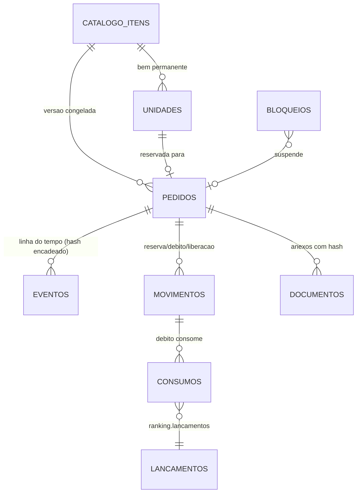

# Plano de implementação — Resgate de pontos por serviços, adesões e bens da Defesa Civil

> Revisão 2 — 25/09/2026. Incorpora as decisões do dono do produto (seção 0). Documento de planejamento; nenhum banco ou código foi alterado. Depende do módulo Ranking (`docs/superpowers/plans/2026-09-21-ranqueamento-ipcm.md`).
>
> **A Fase 0 é bloqueante.** Nenhuma linha de código de resgate vai para produção sem normativo publicado e parecer jurídico. Este plano organiza o sistema; ele **não é parecer jurídico**. Tudo o que aparece como "hipótese jurídica" precisa ser confirmado pela assessoria jurídica da CEDEC ou pela AGE-MG.

**Objetivo:** permitir que o saldo de pontos conquistado no placar seja trocado por itens de um catálogo oficial: serviços, adesões a programas e bens da Defesa Civil, como viaturas e equipamentos. Cada resgate passa por validação, aprovação e confirmação das duas partes, com trilha auditável capaz de sustentar controle externo e processo judicial.

**Princípio:** o sistema **não cria** direito a bem público; ele **operacionaliza um critério objetivo publicado em normativo**. O ponto dá elegibilidade e prioridade. A transferência continua acontecendo pelo instrumento administrativo próprio (termo de doação, cessão de uso, comodato ou adesão), com processo no SEI.

---

## 0. Decisões do dono do produto (revisão 2)

| # | Decisão | Como entra no plano |
|---|---|---|
| D1 | **Quem resgata é o município e/ou o usuário com permissão especial**, concedida no módulo de Permissionamento, com rastreio de IP e dos demais dados que já existem. | O **beneficiário continua sendo o ente** (P1). O usuário com a permissão `resgate.solicitar` é quem **opera em nome do ente**. A concessão e a retirada dessa permissão já ficam gravadas no `permission_audit_log` pelo `PermissionEventSubscriber` (IP, user agent, sessão, antes/depois, motivo). Cada ato no resgate grava os mesmos campos (seção 7). Se a intenção for o usuário receber o prêmio **para si**, isso fica fora até parecer jurídico (seção 12, item 1). |
| D2 | **O resgate não mexe no placar. Os prêmios são liberados a partir da faixa de corte** (Bronze, Prata, Ouro, Diamante). | Cada item do catálogo tem `faixa_minima` como **porta de acesso**: sem a faixa, o item não aparece como disponível. O custo em pontos, debitado da carteira separada, é **opcional**: custo 0 = prêmio só por faixa. A faixa avaliada é a da **temporada fechada** (seção 3.2). |
| D3 | **Tudo centralizado na conexão de `sdc_ranking`**, com rastreabilidade total, incluindo IP, como já existe. | Schema `resgate` dentro de `sdc_ranking`, na mesma transação do ledger (seção 7). Cada evento grava quem, de que IP, com qual user agent, em qual sessão e requisição, e **com qual permissão**. A trilha também registra a permissão vigente no instante do ato, para provar a autoridade do operador naquele momento. |

---

## 1. Premissas inegociáveis

| # | Premissa | Por quê |
|---|---|---|
| P1 | **O beneficiário é sempre o ente** (município via COMPDEC ou órgão), **nunca a pessoa física**. Opera o resgate a autoridade do município **ou** o usuário com permissão especial concedida no Permissionamento (D1), sempre em nome do ente. Pontos de usuário não são resgatáveis para ele mesmo. | Um servidor que recebe vantagem pessoal por atuação funcional corre risco de improbidade. O placar individual continua como reconhecimento. |
| P2 | **O critério é publicado antes de valer.** Catálogo, custos, elegibilidade e limites saem de resolução ou portaria da CEDEC. Cada item do catálogo aponta a versão do normativo que o criou. | Impessoalidade e publicidade: a regra vale para todos e é conhecida antes da disputa. |
| P3 | **Nenhuma transferência sem instrumento formal e número de processo SEI.** O SDC não substitui o processo administrativo; ele o alimenta e o referencia. | Bens públicos só se transferem por ato formal da autoridade competente. Hipótese jurídica: art. 76 da Lei 14.133/2021 e normas estaduais de patrimônio de MG. |
| P4 | **Confirmação das duas partes em todo marco relevante:** o município pede e confirma o recebimento; o Estado analisa, aprova e entrega. Quem executa uma etapa não executa a seguinte. | Segregação de funções e o controle "quatro olhos" impedem fraude de uma pessoa só. |
| P5 | **Só pontos maduros e comprovados** entram no saldo resgatável. Pontos em apuração, pendentes, com ajuste em aberto ou de demonstração nunca são resgatáveis. | Um ponto contestável não pode virar bem entregue. |
| P6 | **Trilha imutável e reproduzível.** Todo evento é append-only, com hash encadeado. Cada ponto consumido é rastreável até a evidência de origem (RAT, PAE...). | A defesa em juízo exige provar de onde veio cada ponto e quem decidiu cada passo. |
| P7 | **Um bloqueio judicial ou administrativo suspende tudo na hora.** Existe bloqueio por ente e por pedido, com documento de origem. | O caso pode ser judicializado; o sistema precisa obedecer à decisão sem gambiarra. |

---

## 2. Conceitos

### 2.1 Placar não é carteira

| | Placar (Ranking, já existe) | Carteira de resgate (novo) |
|---|---|---|
| Para que serve | Reconhecer entregas e classificar | Trocar por itens do catálogo |
| Quem tem | Usuário, órgão e município | **Só o ente** (P1): município e, se o normativo permitir, órgão |
| Resgate reduz? | **Não.** Posição e faixa ficam intactas | Sim: reserva e débito |
| Período | Temporada trimestral, mês, ano, acumulado | Saldo corrido, com maturação e expiração (a decidir) |

**Recomendação:** o resgate **não** mexe no placar. Se o resgate debitasse o placar, o município que resgata perderia posição, e quem guarda pontos para subir de faixa nunca resgataria: os dois objetivos se anulariam. A carteira é derivada do mesmo ledger, sem cópia de pontos.

### 2.2 Saldo resgatável

```
saldo_resgatavel(ente) =
      Σ créditos MADUROS do ente
    − Σ débitos de resgates concluídos
    − Σ reservas ativas
    + Σ estornos de débito (resgate anulado)
```

Um **crédito maduro** atende a todas as condições abaixo ao mesmo tempo:

- lançamento `confirmada` no ledger, com evidência e autoria comprovadas;
- mais de **N dias de carência** desde a competência (proposta: 30 dias, fixados no normativo). A carência cobre a janela de contestação, estorno e reconciliação;
- sem pedido de ajuste pendente sobre ele;
- sem estorno;
- fora de qualquer marca de demonstração: chave `demo:*` ou `contexto.demonstracao = true`;
- pertence ao ente pelo vínculo histórico do lançamento (`municipio_id` ou `orgao_id`), nunca pelo vínculo atual do usuário.

**Estorno depois do resgate:** se um crédito já consumido for estornado, o saldo fica **negativo**. Novos pedidos ficam bloqueados até a compensação. A entrega física **nunca** se desfaz automaticamente: vira pendência para processo administrativo.

### 2.3 Rastreio do ponto consumido

Cada débito registra **quais lançamentos consumiu** (FIFO pela competência mais antiga). Assim o dossiê de um resgate responde "estes 7.000 pontos vieram dos RATs x, y e z, registrados por tais usuários, em tais datas, com tal evidência". É o elo que torna o resgate defensável em juízo.

---

## 3. Catálogo

### 3.1 Tipos de item

| Tipo | Exemplos | Instrumento (hipótese jurídica) | Individualizado? |
|---|---|---|---|
| Serviço | Capacitação presencial, apoio técnico em PlanCon, vistoria prioritária | Ordem de serviço ou agendamento | Não (vagas) |
| Adesão | Adesão a programa estadual, cota em programa de kits | Termo de adesão | Não (cotas) |
| Bem de consumo | Kits de ajuda humanitária, EPIs | Termo de entrega (baixa no Estoque) | Não (quantidade) |
| Bem permanente | Viatura, drone, gerador, kit de comunicação | Termo de doação, cessão de uso ou comodato | **Sim:** cada unidade tem patrimônio, e a viatura tem placa, RENAVAM e chassi |

### 3.2 Campos do item (versionado)

Cada item do catálogo tem:
- **Identificação:** código, tipo, título e descrição.
- **Custo:** custo em pontos e beneficiário permitido (município e/ou órgão).
- **Disponibilidade:** quantidade disponível, ou unidades individualizadas no caso de bem permanente.
- **Limites:** limite por ente por temporada e prazo de validade da reserva.
- **Elegibilidade:**
  - faixa mínima na temporada;
  - IPCM mínimo, ou "não vermelho";
  - COMPDEC ativa;
  - PlanCon vigente;
  - sem prestação de contas vencida;
  - sem bloqueio vigente.
- **Documentos exigidos:** checklist de documentos.
- **Instrumento e base:** tipo de instrumento jurídico e base normativa (resolução nº, artigo).
- **Entrega:** unidade responsável pela entrega e SLA de cada etapa.
- **Vigência:** `vigente_de` / `vigente_ate`.

**Faixa como porta de acesso (D2).** O prêmio é liberado pela faixa de corte, e o custo em pontos é opcional:

| Campo | Regra |
|---|---|
| `faixa_minima` | Obrigatório. `bronze`, `prata`, `ouro` ou `diamante`, pelos cortes vigentes do `FaixaRanking` (hoje Diamante a partir de 7.000). |
| Temporada avaliada | A faixa **final da última temporada fechada** do ente. Ela não muda mais, então o direito não oscila no meio do processo e fica defensável. Alternativa rejeitada: a faixa da temporada em curso, que pode cair com um estorno depois do pedido. |
| `custo_pontos` | Opcional. **0 = prêmio só por faixa**, sem débito na carteira. Maior que 0 = exige a faixa **e** debita da carteira separada (seção 2). |
| Congelamento | O pedido grava a faixa, a temporada e o corte vigente no instante da solicitação. Mudar o corte depois não tira nem dá direito a pedido já feito. |

Os itens seguem as mesmas regras de versão das regras de pontuação do Ranking:
- **append-only:** mudança fecha a versão vigente e abre `versao + 1`, sem editar no lugar;
- o pedido guarda a versão vigente no momento da solicitação;
- a **publicação exige duas pessoas** (P4): o gestor do catálogo propõe e a autoridade da CEDEC aprova. O sistema recusa quem tenta aprovar a própria proposta.

### 3.3 Bens permanentes: unidades individualizadas

Uma viatura do catálogo é um **modelo** ("Viatura 4x4 de resposta"). As **unidades** são os bens físicos, cada uma com patrimônio próprio. A reserva aloca **uma unidade específica** com `FOR UPDATE`, para que não se prometa a mesma viatura a dois municípios.

**Constatado na Fase 2:** o módulo Inventário do SDC é de **TI** (`inventario_ti_equipamentos`: patrimônio, número de série, ramal). Não há cadastro de frota, placa nem RENAVAM. Por isso `resgate.unidades` guarda os próprios campos (patrimônio, placa, RENAVAM, chassi, número de série), e o vínculo com o Inventário (`inventario_equipamento_id`) é **opcional**, só para equipamento já inventariado. A unidade nunca é apagada: sai do catálogo por baixa. Se no futuro existir cadastro de frota ou integração com o SIAD, ele passa a ser a origem das viaturas.

---

## 4. Fluxo do resgate

```mermaid
stateDiagram-v2
    [*] --> Solicitado: Coordenador COMPDEC solicita (reserva pontos + unidade)
    Solicitado --> ConfirmadoMunicipio: Autoridade municipal confirma (pessoa diferente)
    Solicitado --> Cancelado: Solicitante desiste
    ConfirmadoMunicipio --> AnaliseTecnica: Entra na fila da CEDEC
    AnaliseTecnica --> AnaliseJuridica: Elegível e documentos ok (bem permanente / adesão)
    AnaliseTecnica --> Aprovacao: Elegível e documentos ok (serviço / consumo)
    AnaliseTecnica --> Diligencia: Falta documento
    Diligencia --> AnaliseTecnica: Município complementa (prazo)
    AnaliseJuridica --> Aprovacao: Parecer favorável
    AnaliseTecnica --> Indeferido: Inelegível
    AnaliseJuridica --> Indeferido: Parecer contrário
    Aprovacao --> TermoEmitido: Autoridade CEDEC aprova; nº SEI obrigatório
    Aprovacao --> Indeferido: Autoridade nega
    TermoEmitido --> TermoAssinado: Assinatura das DUAS partes (hash do PDF)
    TermoAssinado --> Entregue: Unidade responsável entrega com evidências
    Entregue --> Concluido: Município confirma recebimento (débito definitivo)
    Entregue --> Contestado: Município recusa (divergência)
    Contestado --> Entregue: Divergência sanada
    Concluido --> Anulado: Decisão administrativa/judicial (estorno do débito)
    Solicitado --> Expirado: Prazo sem ação
    Diligencia --> Expirado: Prazo sem complemento
    Indeferido --> [*]
    Cancelado --> [*]
    Expirado --> [*]
    Concluido --> [*]
    Anulado --> [*]
```



| Transição | Quem | Exige | Efeito nos pontos |
|---|---|---|---|
| Solicitar | Coordenador da COMPDEC **ou usuário com `resgate.solicitar`** (D1), em nome do ente | Faixa mínima na última temporada fechada (D2); saldo resgatável ≥ custo, quando houver custo; elegibilidade; sem bloqueio; limite da temporada | **Reserva** (atômica), se houver custo; unidade reservada |
| Confirmar pelo município | Autoridade municipal (prefeito ou delegado formal), **≠ solicitante** | Ciência do custo e das obrigações do termo | — |
| Análise técnica | Técnico da CEDEC, **sem vínculo com o município** | Checklist documental; **elegibilidade reavaliada agora**, não só na solicitação | — |
| Análise jurídica | Assessoria jurídica | Parecer anexado (bem permanente e adesão) | — |
| Aprovar | Autoridade competente da CEDEC, **≠ analistas** | Número do processo SEI | — |
| Termo assinado | Estado **e** município | PDF do termo com hash SHA-256; número do documento SEI | — |
| Entregar | Unidade responsável, **≠ aprovador** | Termo de recebimento, fotos, patrimônio, placa | — |
| Confirmar recebimento | Autoridade municipal ou representante designado | Conferência do bem recebido | **Débito definitivo**; reserva baixada; consumo FIFO gravado |
| Indeferir, cancelar, expirar | Conforme a etapa | Justificativa obrigatória | **Liberação** da reserva e da unidade |
| Anular (depois de concluído) | Autoridade da CEDEC, com documento da decisão | Decisão administrativa ou judicial anexada | **Estorno do débito**; a devolução do bem segue em processo próprio |

**Segregação de funções (P4), garantida no serviço e no banco:** a mesma pessoa não pode atuar em duas etapas do mesmo pedido. A restrição é verificada contra todos os eventos anteriores do pedido, e não só contra a etapa imediatamente anterior.

---

## 5. Antifraude e integridade

| Risco | Controle |
|---|---|
| Inflar pontos para resgatar | Só créditos maduros (carência) e comprovados. **Detector de anomalia** antes da aprovação: pico de pontos fora do padrão do ente, concentração num único usuário, muitos ajustes. Anomalia leva o pedido a `Diligencia` com alerta à auditoria, sem aprovação automática |
| Mesmo saldo gasto duas vezes | Reserva sob `pg_advisory_xact_lock` por ente + `FOR UPDATE` no saldo; chave de idempotência por solicitação; `UNIQUE` nos movimentos |
| Mesma viatura para dois municípios | Unidade reservada sob `FOR UPDATE`; estado da unidade com `CHECK`; `UNIQUE` (unidade, pedido ativo) |
| Uma pessoa aprovando tudo | Segregação por evento (seção 4); conflito de interesse: aprovador sem vínculo ativo com o ente |
| Adulterar histórico | Tabelas append-only com trigger que bloqueia `UPDATE`/`DELETE` (mesmo padrão do `RegistroImutavel` do Ranking); **hash encadeado** por pedido (`hash = sha256(evento + hash_anterior)`); verificador diário da cadeia |
| Documento trocado depois | Hash SHA-256 de cada arquivo gravado no evento; arquivo em armazenamento sem sobrescrita |
| Regra mudada no meio do jogo | O pedido congela a versão do item e do normativo; mudança posterior não o afeta |
| Pontos de demonstração | Excluídos por construção do saldo resgatável (P5) e testados |
| Entrega "de mentira" | Entrega sem confirmação do município não debita; contestação suspende; evidência obrigatória |

---

## 6. Judicialização e controle externo

- **Bloqueio** por ente ou por pedido, com tipo (judicial ou administrativo), documento de origem (número do processo, decisão), vigência e quem registrou. Enquanto vigente, nenhuma transição avança, e as reservas ficam congeladas.
- **Dossiê do resgate**, exportável em PDF legível e JSON íntegro, com o hash do próprio dossiê. Reúne:
  - linha do tempo completa: quem, papel, quando, justificativa;
  - versão do item e do normativo;
  - documentos com hash;
  - extrato dos lançamentos consumidos, até a evidência de origem;
  - verificação da cadeia de hash.
- **Transparência:** página de consulta com os resgates concluídos (ente, item, data, pontos, processo SEI), sem dados pessoais além do necessário (LGPD).
- **Retenção:** nada é apagado. A anulação é um evento novo, nunca uma remoção.

---

## 7. Modelo de dados

Schema **`resgate` dentro de `sdc_ranking`**. A reserva precisa ler o ledger e gravar o movimento **na mesma transação**; em outra base, a consistência dependeria de compensação distribuída.



| Tabela | Conteúdo essencial | Invariantes |
|---|---|---|
| `resgate.catalogo_itens` | código, versão, tipo, custo, limites, elegibilidade (jsonb validado), instrumento, base normativa, vigência, `proposto_por`, `aprovado_por` | `UNIQUE (codigo, versao)`; `proposto_por <> aprovado_por`; vigência `[de, ate)` |
| `resgate.unidades` | item, patrimônio, placa, RENAVAM, chassi, estado | Estado em `disponivel`, `reservada`, `entregue` ou `baixada`; `UNIQUE (patrimonio)` |
| `resgate.pedidos` | protocolo, escopo e id do ente, item, versão, unidade, custo, status, processo SEI, idempotência | `UNIQUE (chave_idempotencia)`; uma unidade em no máximo um pedido ativo |
| `resgate.eventos` | pedido, etapa, de/para status, ator, papel, **permissão usada**, justificativa, evidências, **`ip_address`, `user_agent`, `session_id`, `request_id`**, `hash`, `hash_anterior`, instante | **Append-only** (trigger); `UNIQUE (pedido_id, sequencia)`; IP e permissão obrigatórios em ato humano |
| `resgate.movimentos` | ente, tipo (reserva, liberação, débito, estorno de débito), pontos com sinal, pedido | **Append-only**; soma por pedido coerente com o status |
| `resgate.consumos` | débito → `ranking.lancamentos.id`, pontos | Soma = débito; lançamento nunca consumido além do seu valor |
| `resgate.documentos` | pedido, tipo, SHA-256, caminho, enviado por, documento SEI | Hash obrigatório; sem sobrescrita |
| `resgate.bloqueios` | ente ou pedido, tipo, documento de origem, vigência, registrado por | Encerrar o bloqueio é um evento, não uma remoção |

Uma view `resgate.saldo_resgatavel` materializa o saldo da seção 2.2, lendo `ranking.lancamentos` pela conexão de leitura. A reserva recalcula tudo dentro da transação, sem confiar na view.

A migration nova entra consolidada numa **migration principal do schema `resgate`**, no mesmo padrão da `create_ranking_schema_tables`.

### 7.1 Rastreabilidade (D3)

Os campos seguem o que o SDC já grava no `permission_audit_log` e no `audit_logs`, no mesmo formato, para que auditoria e dossiê leiam um padrão só:

| Campo | Origem | Observação |
|---|---|---|
| `ator_user_id` | Sessão autenticada | Nunca vem do corpo da requisição |
| `papel` e `permissao` | Permissão efetivamente checada na transição | Prova a autoridade do operador no instante do ato |
| `ip_address` | `request()->ip()`, atrás do Caddy com proxies confiáveis | Mesmo tratamento do `PermissionEventSubscriber` |
| `user_agent`, `session_id` | Requisição | |
| `request_id` | Correlação do log da aplicação | Liga o evento ao log de acesso |
| `hash`, `hash_anterior` | Serviço de transição | Cadeia por pedido; verificador diário |

**Concessão da permissão também é rastreada:** quem deu `resgate.solicitar` a quem, quando e de que IP já fica no `permission_audit_log`. O dossiê do pedido junta os dois lados: quem operou e quem autorizou o operador.

**Uma única conexão.** Ledger, carteira, pedidos e eventos ficam todos em `sdc_ranking`, pela conexão `ranking` (nunca por autowiring de `ConnectionInterface`, que cai na base operacional). O dossiê lê o `permission_audit_log` da base operacional **só para leitura**, pela conexão já existente.

---

## 8. Módulo e integrações

Novo módulo DDD **`app/Modules/Resgate`**, um contexto separado do Ranking, que consome o Ranking só por contrato:

| Integração | Contrato | Observação |
|---|---|---|
| Ranking | `Contracts/SaldoResgatavel` (leitura de créditos maduros por ente) | O Resgate nunca escreve em `ranking.*` |
| Inventário | Unidades de bem permanente; movimentação patrimonial na entrega | Viatura precisa de placa, RENAVAM e chassi |
| Estoque | Baixa de bem de consumo na entrega | |
| SEI-MG | Número do processo e dos documentos, **obrigatórios** a partir da aprovação | Fase 1: informado e validado por formato. Integração automática: fase futura |
| Assinatura | O SDC **não tem hoje** assinatura com validade jurídica (a Cisterna só anexa imagem) | Recomendação: assinar no SEI e registrar no SDC o nº do documento + hash do PDF. Alternativa: Assinador gov.br (a avaliar) |
| Notificações | Cada transição avisa as partes e os prazos | Módulo Notificações existente |
| IPCM / PlanCon / Compdec | Elegibilidade (IPCM, COMPDEC ativa, PlanCon vigente, prestação de contas) | Reavaliada na análise técnica |

**Permissões novas**, no módulo de Permissionamento (grupo `resgate` em `config/permissions.php`, ao lado do grupo `ranking`). Cada concessão e retirada fica automaticamente no `permission_audit_log` (D1, D3):

| Permissão | Papel típico |
|---|---|
| `resgate.catalogo.ver` | Todos os COMPDECs |
| `resgate.solicitar` | Coordenador da COMPDEC ou usuário com permissão especial (D1), em nome do ente |
| `resgate.confirmar_municipio` | Autoridade municipal ou delegado formal |
| `resgate.analisar` | Técnico da CEDEC |
| `resgate.parecer` | Assessoria jurídica |
| `resgate.aprovar` | Autoridade competente da CEDEC |
| `resgate.entregar` | Unidade logística ou patrimonial |
| `resgate.catalogo.propor` / `resgate.catalogo.aprovar` | Gestor do catálogo / autoridade (pessoas diferentes) |
| `resgate.bloquear` | Autoridade da CEDEC / jurídico |
| `resgate.auditar` | Controle interno (somente leitura, dossiês) |

---

## 9. Interface (Atomic Design)

| Página | Público | Conteúdo |
|---|---|---|
| Vitrine do catálogo | COMPDEC | Itens com custo, requisitos, disponibilidade e "você é elegível?" com o motivo |
| Carteira do município | COMPDEC | Saldo resgatável, reservado, maturando (com a data em que libera) e extrato de movimentos |
| Meus pedidos | COMPDEC / autoridade municipal | Linha do tempo por pedido, pendências de cada parte, prazos |
| Fila da CEDEC | Técnico / jurídico / autoridade | Pedidos por etapa, alertas de anomalia, SLA |
| Gestão do catálogo | Gestor / autoridade | Propor versão, aprovar, histórico de versões |
| Dossiê | Auditoria / jurídico | Exportação e verificação da cadeia |

Componentes novos: `Atoms/Resgate/StatusPedidoBadge`, `Molecules/Resgate/ItemCatalogoCard`, `Molecules/Resgate/LinhaDoTempoEvento`, `Organisms/Resgate/CarteiraResumo`, `Organisms/Resgate/FluxoPedido`, `Organisms/Resgate/ChecklistDocumentos`. O componente `Modal` e o `NumberStepper` já existentes são reaproveitados.

---

## 10. Etapas de implementação

Cada etapa só começa com a anterior verificada, e cada uma tem o seu commit atômico.

### Fase 0 — Normativo e jurídico (bloqueante, fora do código)

- Minuta de resolução ou portaria da CEDEC: catálogo inicial, custos, elegibilidade, carência, limites, autoridade competente, instrumentos.
- Parecer jurídico sobre P1–P7, com foco em bens permanentes (doação × cessão × comodato), impessoalidade e forma de assinatura.
- Decisões da seção 12 respondidas.
- **Verificação:** normativo publicado + parecer arquivado + número do processo SEI de criação do programa.

### Fase 1 — Carteira somente leitura

- Schema `resgate` (migration principal), view de saldo resgatável e contrato `SaldoResgatavel`.
- Permissões do grupo `resgate` no Permissionamento (D1), já auditadas pelo `PermissionEventSubscriber`.
- Página "Carteira do município", sem botão de resgate: saldo resgatável, faixa da última temporada fechada e itens que ela liberaria (D2).
- **Verificação:**
  - o saldo bate com um cálculo manual sobre o ledger;
  - demo, pendente, estornado e não maduro ficam fora;
  - o estorno leva o saldo a negativo;
  - conceder `resgate.solicitar` gera linha no `permission_audit_log` com IP.

### Fase 2 — Catálogo versionado com quatro olhos

- CRUD de proposta e aprovação de versões; unidades de bens vindas do Inventário.
- **Verificação:** o autor não aprova a própria proposta; a edição no lugar é recusada pelo banco; o pedido congela a versão.

### Fase 3 — Pedido, reserva e máquina de estados

- Serviço de transição único, com segregação de funções, idempotência, locks, expiração agendada e hash encadeado.
- **Verificação (testes obrigatórios):**
  - dois pedidos simultâneos não passam do saldo;
  - a mesma unidade não é reservada duas vezes;
  - a mesma pessoa em duas etapas é recusada;
  - a expiração libera a reserva;
  - reprocessar uma transição não duplica movimento;
  - `UPDATE`/`DELETE` em eventos e movimentos é bloqueado.

### Fase 4 — Documentos, SEI, termo, entrega e confirmação

- Checklist documental, hash de arquivos, número SEI obrigatório, termo assinado pelas duas partes, entrega com evidência, confirmação e contestação pelo município, débito com consumo FIFO.
- **Verificação:**
  - não se aprova sem SEI;
  - não se debita sem a confirmação do município;
  - a soma do consumo é igual ao débito;
  - nenhum lançamento é consumido além do seu valor.

### Fase 5 — Antifraude, bloqueios, dossiê e transparência

- Detector de anomalia, bloqueios judiciais e administrativos, dossiê exportável, verificador diário da cadeia, página de transparência.
- **Verificação:**
  - o bloqueio congela o pedido em qualquer etapa;
  - a cadeia adulterada é detectada;
  - o dossiê reproduz o extrato até a evidência de origem.

### Fase 6 — Piloto em homologação

- Dois ou três municípios reais e um item de cada tipo; o fluxo completo percorrido com as pessoas reais de cada papel.
- **Verificação:** dossiê revisado pelo jurídico e pelo controle interno; SLA medido.

### Fase 7 — Rollout

- Liberação gradual por tipo de item: primeiro serviço e adesão, por último bem permanente.

---

## 11. Riscos

| Risco | Mitigação |
|---|---|
| Questionamento jurídico da troca de pontos por bens | Fase 0 bloqueante; o ponto dá elegibilidade e prioridade, e a transferência segue o instrumento legal |
| Corrida por pontos com qualidade baixa | Carência, evidência comprovada, detector de anomalia; o IPCM segue separado e pode ser requisito |
| Municípios pequenos em desvantagem | Decidir no normativo: itens por porte, cotas regionais ou limite por temporada |
| Divergência entre a entrega física e o sistema | Débito só com a confirmação do município; contestação formal |
| Dependência do SEI sem integração | Número obrigatório e validado na Fase 1; integração automática em fase futura |

---

## 12. Decisões pendentes (para o normativo)

1. **Beneficiário** (parcial, D1): o ente, operado por autoridade municipal ou usuário com permissão especial. Falta definir se órgãos (CEDEC regional, bombeiros) também são beneficiários, e confirmar com o jurídico que a permissão especial não configura benefício pessoal.
2. ~~Placar × carteira~~ **Decidido (D2):** o resgate não reduz posição nem faixa; os prêmios são liberados pela faixa de corte. Falta validar a recomendação de avaliar a faixa da **última temporada fechada**.
3. **Carência:** quantos dias até o ponto amadurecer (proposta: 30)?
4. **Expiração:** o saldo resgatável expira? Proposta: créditos com mais de 4 temporadas expiram, para evitar acúmulo indefinido.
5. **Autoridades:** quem confirma pelo município (prefeito ou delegado) e quem aprova pela CEDEC, por tipo e valor do item.
6. **Assinatura:** SEI (recomendado) ou Assinador gov.br.
7. **Catálogo inicial:** itens, custos e quantidades da primeira versão.
8. **Limites:** por ente, por temporada e por tipo; cotas por porte ou região.
9. **Elegibilidade mínima:** faixa, IPCM, COMPDEC ativa, PlanCon vigente, prestação de contas em dia.
